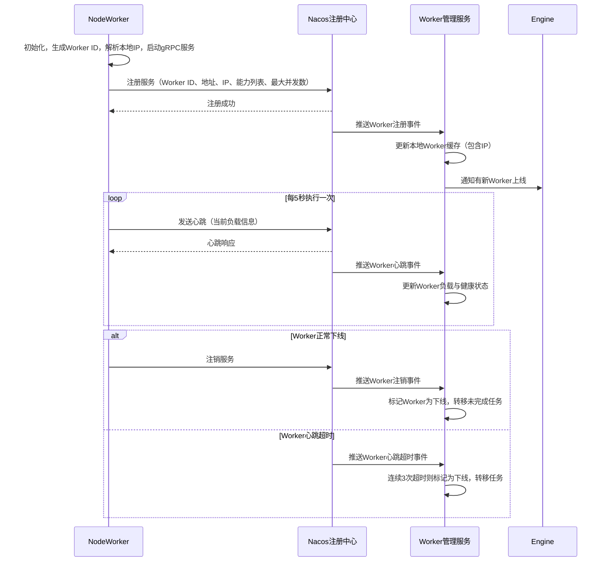
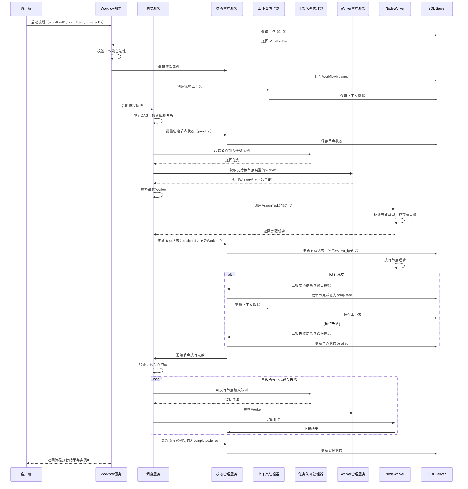
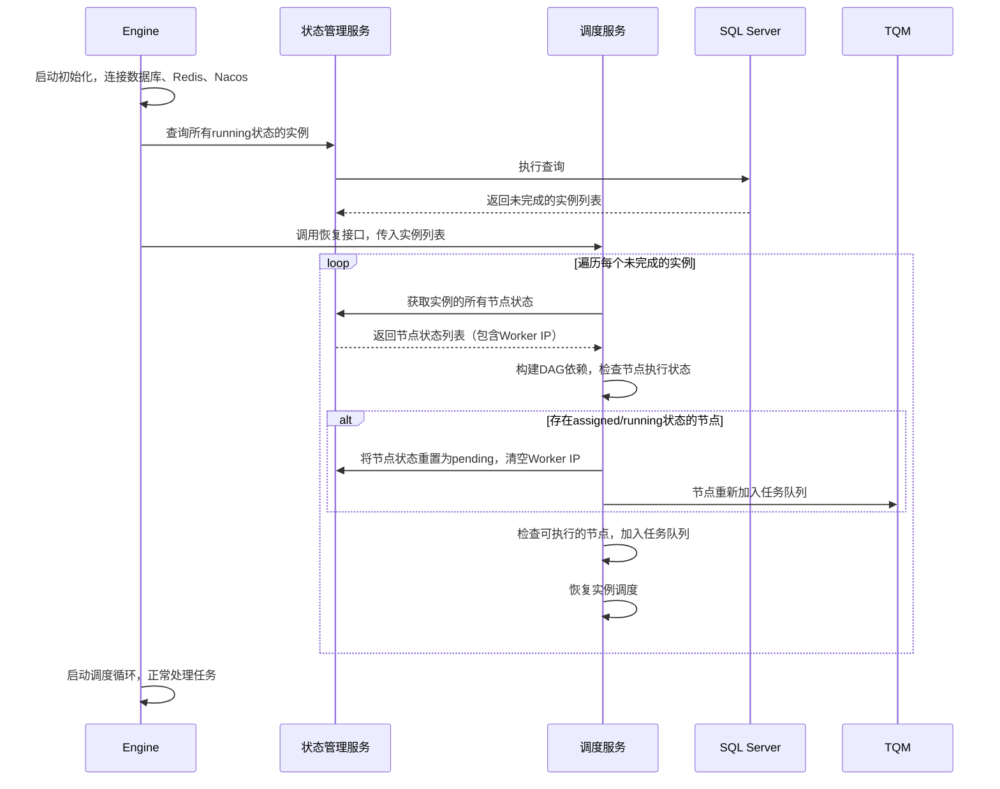

# D1阶段：核心基础架构 详细设计文档
**文档编号**：D1-DESIGN-v1.1
**项目名称**：DistributedWorkflow 分布式工作流引擎
**对应版本**：v0.1.0-v0.4.0
**开发周期**：8周
**文档状态**：正式发布
**编制日期**：2026-04-26
**适用范围**：D1阶段开发、测试、交付全流程

---

## 一、文档概述
本文档是DistributedWorkflow项目D1阶段的详细设计说明书，定义了项目核心基础架构的全部技术实现细节。D1阶段是整个项目的基石，目标是交付**最小可用、可分布式部署、可扩展**的工作流引擎核心，完成「流程定义→实例创建→DAG调度→分布式执行→状态持久化」的全链路闭环，为后续所有高级特性提供稳定的底层支撑。

本文档严格限定了D1阶段的开发边界，所有设计均围绕核心基础能力展开，不引入后续阶段的高级特性，同时预留完整的扩展接口，保障后续迭代的兼容性。

## 二、阶段范围与交付标准
### 2.1 D1阶段包含的核心内容
1. 引擎核心数据结构与接口定义
2. Engine核心调度服务（基础版）
3. NodeWorker分布式执行节点
4. Engine与NodeWorker之间的gRPC通信协议
5. Nacos服务注册、发现与健康检查
6. SQL Server持久化层实现
7. Redis分布式锁、任务队列实现
8. 基础DAG调度能力，支持All/Any两种依赖模式
9. HTTP触发端点（基础版）
10. 按节点类型粒度的并发控制
11. 基础错误处理与日志体系
12. 自定义节点类型扩展能力

### 2.2 D1阶段不包含的内容
以下内容将在后续阶段实现，D1阶段不做开发，仅预留扩展接口：
1. 流程定义版本管理、灰度发布、回滚
2. 流程实例的暂停、恢复、终止全生命周期控制
3. 子流程调用与嵌套
4. 人工任务节点、定时触发端点
5. 失败重试、降级、补偿等高级错误处理
6. 前端配置管理界面、执行可视化
7. Prometheus指标、链路追踪、告警等可观测性体系
8. 多租户、权限控制、安全隔离

### 2.3 量化交付标准
1. 可通过Go代码定义WorkflowDef工作流，并成功启动执行
2. 支持跨机器部署NodeWorker，Engine可自动发现并分配任务
3. 完整支持All（全部前置完成）、Any（任意前置完成）两种依赖模式的DAG调度
4. 所有流程状态、节点状态、上下文数据持久化到SQL Server，Engine/NodeWorker重启后可自动恢复未完成的任务
5. 支持用户通过实现`NodeExecutor`接口自定义节点类型，无需修改引擎核心代码
6. 支持按节点类型为每个NodeWorker设置独立的最大并发数，严格控制执行并发
7. 核心代码单元测试覆盖率≥80%
8. 提供3个以上可直接运行的完整示例（基础串行流程、分支流程、并行流程）
9. 提供完整的Go Doc接口文档与开发接入指南

## 三、核心设计约束
1. **语言与规范约束**：所有组件基于Go 1.22+开发，严格遵循Go官方项目规范与社区最佳实践
2. **无状态Worker约束**：NodeWorker不存储任何流程状态，所有状态由Engine统一管理，Worker仅负责执行任务
3. **幂等性约束**：所有核心操作必须设计为幂等，重复调用、重复上报不会产生数据不一致或重复执行
4. **接口抽象约束**：所有扩展点必须通过接口定义，实现与接口严格分离，禁止硬编码业务逻辑
5. **存储抽象约束**：存储层通过接口抽象，D1阶段默认实现SQL Server驱动，预留后续切换其他数据库的能力
6. **通信约束**：Engine与NodeWorker的内部通信仅使用gRPC协议，禁止使用其他通信方式
7. **日志约束**：统一使用zerolog作为日志组件，所有日志必须包含trace_id、instance_id、node_id等关键字段，支持结构化输出

## 四、核心数据结构详细设计
### 4.1 核心枚举定义
#### 4.1.1 流程实例状态枚举
```go
// WorkflowStatus 工作流实例状态
type WorkflowStatus string

const (
    // WorkflowStatusPending 待执行：实例已创建，尚未启动调度
    WorkflowStatusPending WorkflowStatus = "pending"
    // WorkflowStatusRunning 执行中：实例正在调度执行
    WorkflowStatusRunning WorkflowStatus = "running"
    // WorkflowStatusCompleted 已完成：所有节点执行成功，流程正常结束
    WorkflowStatusCompleted WorkflowStatus = "completed"
    // WorkflowStatusFailed 执行失败：节点执行失败，无后续可执行节点，流程异常结束
    WorkflowStatusFailed WorkflowStatus = "failed"
)
```

#### 4.1.2 节点执行状态枚举
```go
// WorkflowNodeStatus 工作流节点执行状态
type WorkflowNodeStatus string

const (
    // WorkflowNodeStatusPending 待执行：节点依赖未满足，等待调度
    WorkflowNodeStatusPending WorkflowNodeStatus = "pending"
    // WorkflowNodeStatusAssigned 已分配：已分配给NodeWorker，等待执行
    WorkflowNodeStatusAssigned WorkflowNodeStatus = "assigned"
    // WorkflowNodeStatusRunning 执行中：NodeWorker正在执行节点逻辑
    WorkflowNodeStatusRunning WorkflowNodeStatus = "running"
    // WorkflowNodeStatusCompleted 已完成：节点执行成功
    WorkflowNodeStatusCompleted WorkflowNodeStatus = "completed"
    // WorkflowNodeStatusFailed 执行失败：节点执行异常
    WorkflowNodeStatusFailed WorkflowNodeStatus = "failed"
)
```

#### 4.1.3 连线类型枚举
```go
// ConnectionType 流程连线类型
type ConnectionType string

const (
    // ConnectionTypeSuccess 成功分支：源节点执行成功后，执行目标节点
    ConnectionTypeSuccess ConnectionType = "success"
    // ConnectionTypeFailure 失败分支：源节点执行失败后，执行目标节点
    ConnectionTypeFailure ConnectionType = "failure"
    // ConnectionTypeAlways 无条件分支：无论源节点执行成败，都执行目标节点
    ConnectionTypeAlways ConnectionType = "always"
)
```

#### 4.1.4 依赖模式枚举
```go
// DependencyMode 节点前置依赖模式
type DependencyMode string

const (
    // DependencyModeAll 全量依赖：所有前置节点完成后，才执行当前节点
    DependencyModeAll DependencyMode = "all"
    // DependencyModeAny 任意依赖：任意一个前置节点完成后，即可执行当前节点
    DependencyModeAny DependencyMode = "any"
)
```

### 4.2 核心业务结构体
#### 4.2.1 WorkflowDef 工作流定义
```go
// WorkflowDef 工作流定义，流程执行的规则蓝本
type WorkflowDef struct {
    // ID 工作流唯一标识，全局唯一
    ID string `json:"id" validate:"required,max=64"`
    // Name 工作流名称
    Name string `json:"name" validate:"required,max=255"`
    // Description 工作流描述
    Description string `json:"description"`
    // Nodes 流程节点集合，key为节点ID
    Nodes map[string]*WorkflowNode `json:"nodes" validate:"required,min=1"`
    // Connections 节点连线集合，定义节点间的执行顺序
    Connections []*Connection `json:"connections" validate:"required,min=1"`
    // StartNodeID 起始节点ID，必须存在于Nodes集合中
    StartNodeID string `json:"startNodeId" validate:"required"`
    // EndNodeID 结束节点ID，必须存在于Nodes集合中
    EndNodeID string `json:"endNodeId" validate:"required"`
    // CreatedAt 创建时间
    CreatedAt time.Time `json:"createdAt"`
    // UpdatedAt 更新时间
    UpdatedAt time.Time `json:"updatedAt"`
}
```

#### 4.2.2 WorkflowNode 工作流节点
```go
// WorkflowNode 工作流执行节点，流程执行的最小单元
type WorkflowNode struct {
    // ID 节点唯一标识，同一工作流内唯一
    ID string `json:"id" validate:"required,max=64"`
    // Type 节点类型，对应NodeWorker注册的执行器类型
    Type string `json:"type" validate:"required,max=64"`
    // Name 节点名称
    Name string `json:"name" validate:"required,max=255"`
    // Description 节点描述
    Description string `json:"description"`
    // Config 节点执行配置，不同类型节点有不同的配置结构
    Config map[string]interface{} `json:"config"`
    // DependencyMode 前置依赖模式，默认all
    DependencyMode DependencyMode `json:"dependencyMode" validate:"oneof=all any" default:"all"`
    // Timeout 节点执行超时时间，单位秒，0表示不限制
    Timeout int `json:"timeout" validate:"min=0" default:"0"`
}
```

#### 4.2.3 Connection 流程连线
```go
// Connection 流程连线，定义节点间的执行顺序与分支规则
type Connection struct {
    // ID 连线唯一标识，同一工作流内唯一
    ID string `json:"id" validate:"required,max=64"`
    // SourceID 源节点ID
    SourceID string `json:"sourceId" validate:"required"`
    // TargetID 目标节点ID
    TargetID string `json:"targetId" validate:"required"`
    // Type 连线类型，默认success
    Type ConnectionType `json:"type" validate:"oneof=success failure always" default:"success"`
}
```

#### 4.2.4 WorkflowInstance 工作流实例
```go
// WorkflowInstance 工作流实例，对应一次工作流的运行时执行
type WorkflowInstance struct {
    // ID 实例唯一标识，全局唯一
    ID string `json:"id"`
    // WorkflowID 关联的工作流定义ID
    WorkflowID string `json:"workflowId"`
    // WorkflowVersion 工作流定义版本，D1阶段固定为1
    WorkflowVersion int `json:"workflowVersion" default:"1"`
    // Status 实例执行状态
    Status WorkflowStatus `json:"status"`
    // StartTime 实例启动时间
    StartTime time.Time `json:"startTime"`
    // EndTime 实例结束时间
    EndTime time.Time `json:"endTime"`
    // InputData 流程启动时的输入参数
    InputData map[string]interface{} `json:"inputData"`
    // OutputData 流程执行完成后的输出结果
    OutputData map[string]interface{} `json:"outputData"`
    // CreatedBy 流程创建人
    CreatedBy string `json:"createdBy"`
    // ErrorMessage 流程执行失败时的错误信息
    ErrorMessage string `json:"errorMessage"`
}
```

#### 4.2.5 WorkflowNodeState 节点执行状态
```go
// WorkflowNodeState 节点执行状态，记录单个节点的执行详情
type WorkflowNodeState struct {
    // ID 自增主键
    ID int64 `json:"id"`
    // InstanceID 关联的流程实例ID
    InstanceID string `json:"instanceId"`
    // NodeID 关联的节点ID
    NodeID string `json:"nodeId"`
    // Status 节点执行状态
    Status WorkflowNodeStatus `json:"status"`
    // AssignedTo 分配的NodeWorker ID
    AssignedTo string `json:"assignedTo"`
    // WorkerIP 分配的NodeWorker服务器IP地址
    WorkerIP string `json:"workerIp"`
    // StartTime 节点开始执行时间
    StartTime time.Time `json:"startTime"`
    // EndTime 节点执行结束时间
    EndTime time.Time `json:"endTime"`
    // InputData 节点执行的输入数据
    InputData map[string]interface{} `json:"inputData"`
    // OutputData 节点执行的输出数据
    OutputData map[string]interface{} `json:"outputData"`
    // ErrorMessage 节点执行失败时的错误信息
    ErrorMessage string `json:"errorMessage"`
    // RetryCount 已重试次数，D1阶段固定为0
    RetryCount int `json:"retryCount" default:"0"`
}
```

#### 4.2.6 WorkflowContext 流程上下文
```go
// WorkflowContext 流程执行上下文，用于节点间数据传递
type WorkflowContext struct {
    // InstanceID 流程实例ID
    InstanceID string `json:"instanceId"`
    // Data 上下文数据集合
    Data map[string]interface{} `json:"data"`
    // CreatedAt 创建时间
    CreatedAt time.Time `json:"createdAt"`
    // UpdatedAt 更新时间
    UpdatedAt time.Time `json:"updatedAt"`
}
```

#### 4.2.7 NodeWorkerInfo NodeWorker信息
```go
// NodeWorkerInfo NodeWorker节点信息
type NodeWorkerInfo struct {
    // ID Worker唯一标识，全局唯一
    ID string `json:"id"`
    // Address Worker gRPC服务地址，格式：ip:port
    Address string `json:"address"`
    // IP Worker服务器IP地址
    IP string `json:"ip"`
    // Capabilities 节点执行能力，key为节点类型，value为该类型的最大并发数
    Capabilities map[string]int `json:"capabilities"`
    // CurrentLoad 当前负载，key为节点类型，value为当前正在执行的任务数
    CurrentLoad map[string]int `json:"currentLoad"`
    // LastHeartbeat 最后一次心跳时间
    LastHeartbeat time.Time `json:"lastHeartbeat"`
    // Status Worker状态：online/offline
    Status string `json:"status"`
}
```

## 五、核心组件详细设计
D1阶段的组件分为4大模块：Engine核心模块、NodeWorker核心模块、公共组件模块、存储层模块，所有模块通过接口交互，严格遵循单一职责原则。

### 5.1 Engine核心模块
Engine是整个系统的调度中心，D1阶段包含5个核心服务，所有服务通过接口定义，支持后续扩展替换。

#### 5.1.1 Workflow管理服务（WorkflowService）
**核心职责**：工作流定义的CRUD、流程实例的创建与启动、对外提供HTTP触发接口
**接口定义**：
```go
type WorkflowService interface {
    // CreateWorkflow 创建工作流定义
    CreateWorkflow(def *WorkflowDef) (string, error)
    // GetWorkflow 根据ID获取工作流定义
    GetWorkflow(workflowID string) (*WorkflowDef, error)
    // UpdateWorkflow 更新工作流定义
    UpdateWorkflow(def *WorkflowDef) error
    // DeleteWorkflow 删除工作流定义
    DeleteWorkflow(workflowID string) error
    // StartWorkflow 启动工作流实例，返回实例ID
    StartWorkflow(workflowID string, inputData map[string]interface{}, createdBy string) (string, error)
    // GetWorkflowInstance 获取流程实例详情
    GetWorkflowInstance(instanceID string) (*WorkflowInstance, error)
}
```
**核心实现逻辑**：
1. 创建工作流时，校验DAG合法性（无循环依赖、起始/结束节点存在、节点连线匹配）
2. 启动流程时，创建WorkflowInstance实例，初始化上下文，调用调度服务启动执行
3. 所有操作通过事务保证数据一致性
4. 提供HTTP接口封装，支持POST请求触发流程启动

#### 5.1.2 调度服务（SchedulerService）
**核心职责**：DAG解析、依赖检查、任务调度、Worker分配，是引擎的核心大脑
**接口定义**：
```go
type SchedulerService interface {
    // StartExecution 启动流程实例的执行调度
    StartExecution(instanceID string) error
    // ScheduleNextNodes 调度实例的下一批可执行节点
    ScheduleNextNodes(instanceID string) error
    // HandleNodeCompleted 处理节点执行完成事件
    HandleNodeCompleted(instanceID string, nodeID string, success bool, output map[string]interface{}, errMsg string) error
    // RecoverUnfinishedInstances 引擎重启时，恢复未完成的实例调度
    RecoverUnfinishedInstances() error
}
```
**核心实现逻辑**：
1. **DAG解析**：将WorkflowDef解析为邻接表，构建节点的前置依赖关系与后继节点映射
2. **循环依赖检测**：通过深度优先搜索（DFS）检测DAG是否存在循环依赖，存在则拒绝创建工作流
3. **依赖检查算法**：
   - 对于目标节点，获取所有前置节点的执行状态
   - All模式：所有前置节点必须执行成功，且连线类型匹配
   - Any模式：任意一个前置节点执行完成，且连线类型匹配
4. **任务调度流程**：
   - 节点满足依赖条件后，加入Redis任务队列
   - 从队列获取任务，通过Worker管理服务选择匹配的Worker
   - 调用Worker的gRPC接口分配任务，更新节点状态为assigned，同时记录Worker的IP地址
5. **异常恢复**：引擎启动时，扫描所有running状态的实例，重新构建调度上下文，继续执行未完成的节点

#### 5.1.3 实例状态管理服务（InstanceStateService）
**核心职责**：流程实例与节点状态的持久化、查询、更新，接收Worker的任务结果上报
**接口定义**：
```go
type InstanceStateService interface {
    // CreateInstance 创建流程实例
    CreateInstance(instance *WorkflowInstance) error
    // UpdateInstanceStatus 更新流程实例状态
    UpdateInstanceStatus(instanceID string, status WorkflowStatus, errMsg string) error
    // CreateNodeState 创建节点执行状态
    CreateNodeState(state *WorkflowNodeState) error
    // UpdateNodeState 更新节点执行状态
    UpdateNodeState(state *WorkflowNodeState) error
    // GetNodeState 获取节点执行状态
    GetNodeState(instanceID string, nodeID string) (*WorkflowNodeState, error)
    // GetInstanceNodeStates 获取实例的所有节点状态
    GetInstanceNodeStates(instanceID string) ([]*WorkflowNodeState, error)
    // ReportTaskResult 接收Worker上报的任务执行结果
    ReportTaskResult(result *TaskResult) error
}
```
**核心实现逻辑**：
1. 所有状态更新必须通过状态机校验，禁止非法状态转换（例如：completed状态不能更新为running）
2. 节点状态更新后，自动触发调度服务的后续节点调度
3. 实例所有节点执行完成后，自动更新实例状态为completed/failed
4. 所有状态操作通过数据库事务保证原子性

#### 5.1.4 NodeWorker管理服务（WorkerManagerService）
**核心职责**：Worker服务发现、健康状态管理、负载信息维护、Worker选择与任务分配
**接口定义**：
```go
type WorkerManagerService interface {
    // GetOnlineWorkers 获取所有在线的Worker
    GetOnlineWorkers() []*NodeWorkerInfo
    // GetWorkersByNodeType 获取支持指定节点类型的在线Worker
    GetWorkersByNodeType(nodeType string) []*NodeWorkerInfo
    // SelectBestWorker 选择最优的Worker执行任务
    SelectBestWorker(nodeType string) (*NodeWorkerInfo, error)
    // AssignTask 向指定Worker分配任务
    AssignTask(workerID string, task *Task) error
    // HandleWorkerOffline 处理Worker下线事件
    HandleWorkerOffline(workerID string) error
    // UpdateWorkerLoad 更新Worker负载信息
    UpdateWorkerLoad(workerID string, nodeType string, delta int) error
}
```
**核心实现逻辑**：
1. 从Nacos订阅Worker服务的注册/注销/心跳事件，实时维护本地Worker缓存，缓存中包含Worker的IP地址
2. 健康检查：超过3次心跳超时（15秒）的Worker，标记为下线，自动转移其未完成的任务
3. 负载均衡算法：采用**加权最小负载算法**，计算公式：`负载率 = 当前执行数 / 最大并发数`，选择负载率最低的Worker分配任务
4. 任务分配：通过gRPC调用Worker的AssignTask接口，超时时间5秒，失败则自动重试其他Worker，分配成功后将Worker的IP地址记录到节点状态中

#### 5.1.5 HTTP端点服务（HTTPEndpointService）
**核心职责**：提供HTTP接口，支持外部系统通过HTTP请求触发流程启动
**接口定义**：
```go
type HTTPEndpointService interface {
    // Start 启动HTTP服务
    Start(addr string) error
    // Stop 停止HTTP服务
    Stop() error
    // RegisterWorkflowEndpoint 注册工作流的HTTP触发端点
    RegisterWorkflowEndpoint(workflowID string, path string) error
}
```
**核心实现逻辑**：
1. 基于Gin框架实现HTTP服务，默认端口8080
2. 提供通用触发接口：`POST /api/v1/workflow/{workflowID}/start`
3. 支持自定义路径注册，实现不同工作流的独立触发端点
4. 请求参数自动映射为流程输入数据，返回实例ID与执行状态

### 5.2 NodeWorker核心模块
NodeWorker是任务的实际执行节点，无状态设计，可水平扩展，D1阶段包含6个核心模块。

#### 5.2.1 Worker启动与注册模块
**核心职责**：Worker启动初始化、向Nacos注册服务、注销服务
**核心实现逻辑**：
1. 启动时生成全局唯一的Worker ID（格式：`worker-{ip}-{pid}-{uuid}`）
2. 解析本地IP地址，记录到WorkerInfo中
3. 启动gRPC服务，监听指定端口
4. 向Nacos注册服务，注册元数据包含：Worker ID、地址、IP、支持的节点类型与最大并发数
5. 注册关闭钩子，进程退出时主动向Nacos注销服务
6. 启动失败时，自动重试3次，重试失败则退出进程

#### 5.2.2 节点执行器容器（NodeExecutorContainer）
**核心职责**：管理节点执行器的注册、获取、执行
**核心接口定义**：
```go
// NodeExecutor 节点执行器接口，所有自定义节点必须实现该接口
type NodeExecutor interface {
    // Type 返回节点类型，全局唯一
    Type() string
    // Execute 执行节点逻辑
    Execute(config map[string]interface{}, input map[string]interface{}, ctx *WorkflowContext) (output map[string]interface{}, err error)
}

type NodeExecutorContainer interface {
    // Register 注册节点执行器
    Register(executor NodeExecutor) error
    // Get 获取节点执行器
    Get(nodeType string) (NodeExecutor, error)
    // List 获取所有注册的节点类型
    List() []string
}
```
**核心实现逻辑**：
1. 基于map维护执行器的单例实例，线程安全
2. 注册时校验节点类型唯一性，禁止重复注册
3. 执行时，根据节点类型获取对应的执行器，调用Execute方法
4. D1阶段内置执行器：`log`（日志打印）、`http`（HTTP请求）、`sleep`（延时执行）

#### 5.2.3 任务执行管理器（TaskExecutionManager）
**核心职责**：任务接收、并发控制、任务执行生命周期管理
**核心接口定义**：
```go
type TaskExecutionManager interface {
    // Submit 提交任务到执行队列
    Submit(task *Task) error
    // Cancel 取消正在执行的任务
    Cancel(instanceID string, nodeID string) error
    // GetCurrentLoad 获取当前负载
    GetCurrentLoad() map[string]int
}
```
**核心实现逻辑**：
1. 按节点类型维护独立的信号量（Semaphore），控制该类型的最大并发数
2. 任务提交时，先获取对应节点类型的信号量，获取失败则拒绝任务
3. 启动goroutine执行任务，执行完成后释放信号量
4. 任务执行超时控制：基于context.WithTimeout实现，超过节点配置的超时时间自动终止任务
5. 任务执行完成后，通过gRPC上报结果给Engine

#### 5.2.4 gRPC服务端模块
**核心职责**：实现gRPC NodeWorkerService接口，接收Engine的任务分配、取消请求
**核心实现逻辑**：
1. 实现AssignTask接口：校验任务参数，提交任务到执行管理器，返回执行结果
2. 实现CancelTask接口：取消正在执行的任务，释放信号量
3. 所有接口添加请求日志、panic捕获，避免单个请求导致Worker进程崩溃
4. gRPC服务默认端口9001，支持TLS加密（D1阶段可选）

#### 5.2.5 心跳上报模块
**核心职责**：定期向Nacos发送心跳，上报当前负载信息
**核心实现逻辑**：
1. 每5秒发送一次心跳，上报各节点类型的当前执行数
2. 心跳失败时，重试3次，连续失败则标记为不健康
3. 心跳中包含Worker的健康状态，Engine可实时感知Worker负载变化

#### 5.2.6 错误上报模块
**核心职责**：任务执行异常时，向Engine上报错误详情与堆栈信息
**核心实现逻辑**：
1. 捕获任务执行中的panic，转换为错误信息上报
2. 错误信息包含：Worker ID、Worker IP、实例ID、节点ID、错误信息、堆栈信息
3. 通过zerolog记录本地错误日志，同时上报给Engine

### 5.3 公共组件模块
#### 5.3.1 分布式锁组件（RedisLock）
**核心职责**：提供分布式锁能力，保障集群部署时，同一任务不会被多个Engine实例重复调度
**接口定义**：
```go
type DistributedLock interface {
    // Lock 获取锁，返回是否获取成功
    Lock() (bool, error)
    // Unlock 释放锁，返回是否释放成功
    Unlock() (bool, error)
    // TryLockWithTimeout 带超时时间的锁获取
    TryLockWithTimeout(timeout time.Duration) (bool, error)
}
```
**核心实现逻辑**：
1. 基于Redis SETNX + Lua脚本实现，保障锁的原子性
2. 锁默认过期时间30秒，启动看门狗（WatchDog）协程，锁未释放时每10秒自动续期
3. 释放锁时，通过Lua脚本校验锁的持有者，避免误释放其他实例的锁
4. 锁的key格式：`workflow:lock:instance:{instanceID}:node:{nodeID}`

#### 5.3.2 任务队列管理器（TaskQueueManager）
**核心职责**：维护待执行任务队列，支持任务入队、出队、移除
**接口定义**：
```go
type TaskQueueManager interface {
    // Enqueue 任务入队
    Enqueue(task *Task) error
    // Dequeue 任务出队，阻塞等待直到有任务
    Dequeue() (*Task, error)
    // Remove 移除指定任务
    Remove(instanceID string, nodeID string) error
    // Len 获取队列长度
    Len() int
}
```
**核心实现逻辑**：
1. 基于Redis List结构实现分布式任务队列，key格式：`workflow:task:queue`
2. 入队使用LPUSH命令，出队使用BRPOP命令，支持阻塞等待
3. 任务内容为JSON序列化的Task结构体，包含实例ID、节点ID、节点类型等信息
4. 提供队列长度监控，避免任务积压

#### 5.3.3 上下文管理器（ContextManager）
**核心职责**：流程上下文的创建、查询、更新、持久化
**接口定义**：
```go
type ContextManager interface {
    // CreateContext 创建流程上下文
    CreateContext(instanceID string, inputData map[string]interface{}) (*WorkflowContext, error)
    // GetContext 获取流程上下文
    GetContext(instanceID string) (*WorkflowContext, error)
    // UpdateContext 更新流程上下文，合并传入的数据
    UpdateContext(instanceID string, data map[string]interface{}) error
    // DeleteContext 删除流程上下文
    DeleteContext(instanceID string) error
}
```
**核心实现逻辑**：
1. 上下文数据持久化到SQL Server的workflow_instance_context表
2. 高频访问的上下文数据缓存到Redis，过期时间1小时
3. 更新操作采用合并模式，不会覆盖原有数据，仅更新传入的key
4. 上下文数据支持表达式引用，节点配置中可通过`${key}`引用上下文数据

#### 5.3.4 工作流加载器（WorkflowLoader）
**核心职责**：从不同数据源加载工作流定义，D1阶段支持数据库、内存两种加载方式
**接口定义**：
```go
type WorkflowLoader interface {
    // Load 加载工作流定义
    Load(workflowID string) (*WorkflowDef, error)
    // List 加载所有工作流定义
    List() ([]*WorkflowDef, error)
}
```
**核心实现逻辑**：
1. DatabaseLoader：从SQL Server的workflow_defs表加载工作流定义
2. MemoryLoader：从内存map加载工作流定义，用于测试与本地开发
3. 支持链式加载，优先从缓存加载，缓存未命中则从数据库加载

#### 5.3.5 错误处理器（ErrorHandler）
**核心职责**：统一处理全流程错误，D1阶段实现错误日志记录、错误上报
**接口定义**：
```go
type ErrorHandler interface {
    // HandleError 处理错误
    HandleError(err error, metadata map[string]interface{})
}
```
**核心实现逻辑**：
1. 基于zerolog实现结构化错误日志输出，包含所有元数据（instance_id、node_id、worker_id、worker_ip等）
2. 错误分级：debug、info、warn、error、fatal
3. 支持错误钩子，可注册自定义错误处理函数，为后续告警预留扩展接口

### 5.4 存储层模块
存储层通过接口抽象，隔离业务逻辑与底层数据库实现，D1阶段提供SQL Server与Redis的默认实现。

#### 5.4.1 SQL Server存储接口
```go
type WorkflowRepository interface {
    // 工作流定义相关
    CreateWorkflowDef(def *WorkflowDef) error
    GetWorkflowDef(workflowID string) (*WorkflowDef, error)
    UpdateWorkflowDef(def *WorkflowDef) error
    DeleteWorkflowDef(workflowID string) error
    ListWorkflowDefs() ([]*WorkflowDef, error)

    // 流程实例相关
    CreateWorkflowInstance(instance *WorkflowInstance) error
    UpdateWorkflowInstance(instance *WorkflowInstance) error
    GetWorkflowInstance(instanceID string) (*WorkflowInstance, error)
    ListUnfinishedInstances() ([]*WorkflowInstance, error)

    // 节点状态相关
    CreateWorkflowNodeState(state *WorkflowNodeState) error
    UpdateWorkflowNodeState(state *WorkflowNodeState) error
    GetWorkflowNodeState(instanceID string, nodeID string) (*WorkflowNodeState, error)
    ListWorkflowNodeStates(instanceID string) ([]*WorkflowNodeState, error)

    // 上下文相关
    CreateWorkflowContext(ctx *WorkflowContext) error
    UpdateWorkflowContext(ctx *WorkflowContext) error
    GetWorkflowContext(instanceID string) (*WorkflowContext, error)
    DeleteWorkflowContext(instanceID string) error
}
```
**核心实现逻辑**：
1. 基于Go官方`database/sql`包与`mssql`驱动实现
2. 所有写操作通过数据库事务保证原子性
3. 使用预编译语句，防止SQL注入
4. 实现连接池管理，设置最大连接数、空闲连接数、连接生命周期

#### 5.4.2 Redis存储接口
```go
type RedisRepository interface {
    // 分布式锁相关
    Lock(key string, value string, ttl time.Duration) (bool, error)
    Unlock(key string, value string) (bool, error)
    RenewLock(key string, value string, ttl time.Duration) (bool, error)

    // 任务队列相关
    EnqueueTask(key string, task string) error
    DequeueTask(key string, timeout time.Duration) (string, error)
    GetQueueLength(key string) (int64, error)

    // 缓存相关
    SetCache(key string, value string, ttl time.Duration) error
    GetCache(key string) (string, error)
    DeleteCache(key string) error
}
```
**核心实现逻辑**：
1. 基于go-redis v9客户端实现
2. 所有操作使用上下文控制超时
3. 支持Redis集群模式，为后续生产部署预留能力
4. 连接池配置优化，适配高并发场景

## 六、数据库详细设计（SQL Server）
### 6.1 核心表结构
#### 6.1.1 workflow_defs 工作流定义表
| 字段名 | 数据类型 | 约束 | 说明 |
|--------|----------|------|------|
| id | VARCHAR(64) | PRIMARY KEY | 工作流唯一标识 |
| name | VARCHAR(255) | NOT NULL | 工作流名称 |
| description | NVARCHAR(MAX) | NULL | 工作流描述 |
| latest_version | INT | NOT NULL DEFAULT 1 | 最新版本号，D1阶段固定为1 |
| definition | NVARCHAR(MAX) | NOT NULL | 工作流定义JSON字符串 |
| created_at | DATETIME2 | NOT NULL DEFAULT GETDATE() | 创建时间 |
| updated_at | DATETIME2 | NOT NULL DEFAULT GETDATE() | 更新时间 |
| created_by | VARCHAR(64) | NOT NULL | 创建人 |
| updated_by | VARCHAR(64) | NOT NULL | 更新人 |
| disabled | BIT | NOT NULL DEFAULT 0 | 是否禁用，0=启用，1=禁用 |

#### 6.1.2 workflow_instances 工作流实例表
| 字段名 | 数据类型 | 约束 | 说明 |
|--------|----------|------|------|
| id | VARCHAR(64) | PRIMARY KEY | 实例唯一标识 |
| workflow_id | VARCHAR(64) | NOT NULL FOREIGN KEY REFERENCES workflow_defs(id) | 关联的工作流定义ID |
| workflow_version | INT | NOT NULL DEFAULT 1 | 工作流版本号 |
| status | VARCHAR(32) | NOT NULL | 实例状态：pending/running/completed/failed |
| start_time | DATETIME2 | NOT NULL DEFAULT GETDATE() | 启动时间 |
| end_time | DATETIME2 | NULL | 结束时间 |
| input_data | NVARCHAR(MAX) | NULL | 输入参数JSON字符串 |
| output_data | NVARCHAR(MAX) | NULL | 输出结果JSON字符串 |
| created_by | VARCHAR(64) | NOT NULL | 创建人 |
| error_message | NVARCHAR(MAX) | NULL | 失败错误信息 |

#### 6.1.3 workflow_node_states 节点执行状态表
| 字段名 | 数据类型 | 约束 | 说明 |
|--------|----------|------|------|
| id | INT | IDENTITY(1,1) PRIMARY KEY | 自增主键 |
| instance_id | VARCHAR(64) | NOT NULL FOREIGN KEY REFERENCES workflow_instances(id) | 关联的实例ID |
| node_id | VARCHAR(64) | NOT NULL | 节点ID |
| status | VARCHAR(32) | NOT NULL | 节点状态：pending/assigned/running/completed/failed |
| assigned_to | VARCHAR(64) | NULL | 分配的Worker ID |
| worker_ip | VARCHAR(64) | NULL | 分配的Worker服务器IP地址 |
| start_time | DATETIME2 | NULL | 执行开始时间 |
| end_time | DATETIME2 | NULL | 执行结束时间 |
| input_data | NVARCHAR(MAX) | NULL | 节点输入数据JSON |
| output_data | NVARCHAR(MAX) | NULL | 节点输出数据JSON |
| error_message | NVARCHAR(MAX) | NULL | 失败错误信息 |
| retry_count | INT | NOT NULL DEFAULT 0 | 已重试次数 |
| **约束** | | UNIQUE(instance_id, node_id) | 同一实例的同一节点唯一 |

#### 6.1.4 workflow_instance_context 流程实例上下文表
| 字段名 | 数据类型 | 约束 | 说明 |
|--------|----------|------|------|
| id | INT | IDENTITY(1,1) PRIMARY KEY | 自增主键 |
| instance_id | VARCHAR(64) | NOT NULL FOREIGN KEY REFERENCES workflow_instances(id) | 关联的实例ID |
| key | VARCHAR(255) | NOT NULL | 上下文键名 |
| value | NVARCHAR(MAX) | NOT NULL | 上下文值JSON字符串 |
| created_at | DATETIME2 | NOT NULL DEFAULT GETDATE() | 创建时间 |
| updated_at | DATETIME2 | NOT NULL DEFAULT GETDATE() | 更新时间 |
| **约束** | | UNIQUE(instance_id, key) | 同一实例的同一键名唯一 |

### 6.2 索引设计
| 索引名 | 关联表 | 索引字段 | 索引类型 | 说明 |
|--------|--------|----------|----------|------|
| idx_workflow_instances_workflow_id | workflow_instances | workflow_id | 非聚集索引 | 加速按工作流ID查询实例 |
| idx_workflow_instances_status | workflow_instances | status | 非聚集索引 | 加速按状态查询实例，用于引擎重启恢复 |
| idx_workflow_node_states_instance_id | workflow_node_states | instance_id | 非聚集索引 | 加速查询实例的所有节点状态 |
| idx_workflow_node_states_status | workflow_node_states | status | 非聚集索引 | 加速按节点状态查询 |
| idx_workflow_node_states_assigned_to | workflow_node_states | assigned_to | 非聚集索引 | 加速Worker下线时的任务转移 |
| idx_workflow_node_states_worker_ip | workflow_node_states | worker_ip | 非聚集索引 | 加速按Worker IP查询任务 |
| idx_workflow_instance_context_instance_id | workflow_instance_context | instance_id | 非聚集索引 | 加速查询实例的上下文数据 |

### 6.3 数据库初始化脚本
完整的SQL Server初始化脚本见附录A，包含表创建、索引创建、初始数据插入。

## 七、gRPC协议详细设计
### 7.1 协议基础信息
- 协议版本：v1
- 序列化方式：Protobuf 3
- 通信模式：客户端-服务端双向RPC
- 超时设置：默认请求超时5秒，心跳请求超时3秒
- 错误码定义：
  | 错误码 | 含义 | 说明 |
  |--------|------|------|
  | 0 | 成功 | 请求处理成功 |
  | 1001 | 参数错误 | 请求参数校验失败 |
  | 1002 | 节点类型不支持 | Worker不支持该节点类型 |
  | 1003 | 并发已满 | Worker该节点类型的并发数已满 |
  | 1004 | 任务不存在 | 要取消的任务不存在 |
  | 2001 | 服务不可用 | Worker已下线/Engine不可用 |
  | 2002 | 内部错误 | 服务内部处理异常 |

### 7.2 完整Proto定义
```protobuf
syntax = "proto3";

package distributedworkflow;
option go_package = "./proto;proto";

import "google/protobuf/any.proto";
import "google/protobuf/timestamp.proto";

// EngineService 引擎服务，由Worker调用Engine
service EngineService {
  // RegisterWorker 注册Worker节点
  rpc RegisterWorker(RegisterWorkerRequest) returns (RegisterWorkerResponse);
  // UnregisterWorker 注销Worker节点
  rpc UnregisterWorker(UnregisterWorkerRequest) returns (UnregisterWorkerResponse);
  // Heartbeat Worker心跳上报
  rpc Heartbeat(HeartbeatRequest) returns (HeartbeatResponse);
  // ReportTaskResult 上报任务执行结果
  rpc ReportTaskResult(ReportTaskResultRequest) returns (ReportTaskResultResponse);
  // ReportError 上报任务执行错误
  rpc ReportError(ReportErrorRequest) returns (ReportErrorResponse);
}

// NodeWorkerService Worker服务，由Engine调用Worker
service NodeWorkerService {
  // AssignTask 向Worker分配任务
  rpc AssignTask(AssignTaskRequest) returns (AssignTaskResponse);
  // CancelTask 取消Worker上正在执行的任务
  rpc CancelTask(CancelTaskRequest) returns (CancelTaskResponse);
}

// 注册Worker请求
message RegisterWorkerRequest {
  string worker_id = 1; // Worker唯一ID
  string address = 2; // Worker gRPC服务地址，格式：ip:port
  string worker_ip = 3; // Worker服务器IP地址
  map<string, int32> capabilities = 4; // 支持的节点类型与最大并发数，key=节点类型，value=最大并发数
}

// 注册Worker响应
message RegisterWorkerResponse {
  int32 code = 1; // 响应码
  string message = 2; // 响应信息
  bool success = 3; // 是否成功
}

// 注销Worker请求
message UnregisterWorkerRequest {
  string worker_id = 1; // Worker唯一ID
}

// 注销Worker响应
message UnregisterWorkerResponse {
  int32 code = 1;
  string message = 2;
  bool success = 3;
}

// 心跳请求
message HeartbeatRequest {
  string worker_id = 1; // Worker唯一ID
  map<string, int32> current_load = 2; // 当前负载，key=节点类型，value=当前执行数
}

// 心跳响应
message HeartbeatResponse {
  int32 code = 1;
  string message = 2;
  bool success = 3;
}

// 分配任务请求
message AssignTaskRequest {
  string task_id = 1; // 任务唯一ID，格式：instanceId-nodeId
  string workflow_instance_id = 2; // 流程实例ID
  string workflow_node_id = 3; // 节点ID
  string node_type = 4; // 节点类型
  google.protobuf.Any configuration = 5; // 节点配置
  google.protobuf.Any input_data = 6; // 节点输入数据
  map<string, google.protobuf.Any> context = 7; // 流程上下文
  int32 timeout = 8; // 执行超时时间，单位秒，0表示不限制
}

// 分配任务响应
message AssignTaskResponse {
  int32 code = 1;
  string message = 2;
  bool success = 3;
}

// 取消任务请求
message CancelTaskRequest {
  string workflow_instance_id = 1; // 流程实例ID
  string workflow_node_id = 2; // 节点ID
  string reason = 3; // 取消原因
}

// 取消任务响应
message CancelTaskResponse {
  int32 code = 1;
  string message = 2;
  bool success = 3;
}

// 上报任务结果请求
message ReportTaskResultRequest {
  string task_id = 1; // 任务ID
  string workflow_instance_id = 2; // 流程实例ID
  string workflow_node_id = 3; // 节点ID
  bool success = 4; // 是否执行成功
  google.protobuf.Any output_data = 5; // 执行输出数据
  string error_message = 6; // 错误信息
  google.protobuf.Timestamp start_time = 7; // 执行开始时间
  google.protobuf.Timestamp end_time = 8; // 执行结束时间
}

// 上报任务结果响应
message ReportTaskResultResponse {
  int32 code = 1;
  string message = 2;
  bool success = 3;
}

// 上报错误请求
message ReportErrorRequest {
  string worker_id = 1; // Worker ID
  string worker_ip = 2; // Worker IP地址
  string workflow_instance_id = 3; // 流程实例ID
  string workflow_node_id = 4; // 节点ID
  string error_message = 5; // 错误信息
  string stack_trace = 6; // 错误堆栈
  google.protobuf.Timestamp occur_time = 7; // 发生时间
}

// 上报错误响应
message ReportErrorResponse {
  int32 code = 1;
  string message = 2;
  bool success = 3;
}
```

## 八、Redis设计
### 8.1 Key命名规范
所有Key统一使用`:`分隔，前缀为`workflow`，格式：`workflow:{模块}:{业务标识}:{自定义后缀}`

### 8.2 核心Key设计
| Key格式 | 数据类型 | 过期时间 | 说明 |
|---------|----------|----------|------|
| workflow:lock:instance:{instanceID}:node:{nodeID} | String | 30秒 | 分布式锁，value为锁持有者ID |
| workflow:task:queue | List | 永久 | 待执行任务队列，元素为JSON序列化的Task对象 |
| workflow:cache:workflow:def:{workflowID} | String | 1小时 | 工作流定义缓存 |
| workflow:cache:instance:context:{instanceID} | Hash | 1小时 | 流程上下文缓存，field为key，value为对应的值 |
| workflow:worker:load:{workerID} | Hash | 30秒 | Worker负载信息缓存，field为节点类型，value为当前执行数 |
| workflow:instance:running | Set | 永久 | 正在执行的实例ID集合，用于引擎重启恢复 |

### 8.3 核心操作命令
| 场景 | Redis命令 | 说明 |
|------|-----------|------|
| 分布式锁加锁 | SET key value NX PX ttl | 原子性加锁，不存在才设置 |
| 分布式锁释放 | EVAL Lua脚本 1 key value | 校验持有者后删除，原子性释放 |
| 任务入队 | LPUSH key value | 任务加入队列头部 |
| 任务出队 | BRPOP key timeout | 阻塞等待队列尾部的任务，超时时间内无任务则返回 |
| 上下文缓存 | HSET key field value | 批量设置上下文键值对 |
| 上下文获取 | HGETALL key | 获取实例的所有上下文数据 |

## 九、核心流程详细设计
### 9.1 NodeWorker注册与心跳流程

**异常处理**：
1. Worker注册失败：重试3次，每次间隔2秒，重试失败则退出进程
2. 心跳失败：本地记录错误日志，继续重试，连续3次失败则停止接收新任务
3. Worker下线：自动将该Worker上assigned状态的任务重新加入队列，分配给其他Worker

### 9.2 流程启动与执行全流程


### 9.3 引擎重启恢复流程


## 十、关键技术实现细节
### 10.1 DAG循环依赖检测算法
```go
// HasCycle 检测DAG是否存在循环依赖
func HasCycle(nodes map[string]*WorkflowNode, connections []*Connection) bool {
    // 构建邻接表
    adj := make(map[string][]string)
    for _, conn := range connections {
        adj[conn.SourceID] = append(adj[conn.SourceID], conn.TargetID)
    }

    // 访问状态：0=未访问，1=正在访问，2=已访问
    visited := make(map[string]int)
    var dfs func(nodeID string) bool
    dfs = func(nodeID string) bool {
        if visited[nodeID] == 1 {
            // 发现循环
            return true
        }
        if visited[nodeID] == 2 {
            return false
        }
        // 标记为正在访问
        visited[nodeID] = 1
        // 遍历后继节点
        for _, nextID := range adj[nodeID] {
            if dfs(nextID) {
                return true
            }
        }
        // 标记为已访问
        visited[nodeID] = 2
        return false
    }

    // 遍历所有节点
    for nodeID := range nodes {
        if dfs(nodeID) {
            return true
        }
    }
    return false
}
```

### 10.2 分布式锁完整实现
```go
package common

import (
    "context"
    "time"

    "github.com/redis/go-redis/v9"
)

const (
    defaultLockTTL = 30 * time.Second
    renewInterval  = 10 * time.Second
)

type RedisLock struct {
    client     *redis.Client
    key        string
    value      string
    ttl        time.Duration
    renewCtx   context.Context
    renewCancel context.CancelFunc
}

func NewRedisLock(client *redis.Client, key string, value string) *RedisLock {
    return &RedisLock{
        client: client,
        key:    key,
        value:  value,
        ttl:    defaultLockTTL,
    }
}

func (l *RedisLock) Lock(ctx context.Context) (bool, error) {
    success, err := l.client.SetNX(ctx, l.key, l.value, l.ttl).Result()
    if err != nil || !success {
        return false, err
    }
    // 启动看门狗自动续期
    l.renewCtx, l.renewCancel = context.WithCancel(context.Background())
    go l.startWatchDog()
    return true, nil
}

func (l *RedisLock) Unlock(ctx context.Context) (bool, error) {
    // 停止看门狗
    if l.renewCancel != nil {
        l.renewCancel()
    }
    // Lua脚本：校验锁持有者，再删除
    script := `
    if redis.call("GET", KEYS[1]) == ARGV[1] then
        return redis.call("DEL", KEYS[1])
    else
        return 0
    end
    `
    result, err := l.client.Eval(ctx, script, []string{l.key}, l.value).Int64()
    if err != nil {
        return false, err
    }
    return result == 1, nil
}

func (l *RedisLock) startWatchDog() {
    ticker := time.NewTicker(renewInterval)
    defer ticker.Stop()

    for {
        select {
        case <-l.renewCtx.Done():
            return
        case <-ticker.C:
            // 续期
            ctx, cancel := context.WithTimeout(context.Background(), 2*time.Second)
            _, err := l.client.Expire(ctx, l.key, l.ttl).Result()
            cancel()
            if err != nil {
                return
            }
        }
    }
}
```

### 10.3 节点并发控制实现
```go
package worker

import (
    "context"
    "sync"

    "golang.org/x/sync/semaphore"
)

type ConcurrencyController struct {
    // 按节点类型维护信号量
    semaphores map[string]*semaphore.Weighted
    // 最大并发数配置
    maxConcurrency map[string]int
    // 当前负载
    currentLoad map[string]int
    // 锁
    mu sync.RWMutex
}

func NewConcurrencyController(capabilities map[string]int) *ConcurrencyController {
    semaphores := make(map[string]*semaphore.Weighted)
    for nodeType, max := range capabilities {
        semaphores[nodeType] = semaphore.NewWeighted(int64(max))
    }
    return &ConcurrencyController{
        semaphores:     semaphores,
        maxConcurrency: capabilities,
        currentLoad:    make(map[string]int),
    }
}

// Acquire 获取信号量，返回是否获取成功
func (c *ConcurrencyController) Acquire(ctx context.Context, nodeType string) bool {
    c.mu.RLock()
    sem, ok := c.semaphores[nodeType]
    c.mu.RUnlock()
    if !ok {
        return false
    }
    // 尝试获取信号量
    if err := sem.Acquire(ctx, 1); err != nil {
        return false
    }
    // 更新当前负载
    c.mu.Lock()
    c.currentLoad[nodeType]++
    c.mu.Unlock()
    return true
}

// Release 释放信号量
func (c *ConcurrencyController) Release(nodeType string) {
    c.mu.RLock()
    sem, ok := c.semaphores[nodeType]
    c.mu.RUnlock()
    if !ok {
        return
    }
    sem.Release(1)
    // 更新当前负载
    c.mu.Lock()
    if c.currentLoad[nodeType] > 0 {
        c.currentLoad[nodeType]--
    }
    c.mu.Unlock()
}

// GetCurrentLoad 获取当前负载
func (c *ConcurrencyController) GetCurrentLoad() map[string]int {
    c.mu.RLock()
    defer c.mu.RUnlock()
    // 拷贝返回，避免外部修改
    load := make(map[string]int)
    for k, v := range c.currentLoad {
        load[k] = v
    }
    return load
}
```

## 十一、部署架构设计
### 11.1 单机开发部署架构
适用于本地开发、测试环境，所有组件部署在单台机器上：
```
┌─────────────────────────────────────────────────────────────┐
│                      单机部署环境                            │
│                                                             │
│  ┌─────────────┐  ┌─────────────┐  ┌─────────────────┐   │
│  │  Engine服务 │  │ NodeWorker  │  │  Nacos单机版    │   │
│  │ 端口:8080   │  │ 端口:9001   │  │  端口:8848      │   │
│  └─────────────┘  └─────────────┘  └─────────────────┘   │
│                                                             │
│  ┌─────────────────────┐  ┌─────────────────────────────┐ │
│  │  SQL Server 2019+   │  │  Redis 7.0+                │ │
│  │  端口:1433           │  │  端口:6379                 │ │
│  └─────────────────────┘  └─────────────────────────────┘ │
└─────────────────────────────────────────────────────────────┘
```

### 11.2 分布式生产部署架构
适用于生产环境，支持高可用、水平扩展：
```
┌─────────────────────────────────────────────────────────────────────────┐
│                              负载均衡层                                  │
│                                 LVS/Nginx                                │
└───────────────────────────────────┬─────────────────────────────────────┘
                                    │
┌───────────────────────────────────▼─────────────────────────────────────┐
│                              Engine集群                                  │
│  ┌─────────────┐  ┌─────────────┐  ┌─────────────┐  ┌─────────────┐  │
│  │ Engine实例1 │  │ Engine实例2 │  │ Engine实例3 │  │ Engine实例n │  │
│  │ 无状态      │  │ 无状态      │  │ 无状态      │  │ 无状态      │  │
│  └─────────────┘  └─────────────┘  └─────────────┘  └─────────────┘  │
└───────────────────────────────────┬─────────────────────────────────────┘
                                    │
┌───────────────────────────────────▼─────────────────────────────────────┐
│                              中间件集群                                  │
│  ┌─────────────────┐  ┌─────────────────┐  ┌─────────────────────────┐ │
│  │  Nacos集群      │  │  Redis集群       │  │  SQL Server集群(AlwaysOn)│ │
│  │  3节点高可用    │  │  3主3从集群     │  │  主从高可用              │ │
│  └─────────────────┘  └─────────────────┘  └─────────────────────────┘ │
└───────────────────────────────────┬─────────────────────────────────────┘
                                    │
┌───────────────────────────────────▼─────────────────────────────────────┐
│                          NodeWorker执行集群                              │
│  ┌─────────────┐  ┌─────────────┐  ┌─────────────┐  ┌─────────────┐  │
│  │ Worker实例1 │  │ Worker实例2 │  │ Worker实例3 │  │ Worker实例n │  │
│  │ 无状态      │  │ 无状态      │  │ 无状态      │  │ 无状态      │  │
│  └─────────────┘  └─────────────┘  └─────────────┘  └─────────────┘  │
│  可按业务线独立部署，水平扩展无上限                                      │
└─────────────────────────────────────────────────────────────────────────┘
```

### 11.3 端口规划
| 组件 | 端口 | 协议 | 说明 |
|------|------|------|------|
| Engine HTTP服务 | 8080 | HTTP | 对外提供API、HTTP触发端点 |
| Engine gRPC服务 | 9000 | gRPC | Worker调用Engine的gRPC服务 |
| NodeWorker gRPC服务 | 9001 | gRPC | Engine调用Worker的gRPC服务 |
| Nacos | 8848 | HTTP | Nacos服务端口 |
| Nacos | 9848 | gRPC | Nacos内部通信端口 |
| SQL Server | 1433 | TCP | 数据库服务端口 |
| Redis | 6379 | TCP | Redis服务端口 |

## 十二、D1阶段里程碑拆解（8周）
| 周数 | 里程碑版本 | 核心目标 | 交付物 |
|------|------------|----------|--------|
| 第1周 | v0.1.0 | 项目骨架搭建与核心数据结构定义 | 1. 项目目录结构搭建<br>2. 核心数据结构与接口定义（包含Worker IP字段）<br>3. 日志、配置等基础组件实现<br>4. 单元测试框架搭建 |
| 第2周 | v0.1.1 | gRPC通信与基础Worker实现 | 1. gRPC协议代码生成（包含Worker IP字段）<br>2. Engine与Worker的gRPC服务端/客户端实现<br>3. Worker基础启动、注册、心跳逻辑（包含IP解析）<br>4. 节点执行器容器基础实现 |
| 第3周 | v0.2.0 | Nacos集成与服务发现 | 1. Nacos服务注册/发现/心跳集成（包含IP元数据）<br>2. Worker管理服务实现（包含IP缓存）<br>3. 负载均衡算法实现<br>4. Worker上下线事件处理 |
| 第4周 | v0.2.1 | SQL Server存储层实现 | 1. 数据库表结构创建脚本（包含worker_ip字段）<br>2. 所有Repository接口实现（包含IP字段读写）<br>3. 事务控制与连接池管理<br>4. 存储层单元测试 |
| 第5周 | v0.3.0 | Redis集成与分布式能力实现 | 1. Redis客户端集成<br>2. 分布式锁组件实现<br>3. 任务队列管理器实现<br>4. 上下文缓存实现 |
| 第6周 | v0.3.1 | 核心调度服务实现 | 1. DAG解析与循环依赖检测<br>2. 依赖检查算法实现<br>3. 任务调度核心逻辑实现（包含Worker IP记录）<br>4. All/Any依赖模式支持<br>5. 引擎重启恢复机制 |
| 第7周 | v0.4.0-rc | 全流程联调与基础功能完善 | 1. 全流程端到端联调<br>2. HTTP触发端点实现<br>3. 内置节点执行器实现（log、http、sleep）<br>4. 基础错误处理完善<br>5. 示例代码编写 |
| 第8周 | v0.4.0 正式版 | 测试覆盖与文档完善 | 1. 单元测试覆盖率≥80%<br>2. 集成测试、分布式测试、异常测试完成<br>3. 接口文档与开发指南编写<br>4. 性能基础测试<br>5. v0.4.0正式版发布 |

## 十三、测试方案
### 13.1 测试类型与范围
| 测试类型 | 测试范围 | 验收标准 |
|----------|----------|----------|
| 单元测试 | 所有接口、工具函数、核心算法 | 代码覆盖率≥80%，所有用例全部通过 |
| 集成测试 | 流程从定义→启动→执行→完成的全链路 | 所有节点按预期执行，状态正确更新，上下文正确传递，Worker IP正确记录 |
| 分布式测试 | 多Engine、多Worker集群部署场景 | 任务正确分配，负载均衡生效，Worker上下线任务不丢失，IP信息正确 |
| 异常测试 | 网络中断、Worker崩溃、数据库断连、Redis断连 | 系统可自动恢复，数据不丢失，无重复执行 |
| 性能测试 | 单Engine、多Worker的高并发场景 | 1000并发流程执行无异常，平均调度延迟<100ms |

### 13.2 核心测试用例
1. **基础串行流程测试**：3个节点串行执行，验证执行顺序、上下文传递、状态更新、Worker IP记录
2. **并行流程测试**：1个起始节点触发3个并行节点，全部完成后执行结束节点，验证All依赖模式
3. **分支流程测试**：节点执行成功走A分支，失败走B分支，验证连线类型与分支逻辑
4. **Any依赖模式测试**：3个前置节点，任意一个完成即可执行后续节点，验证Any依赖模式
5. **分布式执行测试**：3个Worker部署在不同机器，不同节点类型分配到对应Worker，验证任务分配与执行，验证IP记录正确性
6. **Worker崩溃恢复测试**：任务执行中Worker进程崩溃，验证任务自动重新分配到其他Worker，不丢失
7. **引擎重启恢复测试**：流程执行中Engine重启，验证重启后流程继续执行，状态正确恢复
8. **并发控制测试**：Worker设置最大并发数，验证超过并发数的任务会被拒绝，不会过载
9. **Worker IP记录测试**：验证任务分配后，workflow_node_states表的worker_ip字段正确记录Worker的IP地址

## 十四、风险与应对措施
| 风险点 | 风险等级 | 应对措施 |
|--------|----------|----------|
| DAG调度算法复杂度高，出现调度逻辑错误 | 中 | 1. 提前编写算法单元测试，覆盖所有边界场景<br>2. 先实现基础串行/并行流程，逐步扩展复杂场景<br>3. 调度过程全链路日志记录，便于问题定位 |
| 分布式锁出现死锁，导致任务无法调度 | 高 | 1. 锁设置默认过期时间，避免永久持有<br>2. 实现看门狗自动续期，避免任务未完成锁过期<br>3. 锁释放严格校验持有者，避免误释放<br>4. 定期扫描死锁任务，自动解锁重试 |
| Worker上下线导致任务丢失或重复执行 | 高 | 1. 任务状态机严格校验，仅pending状态可被调度<br>2. Worker下线时，自动将assigned状态的任务重置为pending，清空Worker IP<br>3. 所有操作幂等，重复分配不会重复执行<br>4. 定时扫描超时未上报的任务，自动重新调度 |
| 高并发场景下数据库性能瓶颈 | 中 | 1. 合理设计索引，避免全表扫描（包含worker_ip索引）<br>2. 高频访问数据通过Redis缓存<br>3. 批量操作使用事务合并，减少数据库交互<br>4. 实现数据库读写分离预留接口 |
| 网络异常导致Engine与Worker通信失败 | 中 | 1. gRPC请求设置超时时间，失败自动重试<br>2. 心跳机制实时感知Worker健康状态<br>3. 通信失败自动降级，任务重新分配给其他Worker<br>4. 全链路超时控制，避免无限等待 |

## 十五、附录
### 附录A：SQL Server数据库初始化脚本
### 附录B：Go项目代码规范
### 附录C：接口文档
### 附录D：示例代码