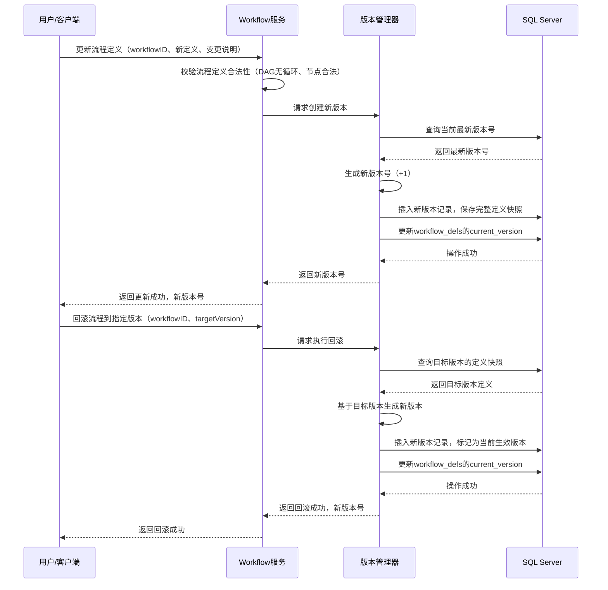
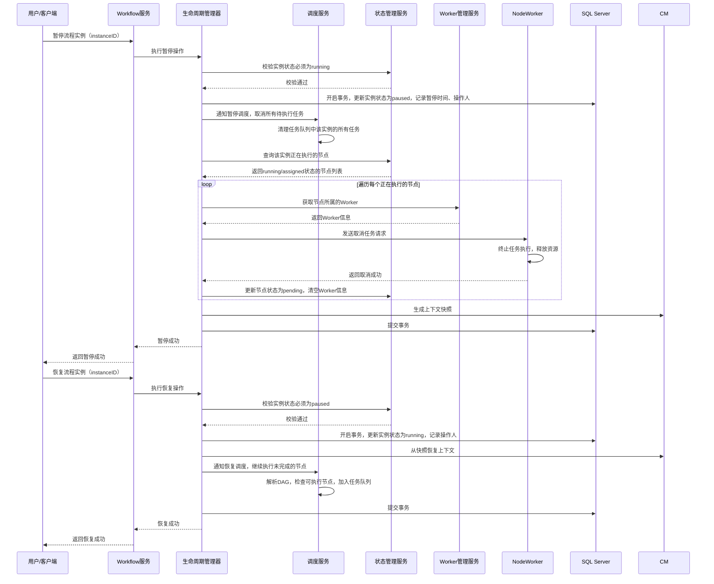
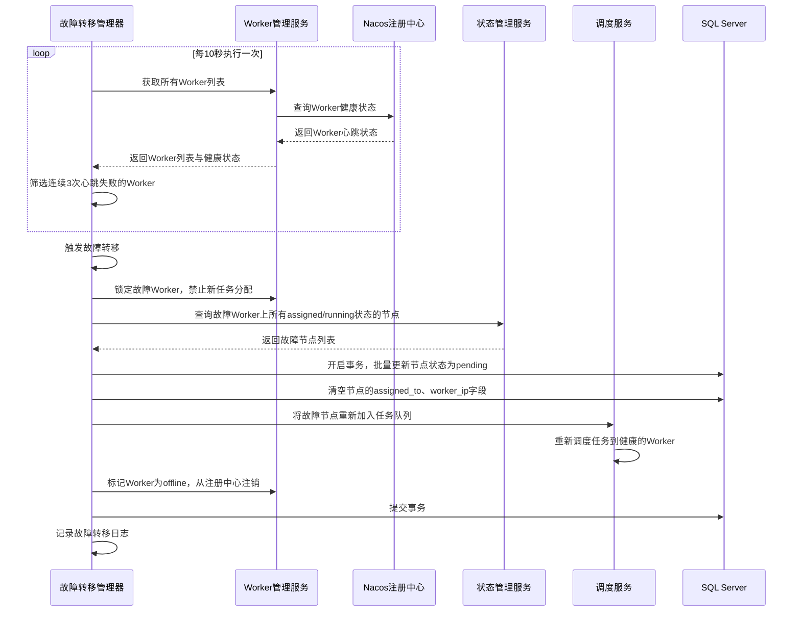
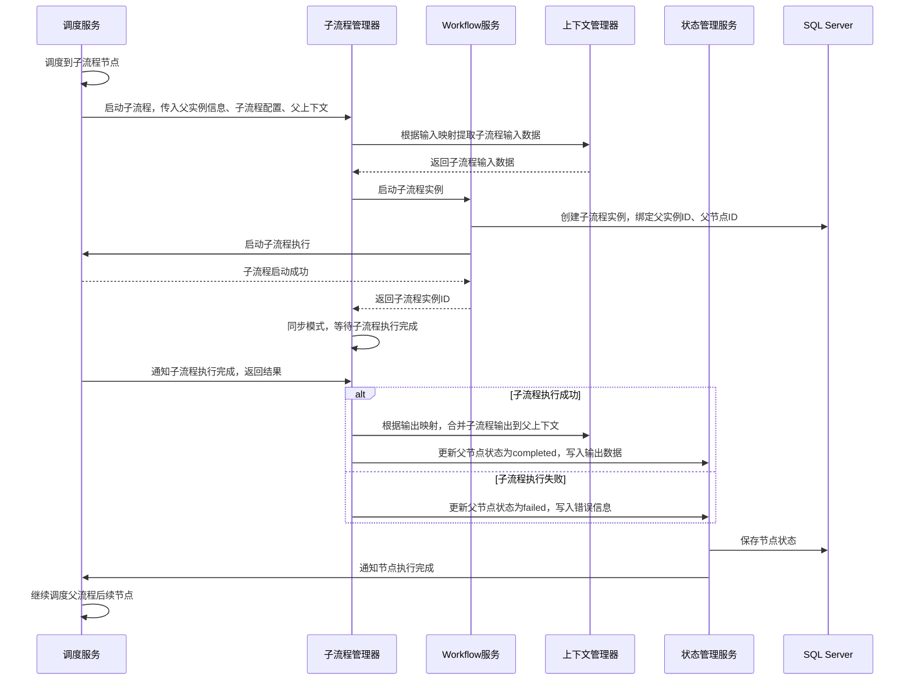

# D2阶段：流程管理与控制 详细设计文档
**文档编号**：D2-DESIGN-v1.0
**项目名称**：DistributedWorkflow 分布式工作流引擎
**对应版本**：v0.5.0-v0.6.0
**开发周期**：4周
**前置依赖**：D1阶段v0.4.0正式版已完整交付
**文档状态**：正式发布
**编制日期**：2026-04-26
**适用范围**：D2阶段开发、测试、交付全流程

---

## 一、文档概述
本文档是DistributedWorkflow项目D2阶段的详细设计说明书，基于D1阶段交付的核心基础架构，完成**流程版本化管理、全生命周期管控、统一容错机制、Worker故障自动转移、子流程调用**五大核心能力的落地。

D2阶段的核心目标是将引擎从「最小可用的核心原型」升级为「生产环境基础可用的工作流引擎」，解决D1阶段遗留的流程变更不可控、执行过程不可干预、故障容错能力弱、复杂流程无法拆分等核心问题，同时100%向后兼容D1阶段的所有功能与接口，保障现有流程的平滑升级。

## 二、阶段范围与交付标准
### 2.1 D2阶段包含的核心内容
1. **流程定义版本化管理**：流程版本创建、版本历史查询、版本回滚、版本灰度发布、运行中实例的版本隔离
2. **流程实例全生命周期管控**：流程实例的暂停/恢复、手动终止、单节点重试、全流程重试、断点续执行
3. **统一错误处理与重试机制**：可配置的节点级重试策略（固定间隔/指数退避）、错误分级处理、失败告警钩子、死信队列机制
4. **NodeWorker高可用与故障自动转移**：Worker故障实时检测、故障任务自动重分配、孤儿任务清理、网络分区容错处理
5. **子流程调用支持**：同步/异步子流程调用、子流程嵌套、父子流程上下文传递、子流程生命周期与父流程联动
6. **流程变更管控**：流程定义修改后仅对新实例生效，运行中实例不受影响，避免流程变更导致的执行异常

### 2.2 D2阶段不包含的内容
以下内容将在后续阶段实现，D2阶段仅预留扩展接口，不做开发：
1. 前端流程管理与可视化界面
2. 人工任务节点、定时触发端点
3. 事务补偿、回滚等高级容错能力
4. Prometheus指标、链路追踪等可观测性体系
5. 多租户、权限控制、数据隔离
6. 流程审计日志的完整实现（仅预留接口）

### 2.3 量化交付标准
1. 流程版本管理：支持最多保留100个历史版本，版本回滚耗时<100ms，灰度发布支持按比例/按白名单流量分发
2. 生命周期管控：流程暂停后1秒内停止所有新任务调度，恢复后从断点继续执行，无状态丢失、无重复执行
3. 容错能力：支持节点级重试策略配置，最大重试次数支持0-100次，Worker故障后30秒内完成任务自动转移，无任务丢失
4. 子流程支持：支持最多5层嵌套子流程调用，同步/异步两种模式，父子流程上下文双向传递
5. 兼容性：100%兼容D1阶段的所有API、数据结构、流程定义，D1阶段创建的流程可在D2版本中无修改正常运行
6. 代码质量：核心新增代码单元测试覆盖率≥85%，全流程集成测试用例100%通过
7. 性能：单Engine实例支持1000并发流程执行，调度延迟较D1阶段无劣化（平均<100ms）
8. 交付物：完整的代码实现、单元测试、集成测试、接口文档、升级指南、示例代码

## 三、核心设计约束
1. **向后兼容约束**：所有新增功能均为增量扩展，不得修改D1阶段已发布的核心接口、数据结构、数据库表结构的原有字段，仅可新增字段与接口
2. **版本隔离约束**：流程定义的修改必须生成新版本，运行中的流程实例严格绑定启动时的版本，不受后续版本变更影响
3. **状态机严格约束**：流程实例与节点的状态转换必须遵循预定义的状态机规则，禁止非法状态跳转，所有状态变更必须通过事务保证原子性
4. **幂等性约束**：所有新增操作（暂停/恢复/终止/重试/回滚）必须设计为幂等，重复调用不会产生数据不一致或重复执行
5. **无状态Worker约束**：延续D1的无状态Worker设计，Worker不存储任何流程状态，所有调度逻辑、状态管理仍由Engine统一管控
6. **故障容错约束**：所有新增流程必须考虑异常场景，任何组件故障不得导致流程状态丢失、数据不一致，必须具备自动恢复能力
7. **可观测性约束**：所有新增功能必须内置结构化日志输出，关键操作必须记录关键元数据（instance_id、node_id、version、operator等），为后续可观测性体系预留基础

## 四、核心数据结构详细设计
### 4.1 扩展枚举定义
#### 4.1.1 扩展流程实例状态枚举
```go
// WorkflowStatus 工作流实例状态（D2扩展）
type WorkflowStatus string

const (
    // D1原有状态
    WorkflowStatusPending   WorkflowStatus = "pending"
    WorkflowStatusRunning   WorkflowStatus = "running"
    WorkflowStatusCompleted WorkflowStatus = "completed"
    WorkflowStatusFailed    WorkflowStatus = "failed"
    // D2新增状态
    WorkflowStatusPaused    WorkflowStatus = "paused"    // 已暂停：流程暂停执行，等待恢复
    WorkflowStatusCancelled WorkflowStatus = "cancelled" // 已取消：手动终止执行
    WorkflowStatusRetrying  WorkflowStatus = "retrying"  // 重试中：流程正在执行重试逻辑
)
```

#### 4.1.2 扩展节点执行状态枚举
```go
// WorkflowNodeStatus 工作流节点执行状态（D2扩展）
type WorkflowNodeStatus string

const (
    // D1原有状态
    WorkflowNodeStatusPending   WorkflowNodeStatus = "pending"
    WorkflowNodeStatusAssigned  WorkflowNodeStatus = "assigned"
    WorkflowNodeStatusRunning   WorkflowNodeStatus = "running"
    WorkflowNodeStatusCompleted WorkflowNodeStatus = "completed"
    WorkflowNodeStatusFailed    WorkflowNodeStatus = "failed"
    // D2新增状态
    WorkflowNodeStatusSkipped   WorkflowNodeStatus = "skipped"   // 已跳过：流程终止时跳过未执行的节点
    WorkflowNodeStatusCancelled WorkflowNodeStatus = "cancelled" // 已取消：节点执行被手动终止
    WorkflowNodeStatusQueued    WorkflowNodeStatus = "queued"    // 重试队列中：等待重试执行
)
```

#### 4.1.3 重试策略类型枚举
```go
// RetryStrategyType 重试策略类型
type RetryStrategyType string

const (
    // RetryStrategyFixed 固定间隔重试
    RetryStrategyFixed RetryStrategyType = "fixed"
    // RetryStrategyExponential 指数退避重试
    RetryStrategyExponential RetryStrategyType = "exponential"
)
```

#### 4.1.4 灰度发布类型枚举
```go
// GrayReleaseType 灰度发布类型
type GrayReleaseType string

const (
    // GrayReleaseByRatio 按比例灰度
    GrayReleaseByRatio GrayReleaseType = "ratio"
    // GrayReleaseByWhitelist 按白名单灰度
    GrayReleaseByWhitelist GrayReleaseType = "whitelist"
)
```

#### 4.1.5 子流程调用模式枚举
```go
// SubflowCallMode 子流程调用模式
type SubflowCallMode string

const (
    // SubflowCallModeSync 同步调用：父流程等待子流程执行完成后继续
    SubflowCallModeSync SubflowCallMode = "sync"
    // SubflowCallModeAsync 异步调用：父流程触发子流程后立即继续执行
    SubflowCallModeAsync SubflowCallMode = "async"
)
```

### 4.2 核心业务结构体扩展
#### 4.2.1 新增WorkflowVersion 流程版本结构体
```go
// WorkflowVersion 流程版本定义
type WorkflowVersion struct {
    // ID 自增主键
    ID int64 `json:"id"`
    // WorkflowID 关联的流程定义ID
    WorkflowID string `json:"workflowId"`
    // Version 版本号，从1开始自增
    Version int `json:"version"`
    // Definition 该版本的流程定义完整JSON
    Definition *WorkflowDef `json:"definition"`
    // ChangeLog 版本变更说明
    ChangeLog string `json:"changeLog"`
    // CreatedBy 创建人
    CreatedBy string `json:"createdBy"`
    // CreatedAt 创建时间
    CreatedAt time.Time `json:"createdAt"`
    // IsCurrent 是否为当前生效版本
    IsCurrent bool `json:"isCurrent"`
    // GrayConfig 灰度发布配置
    GrayConfig *GrayReleaseConfig `json:"grayConfig"`
}

// GrayReleaseConfig 灰度发布配置
type GrayReleaseConfig struct {
    // Type 灰度类型
    Type GrayReleaseType `json:"type"`
    // Ratio 灰度比例，0-100，仅按比例灰度时生效
    Ratio int `json:"ratio"`
    // Whitelist 白名单列表，仅按白名单灰度时生效
    Whitelist []string `json:"whitelist"`
    // Enabled 是否开启灰度
    Enabled bool `json:"enabled"`
}
```

#### 4.2.2 新增RetryPolicy 重试策略结构体
```go
// RetryPolicy 节点重试策略
type RetryPolicy struct {
    // Strategy 重试策略类型
    Strategy RetryStrategyType `json:"strategy" validate:"oneof=fixed exponential" default:"fixed"`
    // MaxRetryCount 最大重试次数，0表示不重试
    MaxRetryCount int `json:"maxRetryCount" validate:"min=0" default:"3"`
    // RetryInterval 重试间隔，单位秒，固定间隔策略生效
    RetryInterval int `json:"retryInterval" validate:"min=1" default:"5"`
    // MaxInterval 最大重试间隔，单位秒，指数退避策略生效
    MaxInterval int `json:"maxInterval" validate:"min=1" default:"300"`
    // Multiplier 指数退避乘数，默认2
    Multiplier float64 `json:"multiplier" validate:"min=1" default:"2"`
    // RetryOnErrorCodes 可重试的错误码，为空则所有错误都重试
    RetryOnErrorCodes []string `json:"retryOnErrorCodes"`
}
```

#### 4.2.3 WorkflowDef 工作流定义扩展
```go
// WorkflowDef 工作流定义（D2扩展）
type WorkflowDef struct {
    // D1原有字段
    ID          string                 `json:"id" validate:"required,max=64"`
    Name        string                 `json:"name" validate:"required,max=255"`
    Description string                 `json:"description"`
    Nodes       map[string]*WorkflowNode `json:"nodes" validate:"required,min=1"`
    Connections []*Connection          `json:"connections" validate:"required,min=1"`
    StartNodeID string                 `json:"startNodeId" validate:"required"`
    EndNodeID   string                 `json:"endNodeId" validate:"required"`
    CreatedAt   time.Time              `json:"createdAt"`
    UpdatedAt   time.Time              `json:"updatedAt"`
    // D2新增字段
    // CurrentVersion 当前生效版本号
    CurrentVersion int `json:"currentVersion" default:"1"`
    // GlobalRetryPolicy 全局重试策略，节点未配置时使用全局配置
    GlobalRetryPolicy *RetryPolicy `json:"globalRetryPolicy"`
    // Timeout 流程全局超时时间，单位秒，0表示不限制
    Timeout int `json:"timeout" validate:"min=0" default:"0"`
}
```

#### 4.2.4 WorkflowNode 工作流节点扩展
```go
// WorkflowNode 工作流节点（D2扩展）
type WorkflowNode struct {
    // D1原有字段
    ID             string                 `json:"id" validate:"required,max=64"`
    Type           string                 `json:"type" validate:"required,max=64"`
    Name           string                 `json:"name" validate:"required,max=255"`
    Description    string                 `json:"description"`
    Config         map[string]interface{} `json:"config"`
    DependencyMode DependencyMode         `json:"dependencyMode" validate:"oneof=all any" default:"all"`
    Timeout        int                    `json:"timeout" validate:"min=0" default:"0"`
    // D2新增字段
    // RetryPolicy 节点级重试策略，优先级高于全局策略
    RetryPolicy *RetryPolicy `json:"retryPolicy"`
    // SkipOnError 执行失败时是否跳过该节点，继续执行后续流程
    SkipOnError bool `json:"skipOnError" default:"false"`
    // IsSubflowNode 是否为子流程节点
    IsSubflowNode bool `json:"isSubflowNode" default:"false"`
    // SubflowConfig 子流程配置，仅子流程节点生效
    SubflowConfig *SubflowNodeConfig `json:"subflowConfig"`
}

// SubflowNodeConfig 子流程节点配置
type SubflowNodeConfig struct {
    // SubflowID 被调用的子流程定义ID
    SubflowID string `json:"subflowId" validate:"required"`
    // CallMode 调用模式
    CallMode SubflowCallMode `json:"callMode" validate:"oneof=sync async" default:"sync"`
    // InputMapping 输入参数映射，父流程上下文到子流程输入的映射
    InputMapping map[string]string `json:"inputMapping"`
    // OutputMapping 输出参数映射，子流程输出到父流程上下文的映射
    OutputMapping map[string]string `json:"outputMapping"`
    // WaitForSubflow 异步模式下，是否等待子流程完成后标记节点成功
    WaitForSubflow bool `json:"waitForSubflow" default:"true"`
}
```

#### 4.2.5 WorkflowInstance 流程实例扩展
```go
// WorkflowInstance 工作流实例（D2扩展）
type WorkflowInstance struct {
    // D1原有字段
    ID           string                 `json:"id"`
    WorkflowID   string                 `json:"workflowId"`
    WorkflowVersion int                 `json:"workflowVersion" default:"1"`
    Status       WorkflowStatus         `json:"status"`
    StartTime    time.Time              `json:"startTime"`
    EndTime      time.Time              `json:"endTime"`
    InputData    map[string]interface{} `json:"inputData"`
    OutputData   map[string]interface{} `json:"outputData"`
    CreatedBy    string                 `json:"createdBy"`
    ErrorMessage string                 `json:"errorMessage"`
    // D2新增字段
    // PauseTime 暂停时间
    PauseTime time.Time `json:"pauseTime"`
    // CancelTime 取消时间
    CancelTime time.Time `json:"cancelTime"`
    // ParentInstanceID 父流程实例ID，子流程实例生效
    ParentInstanceID string `json:"parentInstanceId"`
    // ParentNodeID 父流程节点ID，子流程实例生效
    ParentNodeID string `json:"parentNodeId"`
    // IsSubflowInstance 是否为子流程实例
    IsSubflowInstance bool `json:"isSubflowInstance" default:"false"`
    // PauseNodeIDs 暂停时已暂停的节点ID列表
    PauseNodeIDs []string `json:"pauseNodeIds"`
    // Operator 最后操作人
    Operator string `json:"operator"`
}
```

#### 4.2.6 WorkflowNodeState 节点状态扩展
```go
// WorkflowNodeState 节点执行状态（D2扩展）
type WorkflowNodeState struct {
    // D1原有字段
    ID           int64                  `json:"id"`
    InstanceID   string                 `json:"instanceId"`
    NodeID       string                 `json:"nodeId"`
    Status       WorkflowNodeStatus     `json:"status"`
    AssignedTo   string                 `json:"assignedTo"`
    WorkerIP     string                 `json:"workerIp"`
    StartTime    time.Time              `json:"startTime"`
    EndTime      time.Time              `json:"endTime"`
    InputData    map[string]interface{} `json:"inputData"`
    OutputData   map[string]interface{} `json:"outputData"`
    ErrorMessage string                 `json:"errorMessage"`
    RetryCount   int                    `json:"retryCount" default:"0"`
    // D2新增字段
    // NextRetryTime 下一次重试时间
    NextRetryTime time.Time `json:"nextRetryTime"`
    // LastRetryTime 上一次重试时间
    LastRetryTime time.Time `json:"lastRetryTime"`
    // ErrorCode 错误码
    ErrorCode string `json:"errorCode"`
    // SkippedReason 跳过原因
    SkippedReason string `json:"skippedReason"`
}
```

#### 4.2.7 NodeWorkerInfo 扩展
```go
// NodeWorkerInfo NodeWorker节点信息（D2扩展）
type NodeWorkerInfo struct {
    // D1原有字段
    ID            string            `json:"id"`
    Address       string            `json:"address"`
    IP            string            `json:"ip"`
    Capabilities  map[string]int    `json:"capabilities"`
    CurrentLoad   map[string]int    `json:"currentLoad"`
    LastHeartbeat time.Time         `json:"lastHeartbeat"`
    Status        string            `json:"status"`
    // D2新增字段
    // HealthStatus 健康状态：healthy/unhealthy/offline
    HealthStatus string `json:"healthStatus" default:"healthy"`
    // FailedHeartbeatCount 连续心跳失败次数
    FailedHeartbeatCount int `json:"failedHeartbeatCount" default:"0"`
    // RegisterTime 注册时间
    RegisterTime time.Time `json:"registerTime"`
}
```

## 五、核心组件详细设计
D2阶段基于D1的组件架构进行增量升级，分为**核心服务升级**、**新增核心组件**、**公共组件增强**、**存储层扩展**四大模块，所有组件严格遵循接口抽象原则，可独立替换扩展。

### 5.1 核心服务升级
#### 5.1.1 Workflow管理服务（WorkflowService）
**D2升级职责**：在D1基础上，新增流程版本管理、生命周期操作入口、子流程启动能力
**扩展接口定义**：
```go
type WorkflowService interface {
    // D1原有接口
    CreateWorkflow(def *WorkflowDef) (string, error)
    GetWorkflow(workflowID string) (*WorkflowDef, error)
    UpdateWorkflow(def *WorkflowDef, changeLog string, createdBy string) (int, error) // D2扩展：返回新版本号
    DeleteWorkflow(workflowID string) error
    StartWorkflow(workflowID string, inputData map[string]interface{}, createdBy string) (string, error)
    GetWorkflowInstance(instanceID string) (*WorkflowInstance, error)
    ListWorkflowInstances(workflowID string, page, pageSize int) ([]*WorkflowInstance, int, error)

    // D2新增接口
    // GetWorkflowVersion 获取指定版本的流程定义
    GetWorkflowVersion(workflowID string, version int) (*WorkflowVersion, error)
    // ListWorkflowVersions 列出流程的所有历史版本
    ListWorkflowVersions(workflowID string, page, pageSize int) ([]*WorkflowVersion, int, error)
    // RollbackWorkflow 回滚流程到指定版本，返回新版本号
    RollbackWorkflow(workflowID string, targetVersion int, operator string) (int, error)
    // UpdateGrayConfig 更新灰度发布配置
    UpdateGrayConfig(workflowID string, config *GrayReleaseConfig, operator string) error
    // PauseInstance 暂停流程实例
    PauseInstance(instanceID string, operator string) error
    // ResumeInstance 恢复暂停的流程实例
    ResumeInstance(instanceID string, operator string) error
    // CancelInstance 终止流程实例
    CancelInstance(instanceID string, reason string, operator string) error
    // RetryInstance 重试失败的流程实例
    RetryInstance(instanceID string, operator string) error
    // RetryNode 重试单个失败节点
    RetryNode(instanceID string, nodeID string, operator string) error
}
```
**核心升级逻辑**：
1. 更新流程时自动生成新版本，禁止直接覆盖当前生效版本
2. 启动流程时，根据灰度配置选择对应的流程版本，保障版本隔离
3. 生命周期操作（暂停/恢复/终止/重试）统一入口，校验操作权限与状态合法性
4. 子流程启动时，自动绑定父子实例关系，继承父流程的版本与上下文

#### 5.1.2 调度服务（SchedulerService）
**D2升级职责**：在D1基础上，新增暂停/恢复调度、重试调度、子流程调度、故障任务重调度能力
**扩展接口定义**：
```go
type SchedulerService interface {
    // D1原有接口
    StartExecution(instanceID string) error
    ScheduleNextNodes(instanceID string) error
    HandleNodeCompleted(instanceID string, nodeID string, success bool, output map[string]interface{}, errMsg string) error
    RecoverUnfinishedInstances() error

    // D2新增接口
    // PauseExecution 暂停流程实例的调度
    PauseExecution(instanceID string) error
    // ResumeExecution 恢复流程实例的调度
    ResumeExecution(instanceID string) error
    // CancelExecution 终止流程实例的调度
    CancelExecution(instanceID string, reason string) error
    // RetryExecution 重试流程实例
    RetryExecution(instanceID string) error
    // RetrySingleNode 重试单个节点
    RetrySingleNode(instanceID string, nodeID string) error
    // HandleWorkerFailure 处理Worker故障，重调度故障任务
    HandleWorkerFailure(workerID string) error
    // ProcessRetryQueue 处理重试队列中的任务
    ProcessRetryQueue() error
}
```
**核心升级逻辑**：
1. 暂停调度：取消所有待执行任务，终止正在分发的任务，记录暂停断点，拒绝新的任务调度
2. 恢复调度：从断点加载上下文，重新调度未完成的节点，继续执行流程
3. 重试调度：支持全流程重试（从失败节点继续）和单节点重试，重置节点状态，重新分配任务
4. 故障重调度：Worker故障时，将该Worker上所有assigned/running状态的任务重置为pending，重新加入调度队列
5. 重试队列：基于Redis实现延迟重试队列，按重试策略定时调度重试任务

#### 5.1.3 NodeWorker管理服务（WorkerManagerService）
**D2升级职责**：在D1基础上，新增Worker健康检测、故障检测、故障自动转移能力
**扩展接口定义**：
```go
type WorkerManagerService interface {
    // D1原有接口
    GetOnlineWorkers() []*NodeWorkerInfo
    GetWorkersByNodeType(nodeType string) []*NodeWorkerInfo
    SelectBestWorker(nodeType string) (*NodeWorkerInfo, error)
    AssignTask(workerID string, task *Task) error
    HandleWorkerOffline(workerID string) error
    UpdateWorkerLoad(workerID string, nodeType string, delta int) error

    // D2新增接口
    // CheckWorkerHealth 检测Worker健康状态
    CheckWorkerHealth(workerID string) (bool, error)
    // GetUnhealthyWorkers 获取所有不健康的Worker
    GetUnhealthyWorkers() []*NodeWorkerInfo
    // FailoverWorker 执行Worker故障转移
    FailoverWorker(workerID string) error
    // CleanupOrphanTasks 清理孤儿任务
    CleanupOrphanTasks() error
}
```
**核心升级逻辑**：
1. 健康检测：每10秒全量检测Worker健康状态，连续3次心跳失败标记为不健康
2. 故障转移：Worker标记为不健康后，自动执行故障转移，将该Worker上的所有未完成任务重新调度
3. 孤儿任务清理：定时扫描超过超时时间未上报结果的任务，自动重置状态并重调度
4. 优雅下线：Worker下线时，先停止接收新任务，等待正在执行的任务完成后再注销

#### 5.1.4 实例状态管理服务（InstanceStateService）
**D2升级职责**：在D1基础上，新增状态机校验、生命周期状态更新、重试状态管理能力
**扩展接口定义**：
```go
type InstanceStateService interface {
    // D1原有接口
    CreateInstance(instance *WorkflowInstance) error
    UpdateInstanceStatus(instanceID string, status WorkflowStatus, errMsg string) error
    CreateNodeState(state *WorkflowNodeState) error
    UpdateNodeState(state *WorkflowNodeState) error
    GetNodeState(instanceID string, nodeID string) (*WorkflowNodeState, error)
    GetInstanceNodeStates(instanceID string) ([]*WorkflowNodeState, error)
    ReportTaskResult(result *TaskResult) error

    // D2新增接口
    // ValidateStateTransition 校验状态转换合法性
    ValidateStateTransition(currentStatus WorkflowStatus, targetStatus WorkflowStatus) bool
    // BatchUpdateNodeStatus 批量更新节点状态
    BatchUpdateNodeStatus(instanceID string, nodeIDs []string, status WorkflowNodeStatus, reason string) error
    // UpdateRetryState 更新节点重试状态
    UpdateRetryState(instanceID string, nodeID string, nextRetryTime time.Time, retryCount int) error
    // GetFailedNodes 获取实例的所有失败节点
    GetFailedNodes(instanceID string) ([]*WorkflowNodeState, error)
    // GetAssignedNodesByWorker 获取指定Worker上已分配的节点
    GetAssignedNodesByWorker(workerID string) ([]*WorkflowNodeState, error)
}
```
**核心升级逻辑**：
1. 状态机校验：内置严格的状态转换规则，禁止非法状态跳转，例如running→completed是合法的，completed→running是非法的
2. 事务保障：所有状态更新与业务操作在同一个数据库事务中，保障原子性
3. 重试状态管理：记录节点的重试次数、重试时间，避免无限重试
4. 批量操作：支持批量更新节点状态，提升暂停/终止操作的性能

### 5.2 新增核心组件
#### 5.2.1 流程版本管理器（WorkflowVersionManager）
**核心职责**：流程版本的全生命周期管理，版本创建、查询、回滚、灰度发布
**接口定义**：
```go
type WorkflowVersionManager interface {
    // CreateVersion 创建新版本
    CreateVersion(workflowID string, def *WorkflowDef, changeLog string, createdBy string) (*WorkflowVersion, error)
    // GetVersion 获取指定版本
    GetVersion(workflowID string, version int) (*WorkflowVersion, error)
    // GetCurrentVersion 获取当前生效版本
    GetCurrentVersion(workflowID string) (*WorkflowVersion, error)
    // ListVersions 列出所有历史版本
    ListVersions(workflowID string, page, pageSize int) ([]*WorkflowVersion, int, error)
    // Rollback 回滚到指定版本，自动生成新版本
    Rollback(workflowID string, targetVersion int, operator string) (*WorkflowVersion, error)
    // UpdateGrayConfig 更新灰度配置
    UpdateGrayConfig(workflowID string, config *GrayReleaseConfig, operator string) error
    // SelectVersionForStart 流程启动时选择对应的版本
    SelectVersionForStart(workflowID string, context map[string]interface{}) (*WorkflowVersion, error)
    // SetCurrentVersion 设置当前生效版本
    SetCurrentVersion(workflowID string, version int, operator string) error
}
```
**核心实现逻辑**：
1. 版本自增：每次更新流程自动生成新版本，版本号从1开始连续自增，无跳号
2. 版本隔离：每个版本保存完整的流程定义快照，互不影响
3. 版本回滚：回滚操作不修改历史版本，而是基于目标版本生成新版本，保障变更可追溯
4. 灰度发布：
   - 按比例灰度：根据配置的比例，随机分发流量到新版本
   - 按白名单灰度：根据创建人、租户ID等白名单信息，匹配白名单的使用新版本
   - 灰度关闭后，所有新实例使用当前生效版本
5. 版本选择：流程启动时，根据灰度配置选择对应的版本，实例启动后版本号终身不变

#### 5.2.2 生命周期管理器（LifecycleManager）
**核心职责**：流程实例全生命周期操作的业务逻辑实现，暂停/恢复/终止/重试的核心处理
**接口定义**：
```go
type LifecycleManager interface {
    // Pause 暂停流程实例
    Pause(instanceID string, operator string) error
    // Resume 恢复流程实例
    Resume(instanceID string, operator string) error
    // Cancel 终止流程实例
    Cancel(instanceID string, reason string, operator string) error
    // RetryInstance 重试整个流程实例
    RetryInstance(instanceID string, operator string) error
    // RetryNode 重试单个节点
    RetryNode(instanceID string, nodeID string, operator string) error
    // CheckTimeout 检查流程实例超时
    CheckTimeout() error
}
```
**核心实现逻辑**：
1. **暂停流程**：
   - 校验实例状态必须为running
   - 更新实例状态为paused，记录暂停时间与操作人
   - 通知调度服务暂停调度，取消所有待执行任务
   - 向正在执行任务的Worker发送取消任务请求
   - 记录暂停时的断点信息，包括已完成节点、上下文数据
2. **恢复流程**：
   - 校验实例状态必须为paused
   - 更新实例状态为running，记录恢复操作人
   - 从断点加载上下文与流程定义
   - 通知调度服务恢复调度，继续执行未完成的节点
3. **终止流程**：
   - 校验实例状态为running/paused/failed
   - 更新实例状态为cancelled，记录终止原因与操作人
   - 通知调度服务终止调度，清理所有待执行任务
   - 向Worker发送取消任务请求，终止正在执行的任务
   - 批量更新未执行节点状态为skipped，记录跳过原因
4. **重试流程**：
   - 校验实例状态为failed/cancelled
   - 更新实例状态为retrying，记录操作人
   - 重置所有失败节点的状态为pending，清空错误信息
   - 保留已完成节点的状态与上下文数据，从失败节点继续执行
   - 通知调度服务启动重试调度

#### 5.2.3 子流程管理器（SubflowManager）
**核心职责**：子流程调用的全生命周期管理，父子流程联动、上下文传递
**接口定义**：
```go
type SubflowManager interface {
    // StartSubflow 启动子流程实例
    StartSubflow(parentInstanceID string, parentNodeID string, subflowConfig *SubflowNodeConfig, parentContext *WorkflowContext, createdBy string) (string, error)
    // HandleSubflowCompleted 处理子流程执行完成事件
    HandleSubflowCompleted(subflowInstanceID string, success bool, outputData map[string]interface{}) error
    // GetSubflowInstance 获取子流程实例
    GetSubflowInstance(subflowInstanceID string) (*WorkflowInstance, error)
    // ListSubflowInstances 列出父流程的所有子流程实例
    ListSubflowInstances(parentInstanceID string) ([]*WorkflowInstance, error)
    // CancelSubflow 终止子流程实例
    CancelSubflow(subflowInstanceID string, reason string, operator string) error
}
```
**核心实现逻辑**：
1. **子流程启动**：
   - 校验子流程定义存在且已发布
   - 根据输入映射规则，从父流程上下文提取子流程的输入数据
   - 创建子流程实例，绑定父实例ID、父节点ID，标记为子流程实例
   - 启动子流程执行，根据调用模式决定是否等待
2. **同步调用模式**：
   - 父流程节点等待子流程执行完成
   - 子流程执行成功后，根据输出映射规则，将子流程输出写入父流程上下文
   - 标记父节点为completed，继续调度后续节点
   - 子流程执行失败，标记父节点为failed，触发重试或失败分支
3. **异步调用模式**：
   - 触发子流程后立即标记父节点为completed，继续执行父流程后续节点
   - 若配置了WaitForSubflow，子流程完成后更新父节点输出数据
   - 子流程执行失败不影响父流程执行
4. **父子流程联动**：
   - 父流程暂停/终止时，自动暂停/终止所有未完成的子流程
   - 父流程重试时，自动重试对应的失败子流程
   - 子流程最多支持5层嵌套，禁止循环依赖

#### 5.2.4 故障转移管理器（FailoverManager）
**核心职责**：Worker故障检测、故障任务重分配、孤儿任务清理
**接口定义**：
```go
type FailoverManager interface {
    // Start 启动故障检测循环
    Start() error
    // Stop 停止故障检测
    Stop() error
    // ProcessFailover 执行指定Worker的故障转移
    ProcessFailover(workerID string) error
    // CleanupOrphanTasks 清理孤儿任务
    CleanupOrphanTasks() error
}
```
**核心实现逻辑**：
1. **故障检测**：
   - 后台协程每10秒执行一次全量健康检测
   - 连续3次心跳失败的Worker，标记为不健康
   - 连续5次心跳失败的Worker，标记为offline，触发故障转移
2. **故障转移流程**：
   - 锁定故障Worker，禁止新任务分配
   - 查询该Worker上所有assigned/running状态的节点
   - 批量更新节点状态为pending，清空assigned_to、worker_ip字段
   - 将节点重新加入任务队列，调度服务重新分配给健康的Worker
   - 记录故障转移日志，包含Worker信息、转移的任务数量
3. **孤儿任务清理**：
   - 定时扫描超过2倍超时时间未上报结果的任务
   - 校验任务所属的Worker是否在线
   - Worker离线的任务，执行故障转移
   - Worker在线但长时间未上报的任务，发送心跳检测，无响应则取消任务并重调度

### 5.3 公共组件增强
#### 5.3.1 统一错误处理器（ErrorHandler）
**D2升级职责**：在D1基础上，新增错误分级、重试策略、死信队列、告警钩子能力
**扩展接口定义**：
```go
type ErrorHandler interface {
    // D1原有接口
    HandleError(err error, metadata map[string]interface{})

    // D2新增接口
    // HandleNodeError 处理节点执行错误，判断是否可重试
    HandleNodeError(err error, nodeState *WorkflowNodeState, retryPolicy *RetryPolicy) (needRetry bool, nextRetryTime time.Time)
    // RegisterErrorHook 注册错误处理钩子
    RegisterErrorHook(hook ErrorHook)
    // SendToDeadLetterQueue 将失败任务发送到死信队列
    SendToDeadLetterQueue(task *Task, err error) error
    // ListDeadLetterTasks 列出死信队列中的任务
    ListDeadLetterTasks(page, pageSize int) ([]*DeadLetterTask, int, error)
    // ResendDeadLetterTask 重发死信任务
    ResendDeadLetterTask(taskID string) error
}

// ErrorHook 错误处理钩子
type ErrorHook interface {
    // OnError 错误发生时触发
    OnError(err error, metadata map[string]interface{})
    // OnRetryExhausted 重试次数耗尽时触发
    OnRetryExhausted(task *Task, err error)
}

// DeadLetterTask 死信任务
type DeadLetterTask struct {
    TaskID      string                 `json:"taskId"`
    InstanceID  string                 `json:"instanceId"`
    NodeID      string                 `json:"nodeId"`
    Error       string                 `json:"error"`
    RetryCount  int                    `json:"retryCount"`
    CreatedAt   time.Time              `json:"createdAt"`
    TaskData    map[string]interface{} `json:"taskData"`
}
```
**核心升级逻辑**：
1. **错误分级**：将错误分为可重试错误、不可重试错误、系统错误、业务错误，不同错误执行不同的处理策略
2. **重试策略执行**：
   - 固定间隔重试：每次重试间隔固定，直到达到最大重试次数
   - 指数退避重试：重试间隔按乘数指数增长，直到达到最大间隔
   - 仅当错误码在可重试列表中时，才执行重试
3. **死信队列**：重试次数耗尽的任务，自动进入死信队列，支持人工查看、重发
4. **错误钩子**：支持注册自定义钩子，实现错误告警、日志上报、自定义处理逻辑
5. **结构化错误**：所有错误统一封装，包含错误码、错误信息、堆栈信息、元数据，便于排查问题

#### 5.3.2 上下文管理器（ContextManager）
**D2升级职责**：在D1基础上，新增父子流程上下文传递、上下文快照、版本隔离能力
**扩展接口定义**：
```go
type ContextManager interface {
    // D1原有接口
    CreateContext(instanceID string, inputData map[string]interface{}) (*WorkflowContext, error)
    GetContext(instanceID string) (*WorkflowContext, error)
    UpdateContext(instanceID string, data map[string]interface{}) error
    DeleteContext(instanceID string) error

    // D2新增接口
    // SnapshotContext 生成上下文快照，用于暂停/回滚
    SnapshotContext(instanceID string) (string, error)
    // RestoreContext 从快照恢复上下文
    RestoreContext(instanceID string, snapshotID string) error
    // MergeContext 合并子流程上下文到父流程
    MergeContext(parentInstanceID string, subflowInstanceID string, mapping map[string]string) error
    // ExtractContext 从父流程上下文提取子流程输入
    ExtractContext(parentInstanceID string, mapping map[string]string) (map[string]interface{}, error)
}
```
**核心升级逻辑**：
1. 上下文快照：流程暂停时生成上下文快照，保障恢复时数据不丢失
2. 父子上下文传递：根据映射规则，实现父子流程之间的上下文双向传递，支持字段重命名、过滤
3. 版本隔离：上下文数据与流程实例版本绑定，流程版本变更不影响已运行实例的上下文

## 六、数据库详细设计（SQL Server）
### 6.1 表结构变更与新增
#### 6.1.1 workflow_defs 表变更
```sql
ALTER TABLE workflow_defs
ADD 
    current_version INT NOT NULL DEFAULT 1,
    global_retry_policy NVARCHAR(MAX),
    timeout INT NOT NULL DEFAULT 0;
```

#### 6.1.2 workflow_versions 表完善（D1基础表，D2正式落地）
```sql
-- 先删除D1阶段的基础表，重新创建完整结构
DROP TABLE IF EXISTS workflow_versions;

CREATE TABLE workflow_versions (
    id INT IDENTITY(1,1) PRIMARY KEY,
    workflow_id VARCHAR(64) NOT NULL FOREIGN KEY REFERENCES workflow_defs(id),
    version INT NOT NULL,
    definition NVARCHAR(MAX) NOT NULL,
    change_log NVARCHAR(MAX),
    created_by VARCHAR(64) NOT NULL,
    created_at DATETIME2 NOT NULL DEFAULT GETDATE(),
    is_current BIT NOT NULL DEFAULT 0,
    gray_config NVARCHAR(MAX),
    UNIQUE(workflow_id, version)
);

-- 创建索引
CREATE INDEX idx_workflow_versions_workflow_id ON workflow_versions(workflow_id);
CREATE INDEX idx_workflow_versions_is_current ON workflow_versions(workflow_id, is_current);
```

#### 6.1.3 workflow_instances 表变更
```sql
ALTER TABLE workflow_instances
ADD 
    pause_time DATETIME2,
    cancel_time DATETIME2,
    parent_instance_id VARCHAR(64),
    parent_node_id VARCHAR(64),
    is_subflow_instance BIT NOT NULL DEFAULT 0,
    pause_node_ids NVARCHAR(MAX),
    operator VARCHAR(64);

-- 创建索引
CREATE INDEX idx_workflow_instances_parent_instance_id ON workflow_instances(parent_instance_id);
CREATE INDEX idx_workflow_instances_status_created_at ON workflow_instances(status, created_at);
```

#### 6.1.4 workflow_node_states 表变更
```sql
ALTER TABLE workflow_node_states
ADD 
    next_retry_time DATETIME2,
    last_retry_time DATETIME2,
    error_code VARCHAR(64),
    skipped_reason NVARCHAR(MAX);

-- 创建索引
CREATE INDEX idx_workflow_node_states_next_retry_time ON workflow_node_states(next_retry_time);
CREATE INDEX idx_workflow_node_states_assigned_to_status ON workflow_node_states(assigned_to, status);
```

#### 6.1.5 新增 workflow_dead_letter_tasks 死信队列表
```sql
CREATE TABLE workflow_dead_letter_tasks (
    id VARCHAR(64) PRIMARY KEY,
    instance_id VARCHAR(64) NOT NULL FOREIGN KEY REFERENCES workflow_instances(id),
    node_id VARCHAR(64) NOT NULL,
    worker_id VARCHAR(64),
    worker_ip VARCHAR(64),
    error_message NVARCHAR(MAX) NOT NULL,
    error_code VARCHAR(64),
    retry_count INT NOT NULL DEFAULT 0,
    task_data NVARCHAR(MAX) NOT NULL,
    created_at DATETIME2 NOT NULL DEFAULT GETDATE(),
    resend_count INT NOT NULL DEFAULT 0,
    last_resend_at DATETIME2
);

-- 创建索引
CREATE INDEX idx_workflow_dead_letter_instance_id ON workflow_dead_letter_tasks(instance_id);
CREATE INDEX idx_workflow_dead_letter_created_at ON workflow_dead_letter_tasks(created_at);
```

### 6.2 完整初始化脚本
完整的SQL Server初始化脚本见附录A，包含表创建、字段变更、索引创建、默认数据插入。

## 七、gRPC协议扩展
### 7.1 扩展Proto定义
```protobuf
syntax = "proto3";

package distributedworkflow;
option go_package = "./proto;proto";

import "google/protobuf/any.proto";
import "google/protobuf/timestamp.proto";

// 原有EngineService扩展
service EngineService {
  // D1原有接口
  rpc RegisterWorker(RegisterWorkerRequest) returns (RegisterWorkerResponse);
  rpc UnregisterWorker(UnregisterWorkerRequest) returns (UnregisterWorkerResponse);
  rpc Heartbeat(HeartbeatRequest) returns (HeartbeatResponse);
  rpc ReportTaskResult(ReportTaskResultRequest) returns (ReportTaskResultResponse);
  rpc ReportError(ReportErrorRequest) returns (ReportErrorResponse);

  // D2新增接口
  // 通知Worker取消任务
  rpc NotifyTaskCancel(NotifyTaskCancelRequest) returns (NotifyTaskCancelResponse);
  // 通知Worker暂停任务
  rpc NotifyTaskPause(NotifyTaskPauseRequest) returns (NotifyTaskPauseResponse);
}

// 原有NodeWorkerService扩展
service NodeWorkerService {
  // D1原有接口
  rpc AssignTask(AssignTaskRequest) returns (AssignTaskResponse);
  rpc CancelTask(CancelTaskRequest) returns (CancelTaskResponse);

  // D2新增接口
  // 暂停正在执行的任务
  rpc PauseTask(PauseTaskRequest) returns (PauseTaskResponse);
  // 获取Worker健康状态
  rpc HealthCheck(HealthCheckRequest) returns (HealthCheckResponse);
}

// D2新增消息定义
message NotifyTaskCancelRequest {
  string workflow_instance_id = 1;
  string workflow_node_id = 2;
  string reason = 3;
  string operator = 4;
}

message NotifyTaskCancelResponse {
  int32 code = 1;
  string message = 2;
  bool success = 3;
}

message NotifyTaskPauseRequest {
  string workflow_instance_id = 1;
  string workflow_node_id = 2;
  string operator = 3;
}

message NotifyTaskPauseResponse {
  int32 code = 1;
  string message = 2;
  bool success = 3;
}

message PauseTaskRequest {
  string workflow_instance_id = 1;
  string workflow_node_id = 2;
}

message PauseTaskResponse {
  int32 code = 1;
  string message = 2;
  bool success = 3;
}

message HealthCheckRequest {
  string worker_id = 1;
}

message HealthCheckResponse {
  int32 code = 1;
  string message = 2;
  bool healthy = 3;
  map<string, int32> current_load = 4;
}

// 原有消息扩展
message RegisterWorkerRequest {
  string worker_id = 1;
  string address = 2;
  string worker_ip = 3;
  map<string, int32> capabilities = 4;
}

message ReportTaskResultRequest {
  string task_id = 1;
  string workflow_instance_id = 2;
  string workflow_node_id = 3;
  bool success = 4;
  google.protobuf.Any output_data = 5;
  string error_message = 6;
  string error_code = 7; // D2新增
  google.protobuf.Timestamp start_time = 8;
  google.protobuf.Timestamp end_time = 9;
}

message ReportErrorRequest {
  string worker_id = 1;
  string worker_ip = 2;
  string workflow_instance_id = 3;
  string workflow_node_id = 4;
  string error_message = 5;
  string error_code = 6; // D2新增
  string stack_trace = 7;
  google.protobuf.Timestamp occur_time = 8;
}
```

## 八、核心流程详细设计
### 8.1 流程版本创建与回滚流程


### 8.2 流程暂停与恢复流程


### 8.3 Worker故障自动转移流程


### 8.4 同步子流程调用流程


## 九、关键技术实现细节
### 9.1 流程版本隔离实现
```go
// SelectVersionForStart 流程启动时选择版本
func (m *WorkflowVersionManager) SelectVersionForStart(workflowID string, context map[string]interface{}) (*WorkflowVersion, error) {
    // 获取当前生效版本
    currentVersion, err := m.GetCurrentVersion(workflowID)
    if err != nil {
        return nil, err
    }

    // 检查是否开启灰度发布
    if currentVersion.GrayConfig == nil || !currentVersion.GrayConfig.Enabled {
        return currentVersion, nil
    }

    grayConfig := currentVersion.GrayConfig
    switch grayConfig.Type {
    case GrayReleaseByRatio:
        // 按比例灰度：生成0-99的随机数，小于比例则使用新版本
        randNum := rand.Intn(100)
        if randNum < grayConfig.Ratio {
            return currentVersion, nil
        }
        // 否则使用上一个稳定版本
        return m.GetLastStableVersion(workflowID)

    case GrayReleaseByWhitelist:
        // 按白名单灰度：检查创建人是否在白名单中
        createdBy, ok := context["createdBy"].(string)
        if ok && slices.Contains(grayConfig.Whitelist, createdBy) {
            return currentVersion, nil
        }
        return m.GetLastStableVersion(workflowID)

    default:
        return currentVersion, nil
    }
}
```

### 9.2 指数退避重试策略实现
```go
// CalculateNextRetryTime 计算下一次重试时间
func CalculateNextRetryTime(policy *RetryPolicy, retryCount int) time.Time {
    if policy == nil {
        return time.Now().Add(5 * time.Second)
    }

    switch policy.Strategy {
    case RetryStrategyFixed:
        return time.Now().Add(time.Duration(policy.RetryInterval) * time.Second)

    case RetryStrategyExponential:
        // 指数退避公式：初始间隔 * (乘数 ^ 重试次数)
        interval := float64(policy.RetryInterval) * math.Pow(policy.Multiplier, float64(retryCount))
        // 不超过最大间隔
        maxInterval := float64(policy.MaxInterval)
        if interval > maxInterval {
            interval = maxInterval
        }
        return time.Now().Add(time.Duration(interval) * time.Second)

    default:
        return time.Now().Add(5 * time.Second)
    }
}
```

### 9.3 流程暂停的断点续跑实现
```go
// PauseExecution 暂停流程调度
func (s *SchedulerService) PauseExecution(instanceID string) error {
    // 1. 加分布式锁，防止并发操作
    lock := common.NewRedisLock(s.redisClient, fmt.Sprintf("workflow:lock:pause:%s", instanceID), uuid.NewString())
    ok, err := lock.Lock(context.Background())
    if err != nil || !ok {
        return fmt.Errorf("获取暂停锁失败: %w", err)
    }
    defer lock.Unlock(context.Background())

    // 2. 清理任务队列中该实例的所有待执行任务
    err = s.taskQueueManager.RemoveTasksByInstance(instanceID)
    if err != nil {
        return fmt.Errorf("清理任务队列失败: %w", err)
    }

    // 3. 记录暂停断点：已完成的节点ID、当前上下文快照
    instance, err := s.stateService.GetWorkflowInstance(instanceID)
    if err != nil {
        return err
    }
    nodeStates, err := s.stateService.GetInstanceNodeStates(instanceID)
    if err != nil {
        return err
    }

    // 4. 记录已完成的节点ID，用于恢复时跳过
    completedNodeIDs := make([]string, 0)
    for _, state := range nodeStates {
        if state.Status == WorkflowNodeStatusCompleted {
            completedNodeIDs = append(completedNodeIDs, state.NodeID)
        }
    }
    instance.PauseNodeIDs = completedNodeIDs
    err = s.stateService.UpdateInstance(instance)
    if err != nil {
        return err
    }

    // 5. 生成上下文快照
    _, err = s.contextManager.SnapshotContext(instanceID)
    if err != nil {
        return fmt.Errorf("生成上下文快照失败: %w", err)
    }

    s.logger.Info().Str("instance_id", instanceID).Msg("流程暂停成功，断点已记录")
    return nil
}

// ResumeExecution 恢复流程调度
func (s *SchedulerService) ResumeExecution(instanceID string) error {
    // 1. 加分布式锁
    lock := common.NewRedisLock(s.redisClient, fmt.Sprintf("workflow:lock:resume:%s", instanceID), uuid.NewString())
    ok, err := lock.Lock(context.Background())
    if err != nil || !ok {
        return fmt.Errorf("获取恢复锁失败: %w", err)
    }
    defer lock.Unlock(context.Background())

    // 2. 恢复上下文快照
    instance, err := s.stateService.GetWorkflowInstance(instanceID)
    if err != nil {
        return err
    }
    err = s.contextManager.RestoreContext(instanceID, "")
    if err != nil {
        return fmt.Errorf("恢复上下文失败: %w", err)
    }

    // 3. 加载流程定义（实例绑定的版本）
    version, err := s.versionManager.GetVersion(instance.WorkflowID, instance.WorkflowVersion)
    if err != nil {
        return err
    }

    // 4. 解析DAG，构建依赖关系
    dag, err := s.buildDAG(version.Definition)
    if err != nil {
        return err
    }

    // 5. 检查可执行的节点：未完成、依赖已满足的节点
    nodeStates, err := s.stateService.GetInstanceNodeStates(instanceID)
    if err != nil {
        return err
    }
    nodeStateMap := make(map[string]*WorkflowNodeState)
    for _, state := range nodeStates {
        nodeStateMap[state.NodeID] = state
    }

    // 6. 遍历所有节点，筛选可执行的节点
    executableNodes := make([]string, 0)
    for nodeID := range version.Definition.Nodes {
        state, ok := nodeStateMap[nodeID]
        // 节点未创建，或状态为pending/failed
        if !ok || state.Status == WorkflowNodeStatusPending || state.Status == WorkflowNodeStatusFailed {
            // 检查依赖是否满足
            if s.checkDependencySatisfied(nodeID, dag, nodeStateMap) {
                executableNodes = append(executableNodes, nodeID)
            }
        }
    }

    // 7. 将可执行节点加入任务队列
    for _, nodeID := range executableNodes {
        task := &Task{
            InstanceID: instanceID,
            NodeID:     nodeID,
            NodeType:   version.Definition.Nodes[nodeID].Type,
        }
        err = s.taskQueueManager.Enqueue(task)
        if err != nil {
            s.logger.Error().Str("instance_id", instanceID).Str("node_id", nodeID).Err(err).Msg("节点加入队列失败")
        }
    }

    s.logger.Info().Str("instance_id", instanceID).Int("executable_nodes", len(executableNodes)).Msg("流程恢复成功，继续调度")
    return nil
}
```

## 十、部署与升级说明
### 10.1 部署兼容性
D2阶段的部署架构与D1阶段100%兼容，无需调整部署架构，支持Engine与NodeWorker的滚动升级，升级步骤如下：
1. 先升级所有Engine实例，重启生效
2. 执行数据库升级脚本，新增字段与表结构
3. 滚动升级所有NodeWorker实例，重启生效
4. 验证所有功能正常，升级完成

### 10.2 滚动升级保障
- 升级过程中，D1版本的NodeWorker可正常与D2版本的Engine通信，无兼容性问题
- 升级过程中，正在执行的流程实例不会中断，可正常执行完成
- 升级完成后，所有新功能自动生效，无需额外配置

## 十一、D2阶段里程碑拆解（4周）
| 周数 | 里程碑版本 | 核心目标 | 核心交付物 |
|------|------------|----------|------------|
| 第1周 | v0.5.0-alpha | 版本管理与生命周期核心实现 | 1. 流程版本管理器完整实现<br>2. 生命周期管理器核心接口与实现<br>3. 数据库表结构升级脚本<br>4. gRPC协议扩展代码生成<br>5. 单元测试覆盖 |
| 第2周 | v0.5.0-beta | 错误处理与故障转移实现 | 1. 统一错误处理器增强实现<br>2. 故障转移管理器完整实现<br>3. Worker健康检测与自动转移<br>4. 死信队列实现<br>5. 全流程集成测试 |
| 第3周 | v0.6.0-rc | 子流程支持与全功能联调 | 1. 子流程管理器完整实现<br>2. 同步/异步子流程调用支持<br>3. 父子流程上下文传递<br>4. 全功能端到端联调<br>5. 兼容性测试完成 |
| 第4周 | v0.6.0 正式版 | 测试覆盖与文档完善 | 1. 核心代码单元测试覆盖率≥85%<br>2. 所有新增功能集成测试100%通过<br>3. 性能测试与优化<br>4. 接口文档、升级指南、示例代码编写<br>5. v0.6.0正式版发布 |

## 十二、测试方案
### 12.1 测试类型与范围
| 测试类型 | 测试范围 | 验收标准 |
|----------|----------|----------|
| 单元测试 | 所有新增接口、工具函数、核心算法 | 代码覆盖率≥85%，所有用例全部通过 |
| 集成测试 | 版本管理、生命周期、故障转移、子流程全链路 | 所有业务场景按预期执行，状态正确更新，数据一致 |
| 兼容性测试 | D1版本流程在D2版本的运行兼容性 | D1阶段创建的流程可无修改正常运行，无数据丢失、无执行异常 |
| 滚动升级测试 | Engine与Worker滚动升级过程中的可用性 | 升级过程中流程执行不中断，无任务丢失、无重复执行 |
| 故障注入测试 | Worker故障、网络中断、数据库断连等异常场景 | 系统自动恢复，故障任务自动转移，无数据不一致 |
| 性能测试 | 高并发流程执行场景 | 单Engine支持1000并发流程执行，调度延迟<100ms，无性能劣化 |

### 12.2 核心测试用例
1. **流程版本管理测试**：版本创建、历史查询、版本回滚、灰度发布按比例/白名单生效
2. **流程生命周期测试**：流程暂停/恢复、终止、全流程重试、单节点重试，状态转换符合预期
3. **重试策略测试**：固定间隔/指数退避重试，重试次数耗尽进入死信队列，死信任务重发
4. **故障转移测试**：Worker进程崩溃后，30秒内完成任务重分配，任务不丢失、不重复执行
5. **子流程测试**：同步/异步子流程调用，父子上下文传递，嵌套子流程执行，父流程暂停/终止联动子流程
6. **版本隔离测试**：流程更新后，已运行的实例使用旧版本，新实例使用新版本，互不影响
7. **超时测试**：流程/节点超时自动终止，触发错误处理
8. **并发安全测试**：多线程并发操作同一流程实例，无数据竞争、无状态不一致

## 十三、风险与应对措施
| 风险点 | 风险等级 | 应对措施 |
|--------|----------|----------|
| 版本回滚导致的流程定义不一致 | 中 | 1. 回滚操作生成新版本，不修改历史版本<br>2. 每个版本保存完整的定义快照，无引用依赖<br>3. 回滚前校验目标版本的合法性，避免无效回滚 |
| 暂停/恢复过程中出现状态丢失 | 高 | 1. 暂停操作通过数据库事务保障原子性<br>2. 暂停时生成上下文快照，持久化到数据库<br>3. 恢复前校验断点数据完整性，异常时回滚<br>4. 暂停/恢复操作加分布式锁，禁止并发操作 |
| Worker故障转移导致任务重复执行 | 高 | 1. 故障转移前加分布式锁，禁止并发转移<br>2. 任务状态机严格校验，仅assigned/running状态的任务可重调度<br>3. 任务执行前二次校验状态，避免重复执行<br>4. 所有操作幂等，重复调度无副作用 |
| 子流程循环依赖导致死循环 | 中 | 1. 子流程创建时校验循环依赖，禁止循环调用<br>2. 限制最大嵌套层数为5层，超过则报错<br>3. 子流程超时控制，避免无限等待 |
| 滚动升级过程中的兼容性问题 | 中 | 1. 所有接口扩展保持向后兼容，不修改原有字段<br>2. 新增字段设置默认值，兼容旧版本数据<br>3. 先升级Engine，再升级Worker，保障通信兼容性<br>4. 升级前执行数据库预检查，避免表结构冲突 |
| 重试风暴导致系统压力过大 | 中 | 1. 指数退避重试策略，避免集中重试<br>2. 重试队列限流，控制每秒重试次数<br>3. 最大重试次数限制，避免无限重试<br>4. 重试次数耗尽进入死信队列，人工干预 |

## 十四、附录
### 附录A：SQL Server数据库升级与初始化脚本
### 附录B：API接口文档（D2扩展部分）
### 附录C：版本升级指南
### 附录D：子流程开发示例
### 附录E：重试策略配置示例
