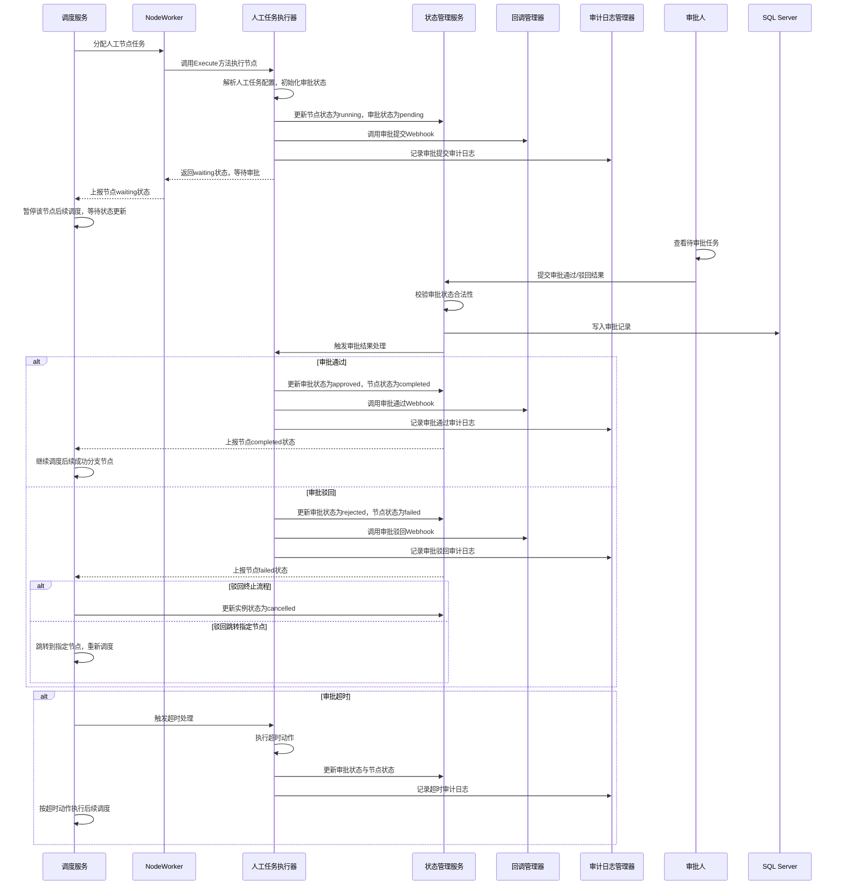
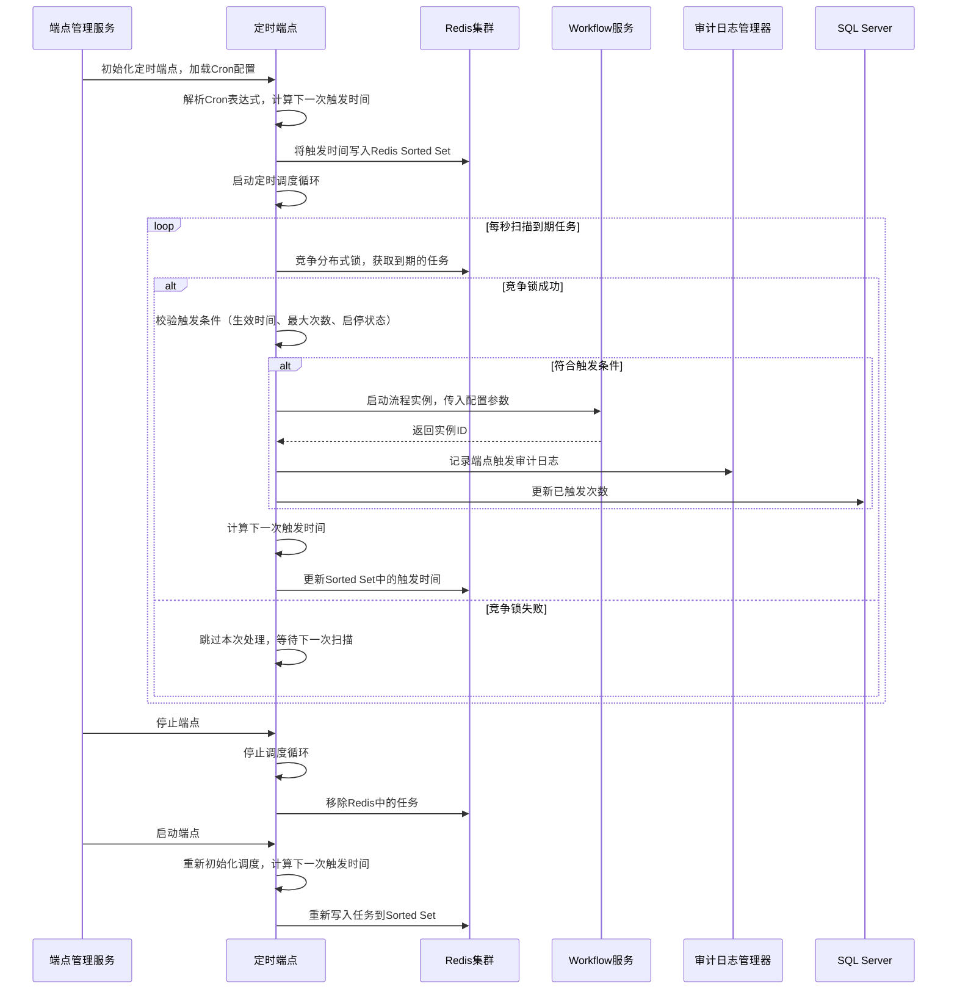
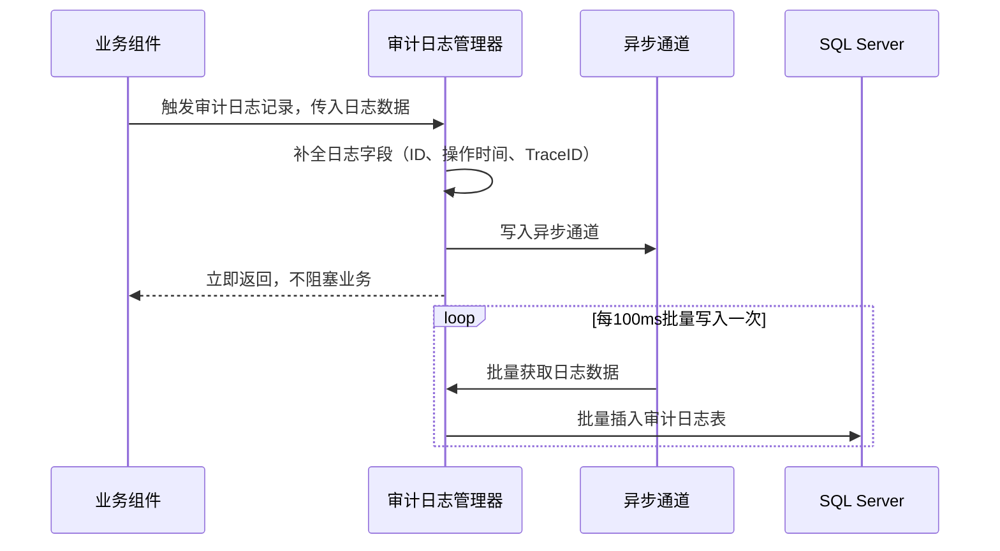

# D3阶段：高级节点与端点 详细设计文档
**文档编号**：D3-DESIGN-v1.0
**项目名称**：DistributedWorkflow 分布式工作流引擎
**对应版本**：v0.7.0
**开发周期**：2周
**前置依赖**：D2阶段v0.6.0正式版已完整交付
**文档状态**：正式发布
**编制日期**：2026-04-26
**适用范围**：D3阶段开发、测试、交付全流程

---

## 一、文档概述
本文档是DistributedWorkflow项目D3阶段的详细设计说明书，基于D1/D2阶段交付的核心引擎与流程管控能力，完成**业务场景核心能力补齐**，严格遵循前期约定的架构收敛原则：
- 人工节点收敛为普通`WorkflowNode`的一种执行器实现，不新增核心概念
- 定时触发能力收敛为`Endpoint`体系的一种扩展类型，不新增独立调度逻辑
- 失败补偿逻辑基于已有`ConnectionType=Failure`连线体系标准化落地，不新增独立节点概念
- 全量审计日志基于已约定的`workflow_instance_logs`表正式落地

D3阶段的核心目标是将引擎从「生产级基础可用」升级为「业务场景可落地」，补齐企业级工作流必备的人工审批、定时自动化触发、全链路审计追溯、标准化失败补偿四大核心能力，同时100%向后兼容D1/D2阶段的所有接口、数据结构与流程定义，保障现有业务的平滑升级。

## 二、阶段范围与交付标准
### 2.1 D3阶段包含的核心内容
1. **人工审批节点完整实现**：作为普通节点类型`human_task`落地，支持审批人配置、审批状态流转、回调通知、通过/驳回分支路由，完全复用现有节点调度体系
2. **定时触发端点完整实现**：作为`Endpoint`的`schedule`类型落地，支持Cron表达式配置、分布式防重触发、启停控制、触发历史追溯，完全收敛到现有端点体系
3. **全链路审计日志体系落地**：基于`workflow_instance_logs`表实现全操作、全生命周期的审计追溯，支持日志查询、过滤、归档
4. **标准化失败补偿与分支路由增强**：完善失败连线的调度逻辑，支持多分支补偿、重试后分支重定向、跳过失败节点继续执行等场景
5. **节点回调与事件通知体系**：实现节点生命周期的HTTP回调、Webhook通知，支撑人工节点审批、外部系统集成
6. **配套HTTP API扩展**：补齐人工任务管理、端点管理、审计日志查询的全量API，为D4阶段前端界面开发提供完整接口支撑

### 2.2 D3阶段不包含的内容
以下内容将在后续阶段实现，D3阶段仅预留扩展接口，不做开发：
1. 前端流程设计器、管理界面（D4阶段交付）
2. 会签、或签、加签、转审等复杂审批逻辑（仅预留扩展接口，核心实现基础单人/多人审批）
3. Prometheus指标、链路追踪等可观测性体系（D6阶段交付）
4. 多租户、数据权限、操作权限管控
5. 跨节点事务、全流程回滚等强一致性能力
6. 日历调度、节假日排除等高级定时规则（仅预留扩展接口）

### 2.3 量化交付标准
1. **人工节点**：支持单人审批、多人顺序审批、多人或签3种基础模式，审批回调接口幂等性100%保障，审批状态流转无异常，分支路由符合预期
2. **定时端点**：支持标准Cron表达式（7位），分布式部署下无重复触发，时间误差≤1秒，支持启停控制，触发历史完整可追溯
3. **审计日志**：覆盖流程定义、实例生命周期、节点执行、人工操作、端点触发全链路，日志不可篡改，查询响应时间≤200ms
4. **兼容性**：100%兼容D1/D2阶段的所有API、流程定义、数据结构，存量流程无修改即可正常运行
5. **代码质量**：核心新增代码单元测试覆盖率≥85%，全流程集成测试用例100%通过
6. **性能**：单Engine实例支持1000+定时端点稳定运行，人工任务回调处理延迟≤100ms，无性能劣化
7. **交付物**：完整代码实现、单元测试、集成测试、API文档、场景示例代码、升级指南

## 三、核心设计约束
1. **架构收敛约束**：严格遵循前期约定，人工节点仅作为`NodeExecutor`的一种实现，定时触发仅作为`Endpoint`的一种类型，不新增任何核心概念，不修改引擎核心调度逻辑
2. **向后兼容约束**：所有新增功能均为增量扩展，不得修改D1/D2阶段已发布的核心接口、数据结构、数据库表原有字段，仅可新增可选字段与扩展接口
3. **无状态Worker约束**：延续无状态Worker设计，人工节点的等待、回调逻辑不得在Worker中存储状态，所有状态统一由Engine管理
4. **幂等性约束**：所有新增操作（审批回调、定时触发、Webhook通知）必须设计为幂等，重复调用不会产生数据不一致、重复执行、重复审批
5. **分布式安全约束**：定时端点必须实现分布式锁防重，多Engine集群部署下，同一个定时规则同一时间仅能触发一次流程
6. **审计不可篡改约束**：审计日志仅可追加，不可修改、删除，所有日志必须记录操作人、操作时间、操作IP、操作前后数据快照
7. **可扩展性约束**：所有实现必须预留扩展接口，支持用户自定义审批逻辑、定时规则、回调处理、审计日志存储

## 四、核心数据结构详细设计
### 4.1 扩展枚举定义
#### 4.1.1 人工审批状态枚举
```go
// ApprovalStatus 人工审批状态
type ApprovalStatus string

const (
    ApprovalStatusPending   ApprovalStatus = "pending"   // 待审批
    ApprovalStatusApproved  ApprovalStatus = "approved"  // 已通过
    ApprovalStatusRejected  ApprovalStatus = "rejected"  // 已驳回
    ApprovalStatusCancelled ApprovalStatus = "cancelled" // 已取消
)
```

#### 4.1.2 审批模式枚举
```go
// ApprovalMode 审批模式
type ApprovalMode string

const (
    ApprovalModeSingle   ApprovalMode = "single"   // 单人审批
    ApprovalModeOrSign   ApprovalMode = "or_sign"  // 或签：任意一人审批通过即可
    ApprovalModeSequential ApprovalMode = "sequential" // 顺序审批：按顺序依次审批
)
```

#### 4.1.3 端点类型枚举扩展
```go
// EndpointType 端点类型（D3扩展）
type EndpointType string

const (
    EndpointTypeHTTP     EndpointType = "http"     // D1原有HTTP端点
    EndpointTypeSchedule EndpointType = "schedule" // D3新增定时端点
)
```

#### 4.1.4 审计操作类型枚举
```go
// AuditOperationType 审计操作类型
type AuditOperationType string

const (
    // 流程定义相关
    AuditOpWorkflowCreate    AuditOperationType = "workflow.create"
    AuditOpWorkflowUpdate    AuditOperationType = "workflow.update"
    AuditOpWorkflowRollback  AuditOperationType = "workflow.rollback"
    AuditOpWorkflowDelete    AuditOperationType = "workflow.delete"
    // 流程实例相关
    AuditOpInstanceStart     AuditOperationType = "instance.start"
    AuditOpInstancePause     AuditOperationType = "instance.pause"
    AuditOpInstanceResume    AuditOperationType = "instance.resume"
    AuditOpInstanceCancel    AuditOperationType = "instance.cancel"
    AuditOpInstanceRetry     AuditOperationType = "instance.retry"
    AuditOpInstanceCompleted AuditOperationType = "instance.completed"
    AuditOpInstanceFailed    AuditOperationType = "instance.failed"
    // 节点执行相关
    AuditOpNodeStart         AuditOperationType = "node.start"
    AuditOpNodeCompleted     AuditOperationType = "node.completed"
    AuditOpNodeFailed        AuditOperationType = "node.failed"
    AuditOpNodeRetry         AuditOperationType = "node.retry"
    AuditOpNodeSkipped       AuditOperationType = "node.skipped"
    // 人工审批相关
    AuditOpApprovalSubmit    AuditOperationType = "approval.submit"
    AuditOpApprovalPass      AuditOperationType = "approval.pass"
    AuditOpApprovalReject    AuditOperationType = "approval.reject"
    AuditOpApprovalCancel    AuditOperationType = "approval.cancel"
    // 端点相关
    AuditOpEndpointCreate    AuditOperationType = "endpoint.create"
    AuditOpEndpointUpdate    AuditOperationType = "endpoint.update"
    AuditOpEndpointStart     AuditOperationType = "endpoint.start"
    AuditOpEndpointStop      AuditOperationType = "endpoint.stop"
    AuditOpEndpointTrigger   AuditOperationType = "endpoint.trigger"
    AuditOpEndpointDelete    AuditOperationType = "endpoint.delete"
)
```

### 4.2 核心业务结构体扩展
#### 4.2.1 新增人工审批配置结构体
```go
// HumanTaskConfig 人工任务节点配置
type HumanTaskConfig struct {
    // Title 审批标题
    Title string `json:"title" validate:"required"`
    // Description 审批描述
    Description string `json:"description"`
    // ApprovalMode 审批模式
    ApprovalMode ApprovalMode `json:"approvalMode" validate:"oneof=single or_sign sequential" default:"single"`
    // Approvers 审批人列表，顺序审批时按列表顺序执行
    Approvers []string `json:"approvers" validate:"required,min=1"`
    // Timeout 审批超时时间，单位秒，0表示不限制，超时后自动执行默认动作
    Timeout int `json:"timeout" validate:"min=0" default:"0"`
    // TimeoutAction 超时动作：pass=自动通过，reject=自动驳回，skip=跳过
    TimeoutAction string `json:"timeoutAction" validate:"oneof=pass reject skip" default:"reject"`
    // RejectAction 驳回动作：terminate=终止流程，goto=跳转到指定节点
    RejectAction string `json:"rejectAction" validate:"oneof=terminate goto" default:"terminate"`
    // RejectGotoNodeId 驳回后跳转的节点ID，仅RejectAction=goto时生效
    RejectGotoNodeId string `json:"rejectGotoNodeId"`
    // FormFields 审批表单字段定义，用于前端渲染与参数校验
    FormFields []FormField `json:"formFields"`
    // Webhook 审批状态变更回调地址
    Webhook string `json:"webhook"`
}

// FormField 审批表单字段定义
type FormField struct {
    // FieldKey 字段唯一标识
    FieldKey string `json:"fieldKey" validate:"required"`
    // FieldName 字段显示名称
    FieldName string `json:"fieldName" validate:"required"`
    // FieldType 字段类型：string/number/boolean/date/select
    FieldType string `json:"fieldType" validate:"required"`
    // Required 是否必填
    Required bool `json:"required" default:"false"`
    // DefaultValue 默认值
    DefaultValue interface{} `json:"defaultValue"`
    // Options 下拉选项，仅select类型生效
    Options []FormFieldOption `json:"options"`
}

// FormFieldOption 表单下拉选项
type FormFieldOption struct {
    Label string      `json:"label"`
    Value interface{} `json:"value"`
}

// ApprovalRecord 审批记录
type ApprovalRecord struct {
    // ID 记录ID
    ID string `json:"id"`
    // InstanceID 流程实例ID
    InstanceID string `json:"instanceId"`
    // NodeID 节点ID
    NodeID string `json:"nodeId"`
    // Approver 审批人
    Approver string `json:"approver"`
    // Action 审批动作：pass/reject
    Action string `json:"action"`
    // Comment 审批意见
    Comment string `json:"comment"`
    // FormData 审批表单数据
    FormData map[string]interface{} `json:"formData"`
    // OperateTime 操作时间
    OperateTime time.Time `json:"operateTime"`
    // OperateIP 操作IP
    OperateIP string `json:"operateIp"`
}
```

#### 4.2.2 新增定时端点配置结构体
```go
// ScheduleEndpointConfig 定时端点配置
type ScheduleEndpointConfig struct {
    // CronExpression Cron表达式，支持7位：秒 分 时 日 月 周 年
    CronExpression string `json:"cronExpression" validate:"required"`
    // InputData 流程启动固定输入参数
    InputData map[string]interface{} `json:"inputData"`
    // CreatedBy 流程创建人
    CreatedBy string `json:"createdBy" validate:"required"`
    // MaxTriggerCount 最大触发次数，0表示无限制
    MaxTriggerCount int `json:"maxTriggerCount" validate:"min=0" default:"0"`
    // TriggeredCount 已触发次数
    TriggeredCount int `json:"triggeredCount" default:"0"`
    // StartTime 生效开始时间，为空则立即生效
    StartTime time.Time `json:"startTime"`
    // EndTime 生效结束时间，为空则永久有效
    EndTime time.Time `json:"endTime"`
    // MisfireStrategy 错过触发策略：ignore=忽略，fire=立即触发一次
    MisfireStrategy string `json:"misfireStrategy" validate:"oneof=ignore fire" default:"ignore"`
}
```

#### 4.2.3 新增审计日志结构体
```go
// WorkflowAuditLog 审计日志结构体
type WorkflowAuditLog struct {
    // ID 日志唯一ID
    ID string `json:"id"`
    // InstanceID 流程实例ID，非实例操作可为空
    InstanceID string `json:"instanceId"`
    // NodeID 节点ID，非节点操作可为空
    NodeID string `json:"nodeId"`
    // WorkflowID 流程定义ID
    WorkflowID string `json:"workflowId"`
    // EndpointID 端点ID，非端点操作可为空
    EndpointID string `json:"endpointId"`
    // OperationType 操作类型
    OperationType AuditOperationType `json:"operationType" validate:"required"`
    // Operator 操作人
    Operator string `json:"operator" validate:"required"`
    // OperateIP 操作IP
    OperateIP string `json:"operateIp"`
    // OperateTime 操作时间
    OperateTime time.Time `json:"operateTime"`
    // BeforeData 操作前数据快照
    BeforeData map[string]interface{} `json:"beforeData"`
    // AfterData 操作后数据快照
    AfterData map[string]interface{} `json:"afterData"`
    // Detail 操作详情描述
    Detail string `json:"detail"`
    // TraceID 链路追踪ID
    TraceID string `json:"traceId"`
}
```

#### 4.2.4 WorkflowNode 工作流节点扩展
```go
// WorkflowNode 工作流节点（D3扩展）
type WorkflowNode struct {
    // D1/D2原有字段
    ID             string                 `json:"id" validate:"required,max=64"`
    Type           string                 `json:"type" validate:"required,max=64"`
    Name           string                 `json:"name" validate:"required,max=255"`
    Description    string                 `json:"description"`
    Config         map[string]interface{} `json:"config"`
    DependencyMode DependencyMode         `json:"dependencyMode" validate:"oneof=all any" default:"all"`
    Timeout        int                    `json:"timeout" validate:"min=0" default:"0"`
    RetryPolicy    *RetryPolicy           `json:"retryPolicy"`
    SkipOnError    bool                   `json:"skipOnError" default:"false"`
    IsSubflowNode  bool                   `json:"isSubflowNode" default:"false"`
    SubflowConfig  *SubflowNodeConfig     `json:"subflowConfig"`
    // D3新增字段
    // HumanTaskConfig 人工任务配置，仅Type=human_task时生效
    HumanTaskConfig *HumanTaskConfig `json:"humanTaskConfig"`
    // CallbackConfig 节点生命周期回调配置
    CallbackConfig *NodeCallbackConfig `json:"callbackConfig"`
}

// NodeCallbackConfig 节点回调配置
type NodeCallbackConfig struct {
    // OnStart 节点开始执行回调地址
    OnStart string `json:"onStart"`
    // OnComplete 节点执行完成回调地址
    OnComplete string `json:"onComplete"`
    // OnFail 节点执行失败回调地址
    OnFail string `json:"onFail"`
    // Timeout 回调超时时间，单位秒
    Timeout int `json:"timeout" default:"3"`
    // RetryCount 回调失败重试次数
    RetryCount int `json:"retryCount" default:"1"`
}
```

#### 4.2.5 WorkflowEndpoint 端点定义扩展
```go
// WorkflowEndpoint 端点定义（D3扩展）
type WorkflowEndpoint struct {
    // D1/D2原有字段
    ID          string                 `json:"id" validate:"required,max=64"`
    Name        string                 `json:"name" validate:"required,max=255"`
    Type        EndpointType           `json:"type" validate:"required"`
    WorkflowID  string                 `json:"workflowId" validate:"required"`
    Config      map[string]interface{} `json:"config"`
    CreatedAt   time.Time              `json:"createdAt"`
    UpdatedAt   time.Time              `json:"updatedAt"`
    CreatedBy   string                 `json:"createdBy"`
    Disabled    bool                   `json:"disabled" default:"false"`
    // D3新增字段
    // ScheduleConfig 定时配置，仅Type=schedule时生效
    ScheduleConfig *ScheduleEndpointConfig `json:"scheduleConfig"`
    // Path HTTP端点路径，仅Type=http时生效
    Path string `json:"path"`
}
```

#### 4.2.6 WorkflowNodeState 节点状态扩展
```go
// WorkflowNodeState 节点执行状态（D3扩展）
type WorkflowNodeState struct {
    // D1/D2原有字段
    ID            int64                  `json:"id"`
    InstanceID    string                 `json:"instanceId"`
    NodeID        string                 `json:"nodeId"`
    Status        WorkflowNodeStatus     `json:"status"`
    AssignedTo    string                 `json:"assignedTo"`
    WorkerIP      string                 `json:"workerIp"`
    StartTime     time.Time              `json:"startTime"`
    EndTime       time.Time              `json:"endTime"`
    InputData     map[string]interface{} `json:"inputData"`
    OutputData    map[string]interface{} `json:"outputData"`
    ErrorMessage  string                 `json:"errorMessage"`
    RetryCount    int                    `json:"retryCount" default:"0"`
    NextRetryTime time.Time              `json:"nextRetryTime"`
    LastRetryTime time.Time              `json:"lastRetryTime"`
    ErrorCode     string                 `json:"errorCode"`
    SkippedReason string                 `json:"skippedReason"`
    // D3新增字段
    // ApprovalStatus 审批状态，仅人工节点生效
    ApprovalStatus ApprovalStatus `json:"approvalStatus"`
    // CurrentApproverIndex 当前审批人索引，顺序审批时生效
    CurrentApproverIndex int `json:"currentApproverIndex" default:"0"`
    // ApprovalRecords 审批记录列表
    ApprovalRecords []*ApprovalRecord `json:"approvalRecords"`
}
```

## 五、核心组件详细设计
D3阶段基于已有组件架构进行增量扩展，分为**新增核心组件**、**原有组件增强**两大模块，严格遵循接口抽象原则，不修改原有核心逻辑。

### 5.1 新增核心组件
#### 5.1.1 人工任务节点执行器（HumanTaskNodeExecutor）
**核心职责**：实现`NodeExecutor`接口，完成人工任务的创建、状态管理、回调处理、审批结果流转，完全复用现有节点调度体系，无侵入引擎核心
**接口实现定义**：
```go
// HumanTaskNodeExecutor 人工任务节点执行器，实现NodeExecutor接口
type HumanTaskNodeExecutor struct {
    auditLogManager *AuditLogManager
    callbackManager *CallbackManager
    logger          zerolog.Logger
}

// 实现NodeExecutor接口的Type方法，返回节点类型
func (e *HumanTaskNodeExecutor) Type() string {
    return "human_task"
}

// 实现NodeExecutor接口的Execute方法，核心执行逻辑
func (e *HumanTaskNodeExecutor) Execute(config map[string]interface{}, input map[string]interface{}, ctx *WorkflowContext) (output map[string]interface{}, err error)
```
**核心实现逻辑**：
1. **任务初始化**：节点执行时，解析`HumanTaskConfig`配置，初始化审批状态为`pending`，创建审批任务记录，写入节点状态
2. **事件通知**：触发审批提交事件，调用配置的Webhook回调，发送审批通知，记录审计日志
3. **等待回调**：执行器返回`pending`状态，告知引擎节点处于等待状态，不标记为完成，暂停后续调度
4. **审批处理**：
   - 审批通过：更新审批状态为`approved`，写入审批记录，将表单数据写入上下文，标记节点为`completed`，触发引擎继续调度后续成功分支
   - 审批驳回：更新审批状态为`rejected`，写入审批记录，根据驳回动作执行终止流程或跳转到指定节点，触发失败分支调度
   - 审批超时：根据超时配置执行自动动作，记录超时审计日志
5. **幂等性保障**：审批回调接口通过`instanceID+nodeID+approver`做幂等控制，重复审批不会重复处理
6. **状态机严格校验**：仅`pending`状态的审批任务可执行审批动作，已通过/驳回/取消的任务禁止重复操作

#### 5.1.2 定时触发端点（ScheduleEndpoint）
**核心职责**：实现`Endpoint`接口，完成Cron表达式解析、分布式定时调度、防重触发、流程启动，完全收敛到现有端点体系
**接口定义**：
```go
// Endpoint 端点通用接口，所有端点类型必须实现
type Endpoint interface {
    // Type 返回端点类型
    Type() EndpointType
    // Init 初始化端点
    Init(config *WorkflowEndpoint) error
    // Start 启动端点
    Start() error
    // Stop 停止端点
    Stop() error
    // Status 获取端点状态
    Status() bool
    // GetConfig 获取端点配置
    GetConfig() *WorkflowEndpoint
}

// ScheduleEndpoint 定时触发端点，实现Endpoint接口
type ScheduleEndpoint struct {
    config         *WorkflowEndpoint
    cronParser     *cron.Parser
    redisClient    *redis.Client
    workflowService *WorkflowService
    auditLogManager *AuditLogManager
    logger         zerolog.Logger
    ctx            context.Context
    cancel         context.CancelFunc
    isRunning      bool
}
```
**核心实现逻辑**：
1. **Cron解析**：使用robfig/cron v3解析标准7位Cron表达式，计算下一次触发时间
2. **分布式调度**：
   - 基于Redis Sorted Set实现延迟任务队列，将下一次触发时间作为score，端点ID作为member
   - 多Engine实例通过分布式锁竞争获取到期的定时任务，确保同一时间只有一个实例处理触发
   - 触发完成后，计算下一次触发时间，重新写入队列
3. **防重触发**：每次触发前通过Redis分布式锁加锁，锁的过期时间小于Cron最小间隔，避免重复触发
4. **触发控制**：校验生效时间、最大触发次数、端点启停状态，不符合条件则不触发
5. **流程启动**：触发时调用WorkflowService启动流程实例，传入配置的固定输入参数，记录触发历史与审计日志
6. **错过触发处理**：服务重启后，根据MisfireStrategy处理错过的触发任务，避免服务停机期间的触发丢失
7. **生命周期管理**：支持端点的动态启停、配置更新，无需重启Engine实例

#### 5.1.3 审计日志管理器（AuditLogManager）
**核心职责**：全链路审计日志的记录、查询、归档，保障日志不可篡改、可追溯
**接口定义**：
```go
type AuditLogManager interface {
    // RecordLog 记录审计日志
    RecordLog(log *WorkflowAuditLog) error
    // BatchRecordLog 批量记录审计日志
    BatchRecordLog(logs []*WorkflowAuditLog) error
    // QueryLogs 分页查询审计日志
    QueryLogs(filter AuditLogFilter, page, pageSize int) ([]*WorkflowAuditLog, int64, error)
    // GetLogByID 根据ID获取日志详情
    GetLogByID(logID string) (*WorkflowAuditLog, error)
    // ArchiveLogs 归档指定时间之前的日志
    ArchiveLogs(beforeTime time.Time) error
}

// AuditLogFilter 审计日志查询过滤器
type AuditLogFilter struct {
    WorkflowID    string
    InstanceID    string
    NodeID        string
    EndpointID    string
    OperationType []AuditOperationType
    Operator      string
    StartTime     time.Time
    EndTime       time.Time
}
```
**核心实现逻辑**：
1. **全链路埋点**：在流程定义、实例生命周期、节点执行、人工审批、端点操作的所有关键节点埋点，自动记录审计日志
2. **异步写入**：日志写入采用异步通道，避免阻塞主业务流程，批量写入数据库，提升性能
3. **不可篡改保障**：日志仅支持追加写入，禁止修改、删除，所有日志记录唯一ID、操作时间、操作人IP，关键操作记录数据快照
4. **查询优化**：基于数据库索引实现多条件组合查询，支持分页、排序，满足审计追溯需求
5. **归档能力**：支持历史日志归档，归档后的日志可查询，不影响在线业务性能
6. **扩展接口**：支持注册自定义日志存储实现，可对接外部审计系统、日志平台

#### 5.1.4 节点回调管理器（CallbackManager）
**核心职责**：节点生命周期的HTTP回调、Webhook通知，支撑人工节点、外部系统集成
**接口定义**：
```go
type CallbackManager interface {
    // InvokeCallback 执行回调请求
    InvokeCallback(url string, data map[string]interface{}, config *NodeCallbackConfig) error
    // InvokeWebhook 执行审批Webhook通知
    InvokeWebhook(url string, event string, data map[string]interface{}) error
    // RegisterCallbackHook 注册回调钩子
    RegisterCallbackHook(hook CallbackHook)
}

// CallbackHook 回调钩子接口
type CallbackHook interface {
    // BeforeCallback 回调执行前触发
    BeforeCallback(url string, data map[string]interface{})
    // AfterCallback 回调执行后触发
    AfterCallback(url string, data map[string]interface{}, response []byte, err error)
}
```
**核心实现逻辑**：
1. **回调执行**：基于HTTP客户端实现POST请求回调，支持超时控制、失败重试、SSL证书校验
2. **异步执行**：所有回调请求采用异步协程执行，不阻塞主流程调度
3. **幂等性保障**：每个回调请求携带唯一`requestID`，支持接收方幂等处理
4. **异常容错**：回调失败记录错误日志，不影响主流程执行，按配置的重试次数自动重试
5. **安全机制**：支持签名校验，回调请求携带签名头，接收方可验证请求合法性，防止恶意请求

### 5.2 原有组件增强
#### 5.2.1 端点管理服务（EndpointManagerService）
**D3升级职责**：在原有HTTP端点基础上，新增定时端点的生命周期管理、动态启停、配置热更新
**扩展接口定义**：
```go
type EndpointManagerService interface {
    // D1原有接口
    StartHTTPServer(addr string) error
    StopHTTPServer() error
    RegisterHTTPEndpoint(workflowID string, path string) error

    // D3新增接口
    // CreateEndpoint 创建端点
    CreateEndpoint(endpoint *WorkflowEndpoint) (string, error)
    // UpdateEndpoint 更新端点配置
    UpdateEndpoint(endpoint *WorkflowEndpoint) error
    // GetEndpoint 根据ID获取端点
    GetEndpoint(endpointID string) (*WorkflowEndpoint, error)
    // ListEndpoints 分页查询端点列表
    ListEndpoints(filter EndpointFilter, page, pageSize int) ([]*WorkflowEndpoint, int64, error)
    // StartEndpoint 启动端点
    StartEndpoint(endpointID string) error
    // StopEndpoint 停止端点
    StopEndpoint(endpointID string) error
    // DeleteEndpoint 删除端点
    DeleteEndpoint(endpointID string) error
    // StartScheduleManager 启动定时端点调度器
    StartScheduleManager() error
    // StopScheduleManager 停止定时端点调度器
    StopScheduleManager() error
}
```
**核心升级逻辑**：
1. 实现端点工厂模式，根据端点类型创建对应的Endpoint实例
2. Engine启动时自动加载所有启用的定时端点，加入调度队列
3. 支持端点配置的动态更新，更新后自动重启调度，无需重启Engine
4. 定时端点的触发历史记录、运行状态监控
5. 端点操作全量记录审计日志

#### 5.2.2 调度服务（SchedulerService）
**D3升级职责**：增强等待状态节点支持、失败分支路由、驳回跳转逻辑、超时处理
**核心升级逻辑**：
1. **等待状态支持**：新增`WorkflowNodeStatus.Waiting`状态，人工节点等需要等待的节点可返回该状态，引擎暂停后续调度，等待节点状态更新后再继续
2. **失败分支增强**：节点执行失败后，优先匹配`Failure`类型连线，执行补偿节点，支持多失败分支并行执行
3. **驳回跳转逻辑**：人工节点驳回后，支持跳转到指定节点，重新执行对应分支，无需终止整个流程
4. **节点超时增强**：支持人工节点的审批超时处理，超时后自动执行配置的动作，触发对应分支
5. **跳过失败节点**：配置`SkipOnError=true`的节点，执行失败后自动标记为跳过，继续执行后续成功分支

#### 5.2.3 实例状态管理服务（InstanceStateService）
**D3升级职责**：扩展人工节点状态管理、审批记录存储、等待状态更新
**扩展接口定义**：
```go
type InstanceStateService interface {
    // D1/D2原有接口
    CreateInstance(instance *WorkflowInstance) error
    UpdateInstanceStatus(instanceID string, status WorkflowStatus, errMsg string) error
    CreateNodeState(state *WorkflowNodeState) error
    UpdateNodeState(state *WorkflowNodeState) error
    GetNodeState(instanceID string, nodeID string) (*WorkflowNodeState, error)
    GetInstanceNodeStates(instanceID string) ([]*WorkflowNodeState, error)
    ReportTaskResult(result *TaskResult) error
    ValidateStateTransition(currentStatus WorkflowStatus, targetStatus WorkflowStatus) bool
    BatchUpdateNodeStatus(instanceID string, nodeIDs []string, status WorkflowNodeStatus, reason string) error
    UpdateRetryState(instanceID string, nodeID string, nextRetryTime time.Time, retryCount int) error
    GetFailedNodes(instanceID string) ([]*WorkflowNodeState, error)
    GetAssignedNodesByWorker(workerID string) ([]*WorkflowNodeState, error)

    // D3新增接口
    // UpdateNodeApprovalState 更新节点审批状态
    UpdateNodeApprovalState(instanceID string, nodeID string, state *WorkflowNodeState) error
    // GetPendingApprovalTasks 获取待审批任务列表
    GetPendingApprovalTasks(filter ApprovalTaskFilter, page, pageSize int) ([]*WorkflowNodeState, int64, error)
    // AddApprovalRecord 新增审批记录
    AddApprovalRecord(record *ApprovalRecord) error
    // GetApprovalRecords 获取节点审批记录
    GetApprovalRecords(instanceID string, nodeID string) ([]*ApprovalRecord, error)
}
```

## 六、数据库详细设计（SQL Server）
### 6.1 表结构新增与变更
#### 6.1.1 workflow_instance_logs 审计日志表（正式落地）
```sql
CREATE TABLE workflow_instance_logs (
    id VARCHAR(64) PRIMARY KEY,
    workflow_id VARCHAR(64),
    instance_id VARCHAR(64),
    node_id VARCHAR(64),
    endpoint_id VARCHAR(64),
    operation_type VARCHAR(64) NOT NULL,
    operator VARCHAR(64) NOT NULL,
    operate_ip VARCHAR(64),
    operate_time DATETIME2 NOT NULL DEFAULT GETDATE(),
    before_data NVARCHAR(MAX),
    after_data NVARCHAR(MAX),
    detail NVARCHAR(MAX),
    trace_id VARCHAR(64)
);

-- 创建索引
CREATE INDEX idx_audit_workflow_id ON workflow_instance_logs(workflow_id);
CREATE INDEX idx_audit_instance_id ON workflow_instance_logs(instance_id);
CREATE INDEX idx_audit_operation_type ON workflow_instance_logs(operation_type);
CREATE INDEX idx_audit_operator ON workflow_instance_logs(operator);
CREATE INDEX idx_audit_operate_time ON workflow_instance_logs(operate_time);
```

#### 6.1.2 workflow_approval_records 审批记录表
```sql
CREATE TABLE workflow_approval_records (
    id VARCHAR(64) PRIMARY KEY,
    instance_id VARCHAR(64) NOT NULL FOREIGN KEY REFERENCES workflow_instances(id),
    node_id VARCHAR(64) NOT NULL,
    approver VARCHAR(64) NOT NULL,
    action VARCHAR(32) NOT NULL,
    comment NVARCHAR(MAX),
    form_data NVARCHAR(MAX),
    operate_time DATETIME2 NOT NULL DEFAULT GETDATE(),
    operate_ip VARCHAR(64),
    UNIQUE(instance_id, node_id, id)
);

-- 创建索引
CREATE INDEX idx_approval_instance_node ON workflow_approval_records(instance_id, node_id);
CREATE INDEX idx_approval_approver ON workflow_approval_records(approver);
CREATE INDEX idx_approval_operate_time ON workflow_approval_records(operate_time);
```

#### 6.1.3 workflow_endpoints 表变更
```sql
ALTER TABLE workflow_endpoints
ADD 
    path VARCHAR(255),
    schedule_config NVARCHAR(MAX);

-- 新增索引
CREATE INDEX idx_endpoints_type ON workflow_endpoints(type);
CREATE INDEX idx_endpoints_disabled ON workflow_endpoints(disabled);
```

#### 6.1.4 workflow_node_states 表变更
```sql
ALTER TABLE workflow_node_states
ADD 
    approval_status VARCHAR(32) DEFAULT 'pending',
    current_approver_index INT DEFAULT 0;
```

### 6.2 完整初始化脚本
完整的SQL Server初始化、升级脚本见附录A，包含表创建、字段变更、索引创建、默认数据插入。

## 七、HTTP API扩展设计
D3阶段新增核心HTTP API，为前端界面提供完整支撑，所有API遵循RESTful规范，统一返回格式，支持权限校验预留。

### 7.1 人工审批相关API
| 接口地址 | 请求方式 | 接口说明 |
|----------|----------|----------|
| `/api/v1/approval/tasks` | GET | 分页查询待审批任务列表 |
| `/api/v1/approval/tasks/{instanceId}/{nodeId}` | GET | 获取审批任务详情 |
| `/api/v1/approval/tasks/{instanceId}/{nodeId}/approve` | POST | 审批通过 |
| `/api/v1/approval/tasks/{instanceId}/{nodeId}/reject` | POST | 审批驳回 |
| `/api/v1/approval/tasks/{instanceId}/{nodeId}/records` | GET | 获取审批记录列表 |

### 7.2 端点管理相关API
| 接口地址 | 请求方式 | 接口说明 |
|----------|----------|----------|
| `/api/v1/endpoints` | POST | 创建端点 |
| `/api/v1/endpoints` | GET | 分页查询端点列表 |
| `/api/v1/endpoints/{endpointId}` | GET | 获取端点详情 |
| `/api/v1/endpoints/{endpointId}` | PUT | 更新端点配置 |
| `/api/v1/endpoints/{endpointId}/start` | POST | 启动端点 |
| `/api/v1/endpoints/{endpointId}/stop` | POST | 停止端点 |
| `/api/v1/endpoints/{endpointId}` | DELETE | 删除端点 |
| `/api/v1/endpoints/{endpointId}/trigger-history` | GET | 获取端点触发历史 |

### 7.3 审计日志相关API
| 接口地址 | 请求方式 | 接口说明 |
|----------|----------|----------|
| `/api/v1/audit/logs` | GET | 分页查询审计日志 |
| `/api/v1/audit/logs/{logId}` | GET | 获取审计日志详情 |
| `/api/v1/audit/logs/archive` | POST | 归档历史日志 |

### 7.4 原有API扩展
- 流程实例详情API扩展返回节点审批状态
- 流程定义API扩展支持人工节点配置
- 流程启动API扩展支持定时触发来源记录

## 八、核心流程详细设计
### 8.1 人工节点执行全流程


### 8.2 定时端点触发全流程


### 8.3 全链路审计日志记录流程


## 九、关键技术实现细节
### 9.1 分布式定时调度防重实现
```go
// FetchExpiredTasks 获取到期的定时任务，通过分布式锁保障仅一个实例获取
func (s *ScheduleEndpointManager) FetchExpiredTasks(ctx context.Context) ([]*WorkflowEndpoint, error) {
    // 1. 加分布式锁，避免多实例同时处理
    lockKey := "workflow:schedule:lock:fetch"
    lock := common.NewRedisLock(s.redisClient, lockKey, uuid.NewString())
    ok, err := lock.Lock(ctx)
    if err != nil || !ok {
        return nil, fmt.Errorf("获取调度锁失败")
    }
    defer lock.Unlock(ctx)

    // 2. 获取当前时间戳
    now := time.Now().Unix()

    // 3. 从Sorted Set中获取到期的任务（score <= 当前时间）
    zRangeBy := &redis.ZRangeBy{
        Min: "0",
        Max: strconv.FormatInt(now, 10),
    }
    taskIDs, err := s.redisClient.ZRangeByScore(ctx, "workflow:schedule:tasks", zRangeBy).Result()
    if err != nil {
        return nil, err
    }
    if len(taskIDs) == 0 {
        return []*WorkflowEndpoint{}, nil
    }

    // 4. 移除已获取的任务，避免重复处理
    _, err = s.redisClient.ZRemRangeByScore(ctx, "workflow:schedule:tasks", "0", strconv.FormatInt(now, 10)).Result()
    if err != nil {
        return nil, err
    }

    // 5. 查询端点详情
    var endpoints []*WorkflowEndpoint
    for _, taskID := range taskIDs {
        endpoint, err := s.endpointService.GetEndpoint(taskID)
        if err != nil {
            s.logger.Error().Str("endpoint_id", taskID).Err(err).Msg("获取端点详情失败")
            continue
        }
        if !endpoint.Disabled {
            endpoints = append(endpoints, endpoint)
        }
    }

    return endpoints, nil
}
```

### 9.2 人工审批回调幂等性实现
```go
// Approve 审批通过处理
func (s *ApprovalService) Approve(ctx context.Context, req *ApprovalRequest) error {
    // 1. 幂等性校验：通过instanceID+nodeID+approver+action生成唯一键
    idempotentKey := fmt.Sprintf("workflow:approval:idempotent:%s:%s:%s:approve", req.InstanceID, req.NodeID, req.Approver)
    lock := common.NewRedisLock(s.redisClient, idempotentKey, uuid.NewString())
    ok, err := lock.Lock(ctx)
    if err != nil || !ok {
        return fmt.Errorf("重复审批，请勿重复提交")
    }
    defer lock.Unlock(ctx)
    // 锁过期时间设置为1小时，避免重复提交

    // 2. 查询节点状态
    nodeState, err := s.stateService.GetNodeState(req.InstanceID, req.NodeID)
    if err != nil {
        return err
    }

    // 3. 状态机校验：仅pending状态可审批
    if nodeState.ApprovalStatus != ApprovalStatusPending {
        return fmt.Errorf("当前审批状态为%s，无法执行审批通过", nodeState.ApprovalStatus)
    }

    // 4. 校验审批人权限
    if !s.checkApproverPermission(nodeState.HumanTaskConfig, req.Approver) {
        return fmt.Errorf("您没有该审批任务的权限")
    }

    // 5. 写入审批记录
    record := &ApprovalRecord{
        ID:          uuid.NewString(),
        InstanceID:  req.InstanceID,
        NodeID:      req.NodeID,
        Approver:    req.Approver,
        Action:      "pass",
        Comment:     req.Comment,
        FormData:    req.FormData,
        OperateTime: time.Now(),
        OperateIP:   req.OperateIP,
    }
    err = s.stateService.AddApprovalRecord(record)
    if err != nil {
        return err
    }

    // 6. 更新节点状态
    nodeState.ApprovalStatus = ApprovalStatusApproved
    nodeState.OutputData = map[string]interface{}{
        "approval": record,
        "formData": req.FormData,
    }
    nodeState.Status = WorkflowNodeStatusCompleted
    nodeState.EndTime = time.Now()
    err = s.stateService.UpdateNodeApprovalState(req.InstanceID, req.NodeID, nodeState)
    if err != nil {
        return err
    }

    // 7. 记录审计日志
    _ = s.auditLogManager.RecordLog(&WorkflowAuditLog{
        ID:            uuid.NewString(),
        InstanceID:    req.InstanceID,
        NodeID:        req.NodeID,
        OperationType: AuditOpApprovalPass,
        Operator:      req.Approver,
        OperateIP:     req.OperateIP,
        OperateTime:   time.Now(),
        Detail:        "审批通过",
        AfterData:     map[string]interface{}{"record": record},
    })

    // 8. 触发调度服务继续执行
    go func() {
        _ = s.schedulerService.HandleNodeCompleted(req.InstanceID, req.NodeID, true, nodeState.OutputData, "")
    }()

    return nil
}
```

## 十、D3阶段里程碑拆解（2周）
| 周数 | 里程碑版本 | 核心目标 | 核心交付物 |
|------|------------|----------|------------|
| 第1周 | v0.7.0-alpha | 核心功能实现 | 1. 人工节点执行器完整实现<br>2. 定时端点完整实现<br>3. 审计日志管理器实现<br>4. 回调管理器实现<br>5. 数据库表结构升级脚本<br>6. 核心API实现<br>7. 单元测试覆盖 |
| 第2周 | v0.7.0 正式版 | 全功能联调与交付 | 1. 全流程端到端联调完成<br>2. 人工审批、定时触发全场景测试通过<br>3. 核心代码单元测试覆盖率≥85%<br>4. 兼容性测试完成，存量流程无异常<br>5. API文档、开发示例、升级指南编写<br>6. 性能测试与优化<br>7. v0.7.0正式版发布 |

## 十一、测试方案
### 11.1 测试类型与范围
| 测试类型 | 测试范围 | 验收标准 |
|----------|----------|----------|
| 单元测试 | 所有新增接口、工具函数、核心算法 | 代码覆盖率≥85%，所有用例全部通过 |
| 集成测试 | 人工审批、定时触发、审计日志、回调通知全链路 | 所有业务场景按预期执行，状态正确更新，数据一致 |
| 场景测试 | 单人审批、或签审批、顺序审批、定时触发、驳回跳转、超时处理等核心业务场景 | 场景执行符合预期，分支路由正确，无逻辑异常 |
| 兼容性测试 | D1/D2阶段存量流程在D3版本的运行兼容性 | 存量流程无修改即可正常运行，无数据丢失、无执行异常 |
| 分布式测试 | 多Engine集群部署下的定时触发防重、人工审批负载均衡 | 集群部署下无重复触发，无状态不一致，请求可正常负载均衡 |
| 幂等性测试 | 审批回调、定时触发、Webhook回调的幂等性 | 重复请求不会产生重复处理、重复执行、数据不一致 |
| 性能测试 | 1000+定时端点稳定运行、高并发审批回调处理 | 定时触发误差≤1秒，回调处理延迟≤100ms，无性能劣化 |

### 11.2 核心测试用例
1. **人工审批基础场景**：单人审批通过/驳回，状态流转正确，分支路由符合预期
2. **审批模式测试**：或签审批任意一人通过即可生效，顺序审批按顺序依次审批
3. **审批超时测试**：审批超时后自动执行配置的动作，触发对应分支
4. **驳回跳转测试**：审批驳回后跳转到指定节点，重新执行对应分支
5. **定时触发基础测试**：Cron表达式正确解析，按配置时间触发流程，无重复触发
6. **定时触发控制测试**：最大触发次数、生效时间、启停控制符合预期
7. **分布式防重测试**：3个Engine实例集群部署，同一个定时规则仅触发一次
8. **审计日志测试**：全操作链路审计日志完整记录，不可修改，查询正确
9. **幂等性测试**：重复提交审批、重复触发回调，不会重复处理
10. **失败补偿测试**：节点失败后，正确执行失败分支补偿节点

## 十二、风险与应对措施
| 风险点 | 风险等级 | 应对措施 |
|--------|----------|----------|
| 多Engine集群下定时任务重复触发 | 高 | 1. 基于Redis分布式锁保障同一时间仅一个实例处理任务<br>2. 任务处理前二次校验触发时间，避免过期任务重复处理<br>3. 流程启动前增加幂等性校验，同一个定时触发周期仅启动一次流程 |
| 人工审批回调幂等性失效 | 高 | 1. 基于Redis分布式锁做幂等控制，重复提交直接拒绝<br>2. 审批状态机严格校验，仅pending状态可执行审批动作<br>3. 审批记录唯一ID约束，避免重复写入 |
| Cron表达式解析异常导致定时任务失效 | 中 | 1. 端点创建时严格校验Cron表达式合法性，非法表达式拒绝创建<br>2. 计算下一次触发时间时增加异常捕获，避免单个任务异常导致整个调度器崩溃<br>3. 定时任务异常记录告警日志，支持人工排查 |
| 大量审计日志写入导致数据库性能下降 | 中 | 1. 审计日志采用异步批量写入，避免阻塞主业务流程<br>2. 合理设计索引，避免全表扫描<br>3. 实现日志归档能力，历史日志归档到冷存储<br>4. 支持日志写入到外部日志平台，降低数据库压力 |
| 人工节点等待状态导致流程实例泄漏 | 中 | 1. 增加超时控制，审批超时自动执行默认动作，避免无限等待<br>2. 定时扫描长期处于等待状态的实例，触发告警与自动处理<br>3. 流程终止时自动取消所有待审批任务 |
| 定时任务在服务停机期间丢失触发 | 中 | 1. 服务重启时扫描所有定时任务，根据MisfireStrategy处理错过的触发<br>2. 触发历史完整记录，支持人工补触发<br>3. 持久化定时配置，服务重启后自动恢复调度 |

## 十三、附录
### 附录A：SQL Server数据库升级与初始化脚本
### 附录B：HTTP API完整文档
### 附录C：人工节点配置示例
### 附录D：定时端点Cron表达式示例
### 附录E：版本升级指南
