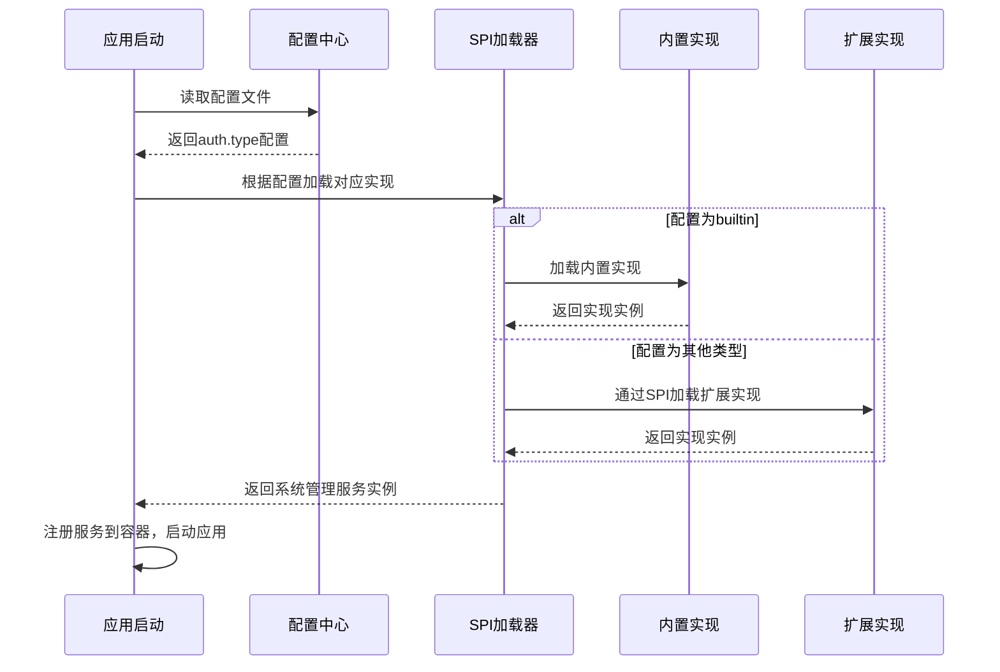
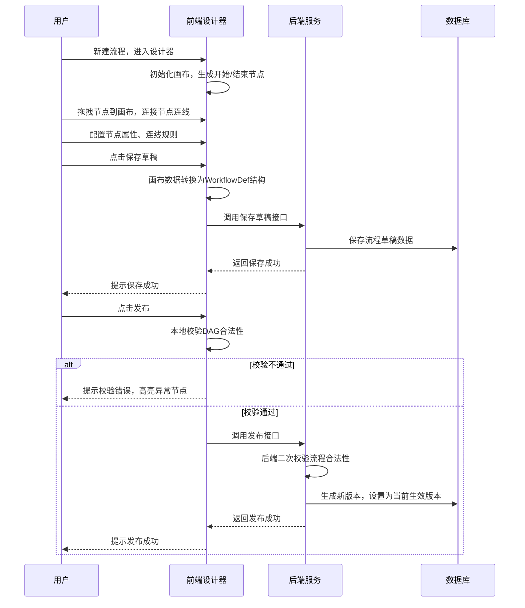
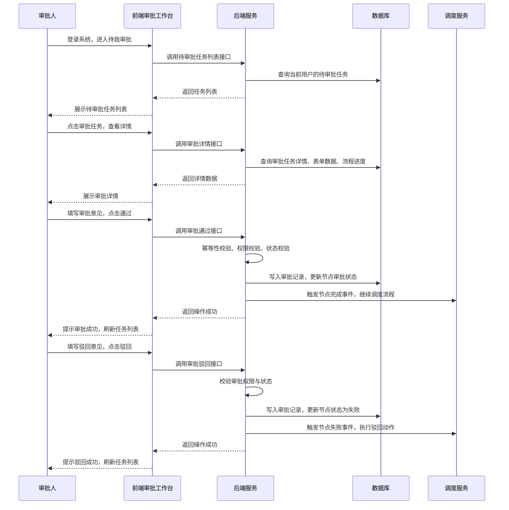
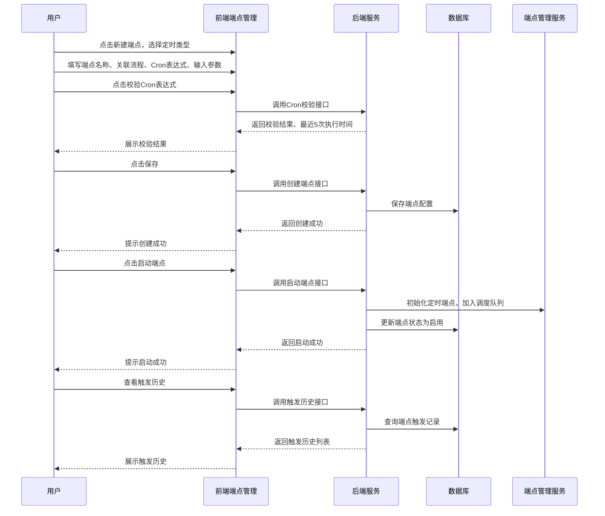

# D4阶段：可视化管理前端 详细设计文档（修订版）
**文档编号**：D4-DESIGN-v1.2
**项目名称**：DistributedWorkflow 分布式工作流引擎
**对应版本**：v0.8.0
**开发周期**：2周
**前置依赖**：D3阶段v0.7.0正式版已完整交付，后端核心能力已全部落地
**文档状态**：正式发布
**编制日期**：2026-04-26
**适用范围**：D4阶段开发、测试、交付全流程

---

## 一、文档概述
本文档是DistributedWorkflow项目D4阶段的详细设计说明书，基于D1-D3阶段交付的完整后端引擎能力，完成**企业级可视化管理前端全量落地**，实现工作流全生命周期的可视化操作闭环。

**本次修订的核心变更**：将系统用户、角色、菜单、权限关联等功能抽象为独立的「系统管理抽象层」模块，提供标准接口定义，支持集成企业现有的用户/权限体系，默认提供基于数据库的内置实现，同时支持无缝对接LDAP、OAuth2、企业SSO等外部系统。

D4阶段的核心目标是将引擎从「后端能力完整的技术产品」升级为「开箱即用的可交付产品」，通过可视化界面降低使用门槛，覆盖流程编排、管理监控、人工审批、配置管理全场景，同时100%对齐后端已有能力，不修改后端核心逻辑，仅扩展前端交互所需的配套API，最终交付前后端一体化、可一键部署的完整工作流产品。

## 二、阶段范围与交付标准
### 2.1 D4阶段包含的核心内容
1. **系统管理抽象层（本次修订新增）**：
   - 用户管理、角色管理、菜单管理、权限关联的标准接口定义
   - 基于数据库的默认实现
   - 扩展接口定义，支持集成外部用户/权限体系
   - 统一的鉴权抽象层，支持多种鉴权方式
2. **前端基础架构搭建**：基于Vue3+TypeScript+Element Plus构建企业级中后台前端框架，包含路由、鉴权、状态管理、请求封装、通用组件等基础能力
3. **可视化流程设计器**：基于LogicFlow实现拖拽式流程编排，完整支持所有节点类型、分支配置、属性编辑、DAG合法性校验、版本管理、流程导入导出
4. **流程定义管理模块**：流程列表、创建/编辑/发布/回滚、版本历史查询、启停控制、权限管理可视化界面
5. **流程实例监控模块**：实例列表、实时执行状态可视化、执行链路追踪、节点日志查询、实例暂停/恢复/终止/重试操作界面
6. **人工审批工作台**：待我审批、我已审批、抄送我的全量审批任务管理，支持审批通过/驳回、批量处理、审批详情查看、审批历史追溯
7. **端点管理模块**：HTTP触发端点、定时触发端点的可视化配置、启停控制、触发历史查询、运行状态监控界面
8. **审计日志模块**：全链路审计日志的多条件查询、详情查看、导出功能可视化界面
9. **系统管理模块（基于抽象层）**：用户管理、角色管理、菜单权限管理、基础数据字典的可视化界面，实现基础RBAC权限控制
10. **前后端联调与适配**：补齐前端交互所需的后端API，完成全场景前后端联调，确保所有功能闭环
11. **部署包构建**：提供前后端一体化一键部署方案，包含Docker镜像、docker-compose部署配置、部署文档

### 2.2 D4阶段不包含的内容
以下内容将在后续阶段实现，D4阶段仅预留扩展接口，不做开发：
1. 多租户数据隔离与租户管理
2. 可视化自定义表单设计器（仅实现人工节点表单渲染能力，预留设计器扩展接口）
3. 移动端适配界面
4. Prometheus监控大盘、链路追踪可视化界面（D6阶段交付）
5. 流程报表、数据分析大屏
6. 企业级组织架构、审批流代理/转签高级能力（仅预留接口）

### 2.3 量化交付标准
1. **系统管理抽象层**：提供完整的接口定义，默认实现基于数据库，支持通过配置切换外部实现，无需修改核心代码
2. **流程设计器**：支持拖拽式可视化编排，完整覆盖基础节点、控制节点、人工任务节点、子流程节点，支持All/Any依赖模式、成功/失败分支配置，DAG合法性实时校验，画布操作流畅度≥60fps
3. **功能闭环**：流程编排→发布→启动→监控→审批→终止全流程可视化操作闭环，无需手动调用API即可完成所有核心操作
4. **兼容性**：界面兼容Chrome、Edge、Firefox浏览器最新3个正式版本，分辨率适配1920*1080及以上主流屏幕
5. **接口覆盖**：100%覆盖后端已有核心API，前端交互所需扩展API全部落地，接口请求成功率100%
6. **代码质量**：前端核心组件单元测试覆盖率≥70%，代码符合ESLint+Prettier规范，无高危漏洞
7. **性能指标**：页面首屏加载时间≤3s，流程设计器打开100节点的大流程加载时间≤2s，列表查询响应时间≤500ms
8. **交付物**：完整前端代码、前后端联调后的后端代码、系统管理抽象层接口定义与默认实现、Docker镜像、docker-compose一键部署脚本、用户操作手册、部署文档、外部系统集成指南

## 三、核心设计约束
1. **系统管理抽象约束**：系统用户、角色、菜单、权限关联必须通过标准接口访问，核心业务逻辑不直接依赖具体实现，支持通过配置或SPI机制切换实现
2. **前后端对齐约束**：前端所有概念、数据结构、业务逻辑必须100%对齐D1-D3阶段的后端设计，禁止新增后端不支持的核心概念，仅做可视化交互封装
3. **架构分层约束**：前端严格遵循「应用层-页面层-组件层-服务层-工具层」的分层架构，业务逻辑与UI组件严格分离，可复用组件必须抽象封装
4. **技术栈约束**：前端核心技术栈固定为Vue3+TypeScript+Element Plus+Pinia+Vue Router+Axios，流程设计器固定使用LogicFlow，禁止引入冗余第三方依赖
5. **向后兼容约束**：所有后端API扩展必须为增量新增，不得修改D1-D3阶段已发布的API接口、数据结构，保障存量接口的兼容性
6. **权限控制约束**：基于RBAC模型实现基础权限控制，菜单权限、按钮权限、数据权限必须与后端鉴权体系完全对齐，前端仅做权限渲染，所有权限校验必须在后端二次执行
7. **可扩展性约束**：所有核心组件、页面必须预留扩展接口，系统管理抽象层必须支持外部实现，支持后续自定义表单、多租户、高级审批等能力的扩展，无需重构核心代码
8. **用户体验约束**：所有操作必须有明确的反馈提示，异常场景必须有友好的错误提示，复杂操作必须有二次确认，关键流程必须有操作引导

## 四、整体架构设计
### 4.1 系统整体架构
D4阶段在原有后端分层架构基础上，新增前端应用层与系统管理抽象层，形成完整的前后端分离架构，整体架构如下：
```
┌─────────────────────────────────────────────────────────────────────────┐
│                        前端应用层（D4阶段核心）                          │
│  ┌─────────────┐  ┌─────────────┐  ┌─────────────┐  ┌─────────────┐  │
│  │  应用配置层  │  │  页面路由层  │  │  状态管理层  │  │  权限控制层  │  │
│  └─────────────┘  └─────────────┘  └─────────────┘  └─────────────┘  │
│  ┌─────────────────────────────────────────────────────────────────────┐  │
│  │                          业务页面层                                  │  │
│  │  流程设计器 | 流程管理 | 实例监控 | 审批工作台 | 端点管理 | 审计日志 │  │
│  └─────────────────────────────────────────────────────────────────────┘  │
│  ┌─────────────────────────────────────────────────────────────────────┐  │
│  │                          公共组件层                                  │  │
│  │  通用组件 | 业务组件 | 流程设计器组件 | 表单渲染组件 | 图表组件    │  │
│  └─────────────────────────────────────────────────────────────────────┘  │
│  ┌─────────────────────────────────────────────────────────────────────┐  │
│  │                          基础服务层                                  │  │
│  │  API请求封装 | 鉴权服务 | 工具函数 | 常量定义 | 错误处理          │  │
│  └─────────────────────────────────────────────────────────────────────┘  │
└─────────────────────────────────────────────────────────────────────────┘
                                    ↓ RESTful API + JWT鉴权
┌─────────────────────────────────────────────────────────────────────────┐
│                        后端应用层（D1-D3已有）                          │
│  ┌─────────────────────────────────────────────────────────────────────┐  │
│  │                    系统管理抽象层（本次修订新增）                      │  │
│  │  ┌─────────────────────────────────────────────────────────────────┐  │  │
│  │  │  标准接口定义：UserService | RoleService | MenuService | AuthService │  │  │
│  │  └─────────────────────────────────────────────────────────────────┘  │  │
│  │  ┌──────────────────────────┐  ┌──────────────────────────────────┐  │  │
│  │  │  内置实现（数据库）      │  │  扩展实现（外部系统）            │  │  │
│  │  │  - sys_user             │  │  - LDAP集成                      │  │  │
│  │  │  - sys_role             │  │  - OAuth2集成                    │  │  │
│  │  │  - sys_menu             │  │  - 企业SSO集成                   │  │  │
│  │  │  - sys_user_role        │  │  - 自定义实现                     │  │  │
│  │  │  - sys_role_menu        │  │  │                                  │  │  │
│  │  └──────────────────────────┘  └──────────────────────────────────┘  │  │
│  └─────────────────────────────────────────────────────────────────────┘  │
│  ┌─────────────┐  ┌─────────────┐  ┌─────────────┐  ┌─────────────┐  │
│  │  API控制层   │  │  业务服务层  │  │  公共组件层  │  │  数据存储层  │  │
│  └─────────────┘  └─────────────┘  └─────────────┘  └─────────────┘  │
└─────────────────────────────────────────────────────────────────────────┘
```

### 4.2 系统管理抽象层架构
系统管理抽象层采用「接口定义+内置实现+扩展支持」的三层架构，核心设计如下：
```
┌─────────────────────────────────────────────────────────────────────────┐
│                        系统管理抽象层                                    │
│                                                                           │
│  ┌─────────────────────────────────────────────────────────────────┐    │
│  │  标准接口层（SPI）                                                │    │
│  │  ┌──────────────────┐  ┌──────────────────┐  ┌──────────────────┐ │    │
│  │  │ UserService      │  │ RoleService      │  │ MenuService      │ │    │
│  │  │ - 查询用户       │  │ - 查询角色       │  │ - 查询菜单       │ │    │
│  │  │ - 用户认证       │  │ - 角色权限       │  │ - 菜单树         │ │    │
│  │  └──────────────────┘  └──────────────────┘  └──────────────────┘ │    │
│  │  ┌──────────────────┐  ┌──────────────────┐                        │    │
│  │  │ AuthService      │  │ PermissionService│                        │    │
│  │  │ - 登录认证       │  │ - 权限校验       │                        │    │
│  │  │ - Token管理      │  │ - 数据权限       │                        │    │
│  │  └──────────────────┘  └──────────────────┘                        │    │
│  └─────────────────────────────────────────────────────────────────┘    │
│                              ↓ 通过SPI加载实现                            │
│  ┌──────────────────────────┐              ┌──────────────────────────┐ │
│  │  内置实现（默认）        │              │  扩展实现（可选）        │ │
│  │  - 数据库存储            │              │  - LDAP用户同步          │ │
│  │  - 本地密码认证          │              │  - OAuth2登录            │ │
│  │  - JWT Token             │              │  - 企业SSO集成           │ │
│  │  - RBAC权限控制          │              │  - 自定义权限体系        │ │
│  └──────────────────────────┘              └──────────────────────────┘ │
└─────────────────────────────────────────────────────────────────────────┘
```

### 4.3 前端技术栈选型
| 技术类别 | 技术选型 | 版本要求 | 适用场景 |
|----------|----------|----------|----------|
| 核心框架 | Vue3 | 3.4+ | 前端核心框架，使用Composition API |
| 开发语言 | TypeScript | 5.0+ | 类型安全，提升代码可维护性 |
| UI组件库 | Element Plus | 2.7+ | 企业级中后台UI组件 |
| 状态管理 | Pinia | 2.1+ | 全局状态管理，替代Vuex |
| 路由管理 | Vue Router | 4.3+ | 前端路由与权限控制 |
| HTTP客户端 | Axios | 1.7+ | API请求封装与拦截 |
| 流程设计器 | LogicFlow | 1.2+ | 可视化流程编排画布 |
| 代码规范 | ESLint + Prettier | 最新稳定版 | 代码格式与质量校验 |
| 单元测试 | Vitest + Vue Test Utils | 最新稳定版 | 前端单元测试 |
| 构建工具 | Vite | 5.0+ | 前端项目构建与热更新 |
| 图表库 | ECharts | 5.5+ | 实例监控、执行统计图表渲染 |

### 4.4 前后端交互规范
1. **API规范**：所有接口遵循RESTful规范，使用GET/POST/PUT/DELETE对应查询/新增/更新/删除操作，接口路径统一前缀`/api/v1/`
2. **统一响应格式**：所有后端接口返回统一结构，前端统一处理：
   ```typescript
   interface ApiResponse<T = any> {
     code: number;       // 200=成功，其他=失败
     message: string;    // 响应信息
     data: T;            // 响应数据
     traceId: string;    // 链路追踪ID
   }
   ```
3. **鉴权规范**：基于JWT实现鉴权，登录成功后后端返回token，前端存储在localStorage，所有请求通过Authorization请求头携带token，token过期自动跳转登录页
4. **错误处理规范**：前端统一拦截响应错误，根据错误码做统一处理：401跳转登录，403提示无权限，500提示服务异常，业务错误提示后端返回的错误信息
5. **分页规范**：所有列表查询统一分页参数，后端返回统一分页结构：
   ```typescript
   interface PageResult<T = any> {
     records: T[];        // 数据列表
     total: number;       // 总条数
     page: number;        // 当前页码
     pageSize: number;    // 每页条数
   }
   ```

## 五、系统管理抽象层详细设计（本次修订新增）
### 5.1 设计目标
系统管理抽象层的核心设计目标是：
1. **解耦**：将工作流引擎核心业务与用户/权限体系解耦，引擎不依赖具体的用户/权限实现
2. **可扩展**：提供标准接口定义，支持通过配置或SPI机制无缝集成企业现有的用户/权限体系
3. **开箱即用**：提供基于数据库的完整内置实现，无需额外配置即可使用
4. **统一鉴权**：提供统一的鉴权抽象层，支持多种鉴权方式（密码、OAuth2、SSO等）

### 5.2 核心接口定义
系统管理抽象层定义5个核心接口，所有实现必须实现这些接口。

#### 5.2.1 UserService 用户服务接口
```go
// UserService 用户服务接口
type UserService interface {
    // GetUserByID 根据用户ID获取用户信息
    GetUserByID(ctx context.Context, userID int64) (*SystemUser, error)
    // GetUserByUsername 根据用户名获取用户信息
    GetUserByUsername(ctx context.Context, username string) (*SystemUser, error)
    // ListUsers 分页查询用户列表
    ListUsers(ctx context.Context, filter UserFilter, page, pageSize int) ([]*SystemUser, int64, error)
    // CreateUser 创建用户（仅内置实现支持）
    CreateUser(ctx context.Context, user *SystemUser) (int64, error)
    // UpdateUser 更新用户（仅内置实现支持）
    UpdateUser(ctx context.Context, user *SystemUser) error
    // DeleteUser 删除用户（仅内置实现支持）
    DeleteUser(ctx context.Context, userID int64) error
    // GetUserRoles 获取用户的角色列表
    GetUserRoles(ctx context.Context, userID int64) ([]*SystemRole, error)
    // GetUserPermissions 获取用户的权限标识列表
    GetUserPermissions(ctx context.Context, userID int64) ([]string, error)
}

// SystemUser 系统用户通用结构
type SystemUser struct {
    ID         int64     `json:"id"`
    Username   string    `json:"username"`
    RealName   string    `json:"realName"`
    Email      string    `json:"email"`
    Phone      string    `json:"phone"`
    Avatar     string    `json:"avatar"`
    Status     int       `json:"status"` // 1=启用 0=禁用
    DeptID     int64     `json:"deptId"`
    CreateTime time.Time `json:"createTime"`
    // 扩展字段，用于存储外部系统的额外信息
    Extra map[string]interface{} `json:"extra"`
}

// UserFilter 用户查询过滤器
type UserFilter struct {
    Username string
    RealName string
    Status   *int
    DeptID   *int64
}
```

#### 5.2.2 RoleService 角色服务接口
```go
// RoleService 角色服务接口
type RoleService interface {
    // GetRoleByID 根据角色ID获取角色信息
    GetRoleByID(ctx context.Context, roleID int64) (*SystemRole, error)
    // GetRoleByCode 根据角色编码获取角色信息
    GetRoleByCode(ctx context.Context, roleCode string) (*SystemRole, error)
    // ListRoles 分页查询角色列表
    ListRoles(ctx context.Context, filter RoleFilter, page, pageSize int) ([]*SystemRole, int64, error)
    // CreateRole 创建角色（仅内置实现支持）
    CreateRole(ctx context.Context, role *SystemRole) (int64, error)
    // UpdateRole 更新角色（仅内置实现支持）
    UpdateRole(ctx context.Context, role *SystemRole) error
    // DeleteRole 删除角色（仅内置实现支持）
    DeleteRole(ctx context.Context, roleID int64) error
    // GetRoleMenus 获取角色的菜单ID列表
    GetRoleMenus(ctx context.Context, roleID int64) ([]int64, error)
    // AssignRoleMenus 为角色分配菜单（仅内置实现支持）
    AssignRoleMenus(ctx context.Context, roleID int64, menuIDs []int64) error
}

// SystemRole 系统角色通用结构
type SystemRole struct {
    ID          int64     `json:"id"`
    RoleName    string    `json:"roleName"`
    RoleCode    string    `json:"roleCode"`
    Description string    `json:"description"`
    Status      int       `json:"status"` // 1=启用 0=禁用
    DataScope   int       `json:"dataScope"` // 1=全量 2=本部门 3=个人
    CreateTime  time.Time `json:"createTime"`
}

// RoleFilter 角色查询过滤器
type RoleFilter struct {
    RoleName string
    Status   *int
}
```

#### 5.2.3 MenuService 菜单服务接口
```go
// MenuService 菜单服务接口
type MenuService interface {
    // GetMenuByID 根据菜单ID获取菜单信息
    GetMenuByID(ctx context.Context, menuID int64) (*SystemMenu, error)
    // ListMenus 查询菜单列表
    ListMenus(ctx context.Context, filter MenuFilter) ([]*SystemMenu, error)
    // GetMenuTree 获取菜单树
    GetMenuTree(ctx context.Context, filter MenuFilter) ([]*SystemMenu, error)
    // GetUserMenuTree 获取用户的菜单树
    GetUserMenuTree(ctx context.Context, userID int64) ([]*SystemMenu, error)
    // CreateMenu 创建菜单（仅内置实现支持）
    CreateMenu(ctx context.Context, menu *SystemMenu) (int64, error)
    // UpdateMenu 更新菜单（仅内置实现支持）
    UpdateMenu(ctx context.Context, menu *SystemMenu) error
    // DeleteMenu 删除菜单（仅内置实现支持）
    DeleteMenu(ctx context.Context, menuID int64) error
}

// SystemMenu 系统菜单通用结构
type SystemMenu struct {
    ID        int64          `json:"id"`
    ParentID  int64          `json:"parentId"`
    MenuName  string         `json:"menuName"`
    MenuType  string         `json:"menuType"` // M=目录 C=菜单 F=按钮
    Path      string         `json:"path"`
    Component string         `json:"component"`
    Perms     string         `json:"perms"` // 权限标识
    Icon      string         `json:"icon"`
    Sort      int            `json:"sort"`
    Visible   int            `json:"visible"` // 1=显示 0=隐藏
    Children  []*SystemMenu  `json:"children,omitempty"`
}

// MenuFilter 菜单查询过滤器
type MenuFilter struct {
    MenuName string
    Status   *int
}
```

#### 5.2.4 AuthService 认证服务接口
```go
// AuthService 认证服务接口
type AuthService interface {
    // Login 用户登录，返回token和用户信息
    Login(ctx context.Context, req *LoginRequest) (*LoginResponse, error)
    // Logout 用户登出
    Logout(ctx context.Context, token string) error
    // ValidateToken 验证token有效性，返回用户信息
    ValidateToken(ctx context.Context, token string) (*SystemUser, error)
    // RefreshToken 刷新token
    RefreshToken(ctx context.Context, token string) (*LoginResponse, error)
    // ChangePassword 修改密码（仅内置实现支持）
    ChangePassword(ctx context.Context, userID int64, oldPassword, newPassword string) error
}

// LoginRequest 登录请求通用结构
type LoginRequest struct {
    Username string `json:"username"`
    Password string `json:"password"`
    // 扩展字段，用于支持OAuth2、SSO等其他登录方式
    GrantType string                 `json:"grantType"` // password/authorization_code/client_credentials
    Extra     map[string]interface{} `json:"extra"`
}

// LoginResponse 登录响应通用结构
type LoginResponse struct {
    Token     string       `json:"token"`
    ExpiresIn int64        `json:"expiresIn"` // 过期时间，单位秒
    User      *SystemUser  `json:"user"`
    Roles     []*SystemRole `json:"roles"`
    Perms     []string     `json:"perms"`
}
```

#### 5.2.5 PermissionService 权限校验服务接口
```go
// PermissionService 权限校验服务接口
type PermissionService interface {
    // HasPermission 校验用户是否有指定权限
    HasPermission(ctx context.Context, userID int64, permission string) (bool, error)
    // HasAnyPermission 校验用户是否有任意一个指定权限
    HasAnyPermission(ctx context.Context, userID int64, permissions []string) (bool, error)
    // HasAllPermissions 校验用户是否有所有指定权限
    HasAllPermissions(ctx context.Context, userID int64, permissions []string) (bool, error)
    // HasRole 校验用户是否有指定角色
    HasRole(ctx context.Context, userID int64, roleCode string) (bool, error)
    // HasAnyRole 校验用户是否有任意一个指定角色
    HasAnyRole(ctx context.Context, userID int64, roleCodes []string) (bool, error)
    // CheckDataScope 校验数据权限，返回用户可访问的数据范围
    CheckDataScope(ctx context.Context, userID int64) (*DataScope, error)
}

// DataScope 数据权限范围
type DataScope struct {
    ScopeType int    `json:"scopeType"` // 1=全量 2=本部门 3=个人
    DeptIDs   []int64 `json:"deptIds"`   // 可访问的部门ID列表
    UserID    int64  `json:"userId"`    // 用户ID，ScopeType=3时生效
}
```

### 5.3 内置实现（基于数据库）
内置实现基于D4阶段定义的数据库表结构，提供完整的用户、角色、菜单、权限管理能力，开箱即用。

#### 5.3.1 实现特点
1. 完整实现所有5个核心接口
2. 支持用户、角色、菜单的增删改查
3. 支持角色菜单分配、用户角色分配
4. 基于JWT的Token认证
5. 基于BCrypt的密码加密
6. 完整的RBAC权限控制
7. 支持数据权限控制

#### 5.3.2 配置方式
通过配置文件指定使用内置实现：
```yaml
system:
  auth:
    type: builtin  # 可选值：builtin/ldap/oauth2/custom
    builtin:
      password-encoder: bcrypt
      token:
        secret: your-secret-key
        expire-hours: 24
```

### 5.4 扩展实现支持
系统管理抽象层支持通过SPI（Service Provider Interface）机制加载外部实现，无需修改核心代码。

#### 5.4.1 扩展方式
1. 实现核心接口：UserService、RoleService、MenuService、AuthService、PermissionService
2. 注册实现：通过SPI机制注册实现类
3. 配置切换：通过配置文件指定使用的实现类型

#### 5.4.2 预定义扩展点
- **LDAP集成**：支持从LDAP同步用户信息，支持LDAP认证
- **OAuth2集成**：支持OAuth2登录（GitHub、Google、企业微信等）
- **企业SSO集成**：支持SAML、CAS等企业SSO协议
- **自定义实现**：支持完全自定义的用户/权限体系

#### 5.4.3 配置示例
```yaml
system:
  auth:
    type: ldap  # 使用LDAP实现
    ldap:
      url: ldap://ldap.example.com:389
      base-dn: dc=example,dc=com
      user-dn-pattern: uid={0},ou=users
      group-search-base: ou=groups
```

## 六、核心模块详细设计
### 6.1 可视化流程设计器（核心模块）
流程设计器是D4阶段的核心，基于LogicFlow实现拖拽式流程编排，完全对齐后端WorkflowDef数据结构，实现可视化流程定义全生命周期管理。

#### 6.1.1 设计器整体布局
设计器采用三栏布局，整体结构如下：
```
┌─────────────────────────────────────────────────────────────────────┐
│  顶部工具栏：保存/发布/版本/导入/导出/缩放/撤销/重做/校验/帮助    │
├──────────────┬──────────────────────────┬──────────────────────────┤
│  左侧节点库  │      中间画布区域        │   右侧属性配置面板        │
│  - 基础节点  │  - 拖拽式画布            │  - 流程基础属性配置      │
│  - 控制节点  │  - 节点连线渲染          │  - 节点属性配置          │
│  - 人工节点  │  - 执行状态高亮          │  - 连线规则配置          │
│  - 子流程节点│  - 网格与对齐线          │  - 版本信息查看          │
└──────────────┴──────────────────────────┴──────────────────────────┘
```

#### 6.1.2 节点库设计
节点库完全对齐后端WorkflowNode类型，分为4大类，所有节点可拖拽到画布中：
| 节点分类 | 节点类型 | 后端对应Type | 核心功能 |
|----------|----------|--------------|----------|
| 基础节点 | 开始节点 | start | 流程起始节点，每个流程唯一 |
| 基础节点 | 结束节点 | end | 流程结束节点，每个流程唯一 |
| 基础节点 | 通用任务节点 | task | 通用HTTP调用、脚本执行任务节点 |
| 基础节点 | 日志节点 | log | 日志打印节点 |
| 基础节点 | 延时节点 | sleep | 延时等待节点 |
| 控制节点 | 条件分支节点 | gateway | 基于条件判断的多分支路由，支持成功/失败分支、All/Any依赖模式 |
| 人工节点 | 人工审批节点 | human_task | 人工审批任务节点，支持单人/或签/顺序审批模式 |
| 子流程节点 | 子流程调用节点 | subflow | 同步/异步子流程调用节点 |

#### 6.1.3 画布核心能力
1. **基础操作**：支持拖拽添加节点、连线连接节点、节点移动/复制/删除、画布缩放/平移/居中、撤销/重做、网格对齐、快捷键操作
2. **DAG合法性校验**：实时校验流程是否有循环依赖、是否有孤立节点、是否有未配置的必填属性、开始/结束节点是否唯一，校验不通过禁止发布
3. **连线规则**：连线完全对齐后端ConnectionType，支持success（成功分支）、failure（失败分支）、always（无条件分支）三种类型，连线可配置条件表达式
4. **状态可视化**：在实例监控页面，设计器可实时渲染节点执行状态，不同状态用不同颜色高亮：pending（灰色）、running（蓝色）、completed（绿色）、failed（红色）、skipped（浅灰色）
5. **导入导出**：支持流程定义的JSON导入导出，兼容后端WorkflowDef结构，支持流程模板导入
6. **版本对比**：支持不同版本的流程定义可视化对比，高亮显示变更内容

#### 6.1.4 属性配置面板
属性面板根据选中的元素动态切换配置内容，完全对齐后端数据结构：
1. **流程基础属性**：选中画布空白区域时显示，配置流程名称、描述、全局重试策略、全局超时时间、流程版本信息
2. **节点属性**：选中节点时显示，根据节点类型动态渲染配置项：
   - 通用属性：节点ID、名称、描述、超时时间、重试策略
   - 人工节点专属：审批模式、审批人列表、超时配置、驳回动作、表单字段、Webhook地址
   - 子流程节点专属：子流程选择、调用模式、输入输出映射
   - 条件网关专属：分支条件表达式配置
3. **连线属性**：选中连线时显示，配置连线类型、条件表达式、连线名称、描述

#### 6.1.5 生命周期流程
1. **新建流程**：用户创建空白流程，画布自动生成开始/结束节点，用户拖拽节点编排流程，配置节点属性
2. **保存草稿**：用户点击保存，前端将画布数据转换为后端WorkflowDef结构，调用保存接口，存储为草稿状态
3. **校验发布**：用户点击发布，前端先执行本地合法性校验，校验通过后调用发布接口，后端生成新版本，设置为当前生效版本
4. **版本回滚**：用户选择历史版本，点击回滚，前端加载历史版本到画布，用户可编辑后重新发布
5. **流程导入**：用户上传JSON文件，前端解析后校验合法性，校验通过后渲染到画布中
6. **流程导出**：用户点击导出，前端将当前流程定义转换为JSON文件下载

### 6.2 流程定义管理模块
#### 6.2.1 核心功能
1. **流程列表**：分页展示所有流程定义，支持按流程名称、创建人、创建时间、状态筛选，显示流程ID、名称、当前版本、状态、创建人、创建时间、更新时间
2. **流程操作**：支持新建流程、编辑流程、查看版本历史、发布/停用流程、复制流程、删除流程、导出流程
3. **版本管理**：展示流程的所有历史版本，支持版本详情查看、版本对比、版本回滚、版本导出
4. **流程预览**：无需进入设计器即可查看流程的可视化拓扑图
5. **启动流程**：在流程列表可直接启动流程，填写输入参数，快速创建流程实例

#### 6.2.2 页面结构
- 顶部：搜索筛选栏、新建流程按钮、批量操作按钮
- 中间：流程列表表格，包含操作列
- 弹窗：版本历史弹窗、流程启动弹窗、删除确认弹窗

### 6.3 流程实例监控模块
#### 6.3.1 核心功能
1. **实例列表**：分页展示所有流程实例，支持按流程ID、实例ID、状态、创建时间、创建人筛选，显示实例基本信息、执行状态、耗时、创建人、创建时间
2. **实例详情**：
   - 可视化拓扑：基于流程设计器渲染实例执行链路，高亮每个节点的执行状态
   - 执行日志：展示每个节点的执行详情、输入输出数据、错误信息、执行耗时
   - 基本信息：实例的基础属性、版本信息、上下文数据
3. **实例操作**：支持暂停/恢复运行中的实例、终止执行中的实例、重试失败的实例、重试单个失败节点、查看实例上下文数据
4. **实例追踪**：完整展示实例从启动到结束的全生命周期事件、状态变更记录

#### 6.3.2 页面结构
- 顶部：搜索筛选栏、刷新按钮
- 中间：实例列表表格，包含操作列
- 详情页：顶部实例基本信息、中间可视化拓扑图、底部节点执行日志Tab页

### 6.4 人工审批工作台模块
#### 6.4.1 核心功能
1. **待我审批**：分页展示当前登录用户需要处理的审批任务，支持按流程名称、提交时间、紧急程度筛选，显示审批任务基本信息、流程名称、提交人、提交时间、超时时间
2. **审批处理**：支持查看审批详情、流程执行进度、表单数据、审批历史，执行通过/驳回操作，填写审批意见，支持批量审批通过
3. **我已审批**：展示当前用户已处理的审批任务，支持查看审批详情、审批记录
4. **抄送我的**：展示抄送给当前用户的审批任务，支持查看详情，无需处理
5. **审批委托**：预留审批委托功能接口，支持用户设置审批代理人，代理人可代处理审批任务

#### 6.4.2 页面结构
- 顶部：Tab栏（待我审批/我已审批/抄送我的）、搜索筛选栏
- 中间：审批任务列表表格，包含操作列
- 审批弹窗：审批详情、表单数据、审批意见输入框、通过/驳回按钮

### 6.5 端点管理模块
#### 6.5.1 核心功能
1. **端点列表**：分页展示所有端点，支持按端点类型、名称、关联流程、状态筛选，显示端点ID、名称、类型、关联流程、状态、创建人、创建时间
2. **HTTP端点管理**：可视化创建HTTP触发端点，配置触发路径、关联流程、请求参数映射、鉴权配置，支持启停控制、触发测试、触发历史查看
3. **定时端点管理**：可视化创建定时触发端点，配置Cron表达式、关联流程、输入参数、生效时间、最大触发次数，支持Cron表达式可视化校验、启停控制、触发历史查看
4. **触发历史**：展示端点的所有触发记录，包括触发时间、触发结果、生成的实例ID、错误信息，支持失败触发的重试

#### 6.5.2 页面结构
- 顶部：搜索筛选栏、新建端点按钮
- 中间：端点列表表格，包含操作列
- 新建/编辑弹窗：端点类型选择、基础信息配置、类型专属配置表单
- 触发历史弹窗：触发记录列表、详情查看

### 6.6 审计日志模块
#### 6.6.1 核心功能
1. **日志查询**：分页展示全链路审计日志，支持多条件组合筛选：流程ID、实例ID、操作类型、操作人、操作时间、操作IP
2. **日志详情**：查看单条审计日志的完整信息，包括操作前后数据快照、操作详情、链路追踪ID
3. **日志导出**：支持将筛选后的审计日志导出为Excel文件，满足审计合规要求
4. **操作追溯**：支持按实例ID、流程ID追溯该资源的全生命周期操作记录

#### 6.6.2 页面结构
- 顶部：多条件搜索筛选栏、导出按钮、刷新按钮
- 中间：审计日志列表表格
- 详情弹窗：日志完整信息展示、数据快照对比

### 6.7 系统管理模块（基于抽象层）
#### 6.7.1 核心功能
基于系统管理抽象层实现，支持内置实现和外部实现，当使用内置实现时，提供完整的管理功能；当使用外部实现时，仅提供查询功能。

基于RBAC模型实现基础权限控制，包含4个子模块：
1. **用户管理**：用户列表、新增/编辑/删除用户、重置密码、启用/禁用用户、分配用户角色（仅内置实现支持）
2. **角色管理**：角色列表、新增/编辑/删除角色、配置角色菜单权限、配置角色数据权限（仅内置实现支持）
3. **菜单管理**：菜单列表、新增/编辑/删除菜单/按钮、菜单排序、菜单图标配置（仅内置实现支持）
4. **数据字典**：字典类型管理、字典项管理，支持系统常量的可视化配置

#### 6.7.2 权限体系设计
1. **菜单权限**：控制用户是否可访问对应页面，前端路由根据权限动态生成，后端接口鉴权二次校验
2. **按钮权限**：控制用户是否可看到页面上的操作按钮，如新增/编辑/删除按钮，后端接口对应操作鉴权
3. **数据权限**：预留数据权限控制，支持全量数据/本部门数据/个人数据三级权限，D4阶段实现基础框架
4. **默认角色**：
   - 超级管理员：拥有所有菜单权限和操作权限
   - 流程设计师：拥有流程设计、流程管理权限
   - 普通用户：拥有流程启动、审批工作台权限
   - 运维人员：拥有实例监控、端点管理、审计日志权限

## 七、数据库设计（SQL Server）
D4阶段主要新增系统管理、权限控制相关的表，不修改D1-D3阶段已有的业务表，仅新增索引优化查询性能。

### 7.1 新增系统表（内置实现使用）
#### 7.1.1 sys_user 系统用户表
```sql
CREATE TABLE sys_user (
    id BIGINT IDENTITY(1,1) PRIMARY KEY,
    username VARCHAR(64) NOT NULL UNIQUE,
    password VARCHAR(128) NOT NULL,
    real_name NVARCHAR(64) NOT NULL,
    email VARCHAR(128),
    phone VARCHAR(32),
    avatar VARCHAR(255),
    status BIT NOT NULL DEFAULT 1, -- 1=启用 0=禁用
    dept_id BIGINT,
    create_time DATETIME2 NOT NULL DEFAULT GETDATE(),
    update_time DATETIME2 NOT NULL DEFAULT GETDATE(),
    create_by VARCHAR(64),
    update_by VARCHAR(64),
    deleted BIT NOT NULL DEFAULT 0
);
```

#### 7.1.2 sys_role 系统角色表
```sql
CREATE TABLE sys_role (
    id BIGINT IDENTITY(1,1) PRIMARY KEY,
    role_name VARCHAR(64) NOT NULL UNIQUE,
    role_code VARCHAR(64) NOT NULL UNIQUE,
    description NVARCHAR(255),
    status BIT NOT NULL DEFAULT 1,
    data_scope INT NOT NULL DEFAULT 1, -- 1=全量 2=本部门 3=个人
    create_time DATETIME2 NOT NULL DEFAULT GETDATE(),
    update_time DATETIME2 NOT NULL DEFAULT GETDATE(),
    create_by VARCHAR(64),
    update_by VARCHAR(64),
    deleted BIT NOT NULL DEFAULT 0
);
```

#### 7.1.3 sys_menu 系统菜单表
```sql
CREATE TABLE sys_menu (
    id BIGINT IDENTITY(1,1) PRIMARY KEY,
    parent_id BIGINT NOT NULL DEFAULT 0,
    menu_name VARCHAR(64) NOT NULL,
    menu_type VARCHAR(10) NOT NULL, -- M=目录 C=菜单 F=按钮
    path VARCHAR(255),
    component VARCHAR(255),
    perms VARCHAR(128), -- 权限标识
    icon VARCHAR(128),
    sort INT NOT NULL DEFAULT 0,
    visible BIT NOT NULL DEFAULT 1,
    is_frame BIT NOT NULL DEFAULT 0,
    create_time DATETIME2 NOT NULL DEFAULT GETDATE(),
    update_time DATETIME2 NOT NULL DEFAULT GETDATE(),
    deleted BIT NOT NULL DEFAULT 0
);
```

#### 7.1.4 sys_user_role 用户角色关联表
```sql
CREATE TABLE sys_user_role (
    id BIGINT IDENTITY(1,1) PRIMARY KEY,
    user_id BIGINT NOT NULL,
    role_id BIGINT NOT NULL,
    UNIQUE(user_id, role_id)
);
```

#### 7.1.5 sys_role_menu 角色菜单关联表
```sql
CREATE TABLE sys_role_menu (
    id BIGINT IDENTITY(1,1) PRIMARY KEY,
    role_id BIGINT NOT NULL,
    menu_id BIGINT NOT NULL,
    UNIQUE(role_id, menu_id)
);
```

#### 7.1.6 sys_dictionary_info 数据字典表
```sql
CREATE TABLE sys_dictionary_info (
    dic_id BIGINT IDENTITY(1,1) PRIMARY KEY,
    dict_type VARCHAR(128) NOT NULL, -- 字典类型，distributedworkflow 表示字典类型定义
    dict_name NVARCHAR(128) NOT NULL, -- 原 dict_label，字典显示名称
    dict_value VARCHAR(255) NOT NULL, -- 字典值
    dict_group VARCHAR(128) NOT NULL DEFAULT '*', -- 字典分组，默认值为 *
    sort INT NOT NULL DEFAULT 0,
    status BIT NOT NULL DEFAULT 1,
    create_time DATETIME2 NOT NULL DEFAULT GETDATE(),
    update_time DATETIME2 NOT NULL DEFAULT GETDATE(),
    remark NVARCHAR(255)
);

-- 创建索引
CREATE INDEX idx_dict_info_type ON sys_dictionary_info(dict_type);
CREATE INDEX idx_dict_info_group ON sys_dictionary_info(dict_group);
CREATE INDEX idx_dict_info_type_value ON sys_dictionary_info(dict_type, dict_value);
```

### 7.2 已有表索引优化
```sql
-- 优化流程实例查询性能
CREATE INDEX idx_workflow_instances_create_time ON workflow_instances(create_time DESC);
-- 优化审批任务查询性能
CREATE INDEX idx_approval_records_approver ON workflow_approval_records(approver, operate_time DESC);
-- 优化审计日志查询性能
CREATE INDEX idx_audit_operate_time_desc ON workflow_instance_logs(operate_time DESC);
```

## 八、后端API扩展设计
D4阶段在原有API基础上，新增前端交互所需的配套API，分为7大类，所有API均遵循RESTful规范，包含完整的权限鉴权。

### 8.1 认证授权API
| 接口地址 | 请求方式 | 接口说明 | 权限要求 |
|----------|----------|----------|----------|
| `/api/v1/auth/login` | POST | 用户登录，返回token和用户信息 | 无 |
| `/api/v1/auth/logout` | POST | 用户登出，销毁token | 登录用户 |
| `/api/v1/auth/user-info` | GET | 获取当前登录用户信息、角色、权限 | 登录用户 |
| `/api/v1/auth/menu` | GET | 获取当前用户的菜单列表 | 登录用户 |
| `/api/v1/auth/reset-pwd` | PUT | 重置当前用户密码 | 登录用户 |

### 8.2 系统管理API（基于抽象层）
| 接口地址 | 请求方式 | 接口说明 | 权限要求 | 实现说明 |
|----------|----------|----------|----------|----------|
| `/api/v1/system/user` | GET | 分页查询用户列表 | 系统管理-用户查询 | 所有实现支持 |
| `/api/v1/system/user` | POST | 新增用户 | 系统管理-用户新增 | 仅内置实现支持 |
| `/api/v1/system/user/{id}` | PUT | 修改用户 | 系统管理-用户编辑 | 仅内置实现支持 |
| `/api/v1/system/user/{id}` | DELETE | 删除用户 | 系统管理-用户删除 | 仅内置实现支持 |
| `/api/v1/system/user/{id}/roles` | GET | 获取用户的角色列表 | 系统管理-用户查询 | 所有实现支持 |
| `/api/v1/system/role` | GET | 分页查询角色列表 | 系统管理-角色查询 | 所有实现支持 |
| `/api/v1/system/role` | POST | 新增角色 | 系统管理-角色新增 | 仅内置实现支持 |
| `/api/v1/system/role/{id}` | PUT | 修改角色 | 系统管理-角色编辑 | 仅内置实现支持 |
| `/api/v1/system/role/{id}` | DELETE | 删除角色 | 系统管理-角色删除 | 仅内置实现支持 |
| `/api/v1/system/role/{id}/menus` | GET | 获取角色的菜单列表 | 系统管理-角色查询 | 所有实现支持 |
| `/api/v1/system/role/{id}/menus` | PUT | 为角色分配菜单 | 系统管理-角色编辑 | 仅内置实现支持 |
| `/api/v1/system/menu` | GET | 查询菜单列表 | 系统管理-菜单查询 | 所有实现支持 |
| `/api/v1/system/menu/tree` | GET | 获取菜单树 | 系统管理-菜单查询 | 所有实现支持 |
| `/api/v1/system/menu` | POST | 新增菜单 | 系统管理-菜单新增 | 仅内置实现支持 |
| `/api/v1/system/menu/{id}` | PUT | 修改菜单 | 系统管理-菜单编辑 | 仅内置实现支持 |
| `/api/v1/system/menu/{id}` | DELETE | 删除菜单 | 系统管理-菜单删除 | 仅内置实现支持 |
| `/api/v1/system/dictionary/types` | GET | 查询字典类型列表 | 登录用户 | 内置实现 |
| `/api/v1/system/dictionary/data/{type}` | GET | 查询指定类型的字典数据列表 | 登录用户 | 内置实现 |
| `/api/v1/system/dictionary` | GET | 分页查询字典数据 | 系统管理-字典查询 | 仅内置实现支持 |
| `/api/v1/system/dictionary` | POST | 新增字典数据 | 系统管理-字典新增 | 仅内置实现支持 |
| `/api/v1/system/dictionary/{dicId}` | PUT | 修改字典数据 | 系统管理-字典编辑 | 仅内置实现支持 |
| `/api/v1/system/dictionary/{dicId}` | DELETE | 删除字典数据 | 系统管理-字典删除 | 仅内置实现支持 |

### 8.3 流程设计器配套API
| 接口地址 | 请求方式 | 接口说明 | 权限要求 |
|----------|----------|----------|----------|
| `/api/v1/workflow/def/save-draft` | POST | 保存流程草稿 | 流程设计-编辑 |
| `/api/v1/workflow/def/publish` | POST | 发布流程版本 | 流程设计-发布 |
| `/api/v1/workflow/def/{id}/versions` | GET | 查询流程版本历史 | 流程设计-查看 |
| `/api/v1/workflow/def/version/{versionId}` | GET | 获取指定版本的流程定义 | 流程设计-查看 |
| `/api/v1/workflow/def/rollback` | POST | 流程版本回滚 | 流程设计-发布 |
| `/api/v1/workflow/def/import` | POST | 导入流程定义 | 流程设计-编辑 |
| `/api/v1/workflow/def/{id}/export` | GET | 导出流程定义 | 流程设计-查看 |
| `/api/v1/workflow/def/{id}/validate` | POST | 校验流程定义合法性 | 流程设计-编辑 |
| `/api/v1/workflow/subflow/list` | GET | 查询可用于子流程调用的流程列表 | 流程设计-编辑 |

### 8.4 流程实例监控扩展API
| 接口地址 | 请求方式 | 接口说明 | 权限要求 |
|----------|----------|----------|----------|
| `/api/v1/workflow/instance/{id}/topology` | GET | 获取实例执行拓扑图数据 | 实例监控-查看 |
| `/api/v1/workflow/instance/{id}/nodes` | GET | 获取实例所有节点执行详情 | 实例监控-查看 |
| `/api/v1/workflow/instance/{id}/context` | GET | 获取实例上下文数据 | 实例监控-查看 |
| `/api/v1/workflow/instance/{id}/events` | GET | 获取实例全生命周期事件记录 | 实例监控-查看 |
| `/api/v1/workflow/instance/{id}/node/{nodeId}/retry` | POST | 重试单个失败节点 | 实例监控-操作 |

### 8.5 人工审批API
| 接口地址 | 请求方式 | 接口说明 | 权限要求 |
|----------|----------|----------|----------|
| `/api/v1/approval/todo` | GET | 分页查询待我审批的任务 | 登录用户 |
| `/api/v1/approval/done` | GET | 分页查询我已审批的任务 | 登录用户 |
| `/api/v1/approval/cc` | GET | 分页查询抄送我的任务 | 登录用户 |
| `/api/v1/approval/{instanceId}/{nodeId}` | GET | 获取审批任务详情 | 审批权限 |
| `/api/v1/approval/{instanceId}/{nodeId}/approve` | POST | 审批通过 | 审批权限 |
| `/api/v1/approval/{instanceId}/{nodeId}/reject` | POST | 审批驳回 | 审批权限 |
| `/api/v1/approval/batch-approve` | POST | 批量审批通过 | 审批权限 |
| `/api/v1/approval/{instanceId}/{nodeId}/records` | GET | 获取审批记录列表 | 审批权限 |

### 8.6 端点管理扩展API
| 接口地址 | 请求方式 | 接口说明 | 权限要求 |
|----------|----------|----------|----------|
| `/api/v1/endpoint/{id}/trigger-history` | GET | 分页查询端点触发历史 | 端点管理-查看 |
| `/api/v1/endpoint/{id}/test` | POST | 测试触发端点 | 端点管理-操作 |
| `/api/v1/endpoint/trigger/{id}/retry` | POST | 重试失败的触发记录 | 端点管理-操作 |
| `/api/v1/endpoint/cron/validate` | POST | 校验Cron表达式合法性，获取最近5次执行时间 | 登录用户 |

### 8.7 审计日志扩展API
| 接口地址 | 请求方式 | 接口说明 | 权限要求 |
|----------|----------|----------|----------|
| `/api/v1/audit/logs` | GET | 分页查询审计日志 | 审计日志-查看 |
| `/api/v1/audit/logs/{id}` | GET | 获取审计日志详情 | 审计日志-查看 |
| `/api/v1/audit/logs/export` | GET | 导出审计日志Excel | 审计日志-导出 |
| `/api/v1/audit/logs/instance/{instanceId}` | GET | 查询指定实例的所有审计日志 | 审计日志-查看 |

## 九、核心流程详细设计
### 9.1 系统管理抽象层加载流程


### 9.2 流程可视化编排-发布全流程


### 9.3 人工审批处理流程


### 9.4 定时端点可视化配置流程


## 十、部署方案设计
D4阶段交付前后端一体化一键部署方案，基于Docker+docker-compose实现，无需手动配置环境，开箱即用。

### 10.1 部署架构
```
┌─────────────────────────────────────────────────────────────────┐
│                      Docker Host                                 │
│  ┌─────────────────┐    ┌─────────────────┐                    │
│  │  Nginx容器      │    │  前端Vue容器    │                    │
│  │  反向代理/静态资源│    │  前端代码构建    │                    │
│  │  端口:80/443    │    │  内部端口:80     │                    │
│  └────────┬────────┘    └────────┬────────┘                    │
│           │                        │                              │
│           └────────────────────────┘                              │
│                                     │                              │
│  ┌─────────────────┐    ┌────────▼────────┐                    │
│  │  Nacos容器      │    │  后端Go容器     │                    │
│  │  服务注册发现    │    │  后端API服务     │                    │
│  │  端口:8848      │    │  内部端口:8080   │                    │
│  └─────────────────┘    └────────┬────────┘                    │
│                                     │                              │
│  ┌─────────────────┐    ┌────────▼────────┐                    │
│  │  Redis容器      │    │  SQL Server容器  │                    │
│  │  缓存/分布式锁   │    │  数据存储         │                    │
│  │  端口:6379      │    │  端口:1433        │                    │
│  └─────────────────┘    └─────────────────┘                    │
└─────────────────────────────────────────────────────────────────┘
```

### 10.2 镜像构建
1. **前端镜像**：基于nginx:alpine构建，多阶段构建，先使用node镜像构建前端代码，再将构建产物复制到nginx镜像中，包含nginx配置
2. **后端镜像**：基于golang:alpine构建，多阶段构建，先编译后端代码，再将可执行文件复制到alpine镜像中，包含配置文件
3. **第三方镜像**：使用官方镜像：mcr.microsoft.com/mssql/server、redis:7-alpine、nacos/nacos-server:v2.3

### 10.3 docker-compose配置
提供完整的docker-compose.yml配置，包含所有服务的配置、环境变量、端口映射、数据卷挂载、依赖关系，支持一键启动所有服务。

### 10.4 系统管理抽象层配置
在docker-compose环境变量中配置系统管理实现类型：
```yaml
services:
  backend:
    environment:
      - SYSTEM_AUTH_TYPE=builtin  # 可选：builtin/ldap/oauth2/custom
```

### 10.5 部署步骤
1. 服务器安装Docker和docker-compose
2. 下载docker-compose.yml配置文件
3. 根据需要修改配置文件中的系统管理实现类型
4. 执行`docker-compose up -d`一键启动所有服务
5. 访问http://服务器IP 进入前端界面，默认管理员账号密码自动初始化
6. 查看部署文档完成基础配置，即可使用

## 十一、D4阶段里程碑拆解（2周）
| 周数 | 里程碑版本 | 核心目标 | 核心交付物 |
|------|------------|----------|------------|
| 第1周 | v0.8.0-alpha | 系统管理抽象层与核心组件开发 | 1. 系统管理抽象层接口定义与内置实现<br>2. SPI扩展机制实现<br>3. 前端基础架构搭建，完成路由、鉴权、状态管理、请求封装<br>4. 通用组件、业务组件抽象开发<br>5. 可视化流程设计器核心功能实现<br>6. 后端配套API扩展开发<br>7. 单元测试覆盖核心组件 |
| 第2周 | v0.8.0 正式版 | 全页面开发与前后端联调交付 | 1. 所有业务页面开发完成<br>2. 全场景前后端联调完成，功能闭环<br>3. 系统管理模块、权限体系落地<br>4. 前端单元测试覆盖率≥70%<br>5. 兼容性测试、E2E测试完成<br>6. Docker镜像构建、docker-compose部署脚本完成<br>7. 用户操作手册、部署文档、外部系统集成指南编写<br>8. v0.8.0正式版发布 |

## 十二、测试方案
### 12.1 测试类型与范围
| 测试类型 | 测试范围 | 验收标准 |
|----------|----------|----------|
| 单元测试 | 系统管理抽象层、前端核心组件、工具函数、API封装、状态管理 | 核心代码单元测试覆盖率≥70%，所有用例全部通过 |
| 集成测试 | 系统管理抽象层内置实现、前后端接口联调、所有业务场景全链路 | 接口请求成功率100%，业务流程执行符合预期 |
| 扩展测试 | 系统管理抽象层扩展实现、SPI机制 | 可通过配置切换实现，无需修改核心代码 |
| E2E测试 | 核心业务场景端到端测试：流程编排→发布→启动→审批→结束 | 场景执行无异常，操作符合预期，数据正确 |
| 兼容性测试 | Chrome、Edge、Firefox最新3个版本，1920*1080/2560*1440分辨率 | 界面无错乱，功能正常使用，无兼容性问题 |
| 性能测试 | 流程设计器大流程加载、列表查询、页面首屏加载 | 首屏加载≤3s，100节点大流程加载≤2s，列表查询≤500ms |
| 权限测试 | 菜单权限、按钮权限、数据权限控制 | 无权限用户无法访问对应页面/执行对应操作，后端鉴权生效 |
| 易用性测试 | 所有操作流程、提示信息、异常处理 | 操作符合用户习惯，有明确的反馈提示，异常场景有友好提示 |

### 12.2 核心测试用例
1. **系统管理抽象层测试**：内置实现功能完整，SPI机制可正常加载扩展实现
2. **流程设计器核心场景**：拖拽编排流程、配置节点属性、保存/发布/回滚、导入导出、DAG合法性校验
3. **流程全生命周期场景**：流程创建→发布→启动→监控→暂停/恢复→终止→重试全流程操作
4. **人工审批场景**：单人审批、或签审批、顺序审批、审批通过/驳回、批量审批、超时处理
5. **端点管理场景**：HTTP端点创建/启动/触发、定时端点Cron配置/启动/触发、触发历史查看
6. **权限控制场景**：不同角色用户登录，菜单/按钮权限正确，无权限操作被拦截
7. **审计日志场景**：所有操作正确记录审计日志，日志查询/导出功能正常
8. **部署测试**：docker-compose一键部署成功，所有服务正常启动，功能可正常使用
9. **扩展实现测试**：通过配置切换系统管理实现，功能正常使用

## 十三、风险与应对措施
| 风险点 | 风险等级 | 应对措施 |
|--------|----------|----------|
| 系统管理抽象层设计过度复杂 | 中 | 1. 接口定义保持简洁，仅定义核心能力<br>2. 内置实现优先，扩展能力预留接口<br>3. 提供清晰的扩展文档和示例<br>4. 先完成内置实现，再验证扩展机制 |
| 流程设计器大流程加载性能问题 | 中 | 1. 实现画布虚拟渲染，仅渲染可视区域节点<br>2. 节点数据懒加载，优化渲染逻辑<br>3. 复杂流程分模块渲染，减少单次渲染节点数<br>4. 提前做性能压测，针对100+节点的大流程做专项优化 |
| 前后端联调接口适配问题 | 中 | 1. 先确定API接口规范，前后端同步开发<br>2. 后端先提供接口文档和Mock数据，前端先基于Mock开发<br>3. 每日联调，及时解决接口适配问题<br>4. 接口变更必须同步更新文档，通知前端 |
| 浏览器兼容性问题 | 低 | 1. 开发过程中使用Chrome浏览器，定期在Edge/Firefox测试<br>2. 使用兼容主流浏览器的CSS属性，避免浏览器专属特性<br>3. 构建时做polyfill兼容，适配低版本浏览器<br>4. 上线前做全浏览器兼容性测试 |
| 流程设计器复杂场景逻辑异常 | 高 | 1. 节点库、连线规则严格对齐后端逻辑，避免前后端不一致<br>2. 实时DAG合法性校验，提前拦截非法操作<br>3. 针对循环依赖、孤立节点、必填属性缺失等场景做专项测试<br>4. 画布操作增加异常捕获，避免单个节点异常导致整个画布崩溃 |
| 前端权限控制绕过风险 | 高 | 1. 前端仅做权限渲染，所有权限校验必须在后端二次执行<br>2. 无权限接口请求后端直接拦截，返回403<br>3. 路由守卫拦截无权限页面访问，自动跳转首页<br>4. 按钮权限动态渲染，无权限按钮不显示 |
| 部署包环境兼容性问题 | 低 | 1. 基于Docker容器化部署，屏蔽环境差异<br>2. 提供amd64/arm64双架构镜像，适配不同服务器环境<br>3. 部署脚本内置环境检查，提前发现环境问题<br>4. 提供详细的部署文档和常见问题解决方案 |
| 外部系统集成复杂度高 | 中 | 1. 提供清晰的接口定义文档和扩展指南<br>2. 提供LDAP、OAuth2等常见集成的示例代码<br>3. 先完成内置实现，再逐步完善扩展实现<br>4. 提供集成测试用例，验证扩展实现的正确性 |

## 十四、附录
### 附录A：数据库初始化脚本
### 附录B：系统管理抽象层接口定义文档
### 附录C：外部系统集成指南
### 附录D：前端API接口完整文档
### 附录E：Docker部署文档与docker-compose配置
### 附录F：用户操作手册
### 附录G：前端代码规范与组件开发指南
