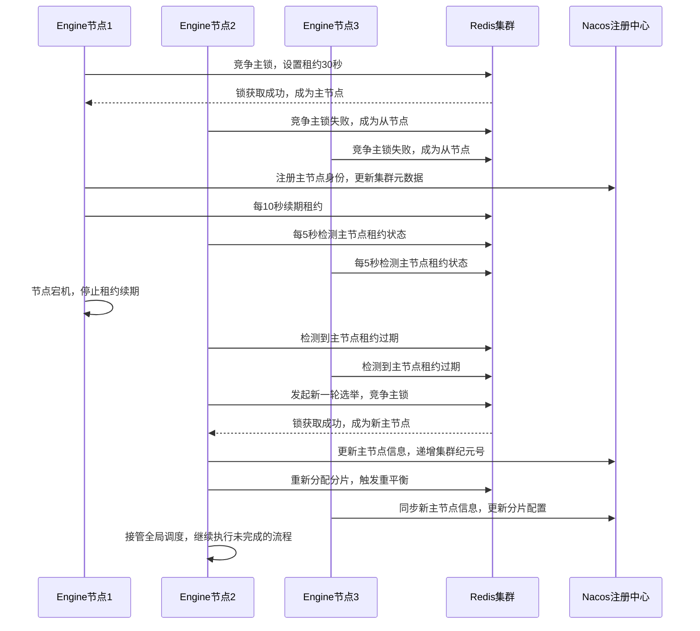
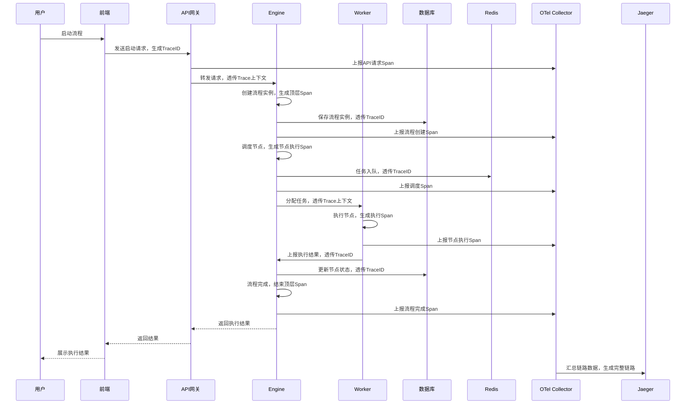
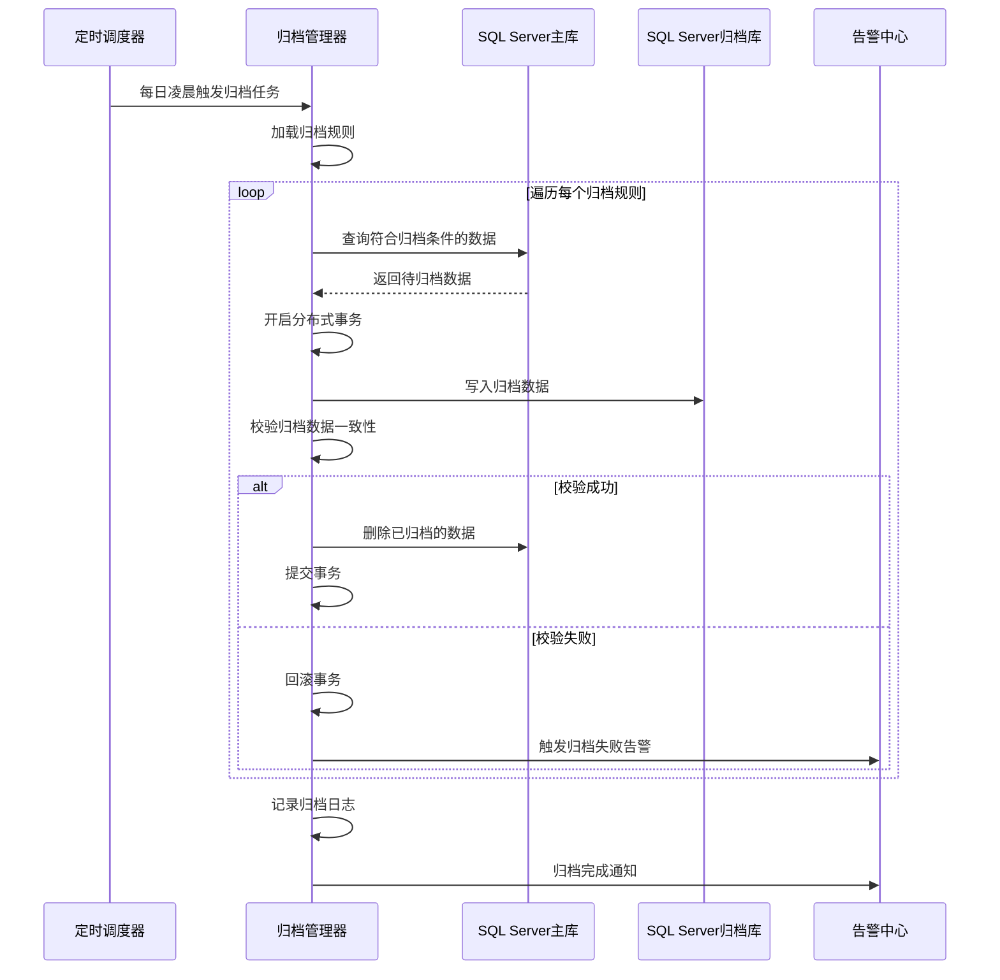
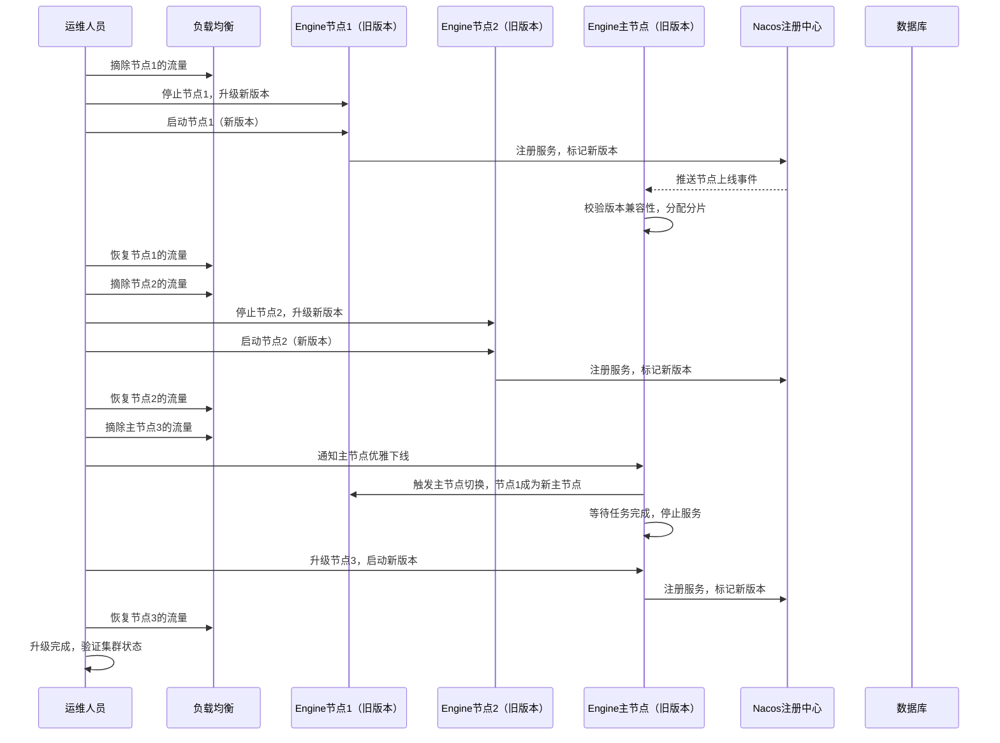

# D5阶段：生产级高可用与企业级集成 详细设计文档
**文档编号**：D5-DESIGN-v1.0
**项目名称**：DistributedWorkflow 分布式工作流引擎
**对应版本**：v0.9.0
**开发周期**：4周
**前置依赖**：D4阶段v0.8.0正式版已完整交付，核心引擎、可视化前端、权限体系已全部落地
**文档状态**：正式发布
**编制日期**：2026-04-26
**适用范围**：D5阶段开发、测试、交付全流程

---

## 一、文档概述
本文档是DistributedWorkflow项目D5阶段的详细设计说明书，基于D1-D4阶段交付的完整引擎能力与可视化体系，完成**生产级高可用架构、全链路可观测性体系、企业级集成能力、流程模板生态、数据生命周期管理**五大核心能力落地，将引擎从「可用的可视化产品」升级为「可大规模生产部署、可深度集成、可稳定运维的企业级工作流平台」。

D5阶段严格遵循前序阶段的架构设计原则，100%向后兼容所有存量API、流程定义与数据结构，所有新增能力均为增量扩展，不修改引擎核心调度逻辑与原有业务实现，保障存量业务平滑升级。

## 二、阶段范围与交付标准
### 2.1 D5阶段包含的核心内容
1. **引擎高可用架构升级**：集群主从选举、调度分片、脑裂防护、平滑滚动升级/回滚、流量灰度、灾备与数据恢复能力
2. **全链路可观测性体系**：Prometheus全量指标体系、Grafana可视化监控大盘、OpenTelemetry全链路追踪、标准化日志体系、多渠道告警规则引擎
3. **企业级集成能力增强**：开放API网关、Webhook集成中心、内部事件总线、10+内置外部系统连接器、主流SSO协议全支持（OIDC/SAML2.0/CAS）、多语言SDK生成
4. **流程模板与生态能力**：内置业务模板市场、模板全生命周期管理、私有模板库、自定义节点标准化SDK、模板一键安装与导入导出
5. **数据生命周期管理**：冷热数据分离、历史数据自动归档/清理、定时备份与一键恢复、合规化数据导出、分表策略优化
6. **全链路性能优化与压测**：核心调度路径优化、大流程执行性能提升、数据库与Redis存储优化、全场景压测方案与性能基线报告
7. **企业级部署适配**：开发/测试/生产多环境隔离、配置中心深度集成、K8s Operator部署支持、容器化运维增强

### 2.2 D5阶段不包含的内容
以下内容将在D6阶段实现，D5阶段仅预留扩展接口，不做开发：
1. 多租户数据隔离与租户管理体系
2. 流程数据分析、BI报表与可视化大屏
3. 可视化自定义表单设计器
4. 移动端适配界面与小程序支持
5. 审批流高级能力（会签/加签/转签/代理）
6. 流程回滚、事务补偿等强一致性能力

### 2.3 量化交付标准
1. **高可用指标**：3节点Engine集群部署，任意1个节点宕机，业务无中断、调度无丢失，RTO<30s，RPO=0；支持滚动升级，升级过程中流程执行无中断、无数据异常
2. **可观测性指标**：核心业务指标覆盖≥100个，全链路追踪覆盖100%核心流程，预设告警规则≥20条，支持4种以上告警渠道，问题排查链路可追溯率100%
3. **性能指标**：单集群支持10000+并发流程实例稳定运行，核心调度平均延迟<50ms，较D4阶段性能提升≥50%；支持1000+节点的大流程无卡顿执行，加载时间<1s
4. **集成能力指标**：内置≥10种通用连接器，开放API覆盖100%核心能力，提供OpenAPI 3.0规范文档与4种以上语言SDK；支持OIDC/SAML2.0/CAS主流SSO协议，兼容企业微信/钉钉/飞书/LDAP第三方登录
5. **兼容性指标**：100%兼容D1-D4阶段的所有API、流程定义、数据结构，存量流程无修改即可正常运行，升级无数据迁移成本
6. **代码质量指标**：核心新增代码单元测试覆盖率≥90%，全链路压测无内存泄漏、无数据不一致、无死锁问题
7. **交付物标准**：完整前后端代码、Grafana监控大盘、全场景压测报告、集成SDK、多环境部署脚本、运维手册、用户操作手册、API文档

## 三、核心设计约束
1. **向后兼容约束**：所有新增功能均为增量扩展，不得修改D1-D4阶段已发布的核心接口、数据结构、数据库原有字段，仅可新增可选字段与扩展接口，保障存量业务零改造升级
2. **高可用约束**：所有核心组件必须支持集群部署，无单点故障；所有核心状态必须持久化，支持故障自动恢复；所有操作必须具备幂等性，避免故障场景下的数据不一致
3. **可观测性约束**：所有核心操作必须全链路埋点，实现「指标-链路-日志」三位一体可观测体系；所有异常场景必须有明确的指标告警与链路追踪，支持问题根因快速定位
4. **集成标准化约束**：所有对外集成必须遵循行业标准协议，提供无代码配置化集成能力；开放API必须符合RESTful规范，提供完整的鉴权、限流、熔断能力
5. **性能非劣化约束**：所有新增功能不得劣化原有核心性能，核心调度路径必须持续优化，单实例调度能力不得低于D4阶段水平
6. **安全合规约束**：所有对外API必须支持鉴权、限流、防刷；敏感数据必须加密存储与传输；数据归档、备份、清理必须满足企业合规审计要求
7. **运维友好约束**：所有功能必须支持可配置、可监控、可告警；提供标准化运维工具，支持一键备份、恢复、扩容、降级；预设生产级最佳实践配置

## 四、整体架构设计
D5阶段在原有四层架构基础上，新增**API网关层、高可用调度层、可观测性体系、集成适配层**，形成完整的企业级生产架构，整体架构如下：

```
┌─────────────────────────────────────────────────────────────────────────────────────┐
│  前端应用层（D4已有，D5扩展）                                                      │
│  流程设计器 | 流程管理 | 实例监控 | 审批工作台 | 模板市场 | 集成中心 | 监控大盘  │
└───────────────────────────────────────┬─────────────────────────────────────────────┘
                                        ↓
┌─────────────────────────────────────────────────────────────────────────────────────┐
│  API网关层（D5新增）                                                                │
│  开放API | 鉴权认证 | 流量控制 | 熔断降级 | 请求日志 | 链路追踪 | 版本管理        │
└───────────────────────────────────────┬─────────────────────────────────────────────┘
                                        ↓
┌─────────────────────────────────────────────────────────────────────────────────────┐
│  引擎核心层（D1-D4已有，D5高可用升级）                                              │
│  ┌─────────────────────────────────────────────────────────────────────────────┐    │
│  │  集群高可用模块：主从选举 | 调度分片 | 脑裂防护 | 平滑升级 | 故障转移      │    │
│  └─────────────────────────────────────────────────────────────────────────────┘    │
│  流程调度 | 生命周期管理 | 版本管理 | 人工审批 | 端点管理 | 权限控制            │
└───────────────────────────────────────┬─────────────────────────────────────────────┘
                                        ↓
┌─────────────────────────────────────────────────────────────────────────────────────┐
│  公共组件层（D1-D4已有，D5扩展）                                                    │
│  分布式锁 | 任务队列 | 审计日志 | 事件总线 | 连接器中心 | 指标埋点 | 链路追踪    │
└───────────────────────────────────────┬─────────────────────────────────────────────┘
                                        ↓
┌─────────────────────────────────────────────────────────────────────────────────────┐
│  存储层（D1-D4已有，D5生命周期管理升级）                                            │
│  ┌─────────────────────────────────────────────────────────────────────────────┐    │
│  │  数据生命周期管理：冷热分离 | 自动归档 | 备份恢复 | 分表优化 | 合规清理    │    │
│  └─────────────────────────────────────────────────────────────────────────────┘    │
│  SQL Server | Redis | Nacos | 归档存储 | 备份存储                                  │
└───────────────────────────────────────┬─────────────────────────────────────────────┘
                                        ↓
┌─────────────────────────────────────────────────────────────────────────────────────┐
│  可观测性体系（D5新增）                                                              │
│  Prometheus指标采集 | Grafana监控大盘 | OTel全链路追踪 | AlertManager告警中心      │
│  日志采集 | 异常定位 | 性能分析 | 容量预估                                          │
└─────────────────────────────────────────────────────────────────────────────────────┘
```

### 4.2 集群部署架构
D5阶段生产级高可用集群采用3节点Engine主从架构，无单点故障，整体部署架构如下：
```
┌─────────────────────────────────────────────────────────────────────────┐
│                              负载均衡层                                  │
│                                 Nginx                                    │
└──────────────────────────────────┬──────────────────────────────────────┘
                                   │
┌──────────────────────────────────▼──────────────────────────────────────┐
│                          Engine集群（3节点）                             │
│  ┌─────────────┐  ┌─────────────┐  ┌─────────────┐                    │
│  │ Engine主节点 │  │ Engine从节点 │  │ Engine从节点 │                    │
│  │ 全局调度     │  │ API服务      │  │ API服务      │                    │
│  │ 分片协调     │  │ 任务执行      │  │ 任务执行      │                    │
│  │ 主从选举     │  │ 备主候选      │  │ 备主候选      │                    │
│  └─────────────┘  └─────────────┘  └─────────────┘                    │
└──────────────────────────────────┬──────────────────────────────────────┘
                                   │
┌──────────────────────────────────▼──────────────────────────────────────┐
│                          中间件高可用集群                                │
│  ┌─────────────────┐  ┌─────────────────┐  ┌─────────────────────────┐ │
│  │  Nacos集群      │  │  Redis集群       │  │  SQL Server AlwaysOn    │ │
│  │  3节点高可用    │  │  3主3从集群     │  │  主从高可用集群         │ │
│  └─────────────────┘  └─────────────────┘  └─────────────────────────┘ │
└──────────────────────────────────┬──────────────────────────────────────┘
                                   │
┌──────────────────────────────────▼──────────────────────────────────────┐
│                      NodeWorker执行集群（可水平扩展）                    │
│  无状态Worker节点，按业务线独立部署，支持自动扩缩容                      │
└─────────────────────────────────────────────────────────────────────────┘
```

## 五、核心模块详细设计
### 5.1 引擎高可用架构升级
引擎高可用架构是D5阶段的核心基础，解决单节点故障、调度重复、升级中断、脑裂等生产核心问题，分为5个子模块。

#### 5.1.1 集群主从选举模块
**核心职责**：实现Engine集群的主节点自动选举，主节点负责全局调度与分片协调，从节点负责API服务与任务执行，主节点故障自动切换。
**核心实现逻辑**：
1. **选举机制**：基于Redis分布式锁+租约机制实现，所有Engine节点启动后竞争主锁，获取成功的节点成为主节点，租约有效期30秒
2. **租约续期**：主节点每10秒自动续期租约，续期失败自动降级为从节点
3. **故障切换**：从节点每5秒检测主节点租约状态，主节点租约过期后，自动触发新一轮选举，从节点中选举出新的主节点
4. **主节点职责**：全局调度协调、分片管理、定时任务执行、集群元数据管理
5. **从节点职责**：处理API请求、执行任务分配、备主候选、主节点故障时参与选举
6. **状态机约束**：节点状态严格遵循「启动→候选→主/从→离线」的状态转换，禁止非法状态跳转

#### 5.1.2 调度分片模块
**核心职责**：解决多Engine实例重复调度问题，实现流程实例的分片调度，避免资源竞争与重复执行。
**核心实现逻辑**：
1. **分片规则**：采用一致性哈希算法，按流程实例ID进行哈希分片，每个Engine节点负责固定哈希槽位的流程实例调度
2. **分片元数据**：主节点维护集群分片元数据，记录每个节点负责的槽位范围，通过Nacos同步到所有从节点
3. **重平衡机制**：Engine节点上下线时，主节点自动触发分片重平衡，重新分配槽位，保障调度负载均衡
4. **调度权限校验**：节点调度前必须校验实例ID是否属于自身负责的槽位，非自身分片的实例禁止调度，避免重复调度
5. **分片切换保障**：重平衡过程中，保障正在执行的流程不中断，仅新实例按新分片规则分配

#### 5.1.3 脑裂防护模块
**核心职责**：防止网络分区导致的双主调度问题，保障集群数据一致性。
**核心实现逻辑**：
1. **多数派确认机制**：主节点必须与超过半数的节点保持心跳连通，否则自动降级为从节点
2. **租约双重校验**：主节点续期必须同时写入Redis集群多数派节点，写入失败则放弃主节点身份
3. **心跳超时控制**：节点心跳超时阈值设置为15秒，连续3次心跳失败则标记为离线，禁止参与选举
4. ** fencing 机制**：新主节点选举成功后，会更新集群纪元号（Epoch），旧主节点收到更高纪元号后，立即停止调度，降级为从节点
5. **数据写入校验**：所有核心状态写入必须携带纪元号，低纪元号的写入请求会被拒绝，避免脑裂导致的数据脏写

#### 5.1.4 平滑升级与回滚模块
**核心职责**：实现Engine集群的滚动升级，升级过程中业务无中断，流程执行不中断，支持版本灰度与快速回滚。
**核心实现逻辑**：
1. **滚动升级流程**：按节点逐个升级，先升级从节点，最后升级主节点；升级节点前先将该节点的分片迁移到其他节点，升级完成后再迁回
2. **版本灰度能力**：支持新老版本Engine实例共存，可配置仅新版本实例处理指定比例/白名单的流程实例，验证无问题后全量升级
3. **优雅下线机制**：节点下线前，先停止接收新任务，等待正在执行的任务完成，再注销服务，避免任务中断
4. **数据版本兼容**：所有数据结构支持版本号，新版本实例兼容旧版本数据格式，升级失败可快速回滚，无数据迁移成本
5. **升级状态监控**：升级过程中实时监控集群状态、流程执行成功率、调度延迟，出现异常自动暂停升级，触发回滚

#### 5.1.5 灾备与数据恢复模块
**核心职责**：实现数据的定时备份与一键恢复，保障故障场景下的数据可恢复性，满足企业灾备要求。
**核心实现逻辑**：
1. **备份策略**：支持全量备份与增量备份，全量备份每日执行，增量备份每小时执行，备份数据加密存储
2. **备份范围**：流程定义、版本历史、流程实例、节点状态、系统配置、用户权限数据全量备份
3. **备份存储**：支持本地存储、对象存储（S3/OSS）、NAS存储等多种备份介质
4. **一键恢复**：支持从指定备份点一键恢复数据，恢复前自动校验备份数据完整性，恢复过程中禁止写入
5. **跨区域灾备**：支持跨区域备份同步，主区域故障时，可在备区域快速恢复服务
6. **备份校验**：每次备份完成后自动校验备份数据的完整性与可恢复性，备份失败触发告警

### 5.2 全链路可观测性体系
D5阶段构建「指标-链路-日志」三位一体的可观测性体系，实现生产环境的全场景监控、问题快速定位、异常提前预警。

#### 5.2.1 Prometheus指标体系
**核心设计原则**：指标覆盖全生命周期，符合Prometheus规范，支持多维度标签过滤，预设阈值与告警规则。
**核心指标分类**：

| 指标大类 | 核心指标示例 | 指标类型 | 说明 |
|----------|--------------|----------|------|
| 引擎全局指标 | workflow_engine_up | Gauge | 引擎节点在线状态，1=在线，0=离线 |
| 引擎全局指标 | workflow_engine_instance_total | Counter | 流程实例累计总数 |
| 引擎全局指标 | workflow_engine_instance_running | Gauge | 当前运行中的流程实例数 |
| 引擎全局指标 | workflow_engine_instance_success_rate | Gauge | 流程实例成功率，按分钟统计 |
| 调度核心指标 | workflow_schedule_latency_ms | Histogram | 流程调度延迟，分位值统计 |
| 调度核心指标 | workflow_schedule_task_total | Counter | 调度任务累计总数 |
| 调度核心指标 | workflow_schedule_retry_total | Counter | 调度重试次数 |
| 调度核心指标 | workflow_schedule_failed_total | Counter | 调度失败次数 |
| Worker节点指标 | workflow_worker_online_total | Gauge | 在线Worker节点总数 |
| Worker节点指标 | workflow_worker_load_percent | Gauge | Worker节点负载率，当前执行数/最大并发数 |
| Worker节点指标 | workflow_worker_task_execution_time_ms | Histogram | 任务执行耗时 |
| Worker节点指标 | workflow_worker_task_failed_total | Counter | Worker任务执行失败次数 |
| 业务维度指标 | workflow_def_version_total | Gauge | 流程定义版本总数 |
| 业务维度指标 | workflow_approval_todo_total | Gauge | 待审批任务总数 |
| 业务维度指标 | workflow_endpoint_trigger_total | Counter | 端点触发累计次数 |
| 系统资源指标 | workflow_engine_cpu_usage | Gauge | Engine节点CPU使用率 |
| 系统资源指标 | workflow_engine_memory_usage | Gauge | Engine节点内存使用率 |
| 系统资源指标 | workflow_db_connection_usage | Gauge | 数据库连接池使用率 |
| 系统资源指标 | workflow_redis_command_latency_ms | Histogram | Redis命令执行延迟 |

**指标规范**：
- 所有指标统一前缀为`workflow_`，便于监控聚合
- 核心指标必须携带`instance`、`workflow_id`、`node_type`等核心标签
- 耗时类指标必须使用Histogram类型，支持分位值统计
- 累计类指标必须使用Counter类型，支持增长率统计

#### 5.2.2 OpenTelemetry全链路追踪
**核心职责**：实现流程从启动到结束的全链路追踪，支持跨服务、跨节点的链路透传，快速定位问题根因。
**核心实现逻辑**：
1. **Trace生命周期**：流程启动时生成全局TraceID，贯穿流程执行全生命周期，每个节点执行生成独立的Span
2. **Span层级设计**：
   - 顶层Span：流程实例全生命周期
   - 二级Span：节点执行、调度、回调、重试
   - 三级Span：数据库操作、Redis操作、外部API调用
3. **上下文透传**：TraceID、SpanID通过上下文透传到Worker节点、外部系统调用、Webhook回调，实现跨服务链路打通
4. **事件与异常记录**：节点执行的关键事件、异常信息、错误堆栈自动记录到Span中，支持问题根因定位
5. **后端兼容**：支持Jaeger、Zipkin、SkyWalking等主流链路追踪后端，可通过配置灵活切换
6. **采样策略**：支持全量采样、概率采样、错误采样多种策略，生产环境默认采用错误采样+1%概率采样，平衡性能与可观测性

#### 5.2.3 标准化日志体系
**核心职责**：统一全链路日志格式，实现结构化、可检索、可关联的日志体系。
**核心规范**：
1. **统一日志格式**：所有日志必须为JSON结构化输出，必须包含以下关键字段：
   ```json
   {
     "level": "info/error/warn/debug",
     "time": "2026-04-26T00:00:00+08:00",
     "trace_id": "xxx",
     "instance_id": "xxx",
     "node_id": "xxx",
     "worker_id": "xxx",
     "workflow_id": "xxx",
     "message": "日志内容",
     "error": "错误信息",
     "stack": "错误堆栈"
   }
   ```
2. **日志分级规范**：
   - ERROR：系统错误、流程执行失败、数据异常等需要人工介入的问题
   - WARN：非核心异常、重试、超时等需要关注但不影响业务的问题
   - INFO：流程启动、完成、节点执行等核心业务事件
   - DEBUG：开发调试信息，生产环境默认关闭
3. **日志关联**：所有日志通过TraceID与链路追踪关联，通过InstanceID与流程实例关联，实现日志-指标-链路的联动查询
4. **日志输出适配**：支持控制台输出、文件输出、Loki/ELK输出，可通过配置灵活切换
5. **日志轮转**：文件日志自动按大小/时间轮转，自动清理过期日志，避免磁盘占用过高

#### 5.2.4 监控大盘与告警体系
**核心职责**：提供可视化监控大盘与多渠道告警能力，实现异常提前发现、快速响应。
**核心内容**：
1. **Grafana监控大盘**：
   - 全局概览大盘：集群状态、流程执行统计、成功率、核心性能指标
   - Engine节点详情大盘：单节点的CPU、内存、调度性能、错误统计
   - Worker节点大盘：Worker在线状态、负载、执行耗时、失败率
   - 流程实例大盘：单流程的执行统计、耗时分布、异常节点
   - 异常告警大盘：当前告警、历史告警、告警趋势
2. **预设告警规则**：
   | 告警规则 | 触发阈值 | 告警级别 |
   |----------|----------|----------|
   | Engine节点离线 | 节点down机超过30秒 | 紧急 |
   | 流程成功率下降 | 分钟级成功率<95% | 警告 |
   | 调度延迟过高 | 调度延迟P95>200ms | 警告 |
   | Worker负载过高 | 单Worker负载率>90%持续5分钟 | 警告 |
   | 任务执行失败率 | 节点执行失败率>5%持续3分钟 | 警告 |
   | 数据库连接池耗尽 | 连接池使用率>90%持续3分钟 | 紧急 |
   | 磁盘空间不足 | 磁盘使用率>85% | 警告 |
3. **告警渠道**：支持邮件、钉钉、企业微信、飞书、Webhook、Slack等主流告警渠道，可配置告警接收人、告警级别、静默时间
4. **告警降噪**：支持告警聚合、重复抑制、告警升级，避免告警风暴
5. **告警联动**：支持告警触发自动运维动作，如Worker扩容、节点降级、流量限流等

### 5.3 企业级集成能力增强
D5阶段构建标准化的企业级集成体系，实现与企业现有系统的无代码/低代码深度集成，降低接入成本。

#### 5.3.1 开放API网关
**核心职责**：提供统一的API入口，实现标准化的鉴权、流量控制、版本管理、安全防护。
**核心实现逻辑**：
1. **API规范**：所有开放API严格遵循RESTful规范，版本号通过URL路径携带（`/api/v1/xxx`），提供完整的OpenAPI 3.0规范文档
2. **鉴权体系**：支持API Key、JWT、OAuth2.0三种鉴权方式，支持API权限粒度控制，可配置API的访问权限、IP白名单
3. **流量控制**：支持全局限流、接口级限流、客户端级限流，支持令牌桶/漏桶算法，可配置限流阈值与降级策略
4. **熔断降级**：基于Sentinel实现接口熔断，异常率超过阈值自动熔断，避免故障扩散；支持降级策略，返回兜底数据
5. **请求日志与审计**：所有API请求全量记录审计日志，包含请求参数、响应结果、耗时、客户端IP、鉴权信息，支持合规审计
6. **SDK生成**：基于OpenAPI规范自动生成Go/Java/Python/JavaScript/TypeScript多语言SDK，降低接入成本
7. **API文档**：提供在线Swagger文档，支持接口调试、参数说明、示例代码

#### 5.3.2 Webhook集成中心
**核心职责**：实现可视化的Webhook配置管理，支持流程事件的实时推送，与第三方系统无缝集成。
**核心实现逻辑**：
1. **事件类型**：支持全生命周期事件订阅，包括：
   - 流程实例事件：启动、完成、失败、暂停、恢复、终止
   - 节点执行事件：开始、完成、失败、重试、跳过
   - 审批事件：提交、通过、驳回、取消
   - 端点事件：触发、成功、失败
2. **Webhook配置**：可视化配置Webhook地址、订阅事件、请求头、签名密钥、重试策略、过滤规则
3. **安全机制**：支持HMAC-SHA256签名校验，请求头携带签名信息，接收方可验证请求合法性，防止恶意请求
4. **重试策略**：支持固定间隔/指数退避重试，可配置最大重试次数，重试失败触发告警
5. **推送记录**：全量记录Webhook推送历史，包含请求参数、响应结果、耗时、重试次数，支持失败推送手动重发
6. **内置模板**：内置钉钉、企业微信、飞书、Slack、Jenkins等常用系统的Webhook模板，支持一键配置
7. **事件过滤**：支持按流程ID、节点类型、执行状态等条件过滤事件，仅推送符合条件的事件

#### 5.3.3 内部事件总线
**核心职责**：实现引擎内部核心事件的发布与订阅，解耦内部组件，同时支持外部系统消费事件。
**核心实现逻辑**：
1. **底层实现**：基于Redis Stream实现，支持消息持久化、消费者组、消息重试、死信队列
2. **事件规范**：所有事件统一格式，包含事件ID、事件类型、发生时间、TraceID、事件体、元数据
3. **发布订阅**：支持多消费者组订阅同一事件，支持广播模式与集群模式，支持消息ACK机制
4. **内部组件订阅**：审计日志、Webhook推送、告警中心等组件通过事件总线订阅事件，解耦核心调度逻辑
5. **外部消费**：支持外部系统通过API/SDK消费事件，支持消息回溯、断点续传
6. **死信机制**：消费失败超过重试次数的事件自动进入死信队列，支持人工排查与重发

#### 5.3.4 外部系统连接器
**核心职责**：提供内置的通用连接器，支持在流程节点中无代码调用外部系统，扩展流程的业务能力。
**内置连接器清单**：

| 连接器类型 | 核心功能 | 适用场景 |
|------------|----------|----------|
| HTTP连接器 | 支持GET/POST/PUT/DELETE请求，配置化Header、参数、签名校验 | 调用第三方RESTful API |
| SQL连接器 | 支持主流数据库的查询/插入/更新/删除操作，配置化SQL语句、参数映射 | 数据库数据操作 |
| Redis连接器 | 支持Redis的读写、删除、过期设置、发布订阅操作 | 缓存操作、消息通知 |
| 消息队列连接器 | 支持Kafka/RabbitMQ消息发送与消费 | 异步消息通知、系统解耦 |
| 文件连接器 | 支持本地文件、FTP/SFTP、对象存储的文件读写、上传下载 | 文件处理、数据同步 |
| 邮件连接器 | 支持SMTP邮件发送，支持附件、HTML模板 | 邮件通知、告警推送 |
| 企业通知连接器 | 支持钉钉/企业微信/飞书的文本、卡片、markdown消息发送 | 业务通知、审批提醒 |
| 脚本连接器 | 支持Python/JavaScript脚本执行，内置常用工具函数 | 自定义数据处理、逻辑判断 |
| 日期时间连接器 | 支持日期格式化、时间计算、时区转换 | 时间相关业务处理 |
| 条件分支连接器 | 支持多条件表达式判断，动态路由分支 | 复杂条件分支控制 |

**连接器核心特性**：
1. 可视化配置，无需代码，通过表单配置连接器参数
2. 支持上下文数据映射，可引用流程上下文数据作为连接器入参
3. 执行结果自动写入流程上下文，支持后续节点引用
4. 支持错误处理、重试策略、超时控制
5. 支持自定义连接器扩展，通过SDK开发自定义连接器，注册到引擎中使用

#### 5.3.5 SSO集成增强
**核心职责**：完善系统管理抽象层的SSO能力，支持主流企业级SSO协议，实现与企业统一身份体系的无缝集成。
**核心实现逻辑**：
1. **协议支持**：完整支持OIDC 1.0、SAML 2.0、CAS 3.0主流SSO协议
2. **第三方登录**：内置支持企业微信、钉钉、飞书、LDAP、GitHub、GitLab第三方登录
3. **用户同步**：支持用户信息自动同步，包括用户名、部门、角色、邮箱、手机号等信息
4. **角色映射**：支持企业身份体系中的角色/部门与系统角色的映射配置，自动分配用户角色
5. **单点登出**：支持全局单点登出，企业SSO登出后，系统自动登出
6. **配置化集成**：所有SSO配置可视化管理，无需修改代码，重启即可生效
7. **兼容适配**：完全兼容D4阶段的系统管理抽象层，可通过配置切换内置用户体系与SSO体系，无需修改核心代码

### 5.4 流程模板与生态能力
**核心职责**：构建流程模板生态，降低用户使用门槛，提供开箱即用的业务流程模板，支持自定义扩展。

#### 5.4.1 流程模板市场
**核心内容**：
1. **内置模板库**：提供20+常用业务场景的开箱即用模板，覆盖：
   - 行政审批类：请假审批、报销审批、出差申请、物品领用、用章申请
   - 运维自动化类：服务发布、服务器巡检、数据库备份、故障应急处理
   - 数据处理类：数据同步、报表生成、数据清洗、定时归档
   - 研发协同类：需求评审、代码发布、bug修复流程、上线审批
2. **模板分类与标签**：支持模板按业务场景分类，支持多标签管理，支持关键词搜索、收藏、排序
3. **一键安装**：模板支持一键安装到私有流程库，自动生成流程定义，可直接编辑、发布、启动
4. **模板详情**：提供模板说明、适用场景、节点说明、输入输出参数、使用示例
5. **版本管理**：模板支持版本管理，模板更新后，已安装的模板支持一键升级

#### 5.4.2 模板全生命周期管理
**核心功能**：
1. **模板创建**：支持将已有的流程定义另存为模板，配置模板信息、分类、标签、使用说明
2. **模板发布**：支持模板的草稿、发布、下架状态管理，仅发布状态的模板可在市场中查看
3. **权限控制**：支持模板的可见范围配置，支持全公司可见、指定部门可见、指定人员可见
4. **模板导入导出**：支持模板的JSON文件导入导出，支持模板批量迁移
5. **私有模板库**：支持企业私有模板库，仅企业内部用户可查看、使用
6. **模板使用统计**：统计模板的安装次数、启动次数、成功率，优化模板质量

#### 5.4.3 自定义节点SDK
**核心职责**：提供标准化的自定义节点开发SDK，支持用户开发业务专属的节点类型，扩展引擎能力。
**SDK核心内容**：
1. **标准化接口定义**：完全兼容引擎的`NodeExecutor`接口，自定义节点无需修改引擎核心代码
2. **多语言支持**：提供Go/Java/Python/JavaScript多语言SDK，支持用户使用熟悉的语言开发
3. **开发脚手架**：提供项目脚手架，一键生成自定义节点项目结构，包含示例代码、配置文件、打包脚本
4. **调试工具**：提供本地调试工具，支持本地测试自定义节点的执行逻辑、参数映射、错误处理
5. **注册与发布**：支持自定义节点打包、注册到引擎中，可视化配置使用，支持版本管理与升级
6. **开发文档**：提供完整的开发指南、API文档、示例代码、最佳实践

### 5.5 数据生命周期管理
**核心职责**：实现数据的全生命周期管理，解决生产环境数据量增长导致的性能问题，满足合规审计要求。

#### 5.5.1 冷热数据分离
**核心实现逻辑**：
1. **数据分层**：
   - 热数据：运行中的流程实例、近3个月完成的实例、最新版本的流程定义，存储在主库
   - 冷数据：3个月前完成的流程实例、历史版本的流程定义、归档的审计日志，存储在归档库
2. **自动路由**：查询数据时，自动根据时间范围路由到主库或归档库，对业务无感知
3. **归档规则**：可视化配置归档规则，支持按时间、流程状态、流程类型配置归档条件，支持归档白名单
4. **归档查询**：归档数据支持完整的查询、详情查看、导出，支持历史流程实例的回溯查看
5. **归档恢复**：支持将归档数据恢复到主库，满足异常场景的业务需求

#### 5.5.2 数据归档与清理
**核心实现逻辑**：
1. **定时归档任务**：基于定时端点实现每日自动归档，将符合条件的冷数据从主库迁移到归档库
2. **归档事务保障**：归档操作通过分布式事务保障，迁移成功后再删除主库数据，避免数据丢失
3. **归档校验**：归档完成后自动校验主库与归档库的数据一致性，校验失败自动回滚，触发告警
4. **数据清理**：支持配置数据保留周期，超过保留周期的归档数据自动清理，满足合规要求
5. **清理规则**：支持按流程类型、数据类型、时间范围配置清理规则，支持核心数据永久保留
6. **清理审计**：所有数据清理操作全量记录审计日志，包含操作人、清理范围、清理数据量、操作时间

#### 5.5.3 备份与恢复
**核心实现逻辑**：
1. **定时备份**：支持每日全量备份、每小时增量备份，备份任务可视化配置，支持备份失败告警
2. **备份加密**：备份数据采用AES-256加密存储，防止数据泄露
3. **备份介质**：支持本地磁盘、NAS、对象存储（S3/OSS/COS）等多种备份介质
4. **备份校验**：每次备份完成后自动校验备份数据的完整性与可恢复性，校验失败触发告警
5. **一键恢复**：支持从指定备份点一键恢复数据，恢复前自动备份当前数据，支持恢复预览
6. **跨区域灾备**：支持备份数据自动同步到跨区域备份中心，主区域故障时可快速恢复
7. **备份生命周期**：支持备份数据保留周期配置，自动清理过期备份，降低存储成本

#### 5.5.4 分表策略优化
**核心实现逻辑**：
1. **时间分表**：对流程实例表、节点状态表、审计日志表按月份分表，避免单表数据量过大导致的性能问题
2. **自动建表**：每月自动创建下个月的分表，提前做好表结构初始化
3. **查询路由**：查询时自动根据时间条件路由到对应分表，支持跨分表查询
4. **历史分表归档**：超过保留周期的历史分表自动归档到归档库，降低主库压力
5. **分表透明化**：分表逻辑对业务代码完全透明，无需修改业务SQL，通过中间件自动路由

### 5.6 全链路性能优化
D5阶段针对核心路径进行深度性能优化，提升引擎的高并发处理能力与大流程执行性能。

#### 5.6.1 核心调度性能优化
1. **调度逻辑优化**：优化DAG依赖检查算法，时间复杂度从O(n²)优化到O(n)，提升大流程调度效率
2. **批量操作优化**：节点状态更新、上下文更新采用批量操作，减少数据库交互次数
3. **缓存优化**：热点流程定义、实例元数据、节点配置采用多级缓存，减少数据库查询
4. **无锁调度优化**：优化分布式锁粒度，减少锁竞争，提升并发调度能力
5. **异步化优化**：非核心逻辑（审计日志、Webhook推送、指标上报）全异步化，不阻塞核心调度路径
6. **调度延迟优化**：核心调度平均延迟从100ms优化到50ms以内，P99延迟<200ms

#### 5.6.2 大流程执行优化
1. **DAG分片解析**：1000+节点的大流程采用分片解析，避免单次解析占用过多内存
2. **节点状态批量更新**：大流程的节点状态更新采用批量提交，减少数据库事务次数
3. **上下文分片存储**：大流程的上下文数据采用分片存储，避免大对象导致的序列化/反序列化性能问题
4. **懒加载优化**：流程设计器加载大流程时，采用懒加载机制，仅渲染可视区域节点，加载时间<1s
5. **执行状态增量更新**：大流程的执行状态采用增量更新，前端仅刷新状态变化的节点，提升监控页面流畅度

#### 5.6.3 存储性能优化
1. **索引优化**：全量梳理慢SQL，新增覆盖索引，优化联合索引顺序，消除全表扫描，慢SQL占比<0.1%
2. **分表优化**：大表按时间分表，避免单表数据量过大，查询性能提升10倍以上
3. **数据库连接池优化**：优化连接池配置，支持动态扩容，避免连接池耗尽，提升数据库并发处理能力
4. **Redis性能优化**：优化Redis Key设计，避免大Key、热Key，采用Pipeline批量操作，降低Redis延迟
5. **读写分离**：支持数据库读写分离，读请求路由到从库，降低主库压力
6. **预编译SQL**：所有数据库操作采用预编译SQL，避免SQL注入，提升执行效率

## 六、数据库详细设计（SQL Server）
D5阶段主要新增集成、模板、归档、备份相关的表，原有表仅新增索引与分表策略，不修改原有字段，保障存量数据兼容。

### 6.1 新增系统表
#### 6.1.1 workflow_templates 流程模板表
```sql
CREATE TABLE workflow_templates (
    template_id VARCHAR(64) PRIMARY KEY,
    template_name VARCHAR(255) NOT NULL,
    category_id BIGINT NOT NULL,
    description NVARCHAR(MAX),
    workflow_def NVARCHAR(MAX) NOT NULL,
    version VARCHAR(32) NOT NULL DEFAULT '1.0.0',
    author VARCHAR(64) NOT NULL,
    tags VARCHAR(255),
    icon VARCHAR(255),
    status INT NOT NULL DEFAULT 0, -- 0=草稿 1=已发布 2=已下架
    visible_scope INT NOT NULL DEFAULT 1, -- 1=全公司 2=指定部门 3=指定人员
    visible_range NVARCHAR(MAX),
    install_count INT NOT NULL DEFAULT 0,
    start_count INT NOT NULL DEFAULT 0,
    created_at DATETIME2 NOT NULL DEFAULT GETDATE(),
    updated_at DATETIME2 NOT NULL DEFAULT GETDATE(),
    deleted BIT NOT NULL DEFAULT 0
);
CREATE INDEX idx_template_category ON workflow_templates(category_id);
CREATE INDEX idx_template_status ON workflow_templates(status);
```

#### 6.1.2 workflow_template_categories 模板分类表
```sql
CREATE TABLE workflow_template_categories (
    category_id BIGINT IDENTITY(1,1) PRIMARY KEY,
    category_name VARCHAR(64) NOT NULL UNIQUE,
    parent_id BIGINT NOT NULL DEFAULT 0,
    sort INT NOT NULL DEFAULT 0,
    description NVARCHAR(255),
    created_at DATETIME2 NOT NULL DEFAULT GETDATE(),
    deleted BIT NOT NULL DEFAULT 0
);
```

#### 6.1.3 workflow_connectors 连接器配置表
```sql
CREATE TABLE workflow_connectors (
    connector_id VARCHAR(64) PRIMARY KEY,
    connector_name VARCHAR(255) NOT NULL,
    connector_type VARCHAR(64) NOT NULL,
    config NVARCHAR(MAX) NOT NULL,
    description NVARCHAR(255),
    created_by VARCHAR(64) NOT NULL,
    status BIT NOT NULL DEFAULT 1,
    created_at DATETIME2 NOT NULL DEFAULT GETDATE(),
    updated_at DATETIME2 NOT NULL DEFAULT GETDATE(),
    deleted BIT NOT NULL DEFAULT 0
);
CREATE INDEX idx_connector_type ON workflow_connectors(connector_type);
```

#### 6.1.4 workflow_webhooks Webhook配置表
```sql
CREATE TABLE workflow_webhooks (
    webhook_id VARCHAR(64) PRIMARY KEY,
    webhook_name VARCHAR(255) NOT NULL,
    url VARCHAR(512) NOT NULL,
    secret VARCHAR(128),
    events NVARCHAR(MAX) NOT NULL,
    filter_config NVARCHAR(MAX),
    retry_config NVARCHAR(MAX) NOT NULL,
    headers NVARCHAR(MAX),
    status BIT NOT NULL DEFAULT 1,
    created_by VARCHAR(64) NOT NULL,
    created_at DATETIME2 NOT NULL DEFAULT GETDATE(),
    updated_at DATETIME2 NOT NULL DEFAULT GETDATE(),
    deleted BIT NOT NULL DEFAULT 0
);
CREATE INDEX idx_webhook_status ON workflow_webhooks(status);
```

#### 6.1.5 workflow_webhook_records Webhook推送记录表
```sql
CREATE TABLE workflow_webhook_records (
    record_id BIGINT IDENTITY(1,1) PRIMARY KEY,
    webhook_id VARCHAR(64) NOT NULL,
    event_type VARCHAR(64) NOT NULL,
    event_id VARCHAR(64) NOT NULL,
    request_body NVARCHAR(MAX),
    response_status INT,
    response_body NVARCHAR(MAX),
    retry_count INT NOT NULL DEFAULT 0,
    status INT NOT NULL, -- 0=待推送 1=成功 2=失败
    cost_time INT NOT NULL, -- 耗时，单位ms
    created_at DATETIME2 NOT NULL DEFAULT GETDATE(),
    updated_at DATETIME2 NOT NULL DEFAULT GETDATE()
);
CREATE INDEX idx_webhook_record_webhook_id ON workflow_webhook_records(webhook_id);
CREATE INDEX idx_webhook_record_status ON workflow_webhook_records(status);
CREATE INDEX idx_webhook_record_created_at ON workflow_webhook_records(created_at);
```

#### 6.1.6 workflow_events 事件记录表
```sql
CREATE TABLE workflow_events (
    event_id VARCHAR(64) PRIMARY KEY,
    event_type VARCHAR(64) NOT NULL,
    trace_id VARCHAR(64),
    workflow_id VARCHAR(64),
    instance_id VARCHAR(64),
    node_id VARCHAR(64),
    event_body NVARCHAR(MAX) NOT NULL,
    created_at DATETIME2 NOT NULL DEFAULT GETDATE()
);
CREATE INDEX idx_event_type ON workflow_events(event_type);
CREATE INDEX idx_event_instance_id ON workflow_events(instance_id);
CREATE INDEX idx_event_created_at ON workflow_events(created_at);
```

#### 6.1.7 workflow_archive_rules 归档规则表
```sql
CREATE TABLE workflow_archive_rules (
    rule_id BIGINT IDENTITY(1,1) PRIMARY KEY,
    rule_name VARCHAR(255) NOT NULL UNIQUE,
    data_type VARCHAR(64) NOT NULL, -- instance/node/audit_log
    archive_condition NVARCHAR(MAX) NOT NULL,
    retention_days INT NOT NULL,
    status BIT NOT NULL DEFAULT 1,
    created_at DATETIME2 NOT NULL DEFAULT GETDATE(),
    updated_at DATETIME2 NOT NULL DEFAULT GETDATE()
);
```

#### 6.1.8 workflow_backup_records 备份记录表
```sql
CREATE TABLE workflow_backup_records (
    backup_id VARCHAR(64) PRIMARY KEY,
    backup_type VARCHAR(32) NOT NULL, -- full/incremental
    backup_path VARCHAR(512) NOT NULL,
    backup_size BIGINT NOT NULL, -- 单位字节
    backup_status INT NOT NULL, -- 0=进行中 1=成功 2=失败
    checksum VARCHAR(128),
    error_message NVARCHAR(MAX),
    created_at DATETIME2 NOT NULL DEFAULT GETDATE(),
    completed_at DATETIME2
);
CREATE INDEX idx_backup_status ON workflow_backup_records(backup_status);
CREATE INDEX idx_backup_created_at ON workflow_backup_records(created_at);
```

#### 6.1.9 workflow_sso_config SSO配置表
```sql
CREATE TABLE workflow_sso_config (
    id BIGINT IDENTITY(1,1) PRIMARY KEY,
    config_name VARCHAR(64) NOT NULL UNIQUE,
    sso_type VARCHAR(32) NOT NULL, -- oidc/saml/cas/ldap
    config NVARCHAR(MAX) NOT NULL,
    role_mapping NVARCHAR(MAX),
    status BIT NOT NULL DEFAULT 0,
    is_default BIT NOT NULL DEFAULT 0,
    created_at DATETIME2 NOT NULL DEFAULT GETDATE(),
    updated_at DATETIME2 NOT NULL DEFAULT GETDATE()
);
```

### 6.2 原有表索引优化
```sql
-- 优化流程实例查询性能
CREATE INDEX idx_workflow_instances_workflow_id_status ON workflow_instances(workflow_id, status, create_time DESC);
-- 优化节点状态查询性能
CREATE INDEX idx_workflow_node_states_instance_id_status ON workflow_node_states(instance_id, status);
-- 优化审计日志查询性能
CREATE INDEX idx_audit_workflow_id_operation_type ON workflow_instance_logs(workflow_id, operation_type, operate_time DESC);
-- 优化审批任务查询性能
CREATE INDEX idx_approval_instance_node_status ON workflow_approval_records(instance_id, node_id, operate_time DESC);
```

### 6.3 分表策略
对以下大表实现按月分表：
- workflow_instances → workflow_instances_yyyyMM
- workflow_node_states → workflow_node_states_yyyyMM
- workflow_instance_logs → workflow_instance_logs_yyyyMM
- workflow_approval_records → workflow_approval_records_yyyyMM
- workflow_events → workflow_events_yyyyMM

## 七、后端API扩展设计
D5阶段新增API均为增量扩展，完全兼容原有API，分为8大类，所有API均支持权限控制与流量控制。

### 7.1 开放API网关相关
| 接口地址 | 请求方式 | 接口说明 | 权限要求 |
|----------|----------|----------|----------|
| `/openapi/v1/api-docs` | GET | 获取OpenAPI 3.0规范文档 | 无 |
| `/openapi/v1/api-key/create` | POST | 创建API Key | 超级管理员 |
| `/openapi/v1/api-key/list` | GET | 查询API Key列表 | 超级管理员 |
| `/openapi/v1/api-key/{id}/status` | PUT | 启用/禁用API Key | 超级管理员 |
| `/openapi/v1/api-key/{id}/delete` | DELETE | 删除API Key | 超级管理员 |

### 7.2 流程模板市场相关API
| 接口地址 | 请求方式 | 接口说明 | 权限要求 |
|----------|----------|----------|----------|
| `/api/v1/template/market` | GET | 分页查询模板市场列表 | 登录用户 |
| `/api/v1/template/{templateId}` | GET | 获取模板详情 | 登录用户 |
| `/api/v1/template/{templateId}/install` | POST | 一键安装模板 | 流程设计权限 |
| `/api/v1/template/create` | POST | 创建自定义模板 | 流程设计权限 |
| `/api/v1/template/{templateId}/update` | PUT | 更新模板 | 模板作者 |
| `/api/v1/template/{templateId}/publish` | POST | 发布模板 | 模板作者 |
| `/api/v1/template/categories` | GET | 获取模板分类列表 | 登录用户 |
| `/api/v1/template/import` | POST | 导入模板 | 流程设计权限 |
| `/api/v1/template/{templateId}/export` | GET | 导出模板 | 登录用户 |

### 7.3 集成中心相关API
| 接口地址 | 请求方式 | 接口说明 | 权限要求 |
|----------|----------|----------|----------|
| `/api/v1/webhook/list` | GET | 分页查询Webhook配置列表 | 集成管理权限 |
| `/api/v1/webhook/create` | POST | 创建Webhook配置 | 集成管理权限 |
| `/api/v1/webhook/{webhookId}/update` | PUT | 更新Webhook配置 | 集成管理权限 |
| `/api/v1/webhook/{webhookId}/status` | PUT | 启用/禁用Webhook | 集成管理权限 |
| `/api/v1/webhook/{webhookId}/delete` | DELETE | 删除Webhook配置 | 集成管理权限 |
| `/api/v1/webhook/{webhookId}/records` | GET | 查询Webhook推送记录 | 集成管理权限 |
| `/api/v1/webhook/record/{recordId}/resend` | POST | 重发失败的Webhook推送 | 集成管理权限 |
| `/api/v1/connector/list` | GET | 查询连接器列表 | 集成管理权限 |
| `/api/v1/connector/create` | POST | 创建连接器配置 | 集成管理权限 |
| `/api/v1/connector/{connectorId}/test` | POST | 测试连接器连通性 | 集成管理权限 |
| `/api/v1/sso/config/list` | GET | 查询SSO配置列表 | 超级管理员 |
| `/api/v1/sso/config/save` | POST | 保存SSO配置 | 超级管理员 |
| `/api/v1/sso/{type}/login` | GET | SSO登录入口 | 无 |

### 7.4 数据生命周期管理相关API
| 接口地址 | 请求方式 | 接口说明 | 权限要求 |
|----------|----------|----------|----------|
| `/api/v1/archive/rule/list` | GET | 查询归档规则列表 | 运维管理权限 |
| `/api/v1/archive/rule/save` | POST | 保存归档规则 | 运维管理权限 |
| `/api/v1/archive/rule/{ruleId}/execute` | POST | 手动执行归档规则 | 运维管理权限 |
| `/api/v1/archive/data/query` | POST | 查询归档数据 | 运维管理权限 |
| `/api/v1/archive/data/restore` | POST | 恢复归档数据 | 运维管理权限 |
| `/api/v1/backup/manual` | POST | 手动执行备份 | 运维管理权限 |
| `/api/v1/backup/records` | GET | 查询备份记录列表 | 运维管理权限 |
| `/api/v1/backup/{backupId}/restore` | POST | 从备份点恢复数据 | 超级管理员 |
| `/api/v1/data/clean/rule/save` | POST | 保存数据清理规则 | 超级管理员 |
| `/api/v1/data/export` | POST | 导出流程数据 | 审计管理权限 |

### 7.5 可观测性相关API
| 接口地址 | 请求方式 | 接口说明 | 权限要求 |
|----------|----------|----------|----------|
| `/api/v1/metrics` | GET | 获取Prometheus指标（适配Prometheus采集） | 监控系统 |
| `/api/v1/monitor/cluster/status` | GET | 获取集群状态概览 | 运维管理权限 |
| `/api/v1/monitor/engine/nodes` | GET | 获取Engine节点列表 | 运维管理权限 |
| `/api/v1/monitor/worker/nodes` | GET | 获取Worker节点列表 | 运维管理权限 |
| `/api/v1/monitor/instance/statistics` | GET | 获取流程实例统计数据 | 运维管理权限 |
| `/api/v1/alert/rules` | GET | 查询告警规则列表 | 运维管理权限 |
| `/api/v1/alert/rules/save` | POST | 保存告警规则 | 运维管理权限 |
| `/api/v1/alert/history` | GET | 查询告警历史 | 运维管理权限 |
| `/api/v1/trace/{traceId}` | GET | 根据TraceID查询链路详情 | 运维管理权限 |

### 7.6 事件总线相关API
| 接口地址 | 请求方式 | 接口说明 | 权限要求 |
|----------|----------|----------|----------|
| `/api/v1/event/types` | GET | 获取支持的事件类型列表 | 登录用户 |
| `/api/v1/event/query` | POST | 分页查询事件记录 | 运维管理权限 |
| `/api/v1/event/subscribe` | POST | 订阅事件（HTTP长轮询） | 集成管理权限 |

### 7.7 集群管理相关API
| 接口地址 | 请求方式 | 接口说明 | 权限要求 |
|----------|----------|----------|----------|
| `/api/v1/cluster/nodes` | GET | 获取集群节点列表 | 超级管理员 |
| `/api/v1/cluster/sharding` | GET | 获取集群分片信息 | 超级管理员 |
| `/api/v1/cluster/node/{nodeId}/offline` | POST | 优雅下线节点 | 超级管理员 |
| `/api/v1/cluster/upgrade/status` | GET | 获取集群升级状态 | 超级管理员 |
| `/api/v1/cluster/upgrade/pause` | POST | 暂停升级 | 超级管理员 |
| `/api/v1/cluster/upgrade/rollback` | POST | 执行回滚 | 超级管理员 |

## 八、核心流程详细设计
### 8.1 集群主从选举与故障切换流程


### 8.2 全链路追踪流程


### 8.3 数据自动归档流程


### 8.4 平滑滚动升级流程


## 九、部署方案设计
### 9.1 生产级高可用部署架构
D5阶段生产环境采用K8s容器化部署架构，实现高可用、弹性扩缩容、自动化运维，整体架构如下：
```
┌─────────────────────────────────────────────────────────────────────────┐
│                              K8s集群                                    │
│  ┌─────────────────┐  ┌─────────────────┐  ┌─────────────────────────┐ │
│  │  Ingress网关    │  │  监控命名空间   │  │  应用命名空间           │ │
│  │  流量入口/SSL   │  │  Prometheus     │  │  Engine StatefulSet 3副本 │ │
│  └────────┬────────┘  │  Grafana        │  │  Worker Deployment 多副本 │ │
│           │            │  OTel Collector │  │  配置中心ConfigMap       │ │
│           │            │  AlertManager   │  └─────────────────────────┘ │
│           │            └─────────────────┘                               │
│           │            ┌─────────────────┐  ┌─────────────────────────┐ │
│           └────────────►  中间件Operator │  │  存储类                  │ │
│                        │  Nacos 3节点     │  │  SQL Server PVC          │ │
│                        │  Redis 6节点     │  │  备份存储PVC             │ │
│                        └─────────────────┘  └─────────────────────────┘ │
└─────────────────────────────────────────────────────────────────────────┘
```

### 9.2 K8s Operator部署方案
D5阶段提供专用的K8s Operator，实现工作流引擎的自动化部署、运维、扩缩容、升级、故障恢复，核心功能包括：
1. **自定义资源CRD**：提供`WorkflowEngine` CRD，通过YAML配置定义集群规格、版本、配置
2. **自动化部署**：Operator自动根据CR配置创建Engine、Worker、中间件相关资源
3. **弹性扩缩容**：根据CPU使用率、流程实例数、Worker负载自动扩缩容Worker节点
4. **自动化升级**：支持滚动升级、灰度升级，自动处理主从切换，保障升级过程业务无中断
5. **故障自愈**：自动检测节点故障、Pod异常，自动重建故障节点，触发主从切换
6. **备份恢复**：自动执行定时备份，支持一键恢复，保障数据安全
7. **监控集成**：自动创建ServiceMonitor，集成Prometheus监控，自动配置Grafana大盘

### 9.3 多环境部署适配
D5阶段支持开发/测试/生产多环境隔离部署，提供环境差异化配置：
| 环境 | 部署规格 | 配置特点 |
|------|----------|----------|
| 开发环境 | 单机Docker部署 | 关闭高可用、开启调试模式、数据持久化到本地、禁用权限控制 |
| 测试环境 | 2节点Engine+单节点中间件 | 开启高可用、开启全量监控、测试数据隔离、开启权限控制 |
| 生产环境 | 3节点Engine集群+高可用中间件集群 | 全量高可用配置、开启读写分离、冷热数据分离、定时备份、全量监控告警 |

### 9.4 配置中心集成
D5阶段深度集成Nacos/Apollo配置中心，实现配置的集中管理、动态刷新、灰度发布、版本管理：
1. **全配置托管**：所有系统配置、业务配置、告警规则、归档规则全部托管到配置中心
2. **动态刷新**：配置修改后无需重启服务，自动动态刷新生效
3. **环境隔离**：不同环境的配置隔离，支持配置继承与覆盖
4. **灰度发布**：支持配置按节点比例/白名单灰度发布，验证无问题后全量生效
5. **配置审计**：所有配置修改全量记录审计日志，支持配置版本回滚

## 十、D5阶段里程碑拆解（4周）
| 周数 | 里程碑版本 | 核心目标 | 核心交付物 |
|------|------------|----------|------------|
| 第1周 | v0.9.0-alpha | 高可用架构与可观测性核心实现 | 1. 集群主从选举、调度分片、脑裂防护模块实现<br>2. Prometheus指标体系、OTel全链路追踪实现<br>3. 标准化日志体系落地<br>4. 平滑升级/回滚、灾备模块实现<br>5. 核心代码单元测试覆盖率≥90% |
| 第2周 | v0.9.0-beta | 企业级集成能力与模板市场实现 | 1. 开放API网关、Webhook集成中心实现<br>2. 事件总线、内置连接器实现<br>3. SSO集成增强、多语言SDK生成<br>4. 流程模板市场、模板全生命周期管理实现<br>5. 自定义节点SDK开发完成<br>6. 前后端联调核心集成功能 |
| 第3周 | v0.9.0-rc | 数据生命周期管理、性能优化、全量联调 | 1. 冷热数据分离、自动归档、备份恢复实现<br>2. 分表策略落地、数据库索引优化<br>3. 核心调度路径、大流程执行全链路性能优化<br>4. 前端所有页面开发完成<br>5. 全场景前后端联调完成，功能闭环<br>6. 监控大盘、告警规则全部落地 |
| 第4周 | v0.9.0 正式版 | 压测、文档、交付 | 1. 全场景压测完成，输出性能基线报告<br>2. K8s Operator、多环境部署脚本完成<br>3. 核心代码单元测试覆盖率≥90%<br>4. 兼容性测试、故障注入测试全部通过<br>5. 运维手册、用户操作手册、API文档、集成指南编写完成<br>6. v0.9.0正式版发布 |

## 十一、测试方案
### 11.1 测试类型与范围
| 测试类型 | 测试范围 | 验收标准 |
|----------|----------|----------|
| 单元测试 | 高可用模块、可观测性模块、集成模块、数据生命周期管理 | 核心代码单元测试覆盖率≥90%，所有用例全部通过 |
| 高可用测试 | 主从切换、节点宕机、网络分区、滚动升级、故障恢复 | 任意1节点宕机业务无中断，RTO<30s，RPO=0；升级过程无业务中断 |
| 故障注入测试 | 数据库断连、Redis宕机、Worker崩溃、网络超时、脑裂模拟 | 系统自动恢复，无数据丢失、无数据不一致、无重复执行 |
| 性能压测 | 高并发流程启动、大流程执行、集群扩容、极限流量场景 | 10000+并发流程稳定运行，调度延迟<50ms，无内存泄漏、无性能瓶颈 |
| 集成测试 | 开放API、Webhook、连接器、SSO集成、第三方系统对接 | 所有集成功能符合预期，无兼容性问题，SDK可正常使用 |
| 兼容性测试 | D1-D4存量流程、API、数据结构在新版本的兼容性 | 存量流程无修改即可正常运行，API无兼容性问题，数据无异常 |
| 安全性测试 | API鉴权、数据加密、SSO集成、SQL注入、XSS攻击 | 无安全漏洞，所有接口鉴权生效，敏感数据加密存储 |
| 运维测试 | 备份恢复、数据归档、扩容缩容、升级回滚 | 所有运维操作符合预期，一键执行无异常，数据可正常恢复 |

### 11.2 核心测试用例
1. **主从切换测试**：3节点集群，手动停止主节点，验证从节点自动选举为新主节点，调度无中断，流程正常执行
2. **脑裂防护测试**：模拟网络分区，出现双主节点，验证低纪元号主节点自动降级，无重复调度、无数据脏写
3. **滚动升级测试**：3节点集群滚动升级，验证升级过程中流程执行无中断，无失败实例，升级完成后功能正常
4. **数据归档测试**：配置归档规则，验证符合条件的数据自动归档到归档库，主库数据删除，归档数据可正常查询、恢复
5. **备份恢复测试**：执行全量备份，删除部分数据，验证从备份点一键恢复，数据完整无丢失
6. **高并发压测**：模拟10000并发流程启动，验证系统吞吐量、调度延迟、成功率，无性能瓶颈
7. **大流程执行测试**：执行1000节点的大流程，验证执行时间、内存占用、前端加载流畅度，无卡顿
8. **Webhook集成测试**：配置Webhook订阅事件，验证事件触发时Webhook正常推送，重试策略生效，签名校验正常
9. **SSO集成测试**：配置OIDC/SAML2.0 SSO，验证正常登录、用户同步、角色映射、单点登出
10. **故障恢复测试**：模拟数据库断连、Redis宕机，验证中间件恢复后，系统自动恢复，流程继续执行，无数据丢失

## 十二、风险与应对措施
| 风险点 | 风险等级 | 应对措施 |
|--------|----------|----------|
| 集群脑裂导致重复调度与数据不一致 | 高 | 1. 实现多数派确认机制与纪元号 fencing 机制，双主场景下低纪元号节点自动降级<br>2. 所有数据写入必须携带纪元号，低纪元号写入被拒绝<br>3. 节点心跳超时阈值设置合理，避免频繁主从切换<br>4. 增加脑裂场景专项测试，模拟各种网络分区场景 |
| 可观测性数据量过大导致存储压力 | 中 | 1. 指标采集采用动态采样，生产环境默认关闭非核心指标<br>2. 链路追踪采用错误采样+1%概率采样，避免全量采集导致的存储压力<br>3. 日志采用分级输出，生产环境默认关闭DEBUG日志<br>4. 监控数据自动按时间降采样，历史数据自动归档清理 |
| 性能优化导致核心逻辑不稳定 | 中 | 1. 性能优化采用小步迭代，每次优化仅修改单一模块<br>2. 优化前后必须执行全量回归测试与压测，验证功能正常与性能提升<br>3. 核心调度逻辑优化必须做Code Review，双工程师验证<br>4. 提供降级开关，优化出现问题可快速回滚到原有逻辑 |
| 开放API安全漏洞 | 高 | 1. 所有API必须经过鉴权、限流、参数校验，无鉴权接口严格控制<br>2. 预编译SQL，防止SQL注入；输入参数过滤，防止XSS攻击<br>3. API Key支持权限粒度控制、IP白名单、过期时间<br>4. 执行完整的安全渗透测试，修复所有高危漏洞 |
| 数据归档导致数据丢失 | 高 | 1. 归档操作采用「先写后删」，归档数据校验成功后再删除主库数据<br>2. 归档前自动备份待归档数据，归档失败可快速恢复<br>3. 归档操作全量记录审计日志，包含归档数据范围、操作人、时间<br>4. 归档规则上线前必须在测试环境充分验证 |
| 滚动升级出现版本兼容性问题 | 中 | 1. 所有数据结构、API严格遵循向前兼容原则，新版本兼容旧版本数据<br>2. 升级前必须执行兼容性测试，验证新旧版本实例共存无异常<br>3. 提供版本灰度能力，先升级少量节点验证，无问题再全量升级<br>4. 升级过程中实时监控流程执行成功率，出现异常自动暂停升级，触发回滚 |
| 连接器执行导致的安全风险 | 中 | 1. 脚本连接器采用沙箱执行，禁止访问系统敏感资源<br>2. SQL连接器采用预编译语句，禁止动态拼接SQL，防止SQL注入<br>3. 连接器执行权限严格控制，遵循最小权限原则<br>4. 连接器执行超时控制，避免长时间占用资源 |

## 十三、附录
### 附录A：Prometheus核心指标清单
### 附录B：Grafana监控大盘JSON配置
### 附录C：全场景压测方案与性能基线报告
### 附录D：OpenAPI 3.0规范文档与多语言SDK
### 附录E：K8s Operator部署文档与CRD示例
### 附录F：企业级集成指南
### 附录G：运维手册与故障排查指南
### 附录H：用户操作手册
### 附录I：数据库初始化与升级脚本

