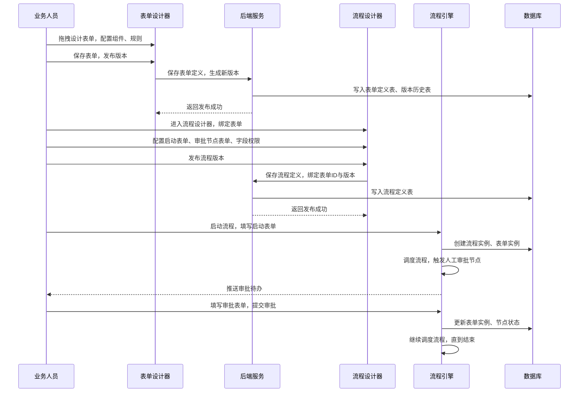
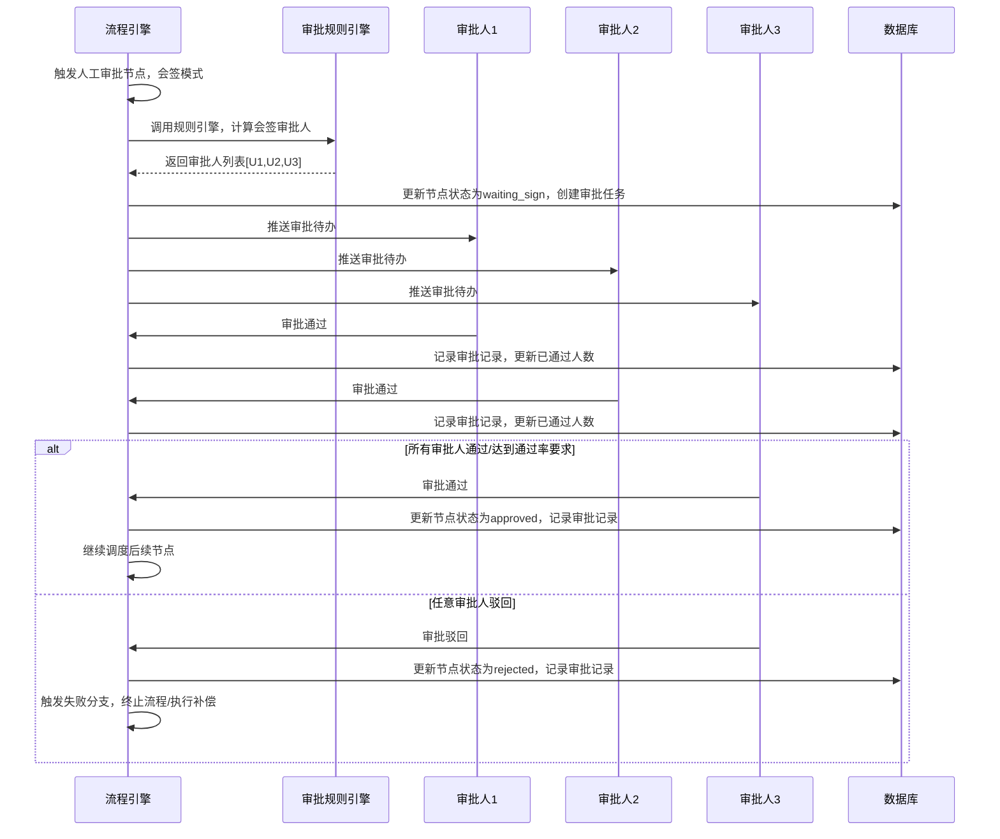
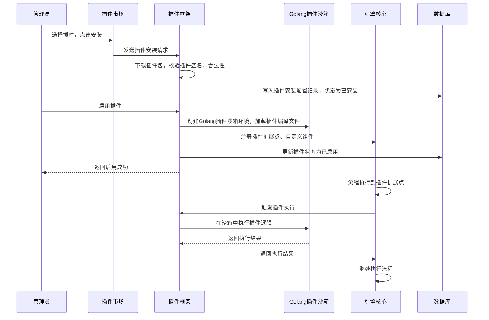
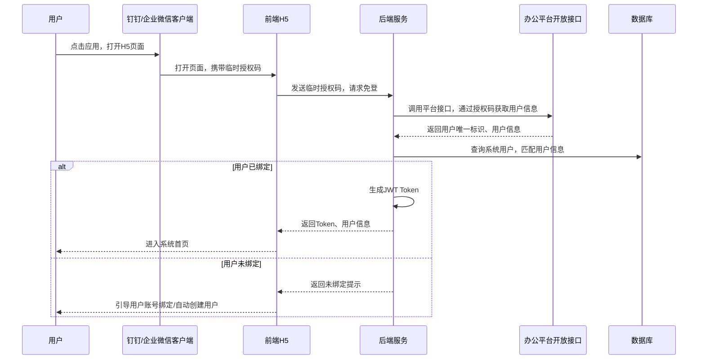

# D6阶段：v1.0.0正式GA版 企业级全能力闭环 详细设计文档
**文档编号**：D6-DESIGN-v1.0
**项目名称**：DistributedWorkflow 分布式工作流引擎
**对应版本**：v1.0.0 正式GA版
**开发周期**：4周
**前置依赖**：D5阶段v0.9.0正式版已完整交付，高可用架构、集成能力、可视化体系已全部落地
**文档状态**：正式发布
**编制日期**：2026-04-26
**适用范围**：D6阶段开发、测试、交付全流程，v1.0.0版本全生命周期运维支撑

---

## 一、文档概述
本文档是DistributedWorkflow项目D6阶段的详细设计说明书，也是项目从技术原型到**企业级商业化可交付产品**的最终闭环阶段。基于D1-D5阶段交付的完整引擎能力、高可用架构、可视化前端与集成体系，完成**可视化表单设计器、高级审批全能力、等保2.0三级合规体系、数据分析BI可视化体系、钉钉/企业微信办公生态适配、Golang插件化生态体系**六大核心能力落地，同时完成全量能力固化、生产级极限优化、全场景测试验证与长期运维支撑体系搭建。

D6阶段的核心目标是将引擎从「生产级可用的技术产品」升级为**符合国内企业级标准、可私有化部署、可稳定运维的正式GA产品**，100%向后兼容D1-D5所有存量API、流程定义与数据结构，保障存量业务零改造平滑升级，最终交付v1.0.0 LTS长期支持版本。

## 二、阶段范围与交付标准
### 2.1 D6阶段包含的核心内容
1. **可视化表单设计器与数据管理**：实现拖拽式表单设计、表单版本管理、流程-表单双向绑定、表单数据全生命周期管理、表单权限控制，补齐流程与业务数据的闭环
2. **高级审批全能力补齐**：实现会签/或签/加签/转签/委托/代理/超时 escalate/审批退回等企业级审批全场景能力，适配国内政企审批全流程需求
3. **等保2.0三级合规体系**：完成身份鉴别、访问控制、安全审计、数据加密/脱敏、备份恢复、应急响应全流程合规改造，满足国内政企等保三级认证要求
4. **数据分析与BI可视化体系**：实现流程效率分析、瓶颈分析、组织绩效分析、自定义报表、可视化运营大屏、数据导出与开放API，完成业务数据价值闭环
5. **钉钉/企业微信办公生态适配**：实现移动端H5、钉钉/企业微信原生适配，支持移动端审批、流程发起、消息通知，与国内主流办公生态无缝打通
6. **Golang插件化生态体系**：实现引擎核心能力插件化，提供Golang标准化插件开发SDK、插件市场、插件全生命周期管理，支持第三方自定义节点、连接器、审批组件、报表插件扩展
7. **生产级能力固化与极限优化**：完成全量bug修复、核心路径极限优化、边界场景全覆盖、内存泄漏治理，固化v1.0.0版本核心能力，制定LTS长期支持规则
8. **全量交付物与运维体系**：完成商业化交付全文档、自动化运维工具、升级/降级/迁移工具、全量测试报告、长期版本管理规则，实现产品化闭环

### 2.2 D6阶段不包含的内容
以下内容为v1.0.0版本之后的迭代规划，D6阶段仅预留扩展接口，不做开发：
1. 多租户数据隔离与租户管理体系
2. 国产化信创全栈适配
3. 飞书等其他办公平台适配
4. 多语言插件SDK（仅支持Golang）
5. 跨流程全局事务、SAGA分布式事务补偿
6. AI流程生成、智能流程优化、大模型集成
7. 流程自动化RPA集成
8. 国际化多语言适配
9. 区块链存证能力
10. 高并发实时流处理能力

### 2.3 量化交付标准
1. **表单设计器**：支持20+基础表单组件、自定义组件、表单校验、表单联动、版本管理，表单渲染加载时间<500ms，与流程引擎无缝集成
2. **高级审批**：覆盖10+企业级审批场景，审批逻辑准确率100%，支持10层嵌套审批，无逻辑死锁、状态异常问题
3. **合规标准**：100%满足等保2.0三级核心要求，日志留存≥6个月，敏感数据全加密，操作审计不可篡改，通过第三方安全渗透测试，无高危/中危漏洞
4. **数据分析**：预设20+核心业务指标、10+标准报表、3套运营大屏，数据刷新延迟<5s，支持百万级数据秒级查询
5. **办公生态适配**：完整适配钉钉/企业微信两大办公平台，移动端功能覆盖率≥90%，与PC端数据实时同步，延迟<1s
6. **插件体系**：提供标准化Golang插件开发SDK，支持插件热插拔，安装/卸载无服务重启，内置10+官方插件，第三方插件可无缝集成
7. **兼容性**：100%兼容D1-D5所有API、流程定义、数据结构，存量业务零改造升级，升级无数据迁移成本
8. **性能指标**：单集群支持10万+并发流程实例稳定运行，核心调度平均延迟<30ms，较D5阶段性能提升≥40%；支持10000+节点的超大型流程无卡顿执行
9. **代码质量**：全量代码单元测试覆盖率≥95%，核心路径覆盖率100%，全量回归测试用例100%通过，无阻塞性bug
10. **交付物标准**：完整前后端代码、Golang插件SDK、全量测试报告、等保合规材料、商业化交付全文档、私有化部署全套方案

## 三、核心设计约束
1. **向后兼容铁律**：所有新增能力均为增量扩展，**绝对禁止修改D1-D5已发布的核心接口、数据结构、数据库原有字段**，仅可新增可选字段与扩展接口，存量业务无需任何修改即可正常运行
2. **等保合规约束**：所有功能必须符合等保2.0三级要求，敏感数据必须加密存储与传输，所有操作必须留痕且不可篡改，权限控制遵循最小权限原则
3. **无侵入扩展约束**：高级审批、表单设计器、插件体系等新增能力，必须基于原有核心调度逻辑扩展，**禁止修改引擎核心调度、状态机、事务逻辑**，避免引入稳定性风险
4. **性能非劣化约束**：所有新增功能不得劣化原有核心性能，核心调度路径必须持续优化，单实例调度能力不得低于D5阶段水平
5. **插件化约束**：插件必须运行在独立沙箱中，禁止修改引擎核心代码，插件生命周期必须可控，支持热插拔，插件故障不得影响引擎核心运行，仅支持Golang语言开发
6. **运维友好约束**：所有新增能力必须可监控、可告警、可配置，提供配套的运维工具、升级脚本、回滚方案，无黑盒功能
7. **生态适配约束**：办公生态仅适配钉钉/企业微信两大平台，预留扩展接口，不开发其他平台的原生适配能力

## 四、整体架构设计
D6阶段在D5生产级高可用架构基础上，新增**安全合规层、表单引擎层、数据分析层、插件化框架、办公生态适配层**，形成完整的企业级商业化产品架构，整体架构如下：

```
┌─────────────────────────────────────────────────────────────────────────────────────┐
│  多端接入层（D6优化）                                                              │
│  PC端管理后台 | 移动端H5 | 钉钉/企业微信适配 | 开放API网关 | 第三方系统集成入口  │
└───────────────────────────────────────┬─────────────────────────────────────────────┘
                                        ↓
┌─────────────────────────────────────────────────────────────────────────────────────┐
│  安全合规层（D6新增）                                                              │
│  身份认证 | 权限控制 | 数据加密 | 敏感脱敏 | 操作审计 | 漏洞防护 | 多因子认证    │
└───────────────────────────────────────┬─────────────────────────────────────────────┘
                                        ↓
┌─────────────────────────────────────────────────────────────────────────────────────┐
│  业务应用层（D4-D5已有，D6扩展）                                                  │
│  流程设计器 | 表单设计器 | 审批工作台 | 流程管理 | 实例监控 | 集成中心 | 报表大屏 │
└───────────────────────────────────────┬─────────────────────────────────────────────┘
                                        ↓
┌─────────────────────────────────────────────────────────────────────────────────────┐
│  引擎核心层（D1-D5已有，D6固化）                                                  │
│  高可用集群调度 | 流程生命周期管理 | 版本管理 | 节点执行 | 事件总线 | 连接器中心  │
└───────────────────────────────────────┬─────────────────────────────────────────────┘
                                        ↓
┌─────────────────────────────────────────────────────────────────────────────────────┐
│  插件化框架（D6新增，仅支持Golang）                                                │
│  插件生命周期管理 | 沙箱运行环境 | Golang插件SDK | 插件市场 | 扩展点管理          │
└───────────────────────────────────────┬─────────────────────────────────────────────┘
                                        ↓
┌─────────────────────────────────────────────────────────────────────────────────────┐
│  公共组件层（D1-D5已有，D6扩展）                                                  │
│  分布式锁 | 任务队列 | 审计日志 | 表单引擎 | 指标埋点 | 链路追踪 | 告警中心      │
└───────────────────────────────────────┬─────────────────────────────────────────────┘
                                        ↓
┌─────────────────────────────────────────────────────────────────────────────────────┐
│  存储层（D1-D5已有，D6扩展）                                                      │
│  SQL Server | Redis集群 | Nacos集群 | 对象存储 | 冷热数据分离 | 归档/备份/恢复    │
└───────────────────────────────────────┬─────────────────────────────────────────────┘
                                        ↓
┌─────────────────────────────────────────────────────────────────────────────────────┐
│  可观测性与运维体系（D5已有，D6增强）                                              │
│  Prometheus指标 | Grafana大盘 | OTel链路追踪 | 智能告警 | 根因分析 | 自动化运维  │
└─────────────────────────────────────────────────────────────────────────────────────┘
```

### 4.2 生产级高可用集群架构
D6阶段延续D5阶段的3节点Engine主从高可用架构，无单点故障，整体部署架构如下：
```
┌─────────────────────────────────────────────────────────────────┐
│                          负载均衡层                              │
│                                 Nginx                            │
└──────────────────────────────────┬──────────────────────────────┘
                                   │
┌─────────────────────────────────────────────────────────────────┐
│                Engine集群（3节点）                                │
│  ┌─────────────┐  ┌─────────────┐  ┌─────────────┐            │
│  │ Engine主节点 │  │ Engine从节点 │  │ Engine从节点 │            │
│  │ 全局调度     │  │ API服务      │  │ API服务      │            │
│  │ 分片协调     │  │ 任务执行      │  │ 任务执行      │            │
│  │ 主从选举     │  │ 备主候选      │  │ 备主候选      │            │
│  └─────────────┘  └─────────────┘  └─────────────┘            │
└──────────────────────────────────┬──────────────────────────────┘
                                   │
┌─────────────────────────────────────────────────────────────────┐
│                          中间件高可用集群                        │
│  ┌─────────────────┐  ┌─────────────────┐  ┌─────────────────┐ │
│  │  Nacos集群      │  │  Redis集群       │  │  SQL Server集群 │ │
│  │  3节点高可用    │  │  3主3从集群     │  │  主从高可用     │ │
│  └─────────────────┘  └─────────────────┘  └─────────────────┘ │
└──────────────────────────────────┬──────────────────────────────┘
                                   │
┌─────────────────────────────────────────────────────────────────┐
│                      NodeWorker执行集群（可水平扩展）            │
│  无状态Worker节点，按业务线独立部署，支持自动扩缩容              │
└─────────────────────────────────────────────────────────────────┘
```

## 五、核心模块详细设计
### 5.1 可视化表单设计器与表单引擎
表单设计器是流程与业务数据的核心桥梁，实现拖拽式表单设计、与流程节点无缝绑定，补齐业务数据闭环。

#### 5.1.1 表单设计器核心能力
1. **拖拽式可视化设计**：基于Vue3+Element Plus实现，支持画布拖拽、组件缩放、撤销/重做、网格对齐、快捷键操作
2. **丰富的表单组件库**：
   | 组件分类 | 内置组件 |
   |----------|----------|
   | 基础组件 | 单行输入、多行输入、数字输入、单选框、复选框、下拉选择、日期选择、时间选择、日期范围、开关、评分、滑块 |
   | 高级组件 | 图片上传、附件上传、子表单、表格、富文本、签名、地址选择、人员选择、部门选择、关联数据 |
   | 布局组件 | 栅格布局、选项卡、分栏、折叠面板、分割线 |
3. **表单规则配置**：支持必填校验、正则校验、自定义校验、字段显隐规则、字段联动规则、选项级联、数据回填
4. **表单版本管理**：表单修改自动生成新版本，支持版本历史查询、版本回滚、版本对比，流程实例绑定表单版本，保障历史数据一致性
5. **表单权限控制**：支持字段级权限配置，不同节点、不同角色可配置字段的「可编辑/只读/隐藏」权限
6. **表单模板市场**：内置常用业务表单模板，支持一键复用、自定义模板保存

#### 5.1.2 表单引擎核心设计
```go
// FormDefinition 表单定义
type FormDefinition struct {
    FormID          string                 `json:"formId" gorm:"primaryKey"`
    FormName        string                 `json:"formName"`
    Description     string                 `json:"description"`
    FormSchema      map[string]interface{} `json:"formSchema"` // 表单设计器JSON Schema
    Version         int                    `json:"version"` // 版本号，从1开始自增
    Status          int                    `json:"status"` // 0=草稿 1=已发布 2=已停用
    CreatedBy       string                 `json:"createdBy"`
    CreatedAt       time.Time              `json:"createdAt"`
    UpdatedAt       time.Time              `json:"updatedAt"`
    Deleted         bool                   `json:"deleted" gorm:"index"`
}

// FormInstance 表单实例
type FormInstance struct {
    InstanceID          string                 `json:"instanceId" gorm:"primaryKey"`
    FormID              string                 `json:"formId"`
    FormVersion         int                    `json:"formVersion"` // 绑定的表单版本
    WorkflowInstanceID  string                 `json:"workflowInstanceId"` // 关联的流程实例ID
    NodeID              string                 `json:"nodeId"` // 关联的流程节点ID
    FormData            map[string]interface{} `json:"formData"` // 表单提交数据
    Status              int                    `json:"status"` // 0=草稿 1=已提交 2=已修改
    CreatedBy           string                 `json:"createdBy"`
    CreatedAt           time.Time              `json:"createdAt"`
    UpdatedAt           time.Time              `json:"updatedAt"`
}
```

#### 5.1.3 流程与表单绑定逻辑
1. **流程启动绑定**：流程定义可绑定启动表单，流程启动时需填写表单数据，表单数据自动写入流程上下文
2. **人工节点绑定**：人工审批节点可绑定审批表单，审批时需填写表单数据，表单数据自动写入节点输出与流程上下文
3. **表单权限联动**：流程节点可配置表单字段的权限，不同审批节点可编辑/只读/隐藏不同的表单字段
4. **表单数据联动**：支持流程上下文数据回填到表单，表单数据自动同步到流程上下文，实现表单与流程的双向数据联动
5. **表单数据追溯**：流程实例的所有表单提交记录完整留存，支持审批历史、表单数据变更历史全链路追溯

### 5.2 高级审批全能力体系
基于D3阶段的基础审批能力，补齐国内政企场景必备的高级审批全能力，完全适配国内审批业务习惯。

#### 5.2.1 核心审批能力扩展
| 审批能力 | 核心实现逻辑 | 适用场景 |
|----------|--------------|----------|
| 会签审批 | 多人并行审批，需所有审批人全部通过才可通过，支持通过率配置（如超过半数通过即可） | 部门集体决策、项目评审 |
| 或签审批 | 多人并行审批，任意一人通过即可通过，无需等待其他审批人 | 部门负责人审批、多角色并行审批 |
| 顺序审批 | 多人按指定顺序依次审批，前一个审批人通过后，下一个审批人才可收到审批任务 | 逐级审批、领导层级审批 |
| 前加签 | 审批人在审批前，新增前置审批人，前置审批人通过后，才可继续审批 | 需向上级请示、补充审批环节 |
| 后加签 | 审批人在审批通过后，新增后置审批人，后置审批人全部通过后，节点才算通过 | 需向下级确认、补充审批环节 |
| 转签 | 审批人将审批任务转交给其他人处理，审批责任转移给接收人 | 审批人出差、无审批权限 |
| 审批委托 | 用户设置委托代理人，在委托时间内，所有审批任务自动转发给代理人处理 | 用户出差、休假，委托他人代审批 |
| 审批退回 | 审批人可将流程退回到指定的历史节点，重新执行审批流程 | 审批材料有误，退回发起人修改 |
| 超时自动处理 | 支持超时自动通过、自动驳回、自动转上级、自动 escalate 升级审批 | 审批超时无人处理，自动流转 |
| 审批撤回 | 发起人可撤回已提交的审批流程，重新修改后再次提交 | 提交后发现材料有误，撤回修改 |
| 抄送 | 审批流程可抄送给指定人员，抄送人可查看流程详情，无需审批 | 流程知会、信息同步 |

#### 5.2.2 审批规则引擎
**核心职责**：实现审批人的动态计算、审批流程的动态分支、审批规则的可视化配置。
**核心能力**：
1. **动态审批人计算**：支持按发起人部门、角色、岗位、直属上级、部门负责人、流程上下文变量动态计算审批人
2. **条件分支路由**：支持按表单数据、发起人信息、流程上下文动态配置审批分支、审批人数、审批模式
3. **审批规则可视化**：审批规则支持可视化配置，无需代码，业务人员可自行配置审批流程
4. **审批规则校验**：实时校验审批规则的合法性，避免循环依赖、审批人缺失等异常
5. **审批规则版本管理**：审批规则随流程版本一起管理，运行中的流程实例绑定启动时的规则版本，不受后续规则变更影响

#### 5.2.3 审批状态机扩展
```go
// 扩展审批状态枚举
type ApprovalStatus string

const (
    ApprovalStatusPending       ApprovalStatus = "pending"       // 待审批
    ApprovalStatusApproved      ApprovalStatus = "approved"      // 已通过
    ApprovalStatusRejected      ApprovalStatus = "rejected"      // 已驳回
    ApprovalStatusCancelled     ApprovalStatus = "cancelled"     // 已取消
    ApprovalStatusWaitingSign   ApprovalStatus = "waiting_sign"  // 待会签
    ApprovalStatusWaitingSeq    ApprovalStatus = "waiting_seq"   // 待顺序审批
    ApprovalStatusAddSign       ApprovalStatus = "add_sign"      // 加签中
    ApprovalStatusTransfered    ApprovalStatus = "transfered"    // 已转签
    ApprovalStatusReturned      ApprovalStatus = "returned"      // 已退回
    ApprovalStatusWithdrawn     ApprovalStatus = "withdrawn"     // 已撤回
    ApprovalStatusCC            ApprovalStatus = "cc"            // 已抄送
)
```

### 5.3 等保2.0三级合规体系
D6阶段完成等保2.0三级核心要求的全量适配，满足国内政企客户的合规认证需求。

#### 5.3.1 核心合规能力实现
1. **身份鉴别**：
   - 支持用户名/密码、短信验证码、钉钉/企业微信SSO、UKey、数字证书等多种身份认证方式
   - 强制密码复杂度策略、定期密码更换、密码历史记录防重复
   - 双因子认证（2FA），关键操作必须二次验证
   - 登录失败锁定、异常登录地点告警、会话超时自动退出
2. **访问控制**：
   - 基于RBAC的最小权限原则，权限粒度到按钮级、字段级
   - 操作权限与数据权限分离，支持数据范围控制
   - 关键操作权限分离，如管理员不能同时拥有审批与审计权限
   - 访问控制列表（ACL），支持细粒度的资源访问控制
3. **安全审计**：
   - 全操作审计日志，覆盖用户登录、流程操作、审批操作、配置修改、数据访问全场景
   - 审计日志不可篡改、不可删除，留存时间≥6个月
   - 审计日志支持多条件查询、统计、导出，满足合规审计要求
   - 敏感操作审计必须记录操作人、操作时间、操作IP、操作前后数据快照
4. **数据完整性与保密性**：
   - 敏感数据（密码、身份证、手机号、银行卡）采用AES-256加密存储
   - 数据传输全程HTTPS加密，支持国密SM2/SM3/SM4算法
   - 敏感数据展示脱敏，如手机号138****1234，身份证5101********1234
   - 数据备份采用加密存储，备份数据完整性校验
   - 数据销毁机制，注销用户数据彻底清除，不可恢复
5. **备份恢复**：
   - 支持全量备份、增量备份、定时备份，备份策略可视化配置
   - 备份数据异地存储，支持跨区域灾备
   - 定期备份恢复演练，验证备份数据的可恢复性
   - 故障恢复RTO<4小时，RPO<1小时，满足等保三级要求
6. **应急响应**：
   - 预设安全事件应急响应预案，包括漏洞攻击、数据泄露、服务中断等场景
   - 安全事件实时告警、自动阻断、溯源分析
   - 定期安全漏洞扫描、渗透测试，及时修复安全漏洞
   - 系统安全升级、补丁更新机制，保障系统安全

#### 5.3.2 安全防护能力
1. **Web应用防护**：防SQL注入、防XSS跨站脚本、防CSRF跨站请求伪造、防文件上传漏洞、防目录遍历
2. **接口安全防护**：API请求限流、熔断、防重放攻击、签名校验、IP白名单
3. **容器安全防护**：容器镜像安全扫描、容器运行时防护、容器权限最小化
4. **数据库安全防护**：数据库审计、SQL注入防护、敏感数据加密、访问控制
5. **代码安全**：全量代码安全扫描，修复高危/中危漏洞，无硬编码密钥、无后门代码

### 5.4 数据分析与BI可视化体系
实现流程业务数据的全量分析、可视化展示，帮助企业优化流程效率、提升管理水平。

#### 5.4.1 核心指标体系
| 指标分类 | 核心指标 | 指标说明 |
|----------|----------|----------|
| 流程规模指标 | 流程定义总数、流程实例总数、月新增实例数、活跃流程数 | 流程业务规模统计 |
| 执行效率指标 | 流程平均执行时长、流程平均审批时长、节点平均执行时长、流程通过率 | 流程执行效率分析 |
| 瓶颈分析指标 | 超时流程数、超时节点分布、平均等待时长、审批驳回率、退回率 | 流程瓶颈定位 |
| 组织绩效指标 | 部门审批平均时长、个人审批平均时长、审批及时率、驳回率排名 | 组织/个人绩效分析 |
| 异常指标 | 流程失败率、节点失败率、异常流程分布、故障恢复时长 | 系统稳定性分析 |
| 资源指标 | 引擎资源使用率、Worker负载、数据库性能、API调用量 | 系统资源分析 |

#### 5.4.2 报表与可视化大屏
1. **标准报表模板**：
   - 流程运营总览报表：流程规模、执行效率、异常情况全局统计
   - 流程效率分析报表：单流程的执行时长、通过率、瓶颈节点、优化建议
   - 组织审批绩效报表：部门/个人的审批及时率、平均时长、驳回率排名
   - 异常分析报表：失败流程、超时流程、驳回流程的分布与根因分析
2. **可视化大屏模板**：
   - 运营总览大屏：全局流程执行情况、实时实例数、关键指标展示
   - 流程监控大屏：实时流程执行状态、异常告警、系统资源监控
   - 绩效分析大屏：组织/个人审批绩效排名、效率趋势、及时率统计
   - 运维监控大屏：系统健康状态、集群节点状态、性能指标、告警信息
3. **自定义报表**：支持用户自定义报表维度、指标、图表类型，支持报表保存、导出、定时推送
4. **数据导出**：支持报表数据导出为Excel/PDF格式，支持定时自动发送到指定邮箱

#### 5.4.3 数据仓库设计
采用「实时明细+离线汇总」的架构，实现百万级数据秒级查询：
1. **明细数据层**：存储流程实例、节点执行、审批操作的全量明细数据，支持实时查询
2. **汇总数据层**：按小时/天/月维度预计算汇总指标，提升查询性能
3. **维度数据层**：用户、部门、流程定义等维度数据，支持多维度分析
4. **数据同步**：基于数据同步工具，实时将业务数据同步到分析库，避免影响业务库性能

### 5.5 钉钉/企业微信办公生态适配
实现移动端与PC端的全功能协同，无缝对接国内两大主流办公平台，满足企业移动办公需求。

#### 5.5.1 移动端核心能力
1. **移动端H5**：响应式设计，适配手机/平板等移动设备，核心功能包括：
   - 待办/已办审批任务处理，支持通过/驳回、填写审批意见、查看审批详情
   - 流程发起，支持表单填写、附件上传
   - 流程进度查看、审批历史追溯
   - 消息通知、待办提醒
   - 流程监控、实例管理
2. **钉钉/企业微信原生适配**：完整适配两大平台的原生能力，实现：
   - 免登认证，与平台用户体系无缝打通
   - 待办消息推送，与平台待办中心同步
   - 审批通知、流程状态变更实时推送
   - 平台通讯录、组织架构同步，支持选人、选部门
   - 附件上传、图片上传、签名等原生能力调用
3. **消息通知体系**：支持短信、邮件、钉钉/企业微信工作通知、站内信等多种通知渠道，支持通知模板自定义、通知触发条件配置

#### 5.5.2 多端协同核心逻辑
1. **数据实时同步**：PC端与移动端数据实时同步，审批操作、流程状态变更实时更新，延迟<1s
2. **操作无缝衔接**：PC端发起的流程，移动端可审批；移动端发起的流程，PC端可管理，全功能无差异
3. **多端状态同步**：待办任务已读/未读状态、审批操作、消息通知多端实时同步
4. **离线能力**：移动端支持离线缓存，弱网环境下可查看已加载的审批详情，网络恢复后自动同步操作

### 5.6 Golang插件化生态体系
实现引擎核心能力的插件化扩展，支持第三方开发者基于Golang SDK开发自定义插件，丰富产品生态。

#### 5.6.1 插件化框架核心设计
1. **插件生命周期管理**：实现插件的安装、启用、停用、卸载、升级全生命周期管理，支持热插拔，无需重启引擎服务
2. **沙箱运行环境**：插件运行在独立的沙箱中，隔离引擎核心资源，插件故障不会影响引擎核心运行
3. **扩展点管理**：引擎预设标准化扩展点，插件可基于扩展点实现能力扩展，预设扩展点包括：
   - 自定义节点扩展：新增自定义流程节点类型
   - 连接器扩展：新增第三方系统连接器
   - 审批组件扩展：新增自定义审批规则、审批模式
   - 通知渠道扩展：新增自定义消息通知渠道
   - 报表组件扩展：新增自定义报表、图表组件
   - 事件钩子扩展：监听引擎核心事件，实现自定义业务逻辑
4. **插件市场**：内置官方插件市场，支持插件在线安装、升级、评分、评论，支持第三方插件上传审核
5. **权限控制**：插件权限严格管控，仅可访问授权的资源与API，禁止越权操作

#### 5.6.2 Golang插件开发SDK
提供标准化Golang插件开发SDK，降低第三方开发门槛：
1. **SDK核心能力**：插件脚手架、API封装、调试工具、打包工具、测试框架
2. **支持语言**：仅支持Golang语言开发
3. **开发文档**：完整的开发指南、API文档、示例代码、最佳实践
4. **官方示例插件**：提供10+官方示例插件，包括自定义节点、连接器、通知渠道等，作为开发模板

#### 5.6.3 官方内置插件
D6阶段内置10+官方插件，开箱即用：
1. 钉钉/企业微信集成插件
2. 短信/邮件通知插件
3. 电子签名插件
4. 条码/二维码生成插件
5. OCR文字识别插件
6. 财务系统集成插件
7. CRM系统集成插件
8. 自定义报表插件
9. 数据同步插件
10. SQL高级连接器插件

## 六、数据库详细设计（SQL Server）
D6阶段新增表单、高级审批、插件、数据分析相关表，原有表结构完全兼容D1-D5版本，仅新增索引优化查询性能。

### 6.1 新增核心表
#### 6.1.1 表单设计器相关表
```sql
-- 表单定义表
CREATE TABLE form_definition (
    form_id VARCHAR(64) NOT NULL PRIMARY KEY,
    form_name NVARCHAR(255) NOT NULL,
    description NVARCHAR(MAX),
    form_schema NVARCHAR(MAX) NOT NULL,
    version INT NOT NULL DEFAULT 1,
    status INT NOT NULL DEFAULT 0,
    created_by VARCHAR(64) NOT NULL,
    created_at DATETIME2 NOT NULL DEFAULT GETDATE(),
    updated_at DATETIME2 NOT NULL DEFAULT GETDATE(),
    deleted BIT NOT NULL DEFAULT 0
);
CREATE INDEX idx_form_def_status ON form_definition(status, deleted);

-- 表单实例表
CREATE TABLE form_instance (
    instance_id VARCHAR(64) NOT NULL PRIMARY KEY,
    form_id VARCHAR(64) NOT NULL,
    form_version INT NOT NULL,
    workflow_instance_id VARCHAR(64) NOT NULL,
    node_id VARCHAR(64),
    form_data NVARCHAR(MAX) NOT NULL,
    status INT NOT NULL DEFAULT 0,
    created_by VARCHAR(64) NOT NULL,
    created_at DATETIME2 NOT NULL DEFAULT GETDATE(),
    updated_at DATETIME2 NOT NULL DEFAULT GETDATE()
);
CREATE INDEX idx_form_instance_workflow ON form_instance(workflow_instance_id);

-- 表单版本历史表
CREATE TABLE form_version_history (
    id BIGINT IDENTITY(1,1) PRIMARY KEY,
    form_id VARCHAR(64) NOT NULL,
    version INT NOT NULL,
    form_schema NVARCHAR(MAX) NOT NULL,
    change_log NVARCHAR(MAX),
    created_by VARCHAR(64) NOT NULL,
    created_at DATETIME2 NOT NULL DEFAULT GETDATE(),
    UNIQUE(form_id, version)
);
```

#### 6.1.2 高级审批相关表
```sql
-- 审批委托表
CREATE TABLE approval_delegate (
    id BIGINT IDENTITY(1,1) PRIMARY KEY,
    delegator_id VARCHAR(64) NOT NULL,
    agent_id VARCHAR(64) NOT NULL,
    start_time DATETIME2 NOT NULL,
    end_time DATETIME2 NOT NULL,
    status INT NOT NULL DEFAULT 1,
    created_by VARCHAR(64) NOT NULL,
    created_at DATETIME2 NOT NULL DEFAULT GETDATE(),
    updated_at DATETIME2 NOT NULL DEFAULT GETDATE()
);
CREATE INDEX idx_approval_delegate_delegator ON approval_delegate(delegator_id, status);

-- 审批抄送表
CREATE TABLE approval_cc (
    id BIGINT IDENTITY(1,1) PRIMARY KEY,
    workflow_instance_id VARCHAR(64) NOT NULL,
    node_id VARCHAR(64) NOT NULL,
    cc_user_id VARCHAR(64) NOT NULL,
    cc_time DATETIME2 NOT NULL DEFAULT GETDATE(),
    is_read BIT NOT NULL DEFAULT 0,
    read_time DATETIME2
);
CREATE INDEX idx_approval_cc_user ON approval_cc(cc_user_id, is_read);

-- 审批加签记录表
CREATE TABLE approval_add_sign (
    id BIGINT IDENTITY(1,1) PRIMARY KEY,
    workflow_instance_id VARCHAR(64) NOT NULL,
    node_id VARCHAR(64) NOT NULL,
    operator_id VARCHAR(64) NOT NULL,
    sign_type VARCHAR(32) NOT NULL, -- before/after
    sign_users NVARCHAR(MAX) NOT NULL,
    created_at DATETIME2 NOT NULL DEFAULT GETDATE()
);
CREATE INDEX idx_add_sign_instance ON approval_add_sign(workflow_instance_id, node_id);
```

#### 6.1.3 插件相关表
```sql
-- 插件信息表
CREATE TABLE plugin_info (
    plugin_id VARCHAR(64) NOT NULL PRIMARY KEY,
    plugin_name VARCHAR(128) NOT NULL UNIQUE,
    description NVARCHAR(MAX),
    author VARCHAR(64) NOT NULL,
    version VARCHAR(32) NOT NULL,
    plugin_type VARCHAR(64) NOT NULL,
    plugin_package NVARCHAR(MAX) NOT NULL,
    config_schema NVARCHAR(MAX),
    status INT NOT NULL DEFAULT 0, -- 0=未安装 1=已安装 2=已启用 3=已停用
    is_official BIT NOT NULL DEFAULT 0,
    download_count INT NOT NULL DEFAULT 0,
    rating DECIMAL(2,1) NOT NULL DEFAULT 0,
    created_at DATETIME2 NOT NULL DEFAULT GETDATE(),
    updated_at DATETIME2 NOT NULL DEFAULT GETDATE()
);

-- 插件安装配置表
CREATE TABLE plugin_config (
    id BIGINT IDENTITY(1,1) PRIMARY KEY,
    plugin_id VARCHAR(64) NOT NULL UNIQUE,
    plugin_version VARCHAR(32) NOT NULL,
    config NVARCHAR(MAX),
    status INT NOT NULL DEFAULT 1, -- 1=已启用 2=已停用
    installed_at DATETIME2 NOT NULL DEFAULT GETDATE(),
    updated_at DATETIME2 NOT NULL DEFAULT GETDATE()
);
```

#### 6.1.4 数据分析相关表
```sql
-- 流程指标日汇总表
CREATE TABLE stats_workflow_daily (
    id BIGINT IDENTITY(1,1) PRIMARY KEY,
    workflow_id VARCHAR(64) NOT NULL,
    stat_date DATE NOT NULL,
    start_count INT NOT NULL DEFAULT 0,
    complete_count INT NOT NULL DEFAULT 0,
    fail_count INT NOT NULL DEFAULT 0,
    avg_execution_time_ms BIGINT NOT NULL DEFAULT 0,
    max_execution_time_ms BIGINT NOT NULL DEFAULT 0,
    timeout_count INT NOT NULL DEFAULT 0,
    reject_count INT NOT NULL DEFAULT 0,
    UNIQUE(workflow_id, stat_date)
);
CREATE INDEX idx_stats_workflow_date ON stats_workflow_daily(stat_date);

-- 审批指标日汇总表
CREATE TABLE stats_approval_daily (
    id BIGINT IDENTITY(1,1) PRIMARY KEY,
    user_id VARCHAR(64) NOT NULL,
    stat_date DATE NOT NULL,
    approve_count INT NOT NULL DEFAULT 0,
    reject_count INT NOT NULL DEFAULT 0,
    avg_approval_time_ms BIGINT NOT NULL DEFAULT 0,
    timeout_count INT NOT NULL DEFAULT 0,
    UNIQUE(user_id, stat_date)
);
CREATE INDEX idx_stats_approval_date ON stats_approval_daily(stat_date);
```

### 6.2 原有表索引优化
```sql
-- 优化流程实例查询性能
CREATE INDEX idx_workflow_instances_workflow_id_status ON workflow_instances(workflow_id, status, create_time DESC);
-- 优化节点状态查询性能
CREATE INDEX idx_workflow_node_states_instance_id_status ON workflow_node_states(instance_id, status);
-- 优化审计日志查询性能
CREATE INDEX idx_audit_workflow_id_operation_type ON workflow_instance_logs(workflow_id, operation_type, operate_time DESC);
-- 优化审批任务查询性能
CREATE INDEX idx_approval_instance_node_status ON workflow_approval_records(instance_id, node_id, operate_time DESC);
```

## 七、后端API扩展设计
D6阶段新增API均为增量扩展，完全兼容原有API，所有API均符合OpenAPI 3.0规范。

### 7.1 表单设计器API
| 接口地址 | 请求方式 | 接口说明 | 权限要求 |
|----------|----------|----------|----------|
| `/api/v1/form/list` | GET | 分页查询表单列表 | 表单设计权限 |
| `/api/v1/form/create` | POST | 创建表单 | 表单设计权限 |
| `/api/v1/form/{formId}` | GET | 获取表单详情 | 登录用户 |
| `/api/v1/form/{formId}/update` | PUT | 更新表单 | 表单设计权限 |
| `/api/v1/form/{formId}/publish` | POST | 发布表单版本 | 表单设计权限 |
| `/api/v1/form/{formId}/versions` | GET | 查询表单版本历史 | 表单设计权限 |
| `/api/v1/form/{formId}/rollback` | POST | 回滚表单版本 | 表单设计权限 |
| `/api/v1/form/instance/{instanceId}` | GET | 获取表单实例详情 | 表单查看权限 |
| `/api/v1/form/instance/save` | POST | 保存表单实例数据 | 表单填写权限 |
| `/api/v1/form/template/list` | GET | 查询表单模板列表 | 登录用户 |

### 7.2 高级审批API
| 接口地址 | 请求方式 | 接口说明 | 权限要求 |
|----------|----------|----------|----------|
| `/api/v1/approval/{instanceId}/{nodeId}/add-sign` | POST | 加签审批 | 审批权限 |
| `/api/v1/approval/{instanceId}/{nodeId}/transfer` | POST | 转签审批 | 审批权限 |
| `/api/v1/approval/{instanceId}/return` | POST | 审批退回 | 审批权限 |
| `/api/v1/approval/{instanceId}/withdraw` | POST | 撤回审批 | 流程发起人 |
| `/api/v1/approval/delegate/set` | POST | 设置审批委托 | 登录用户 |
| `/api/v1/approval/delegate/list` | GET | 查询审批委托列表 | 登录用户 |
| `/api/v1/approval/cc/list` | GET | 查询抄送我的审批列表 | 登录用户 |
| `/api/v1/approval/cc/{id}/read` | POST | 标记抄送已读 | 登录用户 |

### 7.3 数据分析API
| 接口地址 | 请求方式 | 接口说明 | 权限要求 |
|----------|----------|----------|----------|
| `/api/v1/stats/workflow/overview` | GET | 获取流程运营总览数据 | 管理员权限 |
| `/api/v1/stats/workflow/efficiency` | GET | 获取流程效率分析数据 | 管理员权限 |
| `/api/v1/stats/approval/performance` | GET | 获取审批绩效分析数据 | 管理员权限 |
| `/api/v1/stats/instance/trend` | GET | 获取流程实例趋势数据 | 管理员权限 |
| `/api/v1/stats/custom/query` | POST | 自定义报表查询 | 报表权限 |
| `/api/v1/stats/report/export` | POST | 导出报表数据 | 报表权限 |
| `/api/v1/stats/dashboard/{dashboardId}` | GET | 获取大屏数据 | 管理员权限 |

### 7.4 插件管理API
| 接口地址 | 请求方式 | 接口说明 | 权限要求 |
|----------|----------|----------|----------|
| `/api/v1/plugin/market/list` | GET | 查询插件市场列表 | 登录用户 |
| `/api/v1/plugin/market/{pluginId}` | GET | 获取插件详情 | 登录用户 |
| `/api/v1/plugin/install` | POST | 安装插件 | 管理员权限 |
| `/api/v1/plugin/list` | GET | 查询已安装插件列表 | 管理员权限 |
| `/api/v1/plugin/{pluginId}/enable` | POST | 启用插件 | 管理员权限 |
| `/api/v1/plugin/{pluginId}/disable` | POST | 停用插件 | 管理员权限 |
| `/api/v1/plugin/{pluginId}/uninstall` | POST | 卸载插件 | 管理员权限 |
| `/api/v1/plugin/{pluginId}/config` | PUT | 更新插件配置 | 管理员权限 |

### 7.5 办公生态适配API
| 接口地址 | 请求方式 | 接口说明 | 权限要求 |
|----------|----------|----------|----------|
| `/api/v1/oauth/dingtalk/login` | GET | 钉钉免登入口 | 无 |
| `/api/v1/oauth/dingtalk/callback` | GET | 钉钉登录回调 | 无 |
| `/api/v1/oauth/wechatwork/login` | GET | 企业微信免登入口 | 无 |
| `/api/v1/oauth/wechatwork/callback` | GET | 企业微信登录回调 | 无 |
| `/api/v1/contact/department/list` | GET | 获取部门列表 | 登录用户 |
| `/api/v1/contact/user/list` | GET | 获取部门用户列表 | 登录用户 |

## 八、核心流程详细设计
### 8.1 表单设计-流程绑定-执行全流程


### 8.2 高级审批会签流程


### 8.3 插件安装执行全流程


### 8.4 钉钉/企业微信免登流程


## 九、部署方案升级
D6阶段提供企业级私有化部署方案，满足不同规模客户的部署需求。

### 9.1 部署模式
| 部署模式 | 适用场景 | 核心特点 |
|----------|----------|----------|
| 单机Docker部署 | 小型企业、测试环境 | 一键部署、低资源占用、开箱即用 |
| 集群高可用部署 | 中大型企业生产环境 | 3节点Engine集群、中间件高可用、无单点故障 |
| 混合云部署 | 大型企业跨区域部署 | 核心节点私有部署、边缘节点公有云部署、统一管控 |
| K8s容器化部署 | 有容器化运维能力的企业 | 自动化运维、弹性扩缩容、故障自愈 |

### 9.2 K8s Operator部署方案
D6阶段完善K8s Operator，支持引擎全生命周期自动化运维：
1. **自定义CRD资源**：
   - `WorkflowCluster`：引擎集群管理
   - `WorkflowBackup`：备份策略管理
   - `WorkflowPlugin`：插件管理
2. **自动化运维能力**：
   - 集群自动扩缩容、故障自愈
   - 自动备份、灾备切换
   - 版本自动升级、灰度发布
3. **可观测性集成**：自动集成Prometheus、Grafana、Loki，自动创建监控大盘、告警规则

### 9.3 等保合规部署方案
提供等保2.0三级合规部署方案，核心特点：
1. **网络隔离**：划分安全区域，Web区、应用区、数据库区严格隔离，防火墙访问控制
2. **冗余部署**：所有组件双活/集群部署，无单点故障，满足业务连续性要求
3. **安全防护**：部署WAF、IDS/IPS、数据库审计、堡垒机等安全设备
4. **备份灾备**：本地备份+异地灾备，定期备份恢复演练
5. **日志审计**：全操作日志留存≥6个月，日志不可篡改，对接安全审计平台

### 9.4 一键部署方案
提供私有化环境一键部署方案，核心内容：
1. **docker-compose一键部署**：提供单机/集群docker-compose配置，一键启动所有服务
2. **部署脚本**：提供Linux环境一键部署脚本，自动安装依赖、初始化环境、启动服务
3. **运维工具**：提供备份、恢复、升级、回滚、日志查看等自动化运维脚本
4. **适配文档**：详细的部署指南、运维手册、问题排查手册

## 十、D6阶段里程碑拆解（4周）
| 周数 | 里程碑版本 | 核心目标 | 核心交付物 |
|------|------------|----------|------------|
| 第1周 | v1.0.0-alpha | 表单设计器与高级审批落地 | 1. 可视化表单设计器与表单引擎开发完成<br>2. 高级审批全能力开发完成<br>3. 审批规则引擎落地<br>4. 相关API开发完成<br>5. 核心代码单元测试覆盖率≥95% |
| 第2周 | v1.0.0-beta | 插件体系、办公生态适配、合规体系 | 1. Golang插件化框架与SDK开发完成<br>2. 钉钉/企业微信办公生态适配完成<br>3. 等保合规核心能力全量落地<br>4. 官方内置插件开发完成<br>5. 前后端联调核心功能 |
| 第3周 | v1.0.0-rc | 数据分析、全量联调、性能优化 | 1. 数据分析与BI可视化体系开发完成<br>2. 预设报表、运营大屏开发完成<br>3. 全场景前后端联调完成，功能闭环<br>4. 核心路径极限优化、内存泄漏治理<br>5. 全量安全漏洞扫描与修复 |
| 第4周 | v1.0.0 正式GA版 | 全量测试、文档、交付 | 1. 全量回归测试、安全渗透测试完成<br>2. 极限性能压测完成，输出性能基线报告<br>3. 等保合规材料、适配报告完成<br>4. 全量部署方案、运维工具、升级脚本完成<br>5. 商业化交付全文档、API文档、开发指南编写完成<br>6. v1.0.0 LTS正式版发布，制定长期支持规则 |

## 十一、测试方案
### 11.1 测试类型与范围
| 测试类型 | 测试范围 | 验收标准 |
|----------|----------|----------|
| 全量回归测试 | 所有历史功能、新增功能全场景 | 全量测试用例100%通过，无阻塞性bug，兼容D1-D5所有存量业务 |
| 安全渗透测试 | 全量接口、前端页面、部署架构 | 无高危/中危漏洞，低危漏洞修复率≥90%，符合等保2.0三级要求 |
| 极限性能压测 | 高并发、大流程、大数据量场景 | 10万+并发流程稳定运行，核心调度延迟<30ms，无内存泄漏、无死锁、无数据不一致 |
| 高级审批测试 | 所有高级审批场景全流程测试 | 审批逻辑准确率100%，无逻辑死锁、状态异常，支持10层嵌套审批 |
| 插件化测试 | 插件生命周期、沙箱安全、扩展能力 | 插件支持热插拔，安装/卸载无服务重启，插件故障不影响引擎核心运行 |
| 兼容性测试 | 多浏览器、移动端、钉钉/企业微信适配 | 全功能无兼容性问题，移动端功能覆盖率≥90% |
| 部署测试 | 所有部署模式、升级/降级/迁移 | 一键部署成功，升级无数据异常，回滚正常，数据迁移无丢失 |

### 11.2 核心测试用例
1. **高级审批全场景测试**：会签/或签/顺序审批、加签/转签/委托/退回/撤回全场景测试，验证审批逻辑符合预期
2. **表单与流程联动测试**：表单设计、流程绑定、启动表单、审批表单、数据联动全流程测试，验证表单数据正确同步到流程上下文
3. **安全渗透测试**：SQL注入、XSS、越权访问、敏感数据泄露、文件上传漏洞测试，验证无安全漏洞
4. **极限压测**：模拟10万并发流程实例，持续运行24小时，验证系统稳定性、吞吐量、延迟，无内存泄漏、无数据异常
5. **插件安全测试**：安装恶意插件，验证沙箱隔离有效，插件无法访问未授权资源，不影响引擎核心运行
6. **升级兼容性测试**：从D5 v0.9.0版本升级到v1.0.0，验证存量流程、数据、配置无异常，业务正常运行
7. **灾备恢复测试**：模拟数据库故障，从备份恢复数据，验证数据完整无丢失，业务快速恢复
8. **等保合规测试**：验证身份鉴别、访问控制、安全审计、数据加密、备份恢复全流程符合等保2.0三级要求
9. **钉钉/企业微信适配测试**：验证免登、待办推送、通讯录同步、移动端审批全流程正常运行
10. **表单设计器测试**：拖拽设计、版本管理、流程绑定、表单渲染、数据提交全流程测试，无功能异常

## 十二、风险与应对措施
| 风险点 | 风险等级 | 应对措施 |
|--------|----------|----------|
| 高级审批逻辑复杂度导致的bug | 中 | 1. 审批状态机严格设计，禁止非法状态跳转，所有状态转换必须经过校验<br>2. 全场景测试用例覆盖，每个审批场景都有对应的自动化测试用例<br>3. 小步迭代，先实现核心审批能力，再扩展高级能力，每个版本都有完整测试<br>4. 审批操作全链路留痕，出现问题可快速追溯根因 |
| 新增功能导致的性能劣化 | 中 | 1. 核心调度路径无侵入扩展，新增功能不影响核心性能<br>2. 每个版本都做性能压测，与上一版本对比，出现性能劣化立即优化<br>3. 大数据量场景提前做分表、索引优化，避免单表数据量过大导致的性能问题<br>4. 非核心逻辑全异步化，不阻塞核心调度路径 |
| 等保合规不通过风险 | 中 | 1. 严格按照等保2.0三级要求设计，提前邀请等保测评机构做预测评<br>2. 全量安全漏洞扫描、渗透测试，提前修复所有高危/中危漏洞<br>3. 审计日志、数据加密、备份恢复等核心合规能力优先落地，重点保障<br>4. 提供完整的等保合规材料、安全管理制度，满足认证要求 |
| 插件沙箱逃逸安全风险 | 中 | 1. 插件运行在独立沙箱中，严格限制资源访问权限，仅开放授权API<br>2. 插件代码安全扫描，禁止恶意代码，官方插件市场严格审核<br>3. 插件资源限流，避免插件占用过多系统资源<br>4. 插件故障隔离，单个插件故障不影响引擎核心运行 |
| 升级兼容性问题 | 低 | 1. 严格遵循向后兼容原则，不修改原有接口、数据结构，仅做增量扩展<br>2. 存量数据默认值适配，升级无数据迁移成本<br>3. 提供一键升级脚本、回滚脚本，升级前自动备份数据<br>4. 多版本升级兼容性测试，覆盖D1-D5所有历史版本 |
| 办公平台适配兼容性问题 | 低 | 1. 严格遵循钉钉/企业微信开放平台规范，使用官方稳定API<br>2. 搭建专属测试环境，全流程适配测试<br>3. 预留扩展接口，适配平台API变更<br>4. 提供详细的平台适配配置指南 |

## 十三、附录
### 附录A：等保2.0三级合规清单与实现说明
### 附录B：Golang插件开发SDK文档与示例代码
### 附录C：OpenAPI 3.0完整规范文档
### 附录D：全场景部署方案与运维手册
### 附录E：v1.0.0版本升级指南与数据迁移脚本
### 附录F：安全渗透测试报告
### 附录G：性能压测报告与性能基线
### 附录H：钉钉/企业微信适配配置指南
### 附录I：用户操作手册与管理员手册
### 附录J：商业化交付清单与SLA服务说明
