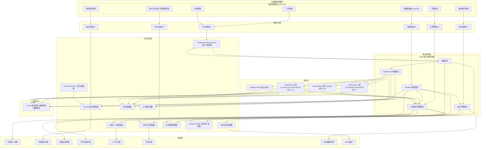

# DistributedWorkflow 分布式工作流引擎库 概要设计文档
**项目名称**：DistributedWorkflow - 分布式可扩展工作流引擎库
**文档版本**：v2.3 最终定稿
**编制日期**：2026-04-26
**文档状态**：正式发布
**适用范围**：项目整体架构规划、分阶段开发交付指导

## 一、文档概述
本文档为DistributedWorkflow分布式工作流引擎库的最终概要设计，定义了系统的整体架构、核心组件、关键特性与分阶段交付规划。本引擎基于Go语言开发，采用**中心化引擎+分布式NodeWorker**的架构模式，实现跨机器、跨集群的工作流节点分布式执行，同时提供可视化流程编辑、执行轨迹追踪、精确并发控制等核心能力。

**本概要设计暂不覆盖以下内容**，相关设计将在后续项目迭代中补充：
1. 安全与隔离相关设计
2. 性能与扩展性深度优化设计
3. 运维与部署相关设计
4. 兼容性与迁移相关设计
5. 开源项目合规与生态相关设计

## 二、设计目标与原则
### 2.1 核心设计目标
1. **中心化调度+分布式执行**：单逻辑调度中心统一管控，多NodeWorker节点分布式执行任务，支持跨机器、跨集群部署
2. **能力注册制**：NodeWorker主动向注册中心上报可执行的节点类型与最大并发数，实现能力的动态注册与发现
3. **配置驱动**：所有工作流规则使用JSON格式定义，无需编译即可修改、发布流程
4. **全流程可视化**：基于LogicFlow提供拖拽式流程图编辑能力，同时支持流程图上直观展示执行轨迹与节点状态
5. **高度可扩展**：支持自定义WorkflowLoader、自定义WorkflowNode类型、自定义流程触发端点，预留完整的扩展接口
6. **精确并发控制**：按节点类型粒度，控制每个NodeWorker的并发执行数量，避免资源过载
7. **高可用与容错**：支持NodeWorker故障自动转移、任务重试、状态持久化，保障流程执行稳定性
8. **版本化管理**：支持WorkflowDef的版本控制、回滚与灰度发布，保障流程变更可控
9. **完整生命周期管理**：支持工作流的启动、暂停、恢复、终止、重试全生命周期管控
10. **统一可观测体系**：提供完整的日志、指标、链路追踪与告警能力，实现流程执行全链路可监控

### 2.2 核心设计原则
- **前后端完全分离**：配置管理与运行执行完全解耦，支持独立部署、独立扩展
- **单一职责**：每个组件仅负责一项核心功能，职责边界清晰无重叠
- **接口抽象**：所有可扩展点均通过接口定义，实现与接口严格分离
- **无状态NodeWorker**：NodeWorker不保存任何流程状态，所有状态由引擎统一管理，保障无状态扩缩容
- **幂等性优先**：所有核心操作均设计为幂等，确保重复执行不会产生副作用
- **可观测性内置**：可观测能力原生集成到核心流程，而非事后补充
- **简单易用**：提供简洁的API与丰富的内置组件，降低接入与使用门槛
- **渐进式迭代**：核心功能优先落地，高级特性分阶段迭代，保障项目可快速交付可用版本

## 三、核心概念定义
| 概念 | 正式定义 |
|------|----------|
| **WorkflowDef** | 工作流定义，由多个WorkflowNode和Connection组成的有向无环图(DAG)，是流程执行的规则蓝本 |
| **WorkflowNode** | 工作流节点，流程执行的最小单元，每个节点有特定的类型、执行配置、依赖规则与重试/超时策略，支持自定义执行器实现任意逻辑（含自动执行、人工等待等场景） |
| **Connection** | 流程连线，定义节点之间的执行顺序、依赖关系与分支条件，支持Success（成功执行）、Failure（失败执行）、Always（无论成败都执行）三种类型 |
| **WorkflowInstance** | 工作流实例，一个正在执行或已执行完成的流程，对应一次WorkflowDef的运行时落地 |
| **WorkflowNodeState** | 节点执行状态，记录单个节点在WorkflowInstance中的执行详情、状态与结果数据 |
| **Engine** | 工作流引擎，系统的逻辑调度中心，由多个独立服务组成，负责流程管控、任务调度与状态管理 |
| **NodeWorker** | 执行节点，实际执行WorkflowNode任务的进程，可分布式部署，向注册中心上报自身能力与负载 |
| **Endpoint** | 流程触发端点，流程的统一入口，提供HTTP、RabbitMQ、RedisStream、定时调度等多种流程触发方式，所有触发方式均收敛到该体系 |
| **WorkflowLoader** | 工作流加载器，负责从不同数据源加载WorkflowDef，支持多数据源扩展 |
| **WorkflowNodeManager** | 节点定义管理器，负责管理所有可用的WorkflowNode类型与执行器 |
| **WorkflowVersionManager** | 流程版本管理器，负责WorkflowDef的版本控制、回滚与灰度发布 |
| **ContextManager** | 全局上下文管理器，负责WorkflowInstance上下文数据的管理、传递与持久化 |
| **ErrorHandler** | 错误处理器，统一处理流程执行过程中的所有错误，支持可配置的重试与降级策略 |
| **TaskQueueManager** | 任务队列管理器，维护待执行节点任务的队列，支持优先级与延迟执行 |
| **SubflowManager** | 子流程管理器，管理子流程的调用、生命周期与结果处理 |
| **AuditLogManager** | 审计日志管理器，记录所有系统操作与执行日志，满足合规审计要求 |
| **LifecycleManager** | 生命周期管理器，管理WorkflowInstance的状态转换，处理流程的暂停、恢复、终止请求 |

## 四、整体架构设计
系统采用**前后端分离+五层分层**架构，整体分为前端配置管理层、后端API层、核心服务层、公共组件层、存储层与执行层，项目拆分为**配置管理应用**与**运行执行应用库**两个独立部分。



## 五、核心组件详细设计
### 5.1 前端配置管理组件
#### 5.1.1 流程编辑器（基于LogicFlow）
核心能力：拖拽式节点添加与连线、节点/连线属性配置面板、流程图缩放/平移/撤销/重做、JSON格式导入导出、节点样式自定义、人工节点等特殊节点的专属配置面板、成功/失败分支连线可视化。

#### 5.1.2 执行轨迹可视化组件
核心能力：基于节点执行状态渲染差异化样式（未执行/执行中/成功/失败）、节点执行耗时与详情展示、执行路径高亮、流程执行回放、失败分支与补偿逻辑可视化。

#### 5.1.3 触发端点管理界面
核心能力：端点类型管理、定时端点Cron表达式配置、端点启停控制、端点与流程绑定、触发历史查看。

#### 5.1.4 管理后台界面
核心能力：流程定义管理、版本管理、实例监控、日志查询、节点类型管理、系统配置与权限管理。

### 5.2 注册中心（Nacos）
核心职责：NodeWorker服务注册与发现、NodeWorker健康状态检查、系统配置管理、动态配置推送、服务元数据管理。
核心机制：NodeWorker启动时注册自身地址、可执行节点类型与最大并发数，Engine从Nacos获取在线NodeWorker列表，Nacos自动完成健康检测与故障节点剔除。

### 5.3 核心服务层组件
#### 5.3.1 Workflow管理服务（WorkflowManagementService）
核心职责：接收端点触发的流程启动请求、创建WorkflowInstance、管理WorkflowDef的全生命周期、协调流程的启动/暂停/恢复/终止、与配置管理应用交互提供流程编辑与保存能力、处理子流程调用。

#### 5.3.2 调度服务（SchedulerService）
核心职责：解析WorkflowDef的DAG结构并构建节点依赖关系图、检查节点前置条件与连线分支条件、从任务队列获取待执行任务、选择匹配的NodeWorker分配任务、管理任务超时与重试、通过分布式锁保障任务唯一调度。

#### 5.3.3 实例状态管理服务（InstanceStateManagementService）
核心职责：管理WorkflowInstance与WorkflowNodeState的执行状态、持久化状态数据到数据库、接收NodeWorker上报的任务执行结果、更新流程执行进度、提供执行轨迹数据给前端。

#### 5.3.4 NodeWorker管理服务（NodeWorkerManagementService）
核心职责：从Nacos获取NodeWorker列表与健康状态、维护NodeWorker的能力与负载信息、实现负载均衡算法、处理NodeWorker故障与任务自动转移、向NodeWorker推送配置更新。

#### 5.3.5 端点管理服务（EndpointManagementService）
核心职责：管理所有流程触发端点的生命周期、加载端点配置、启停端点、维护端点状态、处理端点触发的流程启动请求，内置HTTP、MQ、定时调度等多种端点类型。

### 5.4 公共组件层组件
#### 5.4.1 Workflow版本管理器（WorkflowVersionManager）
核心职责：管理WorkflowDef的版本历史、支持版本回滚、实现流程灰度发布、记录流程变更日志、保障运行中实例的版本隔离。

#### 5.4.2 全局上下文管理器（ContextManager）
核心职责：管理WorkflowInstance的全局上下文数据、支持节点间的数据传递与共享、实现上下文数据的隔离与安全控制、保障上下文的持久化与恢复。

#### 5.4.3 错误处理器（ErrorHandler）
核心职责：统一处理全流程执行错误、实现可配置的重试策略（指数退避/固定间隔）、支持错误降级与失败分支调度、集成多渠道告警。

#### 5.4.4 任务队列管理器（TaskQueueManager）
核心职责：维护待执行节点任务队列、支持任务优先级、提供任务积压监控、实现延迟执行、支持任务取消与删除、保障任务幂等性。

#### 5.4.5 子流程管理器（SubflowManager）
核心职责：管理子流程的调用与生命周期、支持同步/异步子流程调用、处理子流程返回结果与异常、支持子流程嵌套调用。

#### 5.4.6 审计日志管理器（AuditLogManager）
核心职责：记录全流程操作与执行日志、支持日志查询与导出、提供合规审计报告、保障日志不可篡改。

#### 5.4.7 生命周期管理器（LifecycleManager）
核心职责：管理WorkflowInstance的状态转换、处理流程的暂停/恢复/终止请求、暂停时保存执行上下文、恢复时从断点继续执行、终止时清理相关资源。

#### 5.4.8 端点定义装载器（EndpointLoader）
核心职责：管理所有可用的端点类型、加载端点执行器、支持自定义端点类型扩展。

## 六、核心技术规范
### 6.1 分布式锁与幂等性规范
- 分布式锁基于Redis实现，采用SETNX+Lua脚本保障原子性，支持锁自动续期与可重入
- 所有核心操作均设计为幂等，每个任务通过`workflow_instance_id + workflow_node_id`唯一标识
- 任务执行前必须校验节点状态，仅`pending`状态的任务可被调度执行
- 重复上报的任务结果不会改变已持久化的状态数据
- 定时端点内置分布式锁，确保集群环境下同一规则仅触发一次流程

### 6.2 数据库核心表结构（SQL Server）
```sql
-- 工作流定义表
CREATE TABLE workflow_defs (
    id VARCHAR(64) PRIMARY KEY,
    name VARCHAR(255) NOT NULL,
    description NVARCHAR(MAX),
    latest_version INT NOT NULL DEFAULT 1,
    created_at DATETIME2 NOT NULL DEFAULT GETDATE(),
    updated_at DATETIME2 NOT NULL DEFAULT GETDATE(),
    created_by VARCHAR(64) NOT NULL,
    updated_by VARCHAR(64) NOT NULL,
    disabled BIT NOT NULL DEFAULT 0
);

-- 工作流版本表
CREATE TABLE workflow_versions (
    id INT IDENTITY(1,1) PRIMARY KEY,
    workflow_id VARCHAR(64) NOT NULL FOREIGN KEY REFERENCES workflow_defs(id),
    version INT NOT NULL,
    definition NVARCHAR(MAX) NOT NULL,
    created_at DATETIME2 NOT NULL DEFAULT GETDATE(),
    created_by VARCHAR(64) NOT NULL,
    UNIQUE(workflow_id, version)
);

-- 工作流实例表
CREATE TABLE workflow_instances (
    id VARCHAR(64) PRIMARY KEY,
    workflow_id VARCHAR(64) NOT NULL FOREIGN KEY REFERENCES workflow_defs(id),
    workflow_version INT NOT NULL,
    status VARCHAR(32) NOT NULL, -- pending/running/completed/failed
    start_time DATETIME2 NOT NULL DEFAULT GETDATE(),
    end_time DATETIME2,
    input_data NVARCHAR(MAX),
    output_data NVARCHAR(MAX),
    created_by VARCHAR(64) NOT NULL,
    error_message NVARCHAR(MAX)
);

-- 工作流节点状态表
CREATE TABLE workflow_node_states (
    id INT IDENTITY(1,1) PRIMARY KEY,
    instance_id VARCHAR(64) NOT NULL FOREIGN KEY REFERENCES workflow_instances(id),
    node_id VARCHAR(64) NOT NULL,
    status VARCHAR(32) NOT NULL, -- pending/assigned/running/completed/failed
    assigned_to VARCHAR(64),
    start_time DATETIME2,
    end_time DATETIME2,
    input_data NVARCHAR(MAX),
    output_data NVARCHAR(MAX),
    error_message NVARCHAR(MAX),
    retry_count INT NOT NULL DEFAULT 0,
    UNIQUE(instance_id, node_id)
);

-- 工作流实例上下文表
CREATE TABLE workflow_instance_context (
    id INT IDENTITY(1,1) PRIMARY KEY,
    instance_id VARCHAR(64) NOT NULL FOREIGN KEY REFERENCES workflow_instances(id),
    key VARCHAR(255) NOT NULL,
    value NVARCHAR(MAX) NOT NULL,
    created_at DATETIME2 NOT NULL DEFAULT GETDATE(),
    updated_at DATETIME2 NOT NULL DEFAULT GETDATE(),
    UNIQUE(instance_id, key)
);

-- 工作流触发端点配置表
CREATE TABLE workflow_endpoints (
    id VARCHAR(64) PRIMARY KEY,
    name VARCHAR(255) NOT NULL,
    type VARCHAR(64) NOT NULL,
    workflow_id VARCHAR(64) NOT NULL FOREIGN KEY REFERENCES workflow_defs(id),
    config NVARCHAR(MAX) NOT NULL,
    created_at DATETIME2 NOT NULL DEFAULT GETDATE(),
    updated_at DATETIME2 NOT NULL DEFAULT GETDATE(),
    created_by VARCHAR(64) NOT NULL,
    disabled BIT NOT NULL DEFAULT 0
);

-- 工作流实例审计日志表
CREATE TABLE workflow_instance_logs (
    id INT IDENTITY(1,1) PRIMARY KEY,
    instance_id VARCHAR(64),
    node_id VARCHAR(64),
    endpoint_id VARCHAR(64),
    operation VARCHAR(64) NOT NULL,
    operator VARCHAR(64) NOT NULL,
    details NVARCHAR(MAX),
    created_at DATETIME2 NOT NULL DEFAULT GETDATE()
);

-- 索引创建
CREATE INDEX idx_workflow_instances_workflow_id ON workflow_instances(workflow_id);
CREATE INDEX idx_workflow_instances_status ON workflow_instances(status);
CREATE INDEX idx_workflow_node_states_instance_id ON workflow_node_states(instance_id);
CREATE INDEX idx_workflow_node_states_status ON workflow_node_states(status);
CREATE INDEX idx_workflow_instance_context_instance_id ON workflow_instance_context(instance_id);
```

### 6.3 gRPC通信协议规范
系统内部采用gRPC作为通信协议，定义两大核心服务：
1. **EngineService**：NodeWorker调用Engine的服务，包含NodeWorker注册/注销、心跳上报、任务结果上报、错误上报接口
2. **NodeWorkerService**：Engine调用NodeWorker的服务，包含任务分配、任务取消接口

完整Proto定义：
```protobuf
syntax = "proto3";

package distributedworkflow;

import "google/protobuf/any.proto";
import "google/protobuf/timestamp.proto";

// 引擎服务（NodeWorker调用Engine）
service EngineService {
  // 注册NodeWorker
  rpc RegisterWorker(RegisterWorkerRequest) returns (RegisterWorkerResponse);
  
  // 注销NodeWorker
  rpc UnregisterWorker(UnregisterWorkerRequest) returns (UnregisterWorkerResponse);
  
  // 发送心跳
  rpc Heartbeat(HeartbeatRequest) returns (HeartbeatResponse);
  
  // 上报任务结果
  rpc ReportTaskResult(ReportTaskResultRequest) returns (ReportTaskResultResponse);
  
  // 上报错误
  rpc ReportError(ReportErrorRequest) returns (ReportErrorResponse);
}

// NodeWorker服务（Engine调用NodeWorker）
service NodeWorkerService {
  // 分配任务
  rpc AssignTask(AssignTaskRequest) returns (AssignTaskResponse);
  
  // 取消任务
  rpc CancelTask(CancelTaskRequest) returns (CancelTaskResponse);
}

// 消息定义
message RegisterWorkerRequest {
  string worker_id = 1;
  string address = 2;
  map<string, int32> capabilities = 3; // 节点类型 -> 最大并发数
}

message RegisterWorkerResponse {
  bool success = 1;
  string message = 2;
}

message UnregisterWorkerRequest {
  string worker_id = 1;
}

message UnregisterWorkerResponse {
  bool success = 1;
  string message = 2;
}

message HeartbeatRequest {
  string worker_id = 1;
  map<string, int32> current_load = 2; // 节点类型 -> 当前执行数
}

message HeartbeatResponse {
  bool success = 1;
  string message = 2;
}

message AssignTaskRequest {
  string task_id = 1;
  string workflow_instance_id = 2;
  string workflow_node_id = 3;
  string node_type = 4;
  google.protobuf.Any configuration = 5;
  google.protobuf.Any input_data = 6;
  map<string, google.protobuf.Any> context = 7;
}

message AssignTaskResponse {
  bool success = 1;
  string message = 2;
}

message CancelTaskRequest {
  string workflow_instance_id = 1;
  string workflow_node_id = 2;
  string reason = 3;
}

message CancelTaskResponse {
  bool success = 1;
  string message = 2;
}

message ReportTaskResultRequest {
  string task_id = 1;
  string workflow_instance_id = 2;
  string workflow_node_id = 3;
  bool success = 4;
  google.protobuf.Any output_data = 5;
  string error_message = 6;
  google.protobuf.Timestamp start_time = 7;
  google.protobuf.Timestamp end_time = 8;
}

message ReportTaskResultResponse {
  bool success = 1;
  string message = 2;
}

message ReportErrorRequest {
  string worker_id = 1;
  string workflow_instance_id = 2;
  string workflow_node_id = 3;
  string error_message = 4;
  string stack_trace = 5;
}

message ReportErrorResponse {
  bool success = 1;
  string message = 2;
}
```

### 6.4 数据序列化与传输规范
- 流程定义、配置数据、前端交互采用JSON序列化
- 内部gRPC通信采用Protobuf二进制序列化
- 上下文数据采用map结构存储，支持所有JSON可序列化类型
- 大于1MB的大对象采用引用方式传输，实际数据存储于Redis中
- 二进制数据采用base64编码或文件URL引用方式传输

## 七、核心业务流程
### 7.1 流程编辑与保存流程
用户通过前端LogicFlow编辑器完成流程图拖拽编辑与属性配置，前端将流程图转换为标准WorkflowDef格式，通过API提交至Workflow管理服务，Workflow版本管理器创建新版本并持久化到数据库，完成流程保存。

### 7.2 NodeWorker注册与心跳流程
NodeWorker启动时生成唯一ID，向Nacos注册自身地址、可执行节点类型与最大并发数；Nacos完成注册后通知Engine的NodeWorker管理服务更新本地缓存；NodeWorker每5秒发送一次心跳上报当前负载，Nacos持续进行健康检测；NodeWorker下线时主动注销，Nacos通知Engine移除该NodeWorker。

### 7.3 流程触发与执行主流程
1. 触发源（HTTP请求、MQ消息、定时规则等）通过对应Endpoint触发流程启动；
2. 端点管理服务校验端点配置，调用Workflow管理服务创建WorkflowInstance；
3. Workflow管理服务加载对应版本的WorkflowDef，初始化流程上下文，通知调度服务启动执行；
4. 调度服务解析DAG构建依赖关系，将起始节点加入任务队列；
5. 调度服务选择匹配的NodeWorker分配任务，NodeWorker执行节点逻辑（自动执行/等待人工回调）；
6. 节点执行完成后，NodeWorker上报结果至实例状态管理服务，更新节点状态与上下文；
7. 调度服务基于节点执行结果与连线规则，调度后续节点，直至所有节点执行完成，最终更新WorkflowInstance状态。

### 7.4 流程生命周期管控流程
用户发起暂停请求后，生命周期管理器取消所有待执行任务，通知NodeWorker终止正在执行的任务，将流程状态更新为暂停并持久化当前上下文；用户发起恢复请求后，生命周期管理器从断点加载上下文，通知调度服务继续执行未完成的节点。

### 7.5 人工节点处理流程
1. 调度服务将人工节点分配给对应NodeWorker，NodeWorker启动人工节点执行器，更新节点状态为running；
2. 执行器将人工任务信息持久化，生成待办记录；
3. 用户在前端查看待办任务，完成审批/处理后，通过节点回调API上报执行结果；
4. 执行器收到回调结果后，上报至实例状态管理服务，更新节点状态为completed/failed；
5. 调度服务基于节点结果，继续调度后续分支节点。

### 7.6 失败补偿流程
1. 节点执行失败后，实例状态管理服务更新节点状态为failed；
2. 调度服务检查该节点的Failure类型连线，匹配对应的目标节点（补偿节点）；
3. 调度服务将补偿节点加入任务队列，分配给对应NodeWorker执行；
4. 补偿节点执行完成后，基于连线规则继续执行后续流程，或终止流程。

## 八、核心技术选型
| 技术类别 | 技术选型 | 版本要求 | 适用场景 |
|----------|----------|----------|----------|
| 前端语言 | TypeScript | 5.0+ | 前端代码开发 |
| 前端框架 | Vue | 3.4+ | 前端应用框架 |
| 构建工具 | Vite | 5.0+ | 前端项目构建 |
| UI组件库 | Element Plus | 2.6+ | 前端UI组件 |
| 流程图组件 | LogicFlow | 2.0+ | 流程可视化编辑 |
| 后端语言 | Go | 1.22+ | 引擎与NodeWorker开发 |
| 内部通信协议 | gRPC | 1.60+ | Engine与NodeWorker通信 |
| 注册中心 | Nacos | 2.3+ | 服务发现与配置管理 |
| 主数据库 | SQL Server | 2019+ | 核心数据持久化 |
| 缓存与队列 | Redis | 7.0+ | 分布式锁、任务队列、缓存 |
| 异步通信 | RabbitMQ | 3.12+ | MQ触发端点、异步通知 |
| 定时调度 | cron | v3+ | 定时触发端点 |
| 配置管理 | Viper | 1.18+ | 应用配置管理 |
| 日志组件 | zerolog | 1.30+ | 结构化日志输出 |
| 监控指标 | Prometheus | 2.45+ | 指标采集与存储 |
| 链路追踪 | OpenTelemetry | 1.21+ | 全链路追踪 |
| 告警管理 | AlertManager | 0.26+ | 告警规则与通知 |

## 九、项目整体目录结构
```
distributedworkflow/
├── config-management/          # 配置管理应用
│   ├── frontend/               # 前端Vue3+Vite项目
│   │   ├── src/
│   │   │   ├── components/     # 公共组件
│   │   │   ├── views/          # 页面视图
│   │   │   ├── api/            # API请求封装
│   │   │   ├── store/          # 状态管理
│   │   │   └── utils/          # 工具函数
│   │   └── package.json
│   └── backend/                # 后端API服务
│       ├── cmd/
│       │   └── api/            # API服务启动入口
│       ├── internal/
│       │   ├── handler/        # HTTP处理器
│       │   ├── service/        # 业务服务
│       │   └── dao/            # 数据访问层
│       └── go.mod
├── runtime-execution/          # 运行执行应用库
│   ├── cmd/
│   │   ├── engine/             # Engine启动入口
│   │   └── worker/             # NodeWorker启动入口
│   ├── internal/
│   │   ├── engine/             # Engine核心实现
│   │   ├── worker/             # NodeWorker核心实现
│   │   ├── storage/            # 存储层实现
│   │   ├── common/             # 公共工具组件
│   │   └── proto/              # gRPC协议定义
│   ├── pkg/
│   │   ├── api/                # 对外开放API
│   │   ├── node/               # 内置节点实现（含http、db、人工节点等）
│   │   ├── endpoint/           # 内置端点实现（含HTTP、MQ、定时端点等）
│   │   └── loader/             # 内置WorkflowLoader实现
│   └── go.mod
├── examples/                   # 示例代码
└── docs/                       # 项目文档
```

## 十、分阶段交付规划
本项目按照依赖关系与功能模块，拆分为6个可独立交付的阶段，每个阶段对应完整的详细设计文档、可运行代码、测试用例与交付物，总开发周期22周。

| 阶段编号 | 阶段名称 | 对应版本 | 开发周期 | 核心交付物 |
|----------|----------|----------|----------|------------|
| D1 | 核心基础架构 | v0.1.0-v0.4.0 | 8周 | 可运行的单机+分布式基础引擎、核心数据结构与接口、gRPC通信、Nacos集成、SQL Server持久化、Redis分布式锁、基础DAG调度能力、HTTP触发端点 |
| D2 | 流程管理与控制 | v0.5.0-v0.6.0 | 4周 | WorkflowDef版本管理、完整生命周期控制、统一错误处理、NodeWorker故障自动转移、子流程支持 |
| D3 | 高级节点与端点 | v0.7.0 | 2周 | 人工节点实现、定时触发端点、完整审计日志、失败分支与补偿逻辑 |
| D4 | 配置管理前端 | v0.8.0 | 2周 | 基于LogicFlow的流程编辑器、流程管理界面、节点管理、端点管理、基础系统管理功能 |
| D5 | 执行可视化与监控 | v0.9.0 | 2周 | 流程图执行轨迹可视化、流程实例监控、执行日志查看、人工任务待办处理界面 |
| D6 | 可观测性与生产就绪 | v0.10.0-v1.0.0 | 4周 | Prometheus指标体系、OpenTelemetry全链路追踪、告警体系、性能优化、稳定性测试、完整文档与示例、v1.0.0正式版本 |

## 十一、文档说明
1. 本文档为DistributedWorkflow项目的最终精简版概要设计，是后续详细设计、开发、测试的核心指导文件
2. 本文档未覆盖的暂不处理模块，将在项目后续迭代中补充对应的设计文档
3. 本文档的修订与更新，需同步更新版本号与变更记录，确保所有开发环节基于最新文档执行