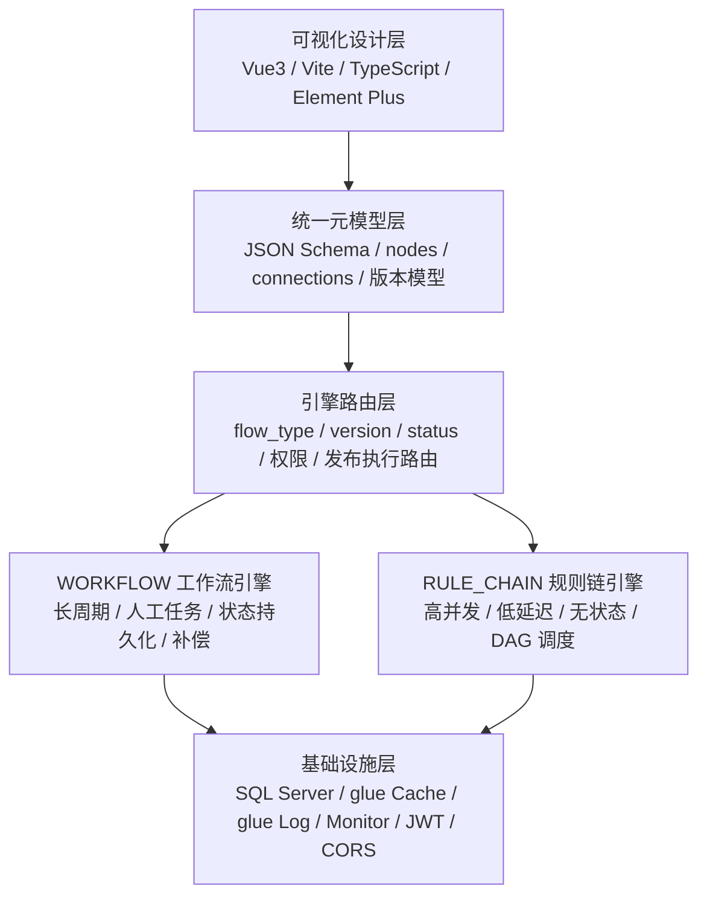
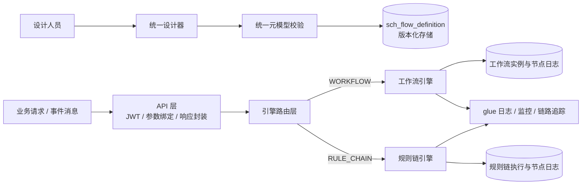
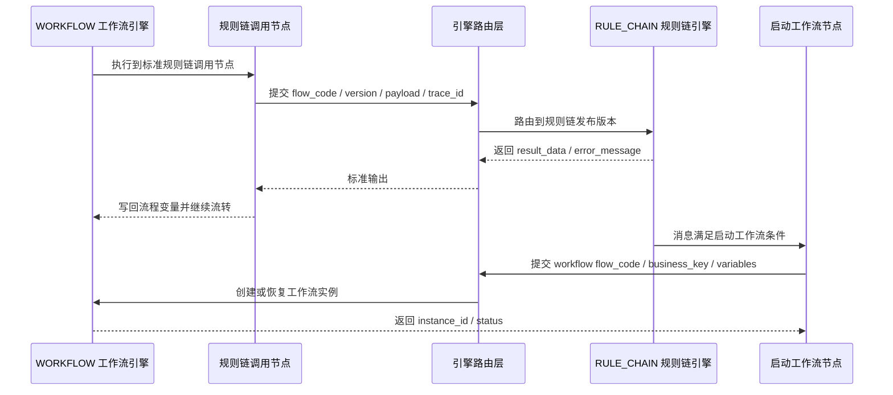
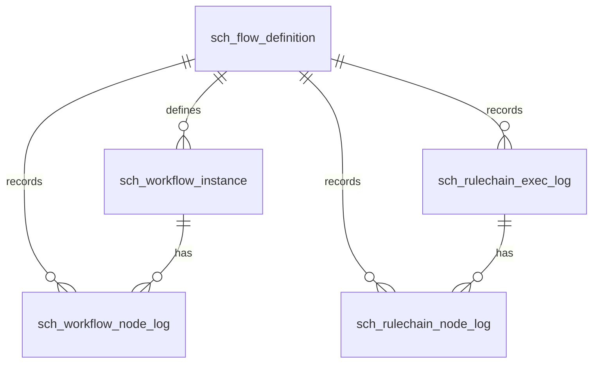

# 统一流程编排平台架构设计

## 1. 背景与目标

统一流程编排平台面向企业数字化场景中的两类流程诉求：一类是长周期、有人工参与、需要状态持久化和事务补偿的 `WORKFLOW` 工作流；另一类是高并发、低延迟、事件驱动、无状态执行的 `RULE_CHAIN` 规则链。平台目标不是把两类执行语义强行合并，而是统一设计入口、统一存储模型、统一治理边界，同时保持双引擎内核隔离和独立演进。

核心目标如下：

| 目标 | 说明 |
| --- | --- |
| 统一设计入口 | 前端使用一套 Vue3/Vite/TypeScript/Element Plus 设计器承载两类流程模式，降低建模学习成本。 |
| 统一元模型与存储 | 使用统一 JSON Schema 和显式 `nodes` / `connections` 边集存储流程定义，支撑版本、审计、导入导出和跨引擎标准调用。 |
| 双引擎能力互补 | `WORKFLOW` 负责人工任务、长周期状态和事务补偿；`RULE_CHAIN` 负责高并发事件链路、DAG 调度和低延迟处理。 |
| 企业级数据库适配 | 以 SQL Server 为核心持久化基础，JSON 字段使用 `varchar(max)`，检索维度结构化，日志支持归档或分区。 |
| 复用 glue 基础能力 | 后端基于 Go 1.24+ 与 `github.com/zhiyunliu/glue`，复用框架的 API、中间件、缓存、日志、监控和服务治理能力。 |

## 2. 问题域与设计边界

### 2.1 问题域

企业中常见的审批流、工单流转、订单生命周期管理，需要流程实例长期存在，能够暂停、恢复、回退、会签、或签、人工处理和审计追踪。此类流程强调状态一致性、过程可解释性和事务补偿，适合由工作流引擎承载。

物联网告警、消息路由、数据转换、实时规则判断等事件链路，通常单次执行生命周期短、吞吐高、状态轻，强调节点调度效率、链路追踪和快速失败处理，适合由规则链引擎承载。

两类流程的共同问题是设计入口、定义存储、版本发布、权限、审计和监控可以统一；真正不能统一的是执行语义。平台设计必须明确：统一的是模型治理和入口，不统一引擎内部上下文、调度语义和节点生命周期。

### 2.2 设计边界

| 边界 | 约束 |
| --- | --- |
| 引擎边界 | 工作流和规则链内核完全隔离，不共享内部上下文，不直接跳转对方节点。 |
| 联动边界 | 跨引擎只能通过标准节点完成：工作流调用规则链节点、规则链启动工作流节点。 |
| 模型边界 | 统一元模型用于存储和设计，不要求两类引擎拥有相同执行语义。 |
| DAG 边界 | 规则链必须是有向无环图，禁止循环；循环、回退、人工等待归工作流处理。 |
| 数据边界 | SQL Server 可存 JSON，但常用检索维度必须冗余为普通列，不依赖大 JSON 全量扫描。 |

## 3. 设计原则

| 原则 | 落地要求 |
| --- | --- |
| 存储优先 | 先稳定 `sch_flow_definition` 和统一元模型，再向上支撑设计器、向下支撑引擎执行。 |
| 模型先行 | 所有流程定义统一遵循 JSON Schema，`type` 明确区分 `WORKFLOW` 与 `RULE_CHAIN`。 |
| 引擎隔离 | 工作流引擎与规则链引擎独立部署、独立扩展、独立故障隔离。 |
| 扩展友好 | 节点类型、节点处理器、路由策略、校验规则通过接口或注册表扩展，避免修改内核。 |
| 复用 glue 基础能力 | API、服务编排、缓存、日志、监控、中间件、CORS 等优先使用 glue 框架能力。 |
| SQL Server 企业级适配 | 表结构、索引、JSON 存储、时间精度、日志归档、审计查询均按 SQL Server 能力设计。 |

## 4. 总体架构

平台采用五层架构：可视化设计层、统一元模型层、引擎路由层、双引擎内核层、基础设施层。上层面向用户体验和模型治理，下层面向执行、持久化、观测和企业级运维。



### 4.1 分层职责

| 层级 | 职责 | 主要产物 |
| --- | --- | --- |
| 可视化设计层 | 统一画布、模式隔离、节点工具箱、属性面板、实时校验、版本保存、预览调试、导入导出。 | 流程定义草稿、发布请求、调试请求。 |
| 统一元模型层 | 定义统一 JSON Schema，完成工作流隐式连线与显式边集映射，执行模型合法性校验。 | 标准 `model_content`、节点集合、连线集合、版本元数据。 |
| 引擎路由层 | 根据 `flow_type`、版本、状态、权限和执行入口分发请求，不泄漏引擎内部实现。 | 查询、发布、执行、调试、跨引擎调用入口。 |
| 双引擎内核层 | `WORKFLOW` 处理状态化长流程；`RULE_CHAIN` 处理无状态事件链路和 DAG 调度。 | 实例状态、执行结果、节点日志、异常信息。 |
| 基础设施层 | SQL Server 持久化、glue Cache、glue 日志与监控、JWT、中间件、CORS、审计。 | 数据表、缓存项、链路日志、指标、审计记录。 |

### 4.2 核心流转



## 5. 关键架构决策

| 决策 | 结论 | 理由 | 影响 |
| --- | --- | --- | --- |
| ADR-001 统一显式边集存储 | `nodes` 与 `connections` 分离存储，连线作为一等对象。 | 规则链天然匹配 DAG；前端渲染直接；工作流隐式连线可无损映射。 | 模型校验和版本 diff 更清晰，工作流加载时需要转换邻接关系。 |
| ADR-002 双引擎内核隔离 | 工作流与规则链各自维护运行时上下文和调度器。 | 两类执行语义差异大，强行合并会增加复杂度和故障影响面。 | 需要路由层和标准跨引擎节点维持统一入口。 |
| ADR-003 规则链纯 Go 自研 | 不引入第三方规则链引擎作为内核依赖。 | 保持自主可控，适配 glue 框架和项目节点模型。 | 需要优先建设 DAG 校验、ConnectionRouter、节点调度和执行日志能力。 |
| ADR-004 SQL Server JSON 与结构化列并用 | `model_content`、变量、快照、载荷使用 `varchar(max)`，常用查询维度独立列化。 | SQL Server 支持 JSON 函数，但大 JSON 检索成本高。 | 表设计需提前冗余 `flow_code`、`status`、`trace_id`、`business_key` 等检索键。 |
| ADR-005 跨引擎只走标准节点 | 工作流调用规则链、规则链启动工作流，只能通过标准节点完成。 | 避免内部上下文耦合和跨引擎直接跳转。 | 联动链路可审计、可限流、可权限控制。 |

## 6. 架构风险与应对

| 风险 | 表现 | 应对策略 |
| --- | --- | --- |
| 元模型过度抽象 | 为兼容两类引擎而牺牲执行语义清晰度。 | 元模型只统一存储和设计表达；执行语义由各引擎解释。 |
| 规则链日志增长过快 | 高并发场景下执行日志和节点日志快速膨胀。 | 总表与明细表分层保留，按月归档或分区，热数据短保留，审计数据长保留。 |
| JSON 字段检索性能下降 | 频繁在 `varchar(max)` 中解析查询条件。 | 常用查询维度冗余普通列，JSON 仅保存完整上下文和模型。 |
| 跨引擎调用造成链路复杂 | 联动失败、超时、重复执行难以追踪。 | 强制携带 `trace_id`，标准节点记录输入输出，支持幂等键和超时策略。 |
| 前端模式混用 | 用户在规则链中配置人工任务或循环连线。 | 设计器按模式隔离节点工具箱，保存前执行实时校验和后端二次校验。 |

## 7. 研发落地模块职责

后端按 `api`、`service`、`model`、`dao`、`engine`、`router`、`cache/log/monitor` 分层，保持 HTTP 接入、业务编排、数据访问、引擎执行和基础设施治理职责独立。

| 模块 | 职责 | 约束 |
| --- | --- | --- |
| `api` | 处理 HTTP、JWT、参数绑定、统一响应封装。 | 不写业务编排和 SQL；查询使用 GET，创建、修改、删除、执行、发布使用 POST。 |
| `service` | 编排发布、版本管理、执行请求、权限判断、跨引擎标准节点调用。 | 不直接拼接 SQL，不持有引擎内部状态。 |
| `model` | 放数据库模型、DTO、统一元模型结构、请求响应结构。 | 结构体需有 JSON 标签；错误码和子码引用常量。 |
| `dao` | 封装 SQL Server 访问、事务、分页、索引友好查询。 | 禁止不安全 SQL 拼接；复杂 JSON 查询应优先结构化列。 |
| `engine/workflow` | 管理工作流实例、人工任务、状态持久化、补偿、会签或签。 | 不调用规则链内部节点，只能通过标准规则链调用节点。 |
| `engine/rulechain` | 纯 Go 规则链内核、DAG 校验、节点调度、ConnectionRouter、执行上下文。 | 禁止循环；节点处理器无状态化优先。 |
| `router` | 按 `flow_type`、`version`、`status`、权限和发布状态选择引擎与定义版本。 | 不实现具体节点逻辑。 |
| `cache/log/monitor` | 复用 glue Cache、日志、监控、链路追踪能力。 | 不重复引入同类基础设施组件。 |

## 8. 统一元模型设计

### 8.1 模型结构

统一元模型以 JSON 保存到 `sch_flow_definition.model_content`，通过 `type` 区分 `WORKFLOW` 与 `RULE_CHAIN`。`nodes` 和 `connections` 是显式边集，所有流转关系必须在 `connections` 中表达。

```json
{
  "id": "flow-definition-id",
  "flowCode": "order_approval",
  "name": "订单审批",
  "type": "WORKFLOW",
  "version": 1,
  "variables": [
    {"name": "amount", "type": "number", "default": 0}
  ],
  "settings": {},
  "nodes": [
    {
      "id": "node_start",
      "name": "开始",
      "type": "START",
      "position": {"x": 120, "y": 80},
      "config": {}
    }
  ],
  "connections": [
    {
      "id": "conn_start_approve",
      "fromId": "node_start",
      "toId": "node_approve",
      "label": "提交审批",
      "relationType": "SUCCESS",
      "condition": "",
      "isDefault": true
    }
  ]
}
```

### 8.2 显式边集与工作流隐式连线映射

| 工作流隐式关系 | 显式边集映射 |
| --- | --- |
| 普通步骤后继 | 生成一条 `fromId` 到 `toId` 的普通连线。 |
| 条件节点 True 分支 | 生成 `relationType=CONDITION`、`label=True` 的连线。 |
| 条件节点 False 分支 | 生成 `relationType=CONDITION`、`label=False`，必要时设置 `isDefault=true`。 |
| 多分支节点 Case | 每个 Case 生成一条带条件或标签的连线。 |
| 默认分支 | 生成一条 `isDefault=true` 的连线。 |

### 8.3 模型校验规则

| 校验项 | `WORKFLOW` | `RULE_CHAIN` |
| --- | --- | --- |
| 起止节点 | 至少一个开始节点，结束节点按流程类型配置。 | 至少一个入口节点，允许多个终止路径。 |
| 连线合法性 | 允许循环、回退、条件分支和人工等待。 | 必须通过 DAG 校验，禁止循环。 |
| 节点类型 | 支持人工任务、审批、网关、补偿、子流程、规则链调用节点。 | 支持过滤、转换、动作、集成、日志、启动工作流节点。 |
| 上下文 | 长生命周期变量和状态快照。 | 单次消息上下文，执行完成后不保留运行时状态。 |
| 发布校验 | 校验人工节点权限、表单、超时、补偿策略。 | 校验节点处理器存在、连线路由关系、DAG 拓扑和并发安全。 |

## 9. 双引擎设计

### 9.1 工作流引擎

工作流引擎适合长周期、人工任务、状态持久化、事务补偿、会签或签等业务流程。它以流程实例为核心，运行时需要保存当前节点、变量、状态快照、人工任务等待点和补偿信息。

关键能力：

| 能力 | 说明 |
| --- | --- |
| 实例持久化 | 流程启动后写入 `sch_workflow_instance`，在每个持久点更新状态快照。 |
| 人工任务 | 支持审批、转办、退回、会签、或签、超时处理等人工协作。 |
| 状态恢复 | 通过 `instance_id` 加载变量和 `state_snapshot`，从等待节点恢复执行。 |
| 事务补偿 | 对跨服务或长事务操作记录补偿点，失败时按策略回滚或人工介入。 |
| 审计追踪 | 每个节点写入 `sch_workflow_node_log`，保留输入、输出、异常、耗时和 `trace_id`。 |

### 9.2 规则链引擎

规则链引擎为纯 Go 自研内核，适合高并发、低延迟、无状态事件链路。它以单次消息执行为核心，加载发布版本的规则链定义，构建 DAG 拓扑和邻接关系，由 `ConnectionRouter` 根据节点结果选择后继节点。

关键能力：

| 能力 | 说明 |
| --- | --- |
| DAG 校验 | 发布或加载时执行拓扑校验，禁止循环。 |
| 节点调度 | 根据入度、连线关系和节点结果推进执行，支持同步或异步策略。 |
| ConnectionRouter | 根据 `relationType`、条件表达式、默认连线选择后继节点。 |
| 无状态上下文 | 单次执行创建独立上下文，执行结束后仅保留日志和结果。 |
| 高并发治理 | 通过协程池、限流、超时、熔断和缓存热点定义保障吞吐。 |
| 执行审计 | 总体执行写入 `sch_rulechain_exec_log`，节点明细写入 `sch_rulechain_node_log`。 |

## 10. 跨引擎联动

跨引擎联动只允许通过标准节点发生，不共享内部上下文，不直接跳转对方节点。调用方只传递标准输入，接收标准输出和错误信息；被调用方按自己的引擎语义执行。



联动规则：

| 场景 | 标准节点 | 关键约束 |
| --- | --- | --- |
| 工作流调用规则链 | 规则链调用节点 | 必须传 `flow_code`、版本策略、输入变量和 `trace_id`；结果只能写回工作流变量。 |
| 规则链启动工作流 | 启动工作流节点 | 必须传业务键、变量、目标流程编码；不得直接设置工作流内部当前节点。 |
| 错误处理 | 标准错误输出 | 调用失败按节点配置决定重试、补偿、终止或进入人工处理。 |
| 权限 | 路由层校验 | 发布权限和执行权限分离，跨引擎调用也必须走权限校验和审计。 |

## 11. 前端设计器设计

前端使用 Vue3、Vite、TypeScript、Element Plus，围绕统一画布提供双模式设计体验。设计器的职责是表达流程定义、执行交互校验和提交版本，不承载后端执行语义。

| 功能 | 说明 |
| --- | --- |
| 统一画布 | 同一画布承载工作流和规则链，节点、连线、拖拽、缩放、对齐交互一致。 |
| 模式隔离 | `WORKFLOW` 与 `RULE_CHAIN` 切换后加载不同节点工具箱、校验规则和属性面板。 |
| 节点工具箱 | 工作流包含人工任务、网关、补偿、规则链调用；规则链包含过滤、转换、动作、集成、启动工作流。 |
| 属性面板 | 配置节点名称、节点类型、条件、权限、超时、重试、输入输出映射。 |
| 实时校验 | 前端即时校验必填项、连线合法性、DAG 环、节点类型混用；后端保存前二次校验。 |
| 版本保存 | 保存草稿、提交发布、复制新版本、查看历史版本。 |
| 预览调试 | 支持模拟输入、查看路由路径、节点输出和错误信息。 |
| 导入导出 | 导入导出统一 JSON Schema，便于迁移、备份和评审。 |

## 12. 数据库设计

数据库设计优先服务版本化流程定义、工作流长周期状态、规则链高频执行审计和跨引擎链路追踪。核心设计原则是：定义表强一致、实例表可恢复、日志表可追踪、JSON 存完整上下文、结构化列支撑高频查询。

### 12.1 数据分类与表职责



  上图为核心表逻辑关系图，仅表达流程定义、实例、执行总表和节点日志之间的业务关联与查询追踪关系，不代表数据库层面的物理外键设计。核心表之间不创建 `FOREIGN KEY` 等物理外键约束；关联完整性、存在性校验、删除或停用限制、级联处理由 `service` / `dao` 层代码在业务事务中实现。表内主键、业务唯一约束、普通索引和组合索引建议仍按下文保留。

| 表名 | 分类 | 职责 |
| --- | --- | --- |
| `sch_flow_definition` | 通用定义表 | 保存统一元模型、流程类型、版本、状态和最新版本标记，是双引擎共同的定义入口。 |
| `sch_workflow_instance` | 工作流实例表 | 保存长周期工作流实例状态、变量、当前节点、状态快照和生命周期时间。 |
| `sch_workflow_node_log` | 工作流节点日志表 | 记录工作流节点执行过程、输入输出、错误、耗时和链路标识。 |
| `sch_rulechain_exec_log` | 规则链执行总表 | 记录单次规则链执行的整体状态、消息来源、载荷、结果、耗时和链路标识。 |
| `sch_rulechain_node_log` | 规则链节点明细表 | 记录规则链每个节点的路由关系、输入输出、状态、耗时和异常。 |

### 12.2 通用字段与数据类型规则

| 规则 | 说明 |
| --- | --- |
| 主键 | 建议使用 `varchar(64)` 或项目统一 ID 类型，所有核心表保留 `id` 作为物理主键。 |
| 业务唯一键 | 工作流实例使用 `instance_id`，规则链执行使用 `exec_id`，用于外部查询和链路关联。 |
| JSON 字段 | `model_content`、`variables`、`state_snapshot`、`input_data`、`output_data`、`payload`、`result_data` 使用 `varchar(max)`。 |
| JSON 校验 | 建议对 JSON 字段增加 `ISJSON(...) = 1` 的约束或保存前校验；允许空的字段需明确空值策略。 |
| 检索冗余 | `flow_code`、`flow_type`、`version`、`status`、`business_key`、`trace_id`、`node_id`、`source` 等高频查询维度必须普通列化。 |
| 时间字段 | 使用 `datetime`；`create_time` 默认 `GETDATE()`；执行类表必须有 `start_time`、`end_time`、`duration_ms`。 |
| 逻辑关联 | `flow_definition_id`、`instance_id`、`exec_id` 等字段仅表达逻辑关联和查询追踪，不创建数据库物理外键。 |
| 错误字段 | 错误码和错误消息分离；执行日志中的 `error_code` 存储与统一 `sub_code` 对齐的稳定错误标识，必要时保留内部错误到 `sub_code` 的映射；对外错误码遵循 `constants/respcode` 与 `constants/subcode` 常量。 |
| 审计字段 | 定义表保留 `create_by`、`update_by`；发布、执行、跨引擎调用需要记录操作者或来源。 |

### 12.3 sch_flow_definition

职责：双引擎共用的流程定义表，保存统一元模型、版本、状态和最新版本标记。所有执行都应路由到已发布且有权限访问的定义版本。

| 字段 | 建议类型 | 说明 |
| --- | --- | --- |
| `id` | `varchar(64)` | 主键。 |
| `flow_code` | `varchar(64)` | 流程编码，同一流程多版本共享。 |
| `name` | `varchar(128)` | 流程名称。 |
| `flow_type` | `varchar(32)` | `WORKFLOW` 或 `RULE_CHAIN`。 |
| `version` | `int` | 同一 `flow_code` 下递增。 |
| `model_content` | `varchar(max)` | 统一 JSON Schema 完整内容，建议 `ISJSON` 校验。 |
| `status` | `tinyint` | 草稿、已发布、停用等状态，具体枚举由常量定义。 |
| `is_latest` | `bit` | 是否为当前最新版本。 |
| `description` | `varchar(512)` | 流程说明。 |
| `create_by` | `varchar(64)` | 创建人。 |
| `update_by` | `varchar(64)` | 更新人。 |
| `create_time` | `datetime` | 创建时间，默认 `GETDATE()`。 |
| `update_time` | `datetime` | 更新时间。 |

约束与索引建议：

| 类型 | 建议 |
| --- | --- |
| 主键 | `PK(id)` |
| 唯一约束 | `UK(flow_code, version)` |
| 普通索引 | `IX(flow_type)`、`IX(status)` |
| 组合索引 | `IX(flow_type, status, is_latest)`、`IX(flow_code, status, version desc)` |

### 12.4 sch_workflow_instance

职责：保存工作流实例运行状态，支持长周期暂停、恢复、人工等待、当前节点定位和业务键查询。

| 字段 | 建议类型 | 说明 |
| --- | --- | --- |
| `id` | `varchar(64)` | 主键。 |
| `instance_id` | `varchar(64)` | 工作流实例唯一标识。 |
| `flow_definition_id` | `varchar(64)` | 逻辑关联 `sch_flow_definition.id`。 |
| `flow_code` | `varchar(64)` | 冗余流程编码，便于查询。 |
| `flow_version` | `int` | 执行时使用的流程版本。 |
| `business_key` | `varchar(128)` | 外部业务单据或对象标识。 |
| `status` | `tinyint` | 运行中、等待中、完成、失败、取消等状态。 |
| `current_node_id` | `varchar(64)` | 当前节点 ID。 |
| `current_node_name` | `varchar(128)` | 当前节点名称，便于列表展示。 |
| `variables` | `varchar(max)` | 流程变量 JSON，建议 `ISJSON` 校验。 |
| `state_snapshot` | `varchar(max)` | 引擎恢复所需状态快照 JSON，建议 `ISJSON` 校验。 |
| `start_time` | `datetime` | 实例开始时间。 |
| `end_time` | `datetime` | 实例结束时间。 |
| `last_active_time` | `datetime` | 最近活跃时间，用于待办、超时和清理。 |
| `create_time` | `datetime` | 创建时间，默认 `GETDATE()`。 |
| `update_time` | `datetime` | 更新时间。 |

约束与索引建议：

| 类型 | 建议 |
| --- | --- |
| 主键 | `PK(id)` |
| 唯一约束 | `UK(instance_id)` |
| 普通索引 | `IX(business_key)`、`IX(status)`、`IX(last_active_time)` |
| 组合索引 | `IX(flow_code, status)`、`IX(status, last_active_time desc)`、`IX(business_key, flow_code)` |

### 12.5 sch_workflow_node_log

职责：记录工作流节点级审计轨迹，支持按实例、节点、状态、时间和链路追踪查询。

| 字段 | 建议类型 | 说明 |
| --- | --- | --- |
| `id` | `varchar(64)` | 主键。 |
| `instance_id` | `varchar(64)` | 逻辑关联工作流实例 ID。 |
| `flow_definition_id` | `varchar(64)` | 逻辑关联流程定义 ID。 |
| `flow_code` | `varchar(64)` | 冗余流程编码。 |
| `node_id` | `varchar(64)` | 节点 ID。 |
| `node_name` | `varchar(128)` | 节点名称。 |
| `node_type` | `varchar(64)` | 节点类型。 |
| `status` | `tinyint` | 节点执行状态。 |
| `input_data` | `varchar(max)` | 节点输入 JSON，建议 `ISJSON` 校验。 |
| `output_data` | `varchar(max)` | 节点输出 JSON，建议 `ISJSON` 校验。 |
| `error_code` | `varchar(64)` | 错误码或子码。 |
| `error_message` | `varchar(1024)` | 错误信息。 |
| `trace_id` | `varchar(128)` | 链路追踪 ID。 |
| `start_time` | `datetime` | 节点开始时间。 |
| `end_time` | `datetime` | 节点结束时间。 |
| `duration_ms` | `bigint` | 节点耗时，单位毫秒。 |

约束与索引建议：

| 类型 | 建议 |
| --- | --- |
| 主键 | `PK(id)` |
| 唯一约束 | 无额外业务唯一约束，仅保留 `PK(id)`；同一实例同一节点允许因回退、重试、会签或恢复执行产生多条日志。 |
| 普通索引 | `IX(instance_id)`、`IX(node_id)`、`IX(trace_id)` |
| 组合索引 | `IX(instance_id, start_time desc)`、`IX(flow_code, node_id, start_time desc)`、`IX(status, start_time desc)` |

### 12.6 sch_rulechain_exec_log

职责：记录规则链单次执行总览，是事件处理审计、问题定位、吞吐统计和失败重放的入口。

| 字段 | 建议类型 | 说明 |
| --- | --- | --- |
| `id` | `varchar(64)` | 主键。 |
| `exec_id` | `varchar(64)` | 单次规则链执行唯一标识。 |
| `flow_definition_id` | `varchar(64)` | 逻辑关联流程定义 ID。 |
| `flow_code` | `varchar(64)` | 冗余流程编码。 |
| `flow_version` | `int` | 执行版本。 |
| `message_id` | `varchar(128)` | 外部消息 ID，用于幂等和追踪。 |
| `source` | `varchar(128)` | 消息来源。 |
| `status` | `tinyint` | 执行成功、失败、部分失败、超时等状态。 |
| `payload` | `varchar(max)` | 原始载荷 JSON，建议 `ISJSON` 校验。 |
| `result_data` | `varchar(max)` | 执行结果 JSON，建议 `ISJSON` 校验。 |
| `error_code` | `varchar(64)` | 执行错误码或统一 `sub_code`，与 `constants/subcode` 中的稳定标识保持一致。 |
| `error_message` | `varchar(1024)` | 执行错误信息。 |
| `trace_id` | `varchar(128)` | 链路追踪 ID。 |
| `start_time` | `datetime` | 执行开始时间。 |
| `end_time` | `datetime` | 执行结束时间。 |
| `duration_ms` | `bigint` | 执行总耗时，单位毫秒。 |
| `create_time` | `datetime` | 创建时间，默认 `GETDATE()`。 |

约束与索引建议：

| 类型 | 建议 |
| --- | --- |
| 主键 | `PK(id)` |
| 唯一约束 | `UK(exec_id)` |
| 普通索引 | `IX(message_id)`、`IX(trace_id)`、`IX(status)` |
| 组合索引 | `IX(flow_code, start_time desc)`、`IX(status, start_time desc)`、`IX(source, start_time desc)` |

### 12.7 sch_rulechain_node_log

职责：记录规则链节点执行明细和路由关系，支撑按节点、链路、状态、耗时的性能分析和故障排查。

| 字段 | 建议类型 | 说明 |
| --- | --- | --- |
| `id` | `varchar(64)` | 主键。 |
| `exec_id` | `varchar(64)` | 逻辑关联规则链执行 ID。 |
| `flow_definition_id` | `varchar(64)` | 逻辑关联流程定义 ID。 |
| `flow_code` | `varchar(64)` | 冗余流程编码。 |
| `node_id` | `varchar(64)` | 节点 ID。 |
| `node_name` | `varchar(128)` | 节点名称。 |
| `node_type` | `varchar(64)` | 节点类型。 |
| `relation_type` | `varchar(64)` | 命中的连线关系类型，如 `SUCCESS`、`FAILURE`、`CONDITION`。 |
| `from_node_id` | `varchar(64)` | 上游节点 ID。 |
| `to_node_ids` | `varchar(max)` | 后继节点 ID 集合 JSON，建议 `ISJSON` 校验。 |
| `status` | `tinyint` | 节点执行状态。 |
| `input_data` | `varchar(max)` | 节点输入 JSON，建议 `ISJSON` 校验。 |
| `output_data` | `varchar(max)` | 节点输出 JSON，建议 `ISJSON` 校验。 |
| `error_code` | `varchar(64)` | 节点错误码或统一 `sub_code`，与 `sch_workflow_node_log.error_code` 保持一致。 |
| `error_message` | `varchar(1024)` | 节点错误信息。 |
| `trace_id` | `varchar(128)` | 链路追踪 ID。 |
| `start_time` | `datetime` | 节点开始时间。 |
| `end_time` | `datetime` | 节点结束时间。 |
| `duration_ms` | `bigint` | 节点耗时，单位毫秒。 |

约束与索引建议：

| 类型 | 建议 |
| --- | --- |
| 主键 | `PK(id)` |
| 唯一约束 | 无额外业务唯一约束，仅保留 `PK(id)`；同一 `exec_id` 下同一 `node_id` 可因分支、重试或并发路径产生多条日志。 |
| 普通索引 | `IX(exec_id)`、`IX(node_id)`、`IX(trace_id)` |
| 组合索引 | `IX(exec_id, start_time asc)`、`IX(flow_code, node_id, start_time desc)`、`IX(status, start_time desc)`、`IX(flow_code, node_type, duration_ms desc)` |

### 12.8 日志归档与保留策略

| 表 | 增长特征 | 建议策略 |
| --- | --- | --- |
| `sch_workflow_node_log` | 随人工流程节点数增长，中等增长。 | 按 `start_time` 月度归档；保留 `instance_id`、`trace_id`、`flow_code` 查询键。 |
| `sch_rulechain_exec_log` | 随事件量增长，高增长。 | 按 `create_time` 或 `start_time` 月度归档或分区；总表保留更长审计周期。 |
| `sch_rulechain_node_log` | 高并发下增长最快。 | 明细热数据短保留，按 `start_time` 月度归档；聚合指标进入监控系统。 |
| `sch_workflow_instance` | 长周期业务状态表。 | 完成实例按业务周期归档，运行中和待处理实例保持热查询。 |

归档要求：保留 `exec_id`、`instance_id`、`trace_id`、`flow_code` 查询键，保证归档后仍可完成审计追踪、跨引擎链路定位和问题复盘。

## 13. API 边界与响应规范

API 层只处理 HTTP、JWT、参数绑定和响应封装，业务编排进入 `service`，数据访问进入 `dao`，引擎执行进入 `engine`。

### 13.1 方法规范

| 场景 | 方法 | 示例边界 |
| --- | --- | --- |
| 查询流程定义、版本、实例、日志 | GET | 只读查询，参数通过 query/path 传递。 |
| 创建、修改、删除流程定义 | POST | 保存草稿、复制版本、停用、删除。 |
| 发布、执行、调试 | POST | 发布流程、启动工作流、执行规则链、跨引擎调用。 |

### 13.2 统一响应

所有接口返回统一格式：`code`、`sub_code`、`message`、`data`。成功时 `code=0`，不输出 `sub_code`；错误时必须输出 `sub_code`。`data` 为空时可以省略。

| 场景 | 响应要求 |
| --- | --- |
| 成功 | `code=0`，`message` 为中文成功提示，按需返回 `data`。 |
| 参数错误 | HTTP 400，返回业务错误 `code` 和 `sub_code`。 |
| 未登录 | HTTP 401，JWT 缺失或无效。 |
| 无权限 | HTTP 403，发布、执行、查看权限不足。 |
| 服务错误 | HTTP 500，返回可追踪 `trace_id`，避免暴露内部敏感信息。 |

错误码常量必须在 `constants/respcode` 和 `constants/subcode` 中定义，前端只依赖稳定错误码和中文消息，不解析后端内部异常文本。

### 13.3 API 资源清单

以下清单用于研发拆分资源边界和排期，路径为建议命名，具体 DTO 可在实现阶段按 `api`、`service`、`model` 分层细化；本节不替代完整接口文档。

| 资源 | 路径与方法 | 用途 | 关键入参 | 返回 `data` | 权限要求 | 主要错误码方向 |
| --- | --- | --- | --- | --- | --- | --- |
| 保存草稿 | `POST /api/basic-distributed/flows/drafts/save` | 创建或更新流程草稿，保存统一元模型。 | `flow_code`、`flow_type`、`name`、`model_content`、`description`。 | `definition_id`、`flow_code`、`version`、`status`、`update_time`。 | 设计权限。 | 参数错误、模型格式错误、版本冲突、无权限。 |
| 发布版本 | `POST /api/basic-distributed/flows/:definition_id/publish` | 将草稿发布为可执行版本，发布前执行后端模型校验。 | `definition_id`、发布说明、版本策略。 | `definition_id`、`flow_code`、`version`、`status`、`publish_time`。 | 发布权限。 | 模型校验失败、状态不允许、版本冲突、无权限。 |
| 停用版本 | `POST /api/basic-distributed/flows/:definition_id/disable` | 停用已发布版本，阻止新执行请求进入该版本。 | `definition_id`、停用原因。 | `definition_id`、`status`、`update_time`。 | 发布或管理权限。 | 定义不存在、状态不允许、运行中依赖限制、无权限。 |
| 模型校验 | `POST /api/basic-distributed/flows/model/validate` | 对前端模型执行保存前或发布前校验。 | `flow_type`、`model_content`、可选 `definition_id`。 | `valid`、`errors`、`warnings`、`normalized_model`。 | 设计权限。 | JSON 非法、节点缺失、连线非法、规则链 DAG 环、节点类型混用。 |
| 启动工作流 | `POST /api/basic-distributed/workflows/start` | 按已发布工作流定义创建实例。 | `flow_code`、可选 `version`、`business_key`、`variables`、`trace_id`。 | `instance_id`、`flow_code`、`version`、`status`、`trace_id`。 | 执行权限。 | 定义未发布、版本不存在、业务键冲突、参数错误、无权限。 |
| 执行规则链 | `POST /api/basic-distributed/rulechains/execute` | 按已发布规则链定义处理单次消息。 | `flow_code`、可选 `version`、`message_id`、`source`、`payload`、`trace_id`。 | `exec_id`、`status`、`result_data`、`duration_ms`、`trace_id`。 | 执行权限，必要时独立限流授权。 | 定义未发布、DAG 不可执行、节点执行失败、超时、限流、无权限。 |
| 查询实例 | `GET /api/basic-distributed/workflows/instances`、`GET /api/basic-distributed/workflows/instances/:instance_id` | 查询工作流实例列表或详情。 | `flow_code`、`business_key`、`status`、时间范围、分页参数或 `instance_id`。 | 列表分页或实例详情、当前节点、变量摘要、状态时间。 | 实例查看权限。 | 实例不存在、参数错误、无权限。 |
| 查询执行日志 | `GET /api/basic-distributed/execution-logs`、`GET /api/basic-distributed/execution-logs/:trace_id` | 按流程、实例、执行、节点或链路查询执行日志。 | `flow_type`、`flow_code`、`instance_id`、`exec_id`、`trace_id`、`status`、时间范围、分页参数。 | 日志分页、节点明细、错误码、耗时统计、链路摘要。 | 日志查看权限。 | 日志不存在、查询范围过大、参数错误、无权限。 |
| 调试预览 | `POST /api/basic-distributed/flows/debug/preview` | 使用草稿或指定模型进行模拟执行，返回路径和节点输出。 | `flow_type`、`model_content` 或 `definition_id`、模拟输入、调试选项、`trace_id`。 | `preview_id`、`route_path`、`node_outputs`、`errors`、`trace_id`。 | 设计或调试权限。 | 模型校验失败、模拟输入非法、调试超时、无权限。 |
| 导入流程 | `POST /api/basic-distributed/flows/import` | 导入统一 JSON Schema，生成草稿或新版本。 | 导入文件或 JSON、冲突处理策略、目标 `flow_code`。 | `definition_id`、`flow_code`、`version`、`status`、导入校验结果。 | 设计权限。 | JSON 非法、版本冲突、模型校验失败、无权限。 |
| 导出流程 | `GET /api/basic-distributed/flows/:definition_id/export` | 导出流程定义 JSON，支持评审、备份和迁移。 | `definition_id`、导出格式选项。 | `flow_code`、`version`、`model_content`、元数据。 | 设计或查看权限。 | 定义不存在、状态不可导出、无权限。 |

## 14. 安全设计

| 安全项 | 设计要求 |
| --- | --- |
| JWT 认证 | 请求头使用 `Authorization: Bearer token`；敏感接口必须校验登录态。 |
| 权限校验 | 设计、发布、执行、查看日志、跨引擎调用分离授权。 |
| 发布与执行隔离 | 有发布权限不等于有执行权限；规则链高并发执行入口需独立限流和授权。 |
| 审计日志 | 发布、停用、执行、跨引擎调用、人工审批动作写审计日志并关联 `trace_id`。 |
| 密钥管理 | 禁止硬编码密钥、密码、Token；全部通过环境变量或配置管理注入。 |
| CORS | 由后端中间件统一处理，不在业务代码中分散配置。 |
| 数据脱敏 | 日志中避免输出敏感字段；必要时在节点配置中声明脱敏规则。 |
| SQL 安全 | `dao` 层禁止不安全 SQL 拼接，统一参数化查询。 |

### 14.1 审计日志落点与查询

当前设计不新增独立审计表，优先复用 glue 结构化日志、流程定义元数据和现有执行日志完成审计闭环；如后续需要面向合规报表的长期审计，可扩展 `sch_audit_log` 独立表。

| 审计内容 | 当前落点 | 保留周期建议 | 查询维度 | `trace_id` 关联方式 |
| --- | --- | --- | --- | --- |
| 登录态、权限拒绝、API 入参校验失败 | glue 结构化日志承载，避免落库敏感请求体。 | 在线日志保留 30-90 天，按运维策略归档。 | `trace_id`、用户、接口路径、HTTP 状态、`sub_code`。 | API 中间件生成或透传 `trace_id`，写入结构化日志字段。 |
| 保存草稿、发布版本、停用版本、导入导出 | `sch_flow_definition` 记录当前版本元数据，操作过程写 glue 结构化日志；发布说明和操作者通过 `create_by`、`update_by` 及发布事件日志追踪。 | 定义表随版本长期保留；结构化操作日志保留 180 天以上。 | `flow_code`、`version`、`status`、操作者、操作时间、`trace_id`。 | 每次设计治理操作使用同一 `trace_id` 贯穿 API、service 和日志。 |
| 工作流启动、节点执行、人工操作、补偿结果 | `sch_workflow_instance` 与 `sch_workflow_node_log` 承载执行审计，glue 日志补充请求上下文。 | 实例按业务周期保留；节点日志热数据 6-12 个月后归档。 | `instance_id`、`business_key`、`flow_code`、`node_id`、`status`、`error_code`、`trace_id`。 | 启动接口生成或接收 `trace_id`，实例、节点日志和跨引擎调用沿用同一值。 |
| 规则链执行、节点路由、失败重放依据 | `sch_rulechain_exec_log` 与 `sch_rulechain_node_log` 承载执行审计，glue 日志补充来源和限流信息。 | 执行总表建议保留 6-12 个月；节点明细热数据 1-3 个月后归档或分区。 | `exec_id`、`message_id`、`source`、`flow_code`、`node_id`、`status`、`error_code`、`trace_id`。 | 执行入口透传或生成 `trace_id`，总表与节点明细必须一致。 |
| 跨引擎调用 | 调用方节点日志、被调用方执行日志和 glue 结构化日志共同承载。 | 随双方执行日志策略保留，关键业务链路可延长归档周期。 | 调用方 `instance_id` 或 `exec_id`、被调用方 `exec_id` 或 `instance_id`、标准节点 ID、`trace_id`。 | 标准跨引擎节点禁止新建孤立链路号，必须透传调用方 `trace_id`。 |

后续扩展 `sch_audit_log` 时仅承载设计治理类操作的合规查询摘要，不替代执行日志；建议字段包含 `id`、`trace_id`、`actor_id`、`action`、`resource_type`、`resource_id`、`flow_code`、`version`、`before_snapshot`、`after_snapshot`、`sub_code`、`create_time`。

## 15. 非功能设计

| 维度 | 设计要求 |
| --- | --- |
| 性能 | 规则链发布后预加载模型并缓存邻接表；高频查询走结构化索引；节点日志异步批量写入。 |
| 可用性 | 双引擎隔离部署，单引擎故障不影响另一类流程；跨引擎调用设置超时和降级策略。 |
| 可扩展性 | 节点处理器、校验器、路由器、表达式处理器均可注册扩展。 |
| 可维护性 | 分层清晰，`api` 不写业务，`dao` 不写执行语义，`engine` 不处理 HTTP。 |
| 可观测性 | 统一 `trace_id`，记录执行总表、节点明细、glue 结构化日志和监控指标。 |
| 数据一致性 | 工作流状态更新需事务保护；规则链执行日志允许异步写入但必须可追踪失败。 |
| 审计 | 定义版本、发布记录、执行记录、人工操作、跨引擎调用均可回溯。 |

## 16. 部署与扩展设计

| 主题 | 建议 |
| --- | --- |
| 服务形态 | 初期可按单体 API 服务内部分层落地，后续按工作流执行、规则链执行、设计管理拆分服务。 |
| 扩容策略 | 规则链执行服务优先水平扩容；工作流服务按实例恢复和人工任务吞吐扩容。 |
| 缓存策略 | 流程定义、发布版本、规则链邻接表、节点处理器元数据使用 glue Cache。 |
| 版本策略 | 发布后版本不可变；新修改生成新版本；`is_latest` 只用于默认选择，不替代显式版本。 |
| 灰度策略 | 可按 `flow_code`、版本、租户或业务来源路由到指定版本。 |
| 监控指标 | 规则链 QPS、P95/P99 耗时、节点失败率；工作流待办量、超时量、实例恢复失败量。 |

## 17. 实施路线

| 阶段 | 目标 | 关键交付 | 最小验收标准 |
| --- | --- | --- | --- |
| 第一阶段：基础元模型和数据库先行 | 固化统一 JSON Schema、五张核心表、版本状态和基础 API 边界。 | `sch_flow_definition`、实例与日志表设计、模型校验规则、基础保存和查询能力。 | 能保存、校验、查询一个 `WORKFLOW` 和一个 `RULE_CHAIN` 草稿；核心表迁移脚本可执行；统一响应、错误码常量方向和 JWT 中间件边界明确。 |
| 第二阶段：规则链 MVP | 优先打通高并发事件链路。 | 纯 Go 规则链执行器、DAG 校验、ConnectionRouter、基础节点、执行总表和节点日志。 | 一个已发布规则链可完成同步执行；环路模型被拒绝；`sch_rulechain_exec_log` 与 `sch_rulechain_node_log` 写入 `trace_id`、`status`、`error_code` 和耗时。 |
| 第三阶段：工作流补齐 | 建设长周期人工流程能力。 | 工作流实例持久化、人工任务、状态恢复、节点日志、会签或签和补偿策略。 | 一个含人工节点的工作流可启动、等待、处理并完成；实例恢复后状态一致；`sch_workflow_node_log` 能按 `instance_id` 和 `trace_id` 回溯节点轨迹。 |
| 第四阶段：双引擎联动 | 通过标准节点实现能力互补。 | 工作流规则链调用节点、规则链启动工作流节点、统一 `trace_id` 和权限审计。 | 工作流调用规则链和规则链启动工作流各有一条端到端用例通过；跨引擎调用不共享内部上下文；调用双方日志可用同一 `trace_id` 串联。 |
| 第五阶段：监控审计与性能优化 | 提升生产可运维能力。 | 日志归档、性能指标、慢节点分析、发布审计、限流、缓存和索引优化。 | 可按 `flow_code`、状态、时间、`trace_id` 查询执行链路；规则链关键指标可观测；日志归档策略和慢节点分析查询在测试数据量下验证可用。 |

## 18. 评审检查清单

| 检查项 | 标准 |
| --- | --- |
| 模型统一 | 所有流程定义都能落到统一 JSON Schema，且 `nodes` / `connections` 显式完整。 |
| 引擎隔离 | 跨引擎没有共享内部上下文或直接节点跳转。 |
| 数据库可落地 | 五张核心表职责清晰，字段、约束、索引、JSON 规则和归档策略明确。 |
| API 合规 | GET/POST 边界、统一响应、错误码常量、JWT、权限校验符合项目规范。 |
| 安全合规 | 无硬编码密钥，发布与执行权限隔离，审计和 CORS 由后端中间件统一处理。 |
| 可观测 | 执行总表、节点日志、`trace_id`、glue 日志与监控指标能串起完整链路。 |